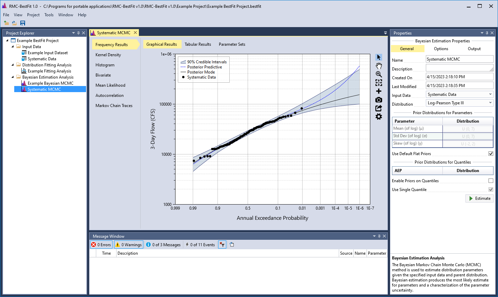

# RMC-BestFit

[](https://github.com/USACE-RMC/RMC-BestFit/actions/workflows/Integration.yml)
[](https://zenodo.org/badge/latestdoi/697453440)
[](https://www.nuget.org/packages/rmc.bestfit/)
[](LICENSE)

***RMC-BestFit*** is free and open-source software developed by the U.S. Army Corps of Engineers Risk Management Center (USACE-RMC) for Bayesian flood-frequency analysis, distribution fitting, uncertainty quantification, rating curves, bivariate and coincident frequency analysis, time-series modeling, and related hydrologic risk workflows. Version 2.0 exposes the core statistical engine as a reusable .NET model library while retaining the desktop application, UI/project layer, and REST API source in the same repository.

> [!NOTE]
> This repository is under active development. Expect ongoing bug fixes, minor enhancements, and documentation improvements as RMC-BestFit 2.0 is prepared for broader public use.



## Supported Frameworks

| Component | Target | Notes |
|-----------|--------|-------|
| `RMC.BestFit` | .NET 10.0 | Portable model library and first public NuGet package |
| `RMC.BestFit.Tests` | .NET 10.0 | Public model-library unit tests run by CI |
| `RMC.BestFit.Api` | .NET 10.0 | REST API and MCP server source over the model library |
| `RMC-BestFit` desktop app | .NET 10.0 Windows | Windows 10+ WPF application; HEC-DSS still resolves through explicit local binary/native references during migration |

## Installation

Install the model library from NuGet:

```powershell
dotnet add package RMC.BestFit --version 2.0.0
```

Or search for [RMC.BestFit](https://www.nuget.org/packages/RMC.BestFit/) in the NuGet Package Manager. The package depends on [RMC.Numerics](https://github.com/USACE-RMC/Numerics) 2.x for probability distributions, optimization, MCMC sampling, and numerical methods.

Source builds include the model library, unit tests, UI/project layer, desktop application, and API projects. Public CI initially restores, builds, and tests the portable model-library path while public packaging for the broader desktop stack and HEC-DSS dependency is finalized.

## Documentation

| Document | Description |
|----------|-------------|
| [Getting Started](docs/getting-started.md) | Minimal namespaces and first model-library workflows |
| [Technical Reference](docs/index.md) | Model, data, distribution, estimation, analysis, and diagnostic documentation |
| [REST API + MCP Server](docs/api.md) | Headless API and MCP server over `RMC.BestFit.dll` |
| [References](docs/references.md) | Consolidated bibliography for the public documentation |
| [Version 1.0 User's Guide](https://usace-rmc.github.io/RMC-Software-Documentation/docs/desktop-applications/rmc-bestfit/users-guide/v1.0/preface/) | Published desktop user guide for the previous major release |
| [Version 1.0 Verification Report](https://usace-rmc.github.io/RMC-Software-Documentation/source-documents/desktop-applications/rmc-bestfit/verification-report/RMC-BestFit-Verification-Report.pdf) | Published verification report for the previous major release |

## Solution Structure

| Area | Path | Description |
|------|------|-------------|
| Model Library | `src/RMC.BestFit/` | Core statistical models, analyses, diagnostics, data frames, trend functions, and link functions |
| Model Tests | `src/RMC.BestFit.Tests/` | Public unit tests for data, estimation, distributions, analyses, diagnostics, rating curves, time series, bivariate analysis, and spatial extremes |
| UI Layer | `src/RMC.BestFit.UI/` | Project serialization and UI wrapper layer used by the desktop application |
| Desktop App | `src/RMC.BestFit.App/` | WPF application shell and RMC-BestFit desktop interface |
| API | `src/RMC.BestFit.Api/` | REST API and MCP server source for programmatic workflows |
| Documentation | `docs/` | Public technical documentation and references |
| Examples | `examples/` | Tutorial `.bestfit` projects, input data, spreadsheets, and walkthrough markdown |

The long-running verification project, verification datasets, and additional validation reports are intentionally excluded from the initial public source release. Those materials are being prepared for follow-on publication.

## Quick Start

Restore, build, and test the public model-library path:

```powershell
dotnet restore src/RMC.BestFit.Tests/RMC.BestFit.Tests.csproj
dotnet build src/RMC.BestFit.Tests/RMC.BestFit.Tests.csproj -c Release --no-restore
dotnet test src/RMC.BestFit.Tests/RMC.BestFit.Tests.csproj -c Release --no-build
```

Create the public NuGet package locally:

```powershell
dotnet pack src/RMC.BestFit/RMC.BestFit.csproj -c Release -o packages /p:Version=2.0.0
```

## Key Capabilities

| Domain | Public API and workflows |
|--------|--------------------------|
| Input data | `DataFrame` with `ExactSeries`, `UncertainSeries`, `IntervalSeries`, and `ThresholdSeries` for exact, uncertain, interval-censored, and threshold observations |
| Estimation | `MaximumLikelihood`, `MaximumAPosteriori`, `GeneralizedMethodOfMoments`, and `BayesianAnalysis` with information criteria and MCMC diagnostics |
| Flood-frequency models | `FittingAnalysis`, `UnivariateAnalysis`, `UnivariateDistribution`, `MixtureAnalysis`, `CompetingRiskAnalysis`, `PointProcessAnalysis`, and `CompositeAnalysis` |
| Bulletin 17C | `Bulletin17CAnalysis` and `Bulletin17CDistribution` workflows for Log-Pearson Type III frequency analysis, penalties, and uncertainty methods |
| Bivariate and coincident frequency | `BivariateDistribution`, `BivariateAnalysis`, and `CoincidentFrequencyAnalysis` for copula-based joint frequency and response-frequency workflows |
| Rating curves | `RatingCurve` and `RatingCurveAnalysis` for Bayesian stage-discharge relationships with one to three segments |
| Time series | `AutoRegressive`, `MovingAverage`, `ARIMA`, `ARIMAX`, and corresponding AR/MA/ARIMA/ARIMAX analyses |
| Spatial extremes | `SpatialGEV`, `SpatialGEVAnalysis`, Gaussian copula support, and spatial correlation models |
| Diagnostics | Prior and posterior predictive checks, observation influence, prior influence, leverage diagnostics, threshold diagnostics, R-hat, ESS, WAIC, LOO-CV, DIC, AIC, BIC, and RMSE outputs |
| Automation | REST API and MCP server endpoints for time-series retrieval, input data creation, analysis execution, workflow chaining, metadata discovery, and JSON results |

## Examples

The [examples](examples/README.md) folder contains tutorial `.bestfit` projects and supporting files that can be opened in RMC-BestFit 2.0.

| Chapter | Topic |
|---------|-------|
| [Time Series Data](examples/1-time-series-data/) | Importing and downloading raw time series from USGS, GHCN, CHMN, ABOM, HEC-DSS, and manual entry |
| [Input Data](examples/2-input-data/) | Extracting block maxima, peaks-over-threshold, and USGS peak-flow samples |
| [Univariate Distribution Analysis](examples/4-univariate-distribution-analysis/) | Bayesian, Bulletin 17C, point-process, mixture, and composite frequency analyses |
| [Bivariate Distribution Analysis](examples/5-bivariate-distribution-analysis/) | Copula-based bivariate fitting and coincident frequency analysis |
| [Rating Curve Analysis](examples/6-rating-curve-analysis/) | Bayesian piecewise power-law stage-discharge rating curves |
| [Time Series Analysis](examples/7-time-series-analysis/) | ARIMA, ARIMAX, and regression fitting with autocorrelated residuals |

## Publications

- [2026 - Improving Bulletin 17C using the Generalized Method of Moments](https://essopenarchive.org/doi/full/10.22541/essoar.15005816/v1)
- [2026 - Nonstationary Flood Frequency Analysis for Urban Watersheds Using Open-Source Bayesian Software: Contrasting Case Studies from Texas](https://www.mdpi.com/2073-4441/18/5/636)
- [2024 - Nonstationary Flood Frequency Analysis with RMC-BestFit](https://www.researchgate.net/publication/386078504)
- [2023 - Moving Beyond Bulletin 17C with Bayesian Flow Frequency Analysis](https://www.researchgate.net/publication/370833315)
- [2021 - Incorporating Regional Rainfall-Frequency into Flood Frequency using RMC-RRFT and RMC-BestFit](https://www.researchgate.net/publication/354477063)
- [2019 - Estimating Design Floods with a Specified Return Period Using Bayesian Analysis](https://www.researchgate.net/publication/344320855)

## RMC Training

- [Risk Management Center Training Center](https://www.rmc.usace.army.mil/Training/)
- [2021 RMC-BestFit and RMC-RFA Training Videos](https://www.youtube.com/playlist?list=PLEIlpoX-ZknTLKrNq7qeVrCIxT_QtLLSF)

## Support

USACE-RMC is preparing RMC-BestFit 2.0 for broader public use with regular bug fixes, documentation improvements, and validation updates. Public issues should include the RMC-BestFit version, operating system, .NET SDK version when relevant, the workflow or project file involved, and enough detail to reproduce the behavior.

The repository includes a fast model-library test suite that is intended to serve both as regression coverage and as API usage examples. Longer-running verification materials are being prepared separately for public release.

## Contributing

Bug reports, feature requests, documentation feedback, and independent validation results are welcome. Please read [CONTRIBUTING.md](CONTRIBUTING.md) before opening a pull request. Review capacity is limited, so proposed code changes should start with an issue discussion.

## License

RMC-BestFit is provided under the [Zero-Clause BSD (0BSD)](LICENSE) license.
