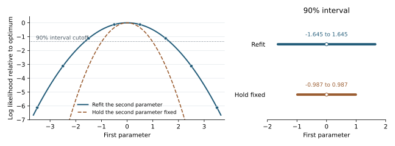

<!-- verification-status: publication-draft -->

# Estimation, Model Comparison, and Diagnostics

## Verification objectives

An estimate is useful only if the software combines the data and prior information correctly and reports uncertainty on the intended scale. This chapter asks three practical questions: does estimation reproduce a known answer, do the model-comparison statistics use the right information, and do the diagnostics identify unreliable sampling?

Maximum likelihood estimation (MLE) selects the parameters that best explain the observations. Maximum a posteriori estimation (MAP) also incorporates prior information and selects the highest point of the posterior. Bayesian sampling describes the whole posterior, including its uncertainty. The generalized method of moments (GMM) chooses parameters that satisfy specified relationships between model and sample quantities, with weighting when those relationships cannot all be met exactly.

## MLE, MAP, and GMM worked comparison

### Test setup and procedure

Seven positive observations are chosen so that their base-10 logarithms are 1.1, 1.4, 1.7, 2.0, 2.3, 2.6, and 2.9. Their log-space mean is exactly 2 and the sum of squared deviations from that mean is 2.52. This small dataset allows the reference estimates to be calculated directly, without fitting software.

The test fits the same observations by MLE, flat-prior MAP, and Bulletin 17C GMM. The flat-prior comparison explicitly disables the optional Jeffreys scale prior: it asks whether MAP reproduces MLE when the prior contributes no preference within the allowed range. Exact likelihood inference divides by $n=7$, while the Bulletin 17C sample-moment calculation divides by $n-1=6$:

$$
\widehat\sigma^2_{\mathrm{MLE}}=0.36,\qquad
\widehat\sigma^2_{\mathrm{GMM}}=0.42.\tag{E.1}
$$

### Results and interpretation

| Calculation | Independent target in log space | Recorded result and meaning |
|---|---:|---|
| MLE and flat-prior MAP mean | 2.000000 | Both fitted points satisfy the analytical 95% joint likelihood-ratio and standard-error checks. Their data log likelihoods agree within $10^{-8}$. |
| MLE and flat-prior MAP standard deviation | 0.600000 | The likelihood scale uses the seven-observation divisor. |
| GMM mean | 2.000000 | Within $10^{-5}$ of the sample-moment answer. |
| GMM standard deviation | 0.648074 | Within $10^{-5}$ of the sample-moment answer; the moment discrepancy is below $10^{-10}$. |

The different standard deviations are the intended consequence of the two finite-sample formulas. They are not evidence of an inconsistent logarithm or a failed fit. All comparisons passed under their respective rules.

### Adding prior information

The next comparison adds Normal information about the mean. Its center is $m$ and its standard deviation is $\tau$. Four cases distinguish a change in the best estimate from a change in uncertainty. The widths below are expressed relative to the unpenalized standard error of the mean, which is about 0.2268 for MLE and 0.2449 for GMM.

| Prior or equivalent GMM penalty | Center and width | Behavior tested |
|---|---|---|
| Flat | No preference over the fitted region | Reproduce the unpenalized estimate and uncertainty. |
| Wide and centered | Center 2; standard deviation 100 times the unpenalized standard error | Add very little information. |
| Narrow and centered | Center 2; standard deviation 0.1 times the unpenalized standard error | Reduce uncertainty without moving the preferred location. |
| Narrow and shifted | Center two unpenalized standard errors above 2; same narrow width | Move the estimate toward the prior and change its uncertainty. |

For each case, BestFit refits both mean and scale. Independently derived equations and the curvature of the objective supply the reference fit and covariance. The tests also compare the fitted interval with the familiar fixed-variance information-combination reference,

$$
V_*=(V_L^{-1}+\tau^{-2})^{-1},\qquad
\mu_*=V_*(\widehat\mu_L/V_L+m/\tau^2).\tag{E.2}
$$

where $\widehat\mu_L$ and $V_L$ are the unpenalized location and its variance. More precise information receives more weight. Because the scale is reestimated, equation (E.2) is an interval reference for this experiment, not an exact identity for the final fitted location.

The four-regime comparisons passed. MAP fits satisfy the analytical joint 95% criterion; GMM location errors satisfy the 1.96-standard-error criterion. Covariance entries agree with the independent calculations within the larger of $2\times10^{-5}$ and 0.2% of the reference magnitude. Equation (E.2)'s location lies within every tested central 95% interval. These results check both the direction of prior influence and its effect on reported uncertainty.

## Recovery and informative priors

### Recovery from generated data

Three experiments isolate the general estimation routines. Each contains 1,000 observations or paired rows. The distribution chapter gives the additional family-specific recovery designs.

| Estimation experiment | Test setup and procedure | Result |
|---|---|---|
| Bayesian Normal analysis | Generate a Normal sample with mean 100 and standard deviation 15, using seed 12345; estimate both parameters with the production Bayesian configuration. | Both generating values are inside the central 95% posterior intervals; each monitored parameter has $\widehat R<1.10$ and ESS at least 100. |
| Normal MAP | Generate mean 100 and standard deviation 10; fit the posterior mode and calculate uncertainty from its curvature. | Both generating values are within 1.96 estimated standard errors of the fitted values. |
| Two-step GMM | Generate responses with mean 2 and standard deviation 1, paired with independent Uniform(-1,1) auxiliary values, using seed 24680. Fit the two conditions that the mean residual and the mean auxiliary-value-weighted residual are zero. | The generating mean 2 is within 1.96 standard errors, using the two-step sandwich covariance. |

The GMM covariance calculation combines the sensitivity of the moment equations with their observed variability; this is why it is called a sandwich covariance. The known mean is used only to generate and assess the data, not supplied as the fitted answer.

Thirteen-family MLE recovery checks complement these general experiments. Most compare generating values with standard-error intervals. Generalized Normal and Generalized Logistic use 95% profile intervals; Generalized Pareto additionally checks its 0.99 quantile. A separate Ln-Normal calculation compares the fitted result with the exact natural-log mean and standard deviation of the same sample. All meet their specified criteria. Parameter tables and the distinction between original and logarithmic scales appear in the distribution chapter.

### An exact Bayesian posterior

A separate experiment uses 1,000 observations generated with mean 100 and standard deviation 15, but treats the observation standard deviation as known. The prior for the unknown mean is Normal with center 120 and standard deviation 5. The intentionally displaced prior tests whether the data and prior are combined with the correct relative weights.

For this known-scale case, equation (E.2) gives an exact posterior: use the sample mean for $\widehat\mu_L$, $V_L=225/1000$, $m=120$, and $\tau^2=25$. The posterior standard deviation is 0.472221, and the prior receives about 0.892% of the combined location weight. The data dominate because the 1,000-observation mean is much more precisely determined than the prior.

The test samples the posterior and compares its mean, standard deviation, and two central 95% endpoints with this exact Normal answer. The accepted absolute differences are 0.05, 0.03, and 0.10, respectively; all passed. The result verifies the shape and width of a posterior with informative prior input, not merely whether an interval happens to contain the generating mean.

## Profile likelihood and covariance

A profile calculation varies one parameter and refits the other parameters at each step. This matters when parameters are related: holding the other parameters fixed can make an interval too narrow.

The reference example uses a smooth two-parameter quadratic log likelihood with correlation 0.8 and an optimum at zero. At a fixed first parameter $t$, the independently calculated optimum for the second is $0.8t$, and the profile log likelihood is $-t^2/2$. R `bbmle` supplies an independent numerical calculation at eight equally spaced midpoints from -3.5 to 3.5.

| Quantity | Independent reference | BestFit comparison |
|---|---:|---|
| Profile at $t=0.5$ | -0.125 | Agrees within $10^{-10}$. |
| Profile at $t=1.5$ | -1.125 | Agrees within $10^{-10}$. |
| Profile at $t=3.5$ | -6.125 | Agrees within $10^{-10}$. |
| 90% profile interval | -1.644854 to 1.644854 | Both endpoints agree within $10^{-8}$. |
| Interval if the second parameter were incorrectly held fixed | -0.986912 to 0.986912 | Comparison illustrates the narrower conditional slice; it is not the reported profile interval. |

All eight profile values, the optimum, and the interval passed for MLE and for MAP with a flat prior. An informative-prior variant checks that MAP refits using the complete posterior, and a restricted-support variant checks ten valid points on a 16-point grid. Invalid points are not included in the numerical agreement claim. The 90% level is part of this particular external comparison; it is not the 95% recovery rule used elsewhere.

*Figure E.1. Allowing the second parameter to adjust produces the wider profile interval. The curves and points show the independent analytical and R references; BestFit's tested profile values agree within $10^{-10}$. They are not plotted as separately retained BestFit estimates.*

Covariance is checked independently on ten Normal observations: 1.2, 0.7, 1.9, 1.1, 0.4, 1.6, 0.9, 1.3, 1.0, and 1.5, with known standard deviation 0.5. The reference mean is 1.16, its variance is $0.5^2/10=0.025$, and its standard error is 0.158114. The fitted mean satisfies the standard-error criterion, and both uncertainty quantities agree within $10^{-8}$ relative error. A separate two-parameter quadratic confirms that adding a flat prior leaves the covariance unchanged within $10^{-4}$. These checks passed.

## DIC and WAIC

The deviance information criterion (DIC) and widely applicable information criterion (WAIC) balance fit against model complexity. They help compare candidate models fitted to the same data; a small value by itself does not establish that a model is physically appropriate.

The setup contains five Normal observations, 2.4, 2.9, 3.5, 4.1, and 4.8, and forty fixed candidate pairs of mean and standard deviation. Using the same pairs in both calculations removes random sampling differences. BestFit and R evaluate how well each pair explains each observation, producing 200 individual log-likelihood values. The tests compare those values first and then compare the summary statistics. The independent packages are R `BayesianTools` 0.1.9 and `loo` 2.10.0.

| Quantity | External result | BestFit tolerance | Result |
|---|---:|---:|---:|
| Mean deviance | 13.0457484595105 | `1e-10` absolute | Passed |
| Deviance at posterior mean | 12.6377539947693 | `1e-10` absolute | Passed |
| Effective DIC parameters | 0.407994464741220 | `1e-10` absolute | Passed |
| DIC | 13.4537429242518 | `1e-10` absolute | Passed |
| lppd | -6.35851654848624 | `1e-10` absolute | Passed |
| Effective WAIC parameters | 0.351001866165060 | `1e-10` absolute | Passed |
| WAIC | 13.4190368293026 | `1e-10` absolute | Passed |

All individual and summary comparisons passed. Here deviance is minus twice the log likelihood; lppd is the sum of log predictive densities for the observed data. The effective-parameter terms measure the complexity penalty, which need not be an integer. Agreement in both components establishes more than agreement in the final DIC or WAIC total.

Two additional checks fit 100 Normal observations generated with mean 100 and standard deviation 10. They independently recompute the Akaike information criterion (AIC) and Bayesian information criterion (BIC) at the MAP estimate. Both use the **data likelihood**, excluding the prior density, and agree within $10^{-10}$. When a nonconstant prior moves the MAP away from the MLE, these MAP-evaluated numbers are not conventional MLE-based AIC and BIC.

## PSIS-LOO

Leave-one-out cross-validation asks how well a model predicts an observation when that observation is left out of the fit. Pareto-smoothed importance sampling (PSIS) approximates this comparison by reweighting the available posterior draws. It also reports when those weights are too uneven for a reliable approximation.

The same five observations and forty fixed parameter pairs were passed through R `loo`. BestFit compares the prediction score for each omitted observation, its smoothed weights, the Pareto shape diagnostic $k$, and its effective sample size. ELPD means expected log predictive density; LOOIC is the same aggregate prediction score expressed as minus twice ELPD.

| Quantity | R `loo` result | BestFit tolerance | Result |
|---|---:|---:|---:|
| ELPD-LOO | -6.70094841652149 | `1e-10` absolute | Passed |
| Effective LOO parameters | 0.342431868035246 | `1e-10` absolute | Passed |
| LOOIC | 13.4018968330430 | `1e-10` absolute | Passed |
| SE(LOOIC) | 1.95756902272540 | `1e-10` absolute | Passed |

All aggregate comparisons passed. The five reference Pareto values are 0.0682, -0.0302, 0.4116, 0.3062, and 0.3209. With only forty draws, the applicable reliability threshold is 0.375804. The third observation therefore requires attention even though its $k$ is below the commonly displayed 0.5 category boundary. BestFit identifies that observation correctly.

Six additional sets of 256 importance ratios test progressively heavier tails and a degenerate case. These represent increasingly uneven contributions from the posterior draws. Smoothed weights, $k$, and effective sample sizes agree with R within $10^{-8}$; the degenerate case correctly returns an infinite diagnostic instead of implying a reliable approximation.

Exact leave-one-out refits, moment matching, and chain-relative-efficiency adjustment are not implemented. The influence diagnostic compares the Pareto shape and the sample-size-dependent reliability threshold with R `loo`. This check is separate from the deterministic formatting and serialization of diagnostic results.

## GMM specification and covariance

The GMM specification test asks whether two proposed moment relationships can both be satisfied by one parameter. Ten response values are 0.2, 0.5, 0.7, 1.1, 1.4, 1.8, 2.1, 2.6, 3.2, and 4.0. They are paired, in that order, with auxiliary values 0.5, 1.0, and so on through 5.0. The two sample moments are the average residual $x-\theta$ and the average weighted residual $z(x-\theta)$.

BestFit and R `gmm` 1.9.1 fit these same data twice. The first fit weights the two moment discrepancies equally. The second updates the weights using their covariance. For the first fit, the independent optimum and weighted discrepancy $Q$ are

$$
\widehat\theta=2.28992700729929,\qquad Q=0.317956204379562.\tag{E.3}
$$

For efficient two-step GMM, the reference values are $\widehat\theta=1.93548454750500$ and $Q=1.00755078518454$. BestFit agrees within $10^{-5}$ for the parameter and $10^{-8}$ for the discrepancy. The Hansen statistic tests the remaining mismatch between the two moment conditions:

$$
J=nQ=10.0755078518454,\qquad p=0.00150253202968641.\tag{E.4}
$$

| Comparison | R or analytical value | Tolerance | Result |
|---|---:|---:|---:|
| Fixed-weight variance | 0.145652392138090 | `1e-8` | Passed |
| Efficient two-step variance | 0.132600447299456 | `1e-8` | Passed |
| Hansen $J$ | 10.0755078518454 | `1e-7` | Passed |
| Hansen p-value | 0.00150253202968641 | `1e-8` | Passed |

The variance and specification comparisons all passed. The small p-value indicates that these particular data are inconsistent with both moment conditions holding at once; a correct test should detect that disagreement. It does not indicate a software failure. The covariance reference is also reconstructed directly from the independent moment derivatives and moment variability.

BestFit does not label an arbitrary fixed-weight discrepancy as a Hansen test: the first fit's Hansen statistic and p-value are unavailable. The chi-square interpretation applies to the efficient second-step weighting used in the second fit.

## Gradients and influence

An optimizer needs the direction in which its objective improves, called the gradient. A controlled GMM example uses the moment $g(\theta)=\theta^2-2$. The test changes the parameter by small positive and negative amounts and independently calculates the resulting slope. It verifies the full derivative when a penalty is present and the documented half-derivative convention for the unpenalized estimating equation. Both comparisons agree within $10^{-8}$.

Influence diagnostics ask which observations most affect an estimate or its uncertainty. On the seven log-space observations used above, each observation's fit influence, variance influence, and combined leverage are compared with an independent R `gmm` calculation. Every value agrees within $10^{-5}$. Adding an extremely weak centered penalty preserves these values within $10^{-4}$, as expected when almost no information is added.

One influence check records an accepted limitation. Removing one value from a sample changes the sample mean by a known amount, so exact deletion provides a direct comparison. The test checks the seven-value sample and then adds an unusually high eighth value. BestFit and exact deletion both identify the added observation as most influential, but the diagnostic's magnitude differs from exact deletion by more than 25% on the tested scale. It can identify the leading observation in this example; it must not be interpreted as the exact amount the estimate would change if that observation were removed.

## Joint-prior sampling boundary

Prior information can describe each parameter separately or describe how two parameters relate. To distinguish those cases, the test gives two parameters separate Uniform(-1,1) priors and also specifies a narrow conditional relationship requiring them to be close together.

The generic prior sampler produces 20,000 pairs. The check compares their behavior with independent Uniform draws: absolute correlation is below 0.03, mean squared separation exceeds 0.60, and fewer than 12% of pairs lie within 0.1 of one another. These findings agree with separate sampling; the independent mean squared separation is $2/3$.

This is the second accepted limitation. The additional joint relationship is not represented by these prior draws. A calculation that needs the full coupled prior, such as a corresponding prior-predictive analysis, cannot treat them as draws from that joint distribution.

## MCMC diagnostics

### Setup and procedure

Nine fixed collections of four chains test the diagnostic calculations themselves. Some represent well-mixed draws; others deliberately include a shifted chain, unequal spread, strong serial dependence, or a chain stuck in the tail. BestFit and R `posterior` 1.7.0 receive the identical draws. This isolates the diagnostic formula from the sampler that originally produced the values.

The tests compare rank-normalized split $\widehat R$ directly. For ESS, R supplies bulk ESS for the main body of the distribution and tail ESS for its 5% and 95% quantiles. BestFit's single conservative ESS is compared with the smallest of those three reference values; the test does not independently verify three separate BestFit ESS outputs.

| Chain design | Draws per chain used | R reference $\widehat R$ | R reference conservative ESS | Interpretation |
|---|---:|---:|---:|---|
| Independent Normal draws | 200 | 0.99873 | 774.55 | Little loss of information to chain dependence. |
| One shifted chain | 200 | 1.05158 | 95.16 | The small ESS flags limited useful information. |
| Different chain spreads | 100 | 1.28101 | 447.63 | Chain disagreement is detected by $\widehat R$. |
| Serial dependence of 0.85 | 240 | 1.04057 | 53.52 | Many stored draws provide much less independent information. |
| One chain stuck in the upper tail | 240 | 1.07719 | 11.70 | Tail information is especially poor. |
| Rounded values with ties | 160 | 1.00049 | 578.87 | Repeated values receive consistent ranks. |
| Initial 80 warmup values discarded | 160 | 0.99901 | 638.26 | Diagnostics use the retained portion of each chain. |
| Repeating integer pattern | 64 | 2.86020 | 5.25 | Severe disagreement is detected. |
| Constant chains | 40 | Unavailable | Unavailable | No spurious convergence or ESS value is reported. |

Every finite $\widehat R$ agrees within $10^{-10}$ and every conservative ESS within $10^{-8}$; unavailable cases are also reproduced. A passing comparison for a deliberately poor chain means the diagnostic identified the problem correctly, not that the chain is acceptable for inference.

### Sampler calculations

Two further tests examine specific sampler calculations. For the No-U-Turn Sampler (NUTS), a two-parameter posterior has an independently derived gradient. At parameter values 1.25 and -0.75, the expected gradient components are -1.50 and 0.50; both agree within $10^{-8}$.

For adaptive random-walk Metropolis-Hastings (ARWMH), a controlled model rejects every proposal. A rejected proposal leaves the chain at its previous state, and that repeated state must still contribute to the adaptive covariance. The configured four-chain run requires 125 recorded transitions per chain; every acceptance count is zero and every covariance history contains exactly 125 states. Both sampler checks passed. Together with the recovery and diagnostic comparisons, they check behavior that would be missed by merely confirming that a sampling run finishes.
