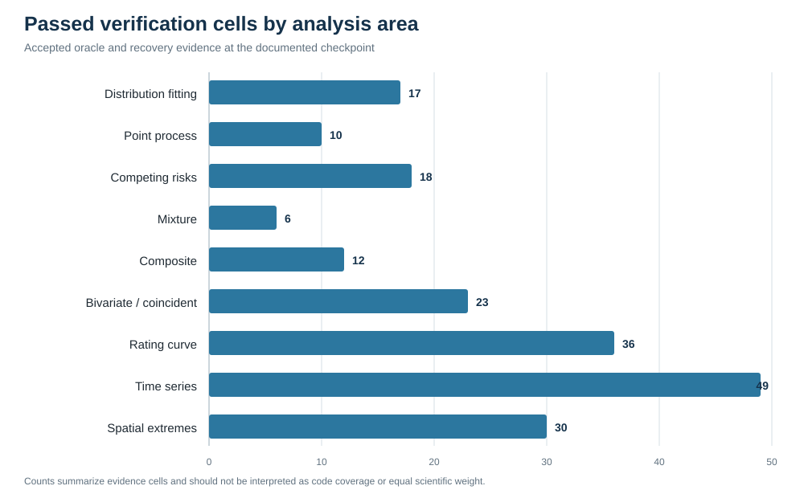

<!-- verification-status: publication-draft -->

# Executive Summary

## Purpose and scope

The purpose of this report is to establish which scientific calculations in RMC.BestFit 2.0 have been compared with evidence independent of the production implementation. The report does not attempt to prove correctness for every possible model, data set, prior, or tail probability. It documents bounded claims whose test design, reference result, and acceptance rule can be inspected and reproduced.

The report follows the application's project-tree order: time-series data; input data; distribution fitting; univariate, Bulletin 17C, point-process, competing-risk, mixture, and composite analyses; bivariate and coincident-frequency analyses; rating-curve analysis; AR, MA, ARIMA, and ARIMAX analyses; and spatial extremes. Maximum-likelihood, maximum-a-posteriori, generalized-method-of-moments, Bayesian estimation, model comparison, and convergence diagnostics are shared foundations.

## Verification conclusion

At the stated software checkpoint, the independently supported cells summarized below satisfy their declared acceptance criteria. The strongest evidence is exact analytical or external-package parity. Recovery evidence is conditional on its generating model, sample size, seed, estimator configuration, and acceptance rule. Simulation coverage is claimed only where a predeclared repetition design and Monte Carlo acceptance interval were executed for the stated checkpoint.

Time-series-data and input-data persistence, validation, and processing contracts passed the fast regression gate. Those two collection-level results control the handoff to the scientific models but are not counted as independent numerical verification.

| Capability | Verification basis | Result at the accepted checkpoint |
|---|---|---:|
| Fifteen univariate families and multi-candidate fitting | SciPy, R `lmomco`, analytical identities, and independent fitting oracles | 17 of 17 fitting cells passed |
| Model comparison and convergence diagnostics | R `loo`, R `posterior`, R `gmm`, R `bbmle`, and analytical covariance results | All reported oracle comparisons passed |
| Bulletin 17C worked examples | Published example parameters and PeakFQ plotting positions | 7 of 7 parameter examples and 3 of 3 plotting-position comparisons passed |
| Bulletin 17C refit reliability | Ordinary and pivotal resampling of seven published examples | 14 of 14 cells; 13,000 finite outputs; zero retries, substitutions, or exceptions |
| Point-process models | Analytical Poisson/GPA calculations, likelihood identities, and recovery | 10 of 10 cells passed |
| Competing risks | Analytical dependence identities and generating-model recovery | 4 of 4 analytical, 10 of 10 MLE, and 4 of 4 supported Bayesian cells passed |
| Finite mixtures | Independent Numerics parity and Bayesian generation-recovery | 6 of 6 cells passed |
| Composite analyses | Closed forms, R `mistr`, Gaussian orthants, and complete Cartesian posterior enumeration | 12 of 12 reported cells passed |
| Bivariate and coincident frequency | Independent copula optimum, Bayesian recovery, and closed-form Normal sums | 23 of 23 reported cells passed |
| Rating curves | SciPy likelihood and optimum, analytical continuity, and curve recovery | 36 of 36 reported cells passed |
| Time-series models | Independent recurrence/transform oracles and generating-model recovery | 12 oracle, 8 independent recovery, and 29 supporting recovery cells passed |
| Spatial extremes | R `mvtnorm`, conditional-GP and haversine oracles, model recovery, and analysis-level checks | 30 of 30 reported cells passed |

*Figure 1. Passed cells in the principal recovery and oracle matrices. Counts are evidence cells, not a measure of scientific importance or code coverage. Model-estimation diagnostics and Bulletin 17C reliability are tabulated separately because their evidence units differ.*

## Interpretation

A passing cell supports the claim stated for that cell. It does not establish universal accuracy outside the tested support, asymptotic regime, sample size, dependence structure, or prior configuration. In particular:

- The six difficult competing-risk Bayesian designs not included in the supported matrix are research-grade identifiability and convergence cases and are not claimed as verified.
- Current Bulletin 17C Cohn-value and broad coverage claims are excluded because the corresponding numerical comparisons were not executed at this checkpoint.
- Bivariate copula fitting conditions on fixed fitted marginals; joint marginal-copula posterior estimation is not claimed.
- Spatial weighting is a heuristic influence weighting and not a composite pairwise likelihood or effective-sample-size correction.
- Generic prior-predictive sampling is not a joint-prior sampler when a model contains coupled prior factors beyond independently sampled parameter priors.

These boundaries are limitations of the supported claim set, not evidence that the verified calculations failed.
