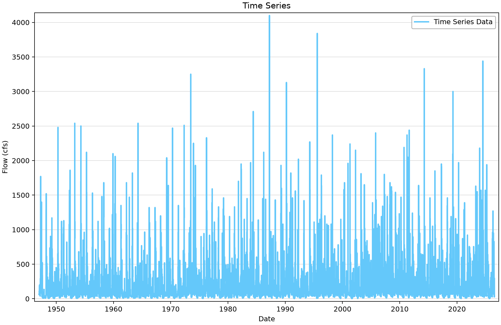
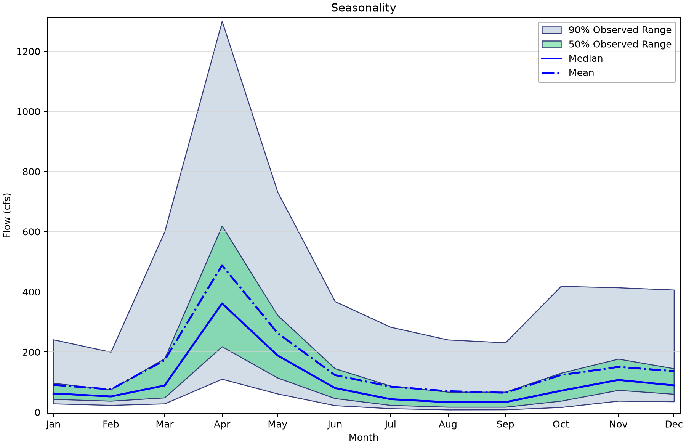
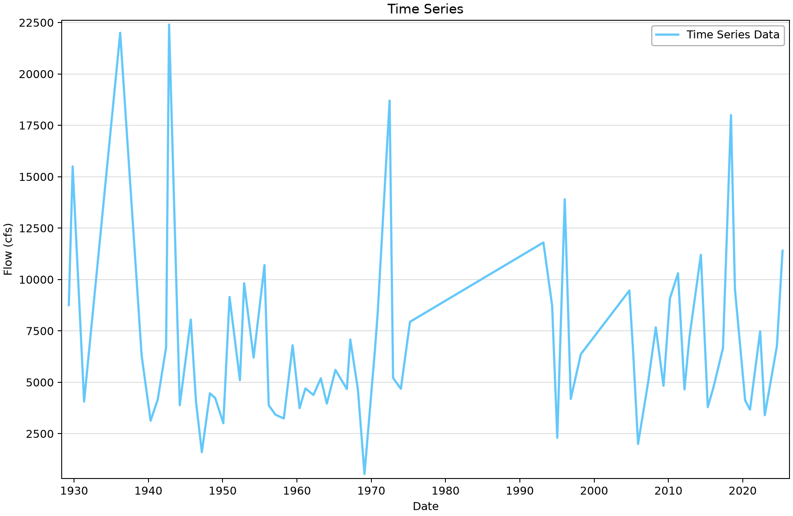
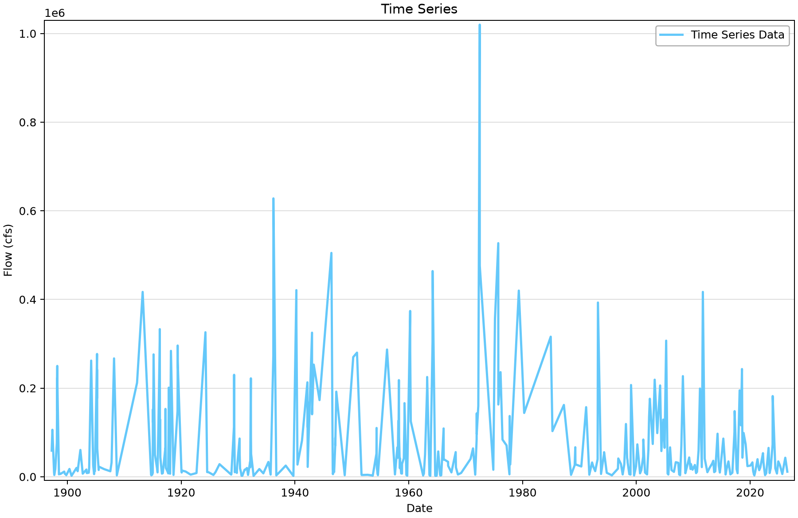

# USGS records: distinguish daily, instantaneous, annual-peak and measurement data

This example introduces eight saved USGS time series from five gaging stations. The aim is to choose a record that matches the engineering quantity of interest before creating a frequency analysis. A daily mean, an instantaneous peak and a field measurement describe different quantities, even when all three are expressed as discharge.

## Open the example

Open [usgs-download-example.bestfit](usgs-download-example.bestfit) in RMC-BestFit and save a working copy before importing or editing data. The figures use the saved snapshot; downloading again may change the record. You do not need to run an analysis to follow this exercise.

## Source and saved records

The saved records come from the U.S. Geological Survey. Station names are Moose River at Victory, Vermont (01134500), Mississippi River at St. Louis, Missouri (07010000), Potomac River near Washington, DC, at Little Falls (01646500), Susquehanna River at Harrisburg, Pennsylvania (01570500), and Back Creek near Jones Springs, West Virginia (01614000). Consult the [USGS water-data portal](https://waterdata.usgs.gov/) for station metadata, qualifiers and revised records.

| Saved element | Units | First–last saved date | Ordinates | Missing |
|---|---|---|---:|---:|
| USGS - 01134500 - Daily Discharge | Flow (cfs) | 1947-01-01–2026-07-14 | 29,050 | 0 |
| USGS - 07010000 - Daily Stage | Value | 1982-10-01–2026-07-15 | 15,994 | 197 |
| USGS - 01646500 - Instantaneous Discharge | Flow (cfs) | 1972-06-09–2026-07-15 | 1,272,826 | 0 |
| USGS - 01646500 - Instantaneous Stage | Stage (ft) | 2007-10-01–2026-07-15 | 723,856 | 0 |
| USGS - 01570500 - Measured Discharge | Flow (cfs) | 1897-03-31–2026-07-15 | 412 | 0 |
| USGS - 01570500 - Measured Stage | Stage (ft) | 1897-03-31–2026-07-15 | 939 | 0 |
| USGS - 01614000 - Peak Discharge | Flow (cfs) | 1929-04-17–2025-05-14 | 69 | 0 |
| USGS - 01614000 - Peak Stage | Stage (ft) | 1929-04-17–2025-05-14 | 69 | 0 |

“Missing” counts stored nonfinite values. A date range and a zero missing-value count do not prove complete time coverage, particularly for irregular or annual-peak records.

## Work through the example

1. Select **USGS - 01134500 - Daily Discharge** under **Time Series Data**. Read the date and value columns, then open the **Time Series** plot. These are daily mean discharges in cubic feet per second (cfs).
2. Open **Seasonality** for the same element. The horizontal axis groups observations by month; it is not a second chronological record. Use the plot to describe when higher daily flows tend to occur before proposing a physical explanation.
3. Select **USGS - 01614000 - Peak Discharge**. Its 69 saved observations span 1929–2025. This is an event record with missing years, not 69 consecutive daily observations. The stored interval setting alone is insufficient to identify its sampling meaning.
4. Select **USGS - 01570500 - Measured Discharge** and then **Measured Stage**. The saved series have different observation counts. Match the actual timestamps and measurement identifiers before constructing a stage–discharge dataset; do not pair rows by their position.
5. Inspect an instantaneous Potomac series. Its detailed timestamps resolve within-event variation. Use the annual peak product when the intended input is annual instantaneous peaks, or explicitly document a separate extraction procedure.
6. To obtain a new record, create a separate time-series element, set **Entry Method = USGS**, enter its site number, choose the series type and select **Download**. Record the retrieval date and review qualifiers before analysis.

## Read the plots

*Figure 1. Daily mean discharge at Moose River. The figure retains every saved ordinate and gap.* [SVG](figures/usgs-download-example-daily-flow.svg) · [Plot data](figures/usgs-download-example-daily-flow.plotspec.json.gz)

*Figure 2. Moose River daily-flow seasonality, displayed with month names.* [SVG](figures/usgs-download-example-seasonality.svg) · [Plot data](figures/usgs-download-example-seasonality.plotspec.json.gz)

*Figure 3. Back Creek annual peak discharge. The line connects available observations across missing years; it does not fill gaps in the record.* [SVG](figures/usgs-download-example-annual-peaks.svg) · [Plot data](figures/usgs-download-example-annual-peaks.plotspec.json.gz)

*Figure 4. Harrisburg field discharge measurements. Irregular sampling is visible; these are not annual maxima.* [SVG](figures/usgs-download-example-field-measurements.svg) · [Plot data](figures/usgs-download-example-field-measurements.plotspec.json.gz)

## Interpretation and limits

The seasonality bands show the 5th–95th percentiles (90% observed range) and 25th–75th percentiles (50% observed range) within each month. They describe variation among observations, not confidence in the monthly mean. Python corrects the desktop’s legacy confidence-interval legend while preserving the plotted values.

The Moose River daily record has no stored missing ordinates, but that does not establish a constant measurement method or unregulated conditions. The St. Louis daily stage record contains 197 missing values. Its saved axis label is the generic “Value”; the selected height unit is feet. Negative gage heights are elevations relative to the station datum, not negative water depths. Never replace them with zero.

Compare the Back Creek event plot with the Moose River daily plot. Annual peak discharge is the relevant starting quantity for many flood-frequency studies; annual maxima extracted from daily means will generally be a different series. This project demonstrates data access and inspection and contains no fitted frequency analysis.

## Check your understanding

Explain why the 412 discharge measurements and 939 stage measurements at Harrisburg cannot be joined by row number. Then identify which saved element you would use for an annual instantaneous-peak study and which one you would use to examine daily-flow seasonality.

## Figure reproducibility

Figures are rendered with Python from BestFit.UI/App coordinates exported from the saved project. Use the repository [figure-generation instructions](../../README.md#reproducing-the-figures) with project filter `usgs-download-example`. The accompanying plot data records the source hash; a successful plot export is not validation of a statistical model.
