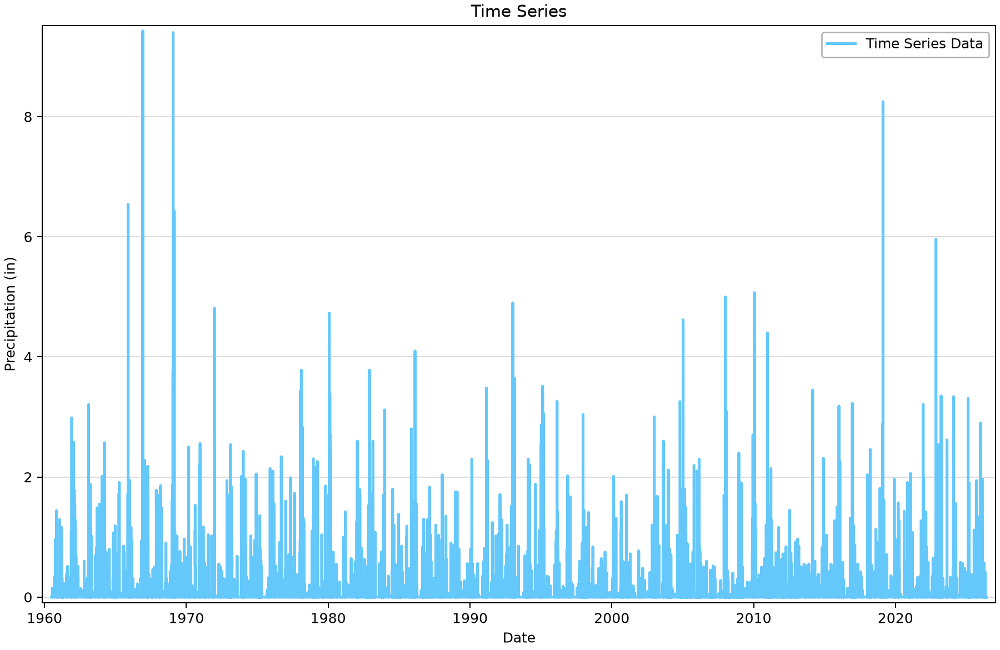
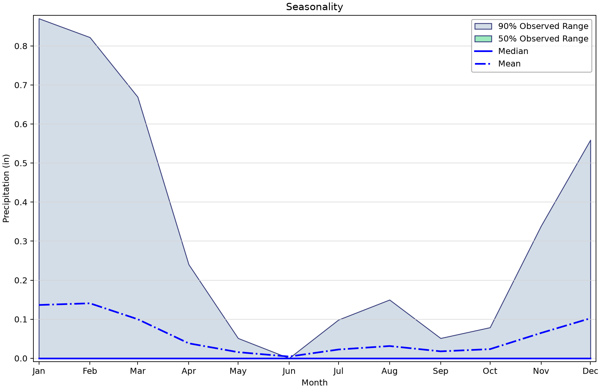
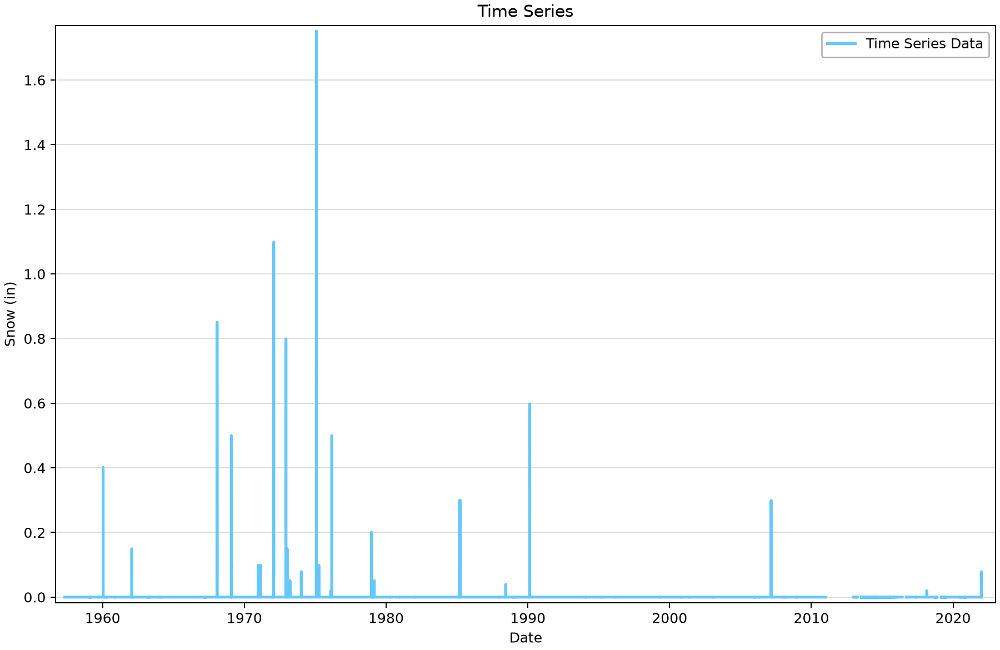

# GHCN daily climate records: precipitation, snowfall and source-unit checks

This example uses saved daily precipitation at Big Bear Lake, California, and snowfall at Paradise, California. It teaches station selection, missing-data inspection and the distinction between precipitation and snowfall units. No frequency model is fitted in this project.

## Open the example

Open [ghcn-download-example.bestfit](ghcn-download-example.bestfit) in RMC-BestFit and save a working copy before importing or editing data. The figures use the saved snapshot; downloading again may change the record. You do not need to run an analysis to follow this exercise.

## Source and saved records

The source is [NOAA GHCN-Daily](https://www.ncei.noaa.gov/products/land-based-station/global-historical-climatology-network-daily). Big Bear Lake is USC00040741 and Paradise is USC00046685. The [daily-file specification](https://www.ncei.noaa.gov/pub/data/ghcn/daily/readme.txt) defines PRCP as precipitation in tenths of millimetres and SNOW as snowfall in millimetres; SNWD is the separate snow-depth variable.

| Saved element | Units | First–last saved date | Ordinates | Missing |
|---|---|---|---:|---:|
| GHCN - USC00040741 - Daily Precipitation | Precipitation (in) | 1960-07-01–2026-06-30 | 24,106 | 482 |
| GHCN - USC00046685 - Daily Snow | Snow (in) | 1957-05-01–2022-05-31 | 23,772 | 2,197 |

“Missing” counts stored nonfinite values. A date range and a zero missing-value count do not prove complete time coverage, particularly for irregular or annual-peak records.

## Work through the example

1. Select **GHCN - USC00040741 - Daily Precipitation**. Confirm the station identifier, **Entry Method = GHCN**, **Series Type = DailyPrecipitation**, and **Depth Unit = Inches**.
2. Inspect the **Time Series** and **Seasonality** plots. A zero means a stored zero precipitation amount; a missing value means the amount is unavailable. The two must remain distinct.
3. Select **GHCN - USC00046685 - Daily Snow**. Check the source-unit discrepancy below before interpreting the magnitude of any snowfall event.
4. For a new download, create a separate time-series element, enter the 11-character station identifier, choose the requested variable and depth unit, then select **Download**. Keep the saved teaching project as a reproducible snapshot.
5. For a precipitation-frequency exercise, proceed to the [precipitation POT example](../../2-input-data/3-peaks-over-threshold/ghcn-peaks-over-threshold-example.md) and review its threshold, separation and observation-period assumptions.

## Read the plots

*Figure 1. Saved daily precipitation at Big Bear Lake, including missing-data gaps.* [SVG](figures/ghcn-download-example-precipitation.svg) · [Plot data](figures/ghcn-download-example-precipitation.plotspec.json.gz)

*Figure 2. Big Bear Lake precipitation seasonality from the saved record.* [SVG](figures/ghcn-download-example-precipitation-seasonality.svg) · [Plot data](figures/ghcn-download-example-precipitation-seasonality.plotspec.json.gz)

*Figure 3. Original Paradise snowfall values. The saved inches are ten times too small; see the source-unit finding before interpreting magnitudes.* [SVG](figures/ghcn-download-example-snowfall-source-check.svg) · [Plot data](figures/ghcn-download-example-snowfall-source-check.plotspec.json.gz)

## Interpretation and limits

The seasonality bands show the 5th–95th percentiles (90% observed range) and 25th–75th percentiles (50% observed range) within each month. They describe variation among observations, not confidence in the monthly mean. Python corrects the desktop’s legacy confidence-interval legend while preserving the plotted values.

The precipitation record contains 482 missing daily ordinates and the snowfall record contains 2,197. Counts describe the saved files, not the latest NOAA download. Review missing intervals and station history before estimating an exposure period or comparing seasons.

**Source-unit finding awaiting correction:** the 38 nonzero saved snowfall values equal the NOAA SNOW integers divided by 254 rather than 25.4. For example, 445 mm on January 29, 1975 is saved as 1.752 inches; the source amount is 17.52 inches. The original values are retained pending the technical decision. The snowfall figure is a data-quality illustration and must not be used as a correctly scaled physical snowfall record. A fresh download through the affected conversion path would not resolve this issue.

## Check your understanding

Locate a missing precipitation interval and explain why filling it with zeros would alter a frequency analysis. Independently convert the 445 mm snowfall observation to inches and compare it with the stored value.

## Figure reproducibility

Figures are rendered with Python from BestFit.UI/App coordinates exported from the saved project. Use the repository [figure-generation instructions](../../README.md#reproducing-the-figures) with project filter `ghcn-download-example`. The accompanying plot data records the source hash; a successful plot export is not validation of a statistical model.
