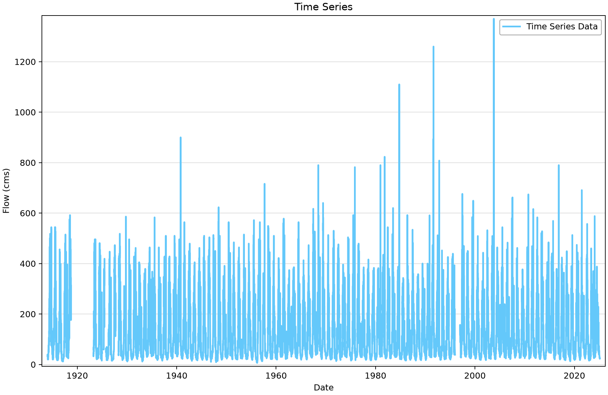
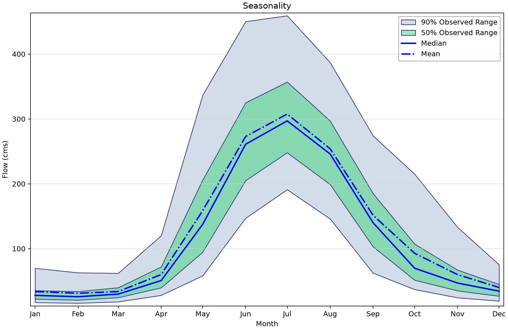
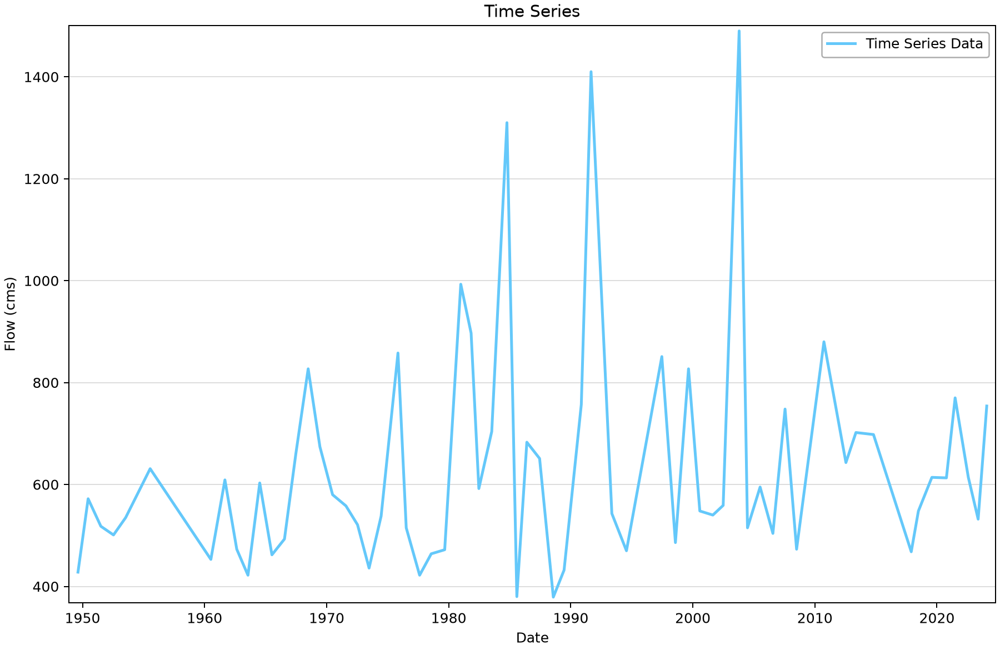

# Canadian hydrometric records: compare discharge, stage and annual peaks

Use the Lillooet River near Pemberton, British Columbia, station (08MG005) to compare six saved hydrometric series. The exercise shows why series from the same station can have different coverage, units and sampling intervals.

## Open the example

Open [chmn-download-example.bestfit](chmn-download-example.bestfit) in RMC-BestFit and save a working copy before importing or editing data. The figures use the saved snapshot; downloading again may change the record. You do not need to run an analysis to follow this exercise.

## Source and saved records

The records were obtained through BestFit’s **CHMN** entry method for Water Survey of Canada data. The [Water Survey station page](https://wateroffice.ec.gc.ca/report/real_time_e.html?stn=08MG005) provides station context. The saved project combines historical daily and peak records with more recent instantaneous observations; these products do not share one common record period.

| Saved element | Units | First–last saved date | Ordinates | Missing |
|---|---|---|---:|---:|
| CHMN - 08MG005 - Daily Discharge | Flow (cms) | 1914-01-01–2025-02-20 | 40,594 | 2,656 |
| CHMN - 08MG005 - Daily Stage | Stage (m) | 2011-03-10–2025-02-20 | 5,097 | 159 |
| CHMN - 08MG005 - Instantaneous Discharge | Flow (cms) | 2025-01-15–2026-07-15 | 157,213 | 0 |
| CHMN - 08MG005 - Instantaneous Stage | Stage (m) | 2025-01-15–2026-07-15 | 157,213 | 0 |
| CHMN - 08MG005 - Peak Discharge | Flow (cms) | 1949-08-17–2024-01-30 | 64 | 0 |
| CHMN - 08MG005 - Peak Stage | Stage (m) | 2012-07-17–2024-01-30 | 13 | 0 |

“Missing” counts stored nonfinite values. A date range and a zero missing-value count do not prove complete time coverage, particularly for irregular or annual-peak records.

## Work through the example

1. Select **CHMN - 08MG005 - Daily Discharge**. Its unit label “Flow (cms)” means cubic metres per second (m³/s). Review the chronological plot and the 2,656 stored missing ordinates before using the record for annual maxima.
2. Select **Daily Stage**. Stage is measured in metres relative to the station reference datum. Its shorter period must be considered before relating stage and discharge.
3. Inspect **Instantaneous Discharge** and **Instantaneous Stage**. The saved interval setting is five minutes. Compare actual timestamps and gaps rather than assuming a continuous five-minute grid from the first to last date.
4. Select **Peak Discharge** and **Peak Stage**. There are 64 discharge peaks but only 13 stage peaks. These are separately sourced event records; their rows are not interchangeable.
5. Open **Seasonality** for daily discharge. Describe the pattern shown by the saved observations. Attribution to snowmelt, rainfall or glacier melt requires catchment evidence beyond the plot.
6. For a new source record, use a separate element with **Entry Method = CHMN**, station **08MG005**, the required series type and **Download**. Save the retrieval date and source qualifiers.

## Read the plots

*Figure 1. Saved daily mean discharge at Lillooet River near Pemberton.* [SVG](figures/chmn-download-example-daily-flow.svg) · [Plot data](figures/chmn-download-example-daily-flow.plotspec.json.gz)

*Figure 2. Seasonal distribution of saved daily discharge.* [SVG](figures/chmn-download-example-seasonality.svg) · [Plot data](figures/chmn-download-example-seasonality.plotspec.json.gz)

*Figure 3. Annual peak discharge observations; event coverage differs from the daily record.* [SVG](figures/chmn-download-example-annual-peaks.svg) · [Plot data](figures/chmn-download-example-annual-peaks.plotspec.json.gz)

## Interpretation and limits

The seasonality bands show the 5th–95th percentiles (90% observed range) and 25th–75th percentiles (50% observed range) within each month. They describe variation among observations, not confidence in the monthly mean. Python corrects the desktop’s legacy confidence-interval legend while preserving the plotted values.

The saved daily discharge spans 1914–2025, while the annual peak discharge spans 1949–2024. A long date span does not guarantee a complete sequence of annual maxima. Stage and discharge units also describe different variables: a stage value in metres cannot be used as discharge in m³/s.

The figures reproduce the stored observations. They do not establish whether the station is suitable for a particular flood-frequency study or whether the current provider record has changed. Review datum history, regulation and missing periods before fitting a model.

## Check your understanding

Use the inventory to identify the common date span of the daily stage and discharge records. Explain why matching that span alone still does not establish that all observations are paired.

## Figure reproducibility

Figures are rendered with Python from BestFit.UI/App coordinates exported from the saved project. Use the repository [figure-generation instructions](../../README.md#reproducing-the-figures) with project filter `chmn-download-example`. The accompanying plot data records the source hash; a successful plot export is not validation of a statistical model.
