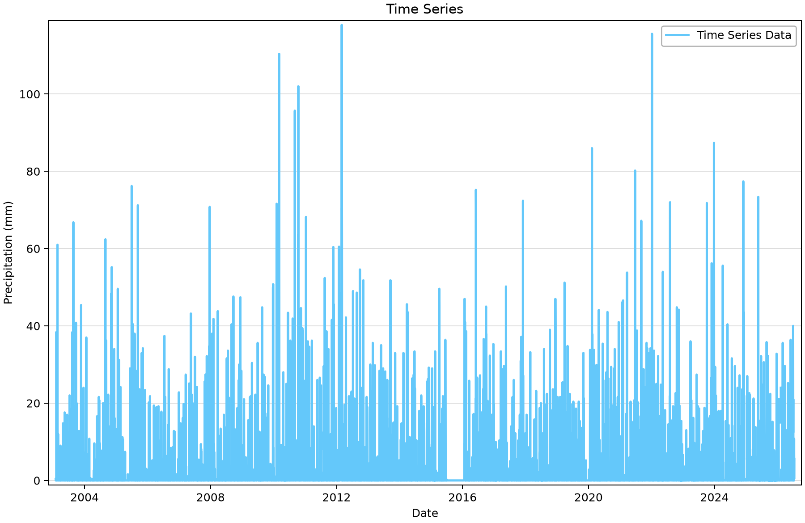
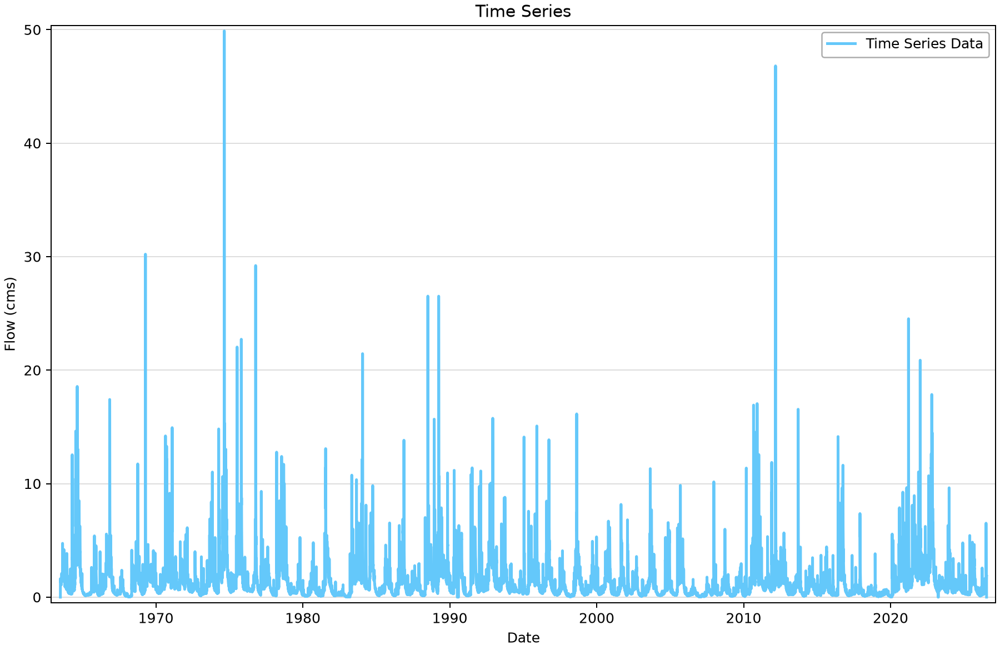
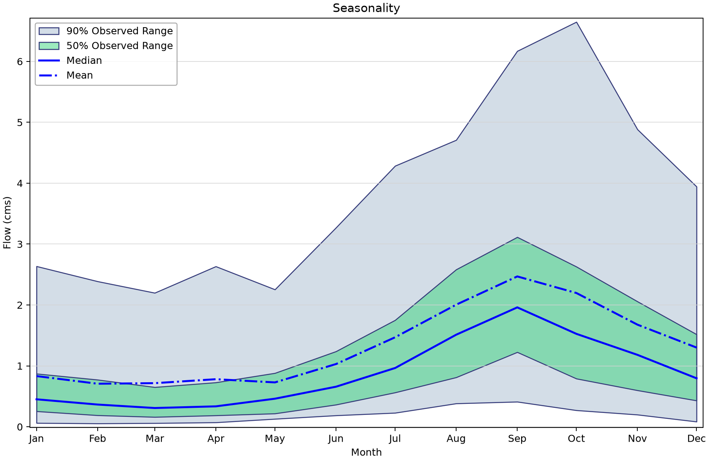
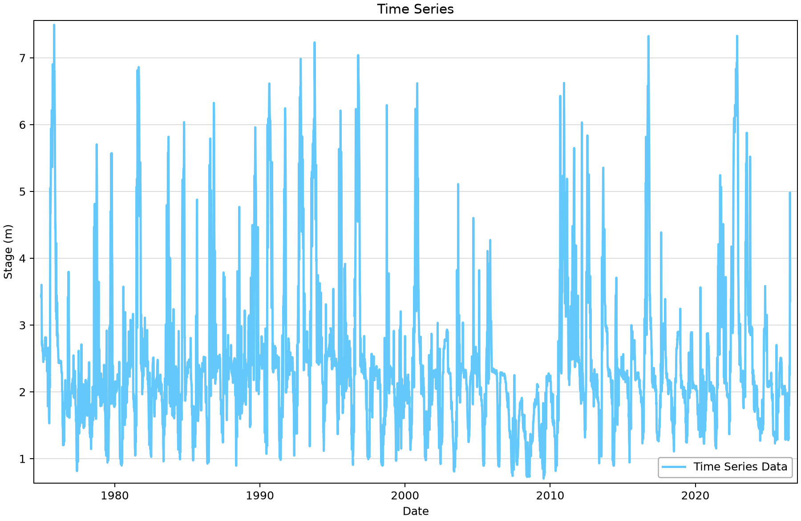

# Australian Water Data Online: inspect flow, stage and rainfall records

This project contains six saved Bureau of Meteorology time series from three Australian stations. Use it to distinguish rainfall depth, discharge and stage, and to inspect missing values before extracting a frequency-analysis dataset.

## Open the example

Open [abom-download-example.bestfit](abom-download-example.bestfit) in RMC-BestFit and save a working copy before importing or editing data. The figures use the saved snapshot; downloading again may change the record. You do not need to run an analysis to follow this exercise.

## Source and saved records

BestFit’s **ABOM** entry method accesses the Bureau of Meteorology’s [Water Data Online](https://www.bom.gov.au/waterdata/) service. The saved station descriptions identify Cotter River at Gingera (410730), Murrumbidgee River below Lobbs Hole Creek (410761), and Murray River at Tocumwal (409202). Use provider station metadata to confirm the variable, datum, qualifiers and upstream regulation for a new study.

| Saved element | Units | First–last saved date | Ordinates | Missing |
|---|---|---|---:|---:|
| ABOM - 410730 - Daily Precipitation | Precipitation (mm) | 2003-01-31–2026-07-15 | 8,567 | 56 |
| ABOM - 410730 - Daily Discharge | Flow (cms) | 1963-07-03–2026-07-15 | 23,024 | 0 |
| ABOM - 410761 - Daily Discharge | Flow (cms) | 1974-11-13–2026-07-15 | 18,873 | 98 |
| ABOM - 409202 - Daily Stage | Stage (m) | 1974-12-10–2026-07-15 | 18,846 | 39 |
| ABOM - 410730 - Instantaneous Discharge | Flow (cms) | 1963-07-03–2026-07-15 | 222,246 | 1 |
| ABOM - 409202 - Instantaneous Stage | Stage (m) | 1974-12-10–2026-07-15 | 669,279 | 46 |

“Missing” counts stored nonfinite values. A date range and a zero missing-value count do not prove complete time coverage, particularly for irregular or annual-peak records.

## Work through the example

1. Select **ABOM - 410730 - Daily Precipitation**. The saved values are precipitation depths in millimetres. Check its date range and missing values independently of the discharge record at the same site.
2. Select **ABOM - 410730 - Daily Discharge**. “Flow (cms)” denotes m³/s. Inspect the daily hydrograph, then open **Seasonality** to compare months.
3. Select **ABOM - 410761 - Daily Discharge**. Compare its coverage and missing-data count with Cotter River; a different station is not a replicate of the same physical record.
4. Select **ABOM - 409202 - Daily Stage**. Stage is in metres relative to the station datum. Compare it with the instantaneous stage record without interpreting either series as discharge.
5. Inspect the instantaneous records using actual timestamps. Their irregular sampling and large observation counts do not imply a complete regular time grid.
6. To collect another record, create a separate element, select **Entry Method = ABOM**, enter the station identifier, choose the variable and select **Download**. Retain source metadata and the retrieval date.

## Read the plots

*Figure 1. Saved daily precipitation at Cotter River at Gingera.* [SVG](figures/abom-download-example-precipitation.svg) · [Plot data](figures/abom-download-example-precipitation.plotspec.json.gz)

*Figure 2. Saved daily mean discharge at Cotter River at Gingera.* [SVG](figures/abom-download-example-cotter-daily-flow.svg) · [Plot data](figures/abom-download-example-cotter-daily-flow.plotspec.json.gz)

*Figure 3. Seasonal distribution of Cotter daily discharge.* [SVG](figures/abom-download-example-cotter-seasonality.svg) · [Plot data](figures/abom-download-example-cotter-seasonality.plotspec.json.gz)

*Figure 4. Saved daily stage at Murray River at Tocumwal; the axis represents stage, not discharge.* [SVG](figures/abom-download-example-murray-stage.svg) · [Plot data](figures/abom-download-example-murray-stage.plotspec.json.gz)

## Interpretation and limits

The seasonality bands show the 5th–95th percentiles (90% observed range) and 25th–75th percentiles (50% observed range) within each month. They describe variation among observations, not confidence in the monthly mean. Python corrects the desktop’s legacy confidence-interval legend while preserving the plotted values.

The records have different starting dates and missing-data counts. The daily Cotter discharge has no missing stored ordinates; the daily Murrumbidgee series has 98 and daily Murray stage has 39. Check whether an apparent quiet period is a physical condition or missing support before extracting extremes.

The unrelated three-value manual test element has been removed from the teaching collection. No fitted analysis is included here. Reservoir operations, rating changes or catchment changes require study-specific review before assuming stationarity.

## Check your understanding

Identify the two variables available at station 410730 and explain why precipitation in mm cannot be compared directly with discharge in m³/s. Select a candidate source for annual flood peaks and state what extraction or additional source record would still be needed.

## Figure reproducibility

Figures are rendered with Python from BestFit.UI/App coordinates exported from the saved project. Use the repository [figure-generation instructions](../../README.md#reproducing-the-figures) with project filter `abom-download-example`. The accompanying plot data records the source hash; a successful plot export is not validation of a statistical model.
