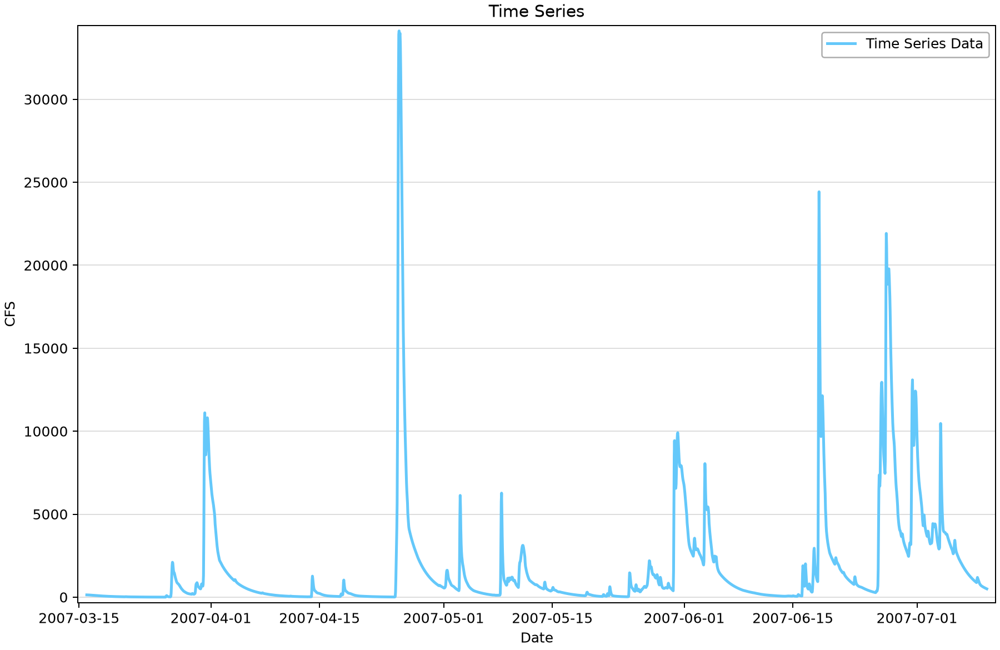
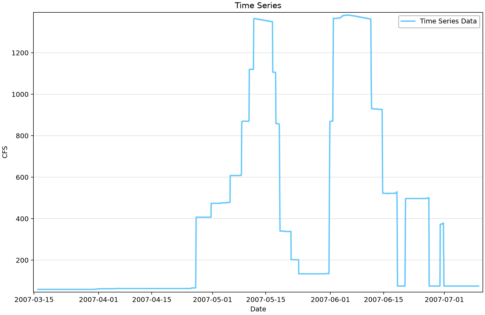

# HEC-DSS import: compare Grapevine Dam inflow and releases

This example imports hourly inflow and release hydrographs from the HEC-DSS file shipped beside the project. It teaches pathname selection, time and unit checks, and comparison of two different flow quantities for the same reservoir period.

## Open the example

Open [hec-dss-import-example.bestfit](hec-dss-import-example.bestfit) in RMC-BestFit and save a working copy before importing or editing data. The figures use the saved snapshot; downloading again may change the record. You do not need to run an analysis to follow this exercise.

## Source and saved records

Use the local [dss-example-data.dss](dss-example-data.dss) file. The saved series cover March 16 through July 10, 2007 and are labeled CFS (cubic feet per second). The DSS pathnames identify a 2007 run; the project does not establish whether every value is a direct measurement, reconstructed inflow or model output. Preserve that distinction when citing the data.

| Saved element | Units | First–last saved date | Ordinates | Missing |
|---|---|---|---:|---:|
| Grapevine Dam - Inflow | CFS | 2007-03-16–2007-07-10 | 2,785 | 0 |
| Grapevine Dam - Outflow | CFS | 2007-03-16–2007-07-10 | 2,785 | 0 |

“Missing” counts stored nonfinite values. A date range and a zero missing-value count do not prove complete time coverage, particularly for irregular or annual-peak records.

## Work through the example

1. Select **Grapevine Dam - Inflow** under **Time Series Data** and inspect its hourly table and time-series plot.
2. Select **Grapevine Dam - Outflow**. Check that the 2,785 saved timestamps and CFS units match the inflow series before comparing them.
3. To repeat the import on a working copy, set **Entry Method = HECDSS** and browse to the supplied `dss-example-data.dss`. Replace the old machine-specific file path with this local path.
4. Choose inflow pathname `//GRAPEVINE INFLOW/FLOW//1Hour/RUN:2007_MAR-JUL/` or release pathname `//GRAPEVINE LAKE-RELEASE/FLOW//1Hour/RUN:2007_MAR-JUL/`, as appropriate for the selected element.
5. Import the selected record and verify the first and last dates, hourly spacing, units and number of ordinates against the inventory. Use the alternative-series selector to compare the two hydrographs in BestFit.

## Read the plots

*Figure 1. Hourly Grapevine Dam inflow from the supplied DSS record.* [SVG](figures/hec-dss-import-example-inflow.svg) · [Plot data](figures/hec-dss-import-example-inflow.plotspec.json.gz)

*Figure 2. Hourly Grapevine Dam release from the supplied DSS record. Compare dates as well as magnitudes.* [SVG](figures/hec-dss-import-example-outflow.svg) · [Plot data](figures/hec-dss-import-example-outflow.plotspec.json.gz)

## Interpretation and limits

The saved maximum inflow is approximately 34,118 cfs, while the maximum release is 1,382 cfs. These are maxima of the two records and need not occur at the same time. A difference between their hydrographs alone does not provide storage change: a water balance also requires consistent timing, volume integration and any other relevant fluxes.

Neither hydrograph is an annual-maximum sample. Do not assign an annual exceedance probability to its largest value from this one event-period record. The supplied DSS file makes the import exercise reproducible without the original author’s computer paths.

## Check your understanding

Find both DSS pathnames and verify that they refer to FLOW at a one-hour interval. Explain what additional information would be required to turn the hydrograph comparison into a reservoir water balance.

## Figure reproducibility

Figures are rendered with Python from BestFit.UI/App coordinates exported from the saved project. Use the repository [figure-generation instructions](../../README.md#reproducing-the-figures) with project filter `hec-dss-import-example`. The accompanying plot data records the source hash; a successful plot export is not validation of a statistical model.
