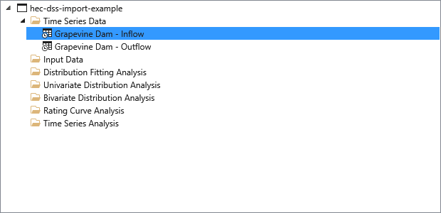
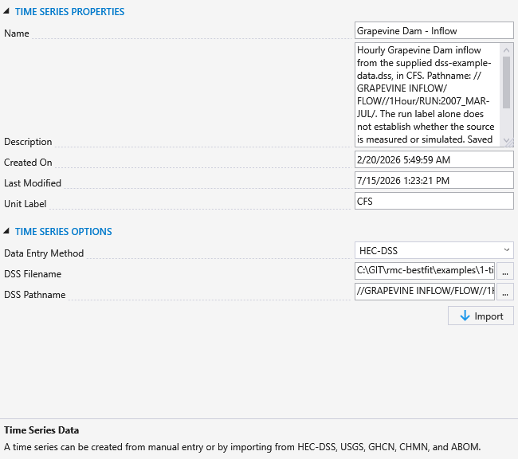
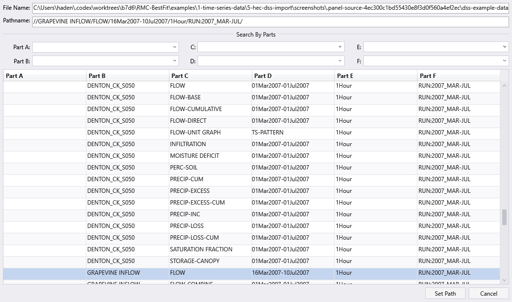
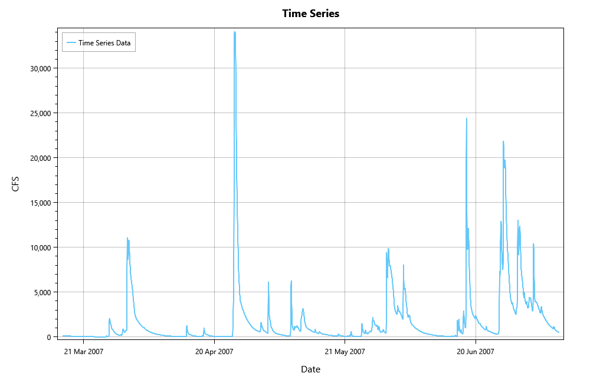
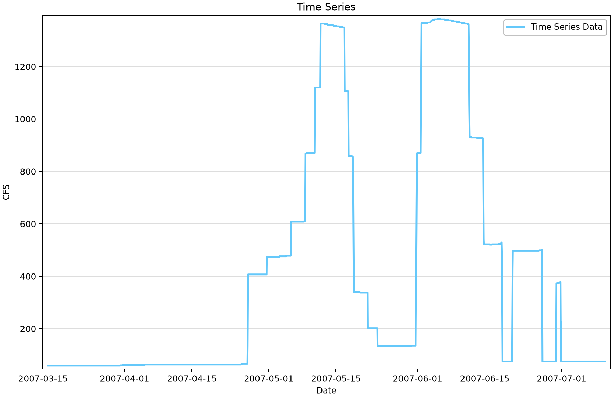
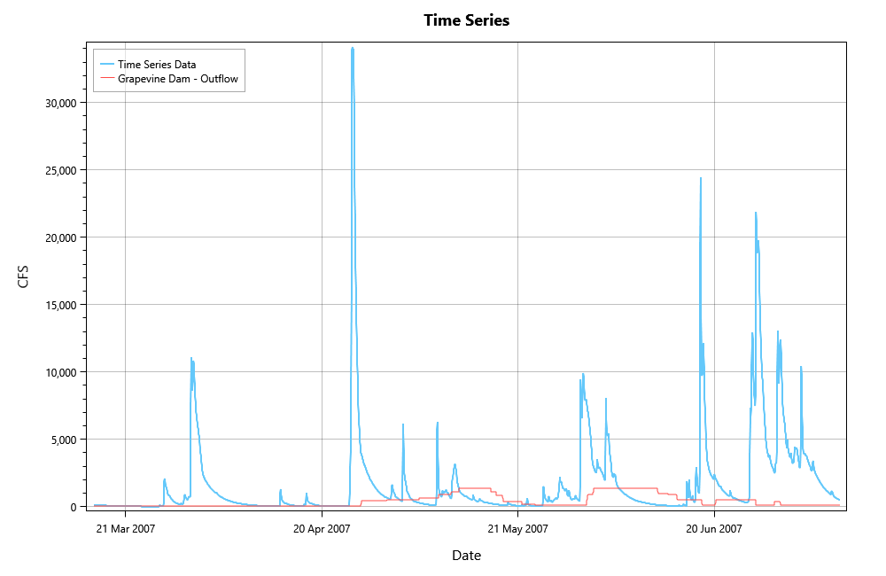

# HEC-DSS import: compare Grapevine Dam inflow and releases

This example imports hourly inflow and release hydrographs from the HEC-DSS file shipped beside the project. It teaches pathname selection, time and unit checks, and comparison of two different flow quantities for the same reservoir period.

## Open the example

Open [hec-dss-import-example.bestfit](hec-dss-import-example.bestfit) in RMC-BestFit and save a working copy before importing or editing data. The figures use the saved snapshot; downloading again may change the record. You do not need to run an analysis to follow this exercise.

## Find the controls

Expand **Time Series Data** in the **Project Explorer** and select **Grapevine Dam - Inflow**. In **Properties**, read **Data Entry Method = HEC-DSS**, **DSS Filename**, and **DSS Pathname**. The **Time Series** tab contains the **Time Series Data** grid and chronological plot; **Summary Statistics** is beside the grid. Use the left-side **Seasonality Plot**, **ACF Plot**, and **PACF Plot** tabs for the corresponding views.

For a new source in a working copy, right-click **Time Series Data**, choose **New Time Series...**, enter a name, and configure **Properties** before importing or downloading.

*Project Explorer for this saved project, with Grapevine Dam - Inflow selected.* [Capture data](screenshots/hec-dss-project-explorer-current.json.gz)

*Properties for Grapevine Dam - Inflow. Check the source and settings before changing a working copy.* [Capture data](screenshots/hec-dss-properties-panel-current.json.gz)

## Source and saved records

Use the local [dss-example-data.dss](dss-example-data.dss) file. The saved series cover March 16 through July 10, 2007 and are labeled CFS (cubic feet per second). The DSS pathnames identify a 2007 run; the project does not establish whether every value is a direct measurement, reconstructed inflow or model output. Preserve that distinction when citing the data.

| Saved element | Units | First–last saved date | Ordinates | Missing |
|---|---|---|---:|---:|
| Grapevine Dam - Inflow | CFS | 2007-03-16–2007-07-10 | 2,785 | 0 |
| Grapevine Dam - Outflow | CFS | 2007-03-16–2007-07-10 | 2,785 | 0 |

“Missing” counts stored nonfinite values. A date range and a zero missing-value count do not prove complete time coverage, particularly for irregular or annual-peak records.

## Work through the example

1. Select **Grapevine Dam - Inflow** under **Time Series Data** and inspect its hourly table and time-series plot.
2. Select **Grapevine Dam - Outflow**. Check that the 2,785 saved timestamps and CFS units match the inflow series before comparing them.
3. To repeat the import on a working copy, set **Data Entry Method = HEC-DSS**. Click **...** beside **DSS Filename** and browse to the supplied `dss-example-data.dss`. Replace the old machine-specific file path with this local path.
4. Click **...** beside **DSS Pathname** to open **HEC-DSS Pathname Selector**. Select the intended record, then choose **Set Path**. Choose inflow pathname `//GRAPEVINE INFLOW/FLOW//1Hour/RUN:2007_MAR-JUL/` or release pathname `//GRAPEVINE LAKE-RELEASE/FLOW//1Hour/RUN:2007_MAR-JUL/`, as appropriate for the selected element.
5. Select **Import** and verify the first and last dates, hourly spacing, units and number of ordinates against the inventory. For the comparison, select **Grapevine Dam - Inflow**, expand **Alternative Time Series** above the plot using its plus control, and check **Grapevine Dam - Outflow** in the list. Clear its checkbox to remove the overlay.

*HEC-DSS Pathname Selector for the supplied local DSS file, with the GRAPEVINE INFLOW/FLOW record at 1Hour selected. Match location, parameter, interval and run label before Set Path.* [Capture data](screenshots/hec-dss-path-selector-current.json.gz)

## Read the plots

*Figure 1. Hourly Grapevine Dam inflow from the supplied DSS record.* [Python SVG](figures/hec-dss-import-example-inflow.svg) · [Python plot data](figures/hec-dss-import-example-inflow.plotspec.json.gz) [Native SVG](screenshots/hec-dss-inflow-ts-plot-native.svg) [Capture data](screenshots/hec-dss-inflow-ts-plot-native.json.gz)

*Figure 2. Hourly Grapevine Dam release from the supplied DSS record. Compare dates as well as magnitudes.* [Python SVG](figures/hec-dss-import-example-outflow.svg) · [Python plot data](figures/hec-dss-import-example-outflow.plotspec.json.gz)

*Native Alternative Time Series comparison with Grapevine Dam - Inflow selected and Grapevine Dam - Outflow enabled. Compare the common hourly clock and CFS units; the overlay alone does not establish a reservoir water balance.* [Native SVG](screenshots/hec-dss-inflow-outflow-comparison-native.svg) [Capture data](screenshots/hec-dss-inflow-outflow-comparison-native.json.gz)

## Interpretation and limits

The saved maximum inflow is approximately 34,118 cfs, while the maximum release is 1,382 cfs. These are maxima of the two records and need not occur at the same time. A difference between their hydrographs alone does not provide storage change: a water balance also requires consistent timing, volume integration and any other relevant fluxes.

Neither hydrograph is an annual-maximum sample. Do not assign an annual exceedance probability to its largest value from this one event-period record. The supplied DSS file makes the import exercise reproducible without the original author’s computer paths.

## Check your understanding

Find both DSS pathnames and verify that they refer to FLOW at a one-hour interval. Explain what additional information would be required to turn the hydrograph comparison into a reservoir water balance.

## Figure reproducibility

Native screenshots show the current desktop plots for the selected saved elements. The linked Python SVG and plot-data files remain companion exports from BestFit.UI/App coordinates; views without a native replacement retain their Python figure. Use the repository [figure-generation instructions](../../README.md#reproducing-the-figures) with project filter `hec-dss-import-example`. The accompanying plot data records the source hash; a successful plot export is not validation of a statistical model.
