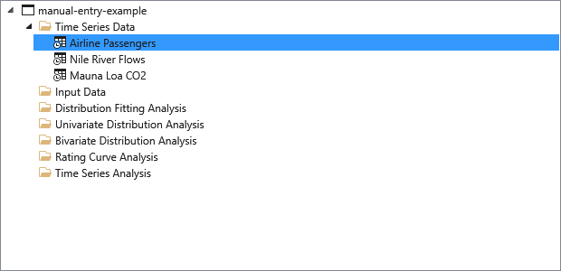
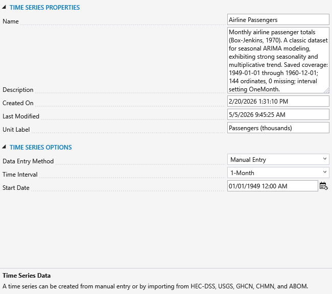
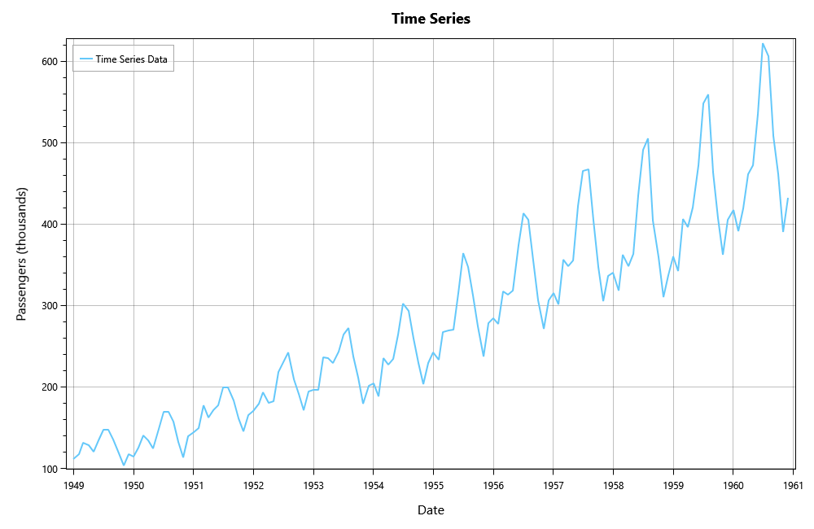
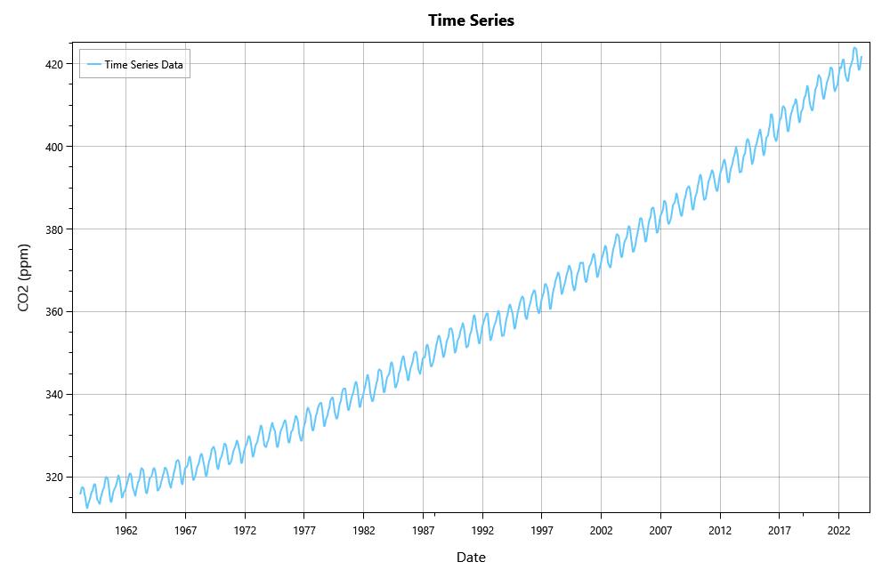
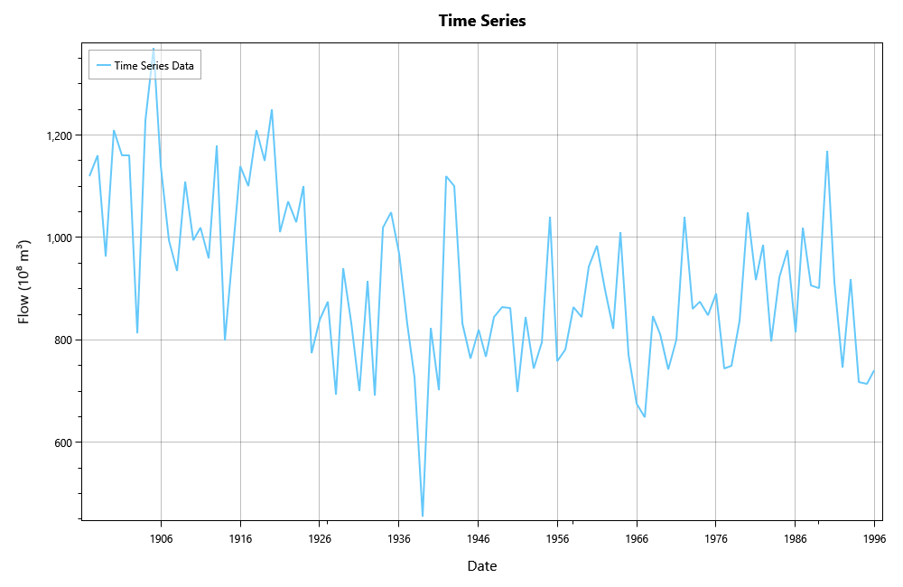
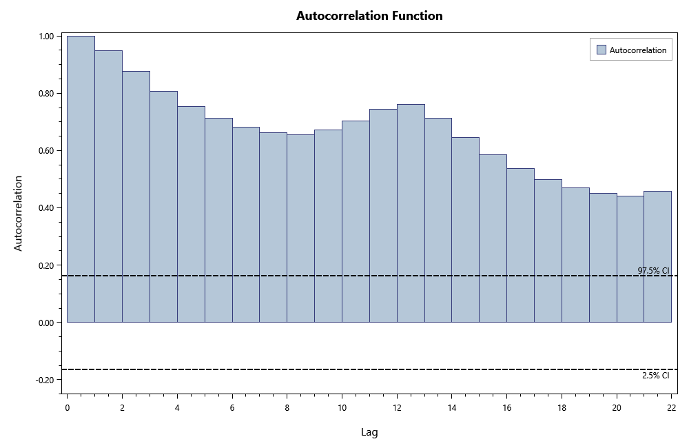

# Manual time-series entry: units, dates and classic datasets

Use three familiar datasets to practise importing values and assigning dates. The objective is to create a faithful time series before choosing a statistical model. These manually entered series have different units and intervals; a generic saved series-type field does not change what the values represent.

## Open the example

Open [manual-entry-example.bestfit](manual-entry-example.bestfit) in RMC-BestFit and save a working copy before importing or editing data. The figures use the saved snapshot; downloading again may change the record. You do not need to run an analysis to follow this exercise.

## Find the controls

Expand **Time Series Data** in the **Project Explorer** and select **Airline Passengers**. In **Properties**, read **Data Entry Method = Manual Entry**, **Time Interval = 1-Month**, and **Start Date**. The **Time Series** tab contains the **Time Series Data** grid and chronological plot; **Summary Statistics** is beside the grid. Use the left-side **Seasonality Plot**, **ACF Plot**, and **PACF Plot** tabs for the corresponding views.

For a new source in a working copy, right-click **Time Series Data**, choose **New Time Series...**, enter a name, and configure **Properties** before importing or downloading.

*Project Explorer for this saved project, with Airline Passengers selected.* [Capture data](screenshots/manual-entry-project-explorer-current.json.gz)

*Properties for Airline Passengers. Check the source and settings before changing a working copy.* [Capture data](screenshots/manual-entry-properties-current.json.gz)

## Source and saved records

The supplied CSV files are [airline-passengers.csv](airline-passengers.csv), [nile-river-flow.csv](nile-river-flow.csv), and [mauna-loa-co2.csv](mauna-loa-co2.csv). They contain monthly airline passenger totals, annual Nile flow volumes, and monthly Mauna Loa carbon-dioxide concentrations. The saved project is the source of the figures below; the CSV files provide a separate date/value check.

| Saved element | Units | First–last saved date | Ordinates | Missing |
|---|---|---|---:|---:|
| Airline Passengers | Passengers (thousands) | 1949-01-01–1960-12-01 | 144 | 0 |
| Nile River Flows | Flow (10⁸ m³) | 1897-01-01–1996-01-01 | 100 | 0 |
| Mauna Loa CO2 | CO2 (ppm) | 1958-03-01–2023-12-01 | 790 | 0 |

“Missing” counts stored nonfinite values. A date range and a zero missing-value count do not prove complete time coverage, particularly for irregular or annual-peak records.

## Work through the example

1. Select **Airline Passengers** and inspect the date and value columns. The 144 monthly observations run from January 1949 through December 1960; values are thousands of passengers.
2. Create a separate working element with **Data Entry Method = Manual Entry**. Set the interval and first date before pasting values. Use one row per observation and verify the final date after import.
3. Repeat the checks with **Mauna Loa CO2**. Its 790 monthly values are concentrations in parts per million (ppm), not flow or precipitation.
4. Inspect **Nile River Flows** and compare its first and last dates with `nile-river-flow.csv`. Read the date discrepancy below before interpreting when a change occurred.
5. Review the **Time Series**, **Seasonality Plot**, and **ACF Plot** views. Use the yearly Nile series for annual behaviour; monthly seasonality is not meaningful for a series containing only one dated value per year.
6. Continue to the [classic time-series analysis example](../../7-time-series-analysis/2-classic-time-series-examples/classic-time-series-examples.md) to examine saved fitted models and their diagnostic limitations.

## Read the plots

*Figure 1. Monthly airline passenger totals, in thousands.* [Python SVG](figures/manual-entry-example-airline.svg) · [Python plot data](figures/manual-entry-example-airline.plotspec.json.gz) [Native SVG](screenshots/manual-entry-airline-ts-plot-native.svg) [Capture data](screenshots/manual-entry-airline-ts-plot-native.json.gz)

*Figure 2. Monthly Mauna Loa CO2 concentrations, in ppm.* [Python SVG](figures/manual-entry-example-co2.svg) · [Python plot data](figures/manual-entry-example-co2.plotspec.json.gz) [Native SVG](screenshots/manual-entry-co2-ts-plot-native.svg) [Capture data](screenshots/manual-entry-co2-ts-plot-native.json.gz)

*Figure 3. Nile values plotted against the project’s stored 1897–1996 dates. Source CSV dates differ by 26 years.* [Python SVG](figures/manual-entry-example-nile-stored-dates.svg) · [Python plot data](figures/manual-entry-example-nile-stored-dates.plotspec.json.gz) [Native SVG](screenshots/manual-entry-nile-ts-plot-native.svg) [Capture data](screenshots/manual-entry-nile-ts-plot-native.json.gz)

*Airline Passengers ACF Plot from the unchanged monthly series. Persistent correlation can reflect the changing level and seasonality; it does not establish that an untransformed stationary model is adequate.* [Native SVG](screenshots/manual-entry-airline-acf-native.svg) [Capture data](screenshots/manual-entry-airline-acf-native.json.gz)

## Interpretation and limits

Airline passenger totals show both variation within each year and a changing level. Mauna Loa CO2 has a different physical meaning and scale. Describe these visible features before selecting transformations, trends or seasonal terms; a recognizable pattern does not by itself select an adequate model.

**Nile date discrepancy:** the 100 saved values are dated 1897–1996, while the supplied CSV dates are 1871–1970. This tutorial preserves the project’s values and timestamps and makes the discrepancy explicit. Do not use the saved date axis to identify a historical change year. In a new working element, enter the dates from the source CSV and verify the mapping before analysis.

No fitting is required to reproduce these plots. The stored series-type setting may read DailyDischarge for manually entered data; the manual entry method, actual interval, units and source file define the dataset.

## Check your understanding

Enter five monthly values in a working element and verify their resulting dates. Then explain the consequence of shifting the Nile record by 26 years while retaining the same sequence of magnitudes.

## Figure reproducibility

Native screenshots show the current desktop plots for the selected saved elements. The linked Python SVG and plot-data files remain companion exports from BestFit.UI/App coordinates; views without a native replacement retain their Python figure. Use the repository [figure-generation instructions](../../README.md#reproducing-the-figures) with project filter `manual-entry-example`. The accompanying plot data records the source hash; a successful plot export is not validation of a statistical model.
