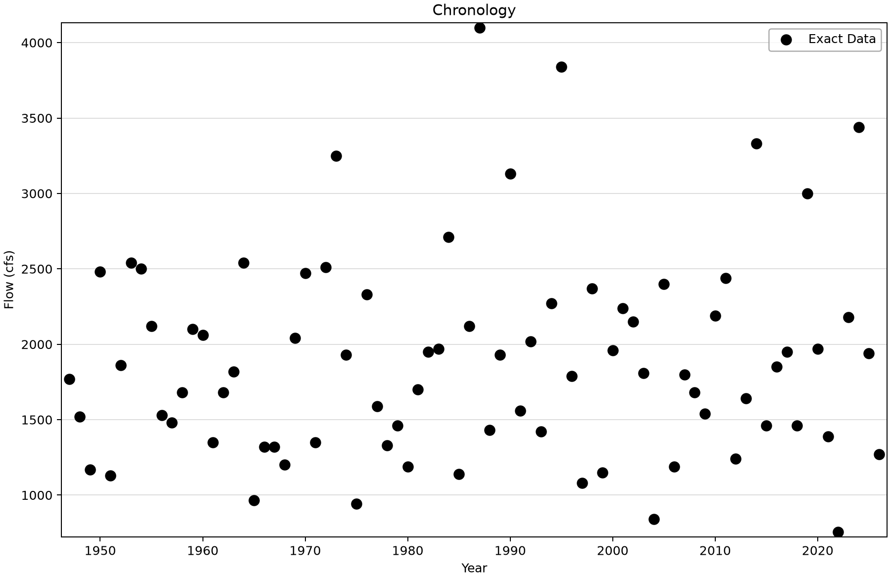
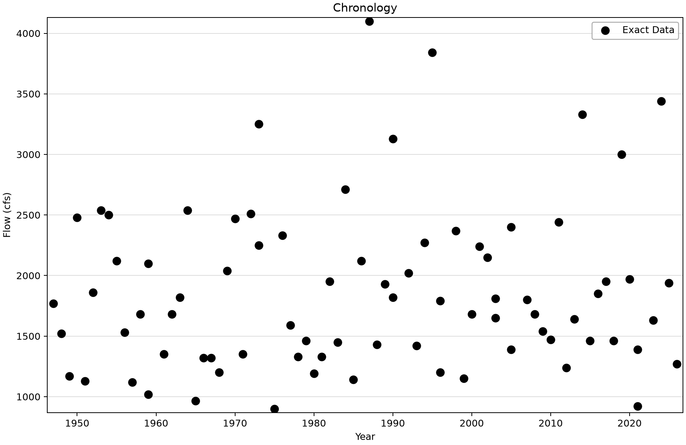
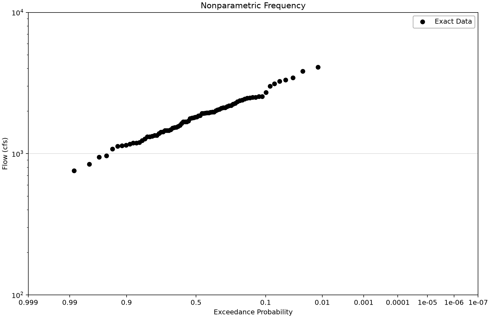

# Annual maxima: choose the block and the measured quantity

This exercise extracts one maximum daily mean discharge per annual block from the Moose River at Victory, Vermont (USGS 01134500). Compare calendar-year and water-year blocks to see how the same daily record can produce different annual samples. Neither sample is an annual instantaneous-peak record.

## Open and inspect the source

Open [usgs-block-max-example.bestfit](usgs-block-max-example.bestfit) in BestFit and save a working copy before refreshing or processing data. The figures below use the saved observations and current desktop display routines.

The saved daily series contains 29,050 observations from 1947-01-01 through 2026-07-14, with no stored missing ordinates. Discharge is in cubic feet per second (cfs). The source record stops partway through 2026. The water-year series also starts partway through water year 1947 because October–December 1946 are absent.

## Saved configuration and sample

| Saved input | Block | Observations | Year indexes | Low outliers |
|---|---|---:|---|---:|
| USGS - 01134500 - Block Max - Calendar Year | January–December | 80 | 1947–2026 | 0 |
| USGS - 01134500 - Block Max - Water Year | October–September, named by ending year | 80 | 1947–2026 | 0 |

## Work through the example

1. Select **USGS - 01134500 - Daily Discharge** under **Time Series Data**. Check the first and last dates and confirm that the values are daily means.
2. Select **USGS - 01134500 - Block Max - Calendar Year** under **Input Data**. In Properties, confirm **Exact Data Method = Block Series**, the Moose River source, **Block Function = Maximum**, and **Time Block = Calendar Year**.
3. Inspect the data grid and **Chronology**. There are 80 rows, including an incomplete 2026 block. A row count alone does not prove that each year was completely observed.
4. Select the water-year element and confirm **Time Block = Water Year**. Read each observation’s event date as well as its year index; an October event belongs to the following water year.
5. Compare the two samples by year index. Sixteen of the 80 paired magnitudes differ. The grouping choice can change the selected event even though no daily value changed.
6. Open **Frequency**. These are empirical plotting positions from the saved sample, not a fitted flood-frequency curve. Inspect completeness before creating a separate analysis.
7. To repeat the extraction, create a new Input Data element in a working copy, select the source, maximum function and desired annual block. Document how incomplete blocks are handled before interpreting a fitted annual probability.

## Read the plots

*Calendar-year maxima of daily mean discharge. The 2026 block is incomplete.* [SVG](images/usgs-block-max-example-calendar-chronology.svg) · [Plot data](images/usgs-block-max-example-calendar-chronology.plotspec.json.gz)

*Water-year maxima. Both the first and last water-year blocks have incomplete coverage.* [SVG](images/usgs-block-max-example-water-year-chronology.svg) · [Plot data](images/usgs-block-max-example-water-year-chronology.plotspec.json.gz)

*Empirical frequency of the saved daily-mean maxima, including the retained boundary years.* [SVG](images/usgs-block-max-example-calendar-frequency.svg) · [Plot data](images/usgs-block-max-example-calendar-frequency.plotspec.json.gz)

## Interpretation and limits

The stored Start Month and End Month fields are 10 and 9 in both elements. For these saved standard-block choices, the Time Block selection determines the grouping; do not describe the calendar-year element as October–September solely from those otherwise retained fields.

A maximum daily mean averages over a day; an instantaneous annual peak describes the highest momentary discharge. Compare records only after matching year convention, coverage and source qualifiers. Do not substitute the daily-mean series for instantaneous peaks without stating the change in the engineering quantity.

Both inputs retain an enabled low-outlier screening setting and zero low-outlier flags. That does not establish independence, stationarity or suitability for extrapolation. The incomplete boundary years require review before a design analysis; the original sample is retained so this issue remains visible.

## Check your understanding

Explain why the two records have the same count but 16 different magnitudes. Then identify which boundary years lack complete source coverage and state whether the intended analysis concerns daily mean or instantaneous flow.

Compare the [USGS annual-peak example](../2-usgs-peak-discharge/usgs-peak-download-example.md) before choosing a frequency-analysis input.

## Reproduce the figures

Follow the [shared figure-generation instructions](../../README.md#reproducing-the-figures) with `--only usgs-block-max-example`. No saved analysis is refitted. Threshold views, where present, call the desktop diagnostic fits on the saved source; the Python package renders their returned geometry.
