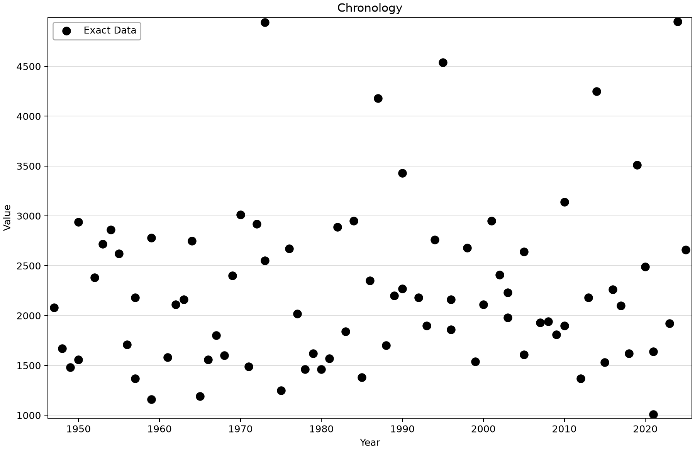
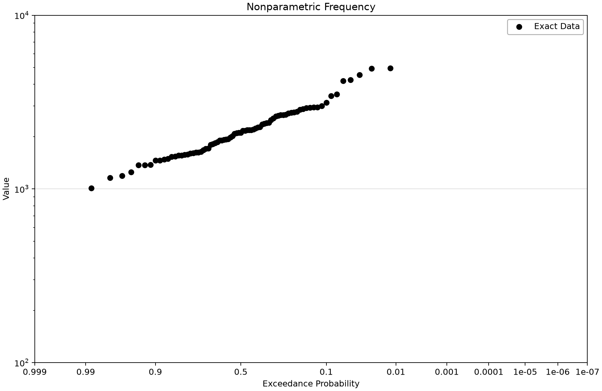
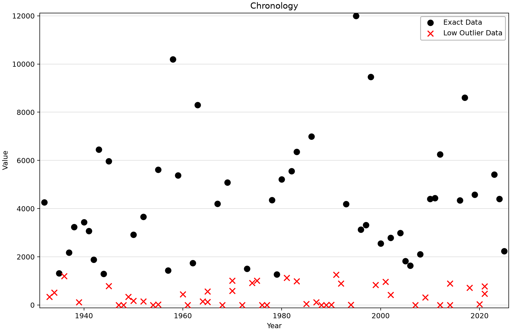
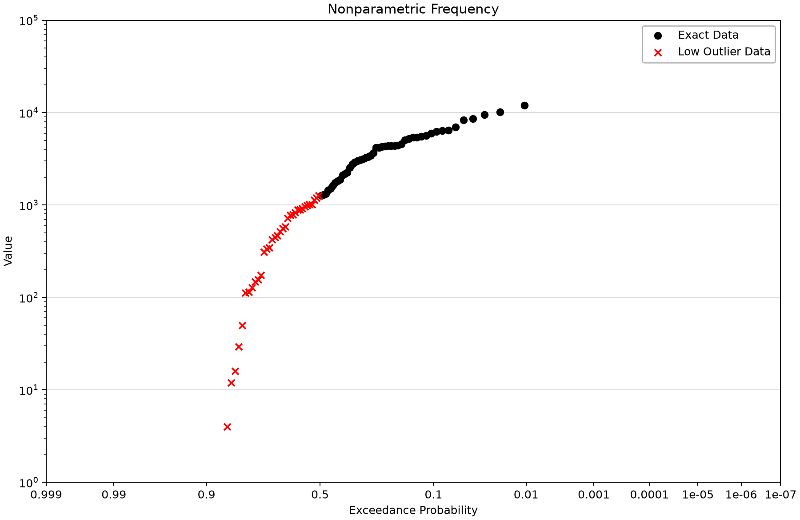

# USGS annual peaks: inspect source records and low-outlier flags

This exercise compares two saved annual instantaneous-peak discharge records. The Moose River series has no flagged low outliers; the Orestimba Creek series has 47. Learn to distinguish a retained low observation, its statistical treatment and the physical explanation that still needs independent evidence.

## Open and inspect the source

Open [usgs-peak-download-example.bestfit](usgs-peak-download-example.bestfit) in BestFit and save a working copy before refreshing or processing data. The figures below use the saved observations and current desktop display routines.

The saved inputs were downloaded as USGS annual peak discharges. Moose River at Victory, Vermont is site 01134500; Orestimba Creek near Newman, California is site 11274500. The source values are in cfs, although both saved plot axes use the generic label “Value.” Review the original peak-flow qualifiers and station history through the [USGS water-data portal](https://waterdata.usgs.gov/) when preparing a new study.

## Saved configuration and sample

| Saved input | Year indexes | Exact-series rows | Flagged low outliers | Saved screening threshold |
|---|---|---:|---:|---:|
| USGS - 01134500 - Peak Discharge | 1947–2025 | 79 | 0 | 0 cfs |
| USGS - 11274500 - Peak Discharge | 1932–2025 | 94 | 47 | 1,270 cfs |

## Work through the example

1. Open **Input Data** in the Project Explorer. This project has two direct peak-data inputs and does not require a daily time-series element.
2. Select the Moose River input. Check its station number, **Exact Data Method = USGS Peak Discharge** and enabled **Use Multiple Grubbs-Beck Test** setting.
3. Read **Chronology** and the data grid. Confirm the 79 year indexes, then inspect **Frequency**. A smooth sample plot is not a convergence check or proof of a distributional model.
4. Select Orestimba Creek. Compare its chronology with the frequency view, and identify the 47 low-outlier flags and 1,270 cfs screening threshold.
5. Keep the flagged observations in the record. The saved DataFrame retains all 94 rows in ExactSeries with low-outlier flags; it does not physically move them into a separate ThresholdSeries.
6. Before fitting, record the chosen screening policy and assess how the selected estimator uses the flags. Review source qualifiers, historical information and the intended annual-peak definition together.
7. For a new download, create a separate Input Data element, enter the station number and download into a working copy. Preserve the retrieval date and raw source evidence; a refreshed record need not reproduce this snapshot.

## Read the plots

*Moose River annual instantaneous peaks, with the saved year indexes.* [SVG](images/usgs-peak-download-example-moose-chronology.svg) · [Plot data](images/usgs-peak-download-example-moose-chronology.plotspec.json.gz)

*Moose River empirical frequency. “Value” denotes discharge in cfs.* [SVG](images/usgs-peak-download-example-moose-frequency.svg) · [Plot data](images/usgs-peak-download-example-moose-frequency.plotspec.json.gz)

*Orestimba chronology retains the low-flow years and their flags.* [SVG](images/usgs-peak-download-example-orestimba-chronology.svg) · [Plot data](images/usgs-peak-download-example-orestimba-chronology.plotspec.json.gz)

*Orestimba empirical frequency with low outliers shown separately. Zero magnitudes cannot appear on a log axis.* [SVG](images/usgs-peak-download-example-orestimba-frequency.svg) · [Plot data](images/usgs-peak-download-example-orestimba-frequency.plotspec.json.gz)

## Interpretation and limits

The Multiple Grubbs–Beck Test (MGBT) identifies potentially influential low floods under its statistical screening rule. A flag is not proof that a measurement is wrong or that the observation arose from a different physical population. Treating flagged values as censored information is different from deleting dry years, which would change the annual sample.

The log-magnitude frequency display cannot show zero flows. Use the chronology and data grid to retain visibility of the whole record; do not replace zero by a small invented positive number. The curve of plotted observations remains an empirical description, not a fitted distribution or confidence band.

The block-maximum tutorial uses the same Moose River station but maxima of daily means and a different end date. Match complete years before comparing the two sources. A generic “Value” axis label does not remove the need to document cfs.

## Check your understanding

Identify the number of original observations, the number flagged and the screening threshold for Orestimba. Explain why retaining dry years matters and why a low-outlier test cannot identify a physical flood mechanism by itself.

Continue with the [block-maximum comparison](../1-block-maximum/usgs-block-max-example.md) or [univariate analysis examples](../../4-univariate-distribution-analysis/README.md). For formal B17C context, consult [USGS Bulletin 17C](https://doi.org/10.3133/tm4B5).

## Reproduce the figures

Follow the [shared figure-generation instructions](../../README.md#reproducing-the-figures) with `--only usgs-peak-download-example`. No saved analysis is refitted. Threshold views, where present, call the desktop diagnostic fits on the saved source; the Python package renders their returned geometry.
