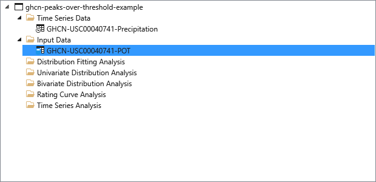
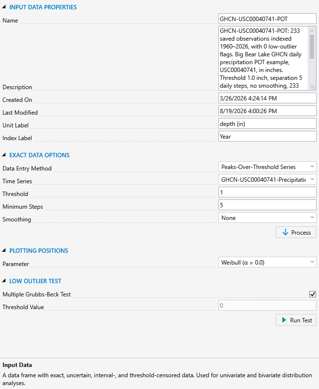
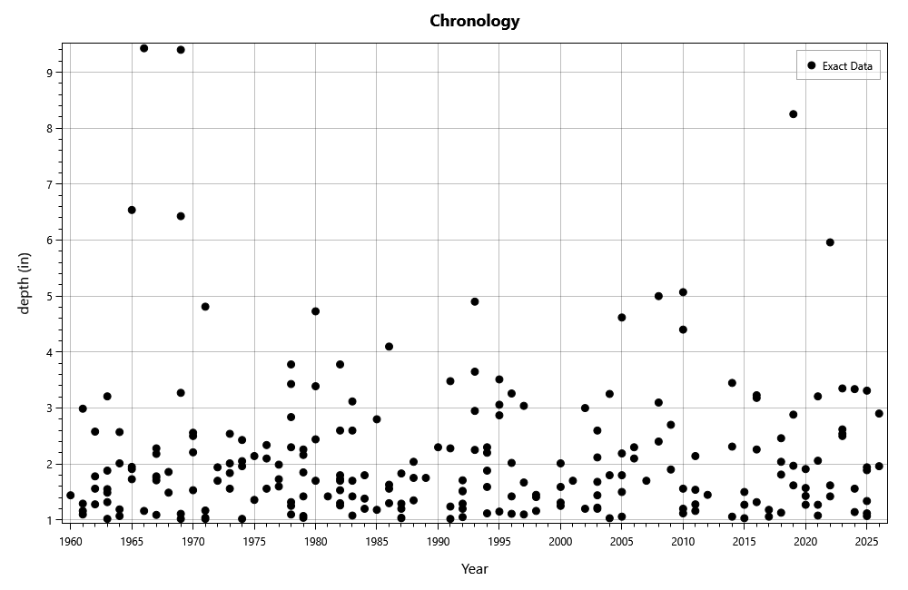
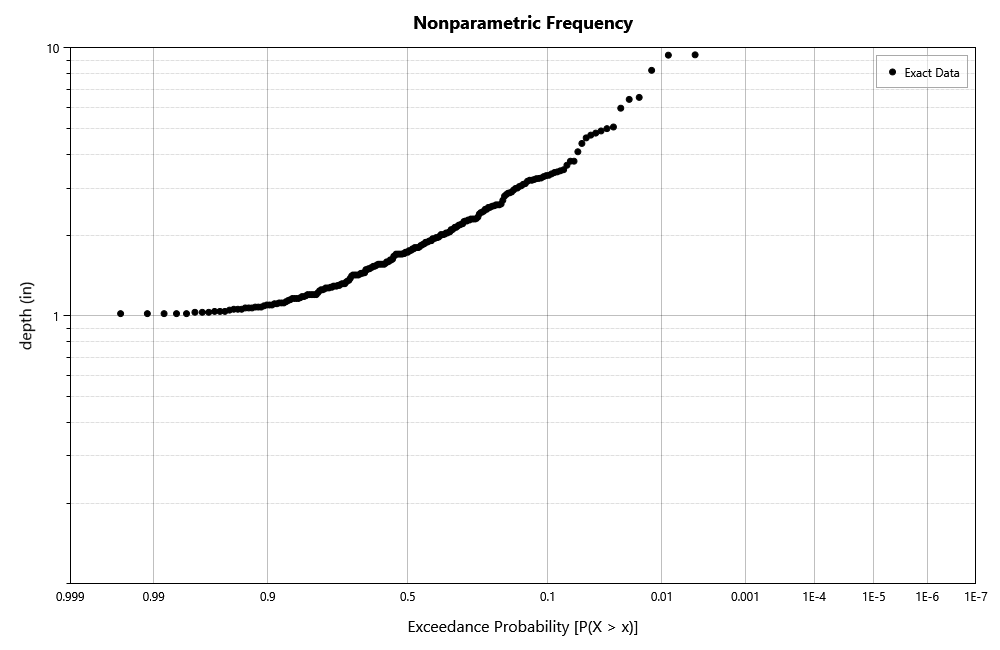
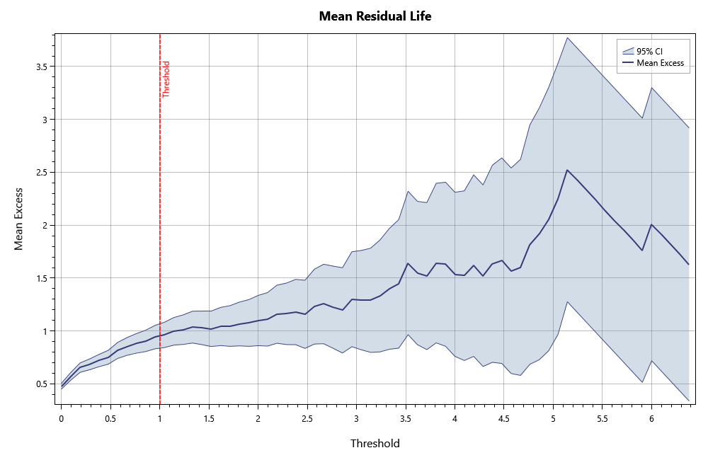
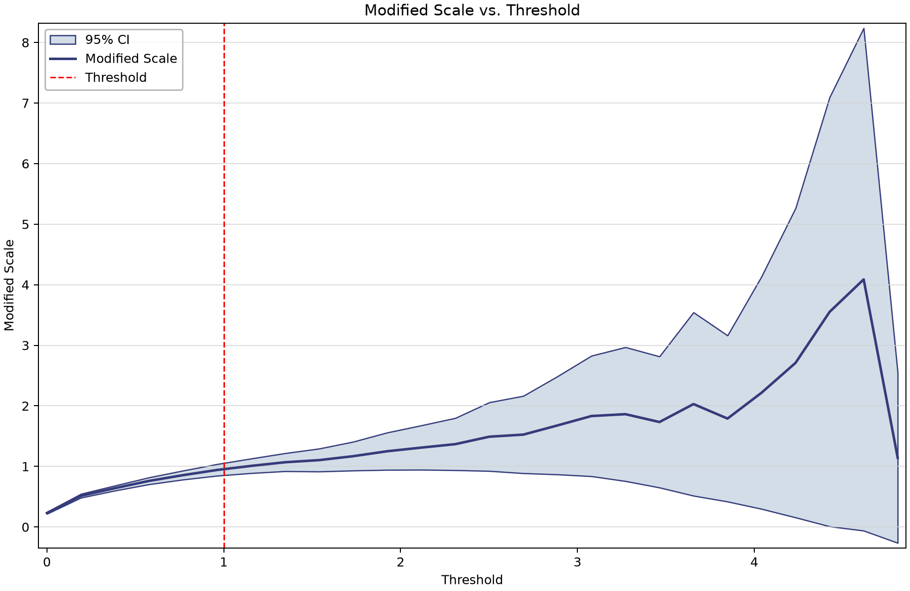
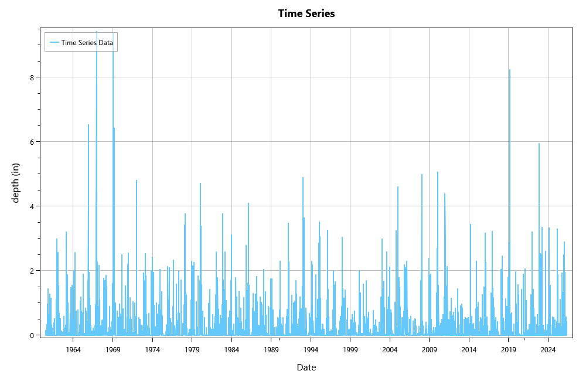

# Big Bear precipitation POT: threshold diagnostics and missing coverage

This example extracts separated daily precipitation peaks at Big Bear Lake, California (GHCN USC00040741). It shows how to connect a threshold, daily event selection and an observation-period record without assuming that every selected value is an independent storm or an annual maximum.

## Open and inspect the source

Open [ghcn-peaks-over-threshold-example.bestfit](ghcn-peaks-over-threshold-example.bestfit) in BestFit and save a working copy before refreshing or processing data. The figures below use the saved observations and current desktop display routines.

The saved precipitation series has 24,106 daily ordinates from 1960-07-01 through 2026-06-30; 482 are missing. Values are in inches. NOAA defines the source PRCP field in tenths of millimetres; precipitation is converted separately from the snowfall variable discussed in the [GHCN download tutorial](../../1-time-series-data/2-ghcn-download/ghcn-download-example.md). See the [NOAA daily format specification](https://www.ncei.noaa.gov/pub/data/ghcn/daily/readme.txt) for source units and flags.

## Find the controls

Expand **Time Series Data** and **Input Data** in the **Project Explorer** and select **GHCN-USC00040741-POT**. In **Properties**, read **Data Entry Method = Peaks-Over-Threshold Series**, **Time Series = GHCN-USC00040741-Precipitation**, **Threshold**, **Minimum Steps**, and **Smoothing**. Open **Data Frame** on the left, then **Exact Data** above the grid. The **Chronology Plot** and **Frequency Plot** selectors below the plot switch between event timing and empirical frequency.

For a separate working input, right-click **Input Data**, choose **New Input Data...**, and enter a name. Configure **Data Entry Method** and the source in **Properties**; **Process** extracts a block or POT sample, while **Download** retrieves direct USGS peaks. Follow the saved example by inspection before processing a new input.

*Project Explorer for this saved project, with GHCN-USC00040741-POT selected.* [Capture data](screenshots/ghcn-pot-project-explorer-current.json.gz)

*Properties for GHCN-USC00040741-POT. Check the source and settings before changing a working copy.* [Capture data](screenshots/ghcn-pot-properties-current.json.gz)

## Saved configuration and sample

| Saved setting or result | Value |
|---|---|
| Input element | GHCN-USC00040741-POT |
| Source element | GHCN-USC00040741-Precipitation |
| Threshold | 1.0 inch |
| Minimum steps between peaks | 5 daily steps |
| Smoothing | None; retained Period = 2 is inactive |
| Selected events and year indexes | 233; 1960–2026 |
| Stored source exposure | 67 inclusive calendar years |
| Saved Lambda | 3.4776119403 events/year (233 / 67) |

## Work through the example

1. Open the precipitation source and check the dates, units and missing observations before interpreting the storm peaks.
2. Select **GHCN-USC00040741-POT**. Confirm the 1.0 inch threshold, five-step separation and **Smoothing = None**. The saved name is GHCN, not the earlier tutorial’s GHCH spelling.
3. Inspect all 233 event rows and their dates. A daily precipitation peak is a one-day total; it is not a multi-day storm-total depth.
4. Compare **Chronology** with **Frequency**. Several selected events can occur in one calendar year. The sample exceedance probability should not be described as annual exceedance probability without an occurrence model.
5. Open **POT Diagnostics** on the left. Select **Mean Residual Life**, **Modified Scale**, and **Shape** below the plot. Inspect mean residual life and modified-scale stability together; consult shape stability in the app. Record how many observations support the tail and whether uncertainty expands as the threshold rises.
6. Read the stored exposure of 67 calendar years and calculate 233 / 67. Then identify the two partial boundary years and the 482 missing daily values that a study-specific effective-exposure review must address.
7. If investigating sensitivity, create separate working-copy inputs for alternative thresholds and separation rules, keeping units and source period fixed. Explain the hydrologic evidence behind a choice rather than targeting a preferred event count.

## Read the plots

*The 233 selected one-day precipitation peaks; some years have multiple events.* [Python SVG](images/ghcn-peaks-over-threshold-example-chronology.svg) · [Python plot data](images/ghcn-peaks-over-threshold-example-chronology.plotspec.json.gz) [Native SVG](screenshots/ghcn-pot-chronology-native.svg) [Capture data](screenshots/ghcn-pot-chronology-native.json.gz)

*Empirical event-magnitude frequency in inches. Annual frequency requires the occurrence model and exposure.* [Python SVG](images/ghcn-peaks-over-threshold-example-frequency.svg) · [Python plot data](images/ghcn-peaks-over-threshold-example-frequency.plotspec.json.gz) [Native SVG](screenshots/ghcn-pot-frequency-native.svg) [Capture data](screenshots/ghcn-pot-frequency-native.json.gz)

*Mean excess from the desktop threshold diagnostic calculation on the saved precipitation source.* [Python SVG](images/ghcn-peaks-over-threshold-example-mean-residual-life.svg) · [Python plot data](images/ghcn-peaks-over-threshold-example-mean-residual-life.plotspec.json.gz) [Native SVG](screenshots/ghcn-pot-mrl-native.svg) [Capture data](screenshots/ghcn-pot-mrl-native.json.gz)

*Modified GPD scale stability. Sparse high-threshold support should be read together with the interval width.* [Python SVG](images/ghcn-peaks-over-threshold-example-modified-scale.svg) · [Python plot data](images/ghcn-peaks-over-threshold-example-modified-scale.plotspec.json.gz)

*GHCN-USC00040741-Precipitation, the saved daily source for the POT input. Missing days remain unknown; these are one-day totals in inches.* [Native SVG](screenshots/ghcn-pot-daily-precipitation-native.svg) [Capture data](screenshots/ghcn-pot-daily-precipitation-native.json.gz)

## Interpretation and limits

The five-step separation is an extraction convention, not a demonstration of storm independence. The threshold diagnostics use the source series after smoothing, with no smoothing active here; they do not repeat the final declustering rule at each threshold. A stable-looking parameter curve should be considered alongside storm timing, dependence, source quality and the number of exceedances.

The stored exposure counts 1960 through 2026 inclusive. It does not subtract the partial boundary years or 482 missing days. Missing precipitation is unknown, not zero. Preserve that distinction when deciding whether the source represents continuous observation or requires a different effective exposure in a new study.

Compare this example with Orestimba only as a contrast in variable, units and settings. A higher event rate does not by itself establish a physical difference in storm frequency because the thresholds, record completeness and extraction choices also differ. The retained 1.0 inch threshold is a tutorial setting, not a general recommendation for precipitation studies.

## Check your understanding

Explain why 233 events do not mean 233 years, why the inactive Period = 2 does not create two-day totals, and why 67 calendar years is not automatically 67 complete observed years.

Continue with the [point-process examples](../../4-univariate-distribution-analysis/3-point-process-analysis/point-process-examples.md), where event magnitudes and occurrence exposure enter an annual-frequency model.

## Reproduce the figures

Follow the [shared figure-generation instructions](../../README.md#reproducing-the-figures) with `--only ghcn-peaks-over-threshold-example`. Native screenshots show the current desktop views of the saved inputs. The linked Python SVG and plot-data files remain companion exports; views without a native replacement retain their Python figure. No saved analysis is refitted. Threshold views, where present, call the desktop diagnostic fits on the saved source.
