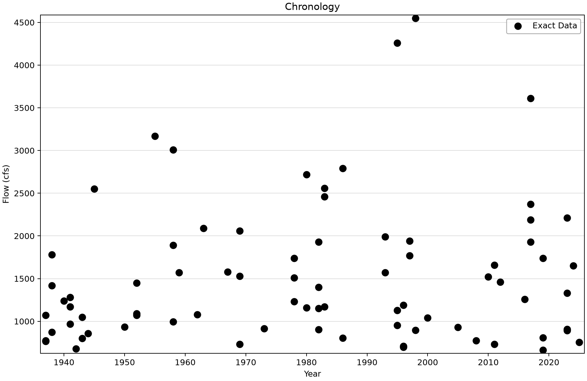
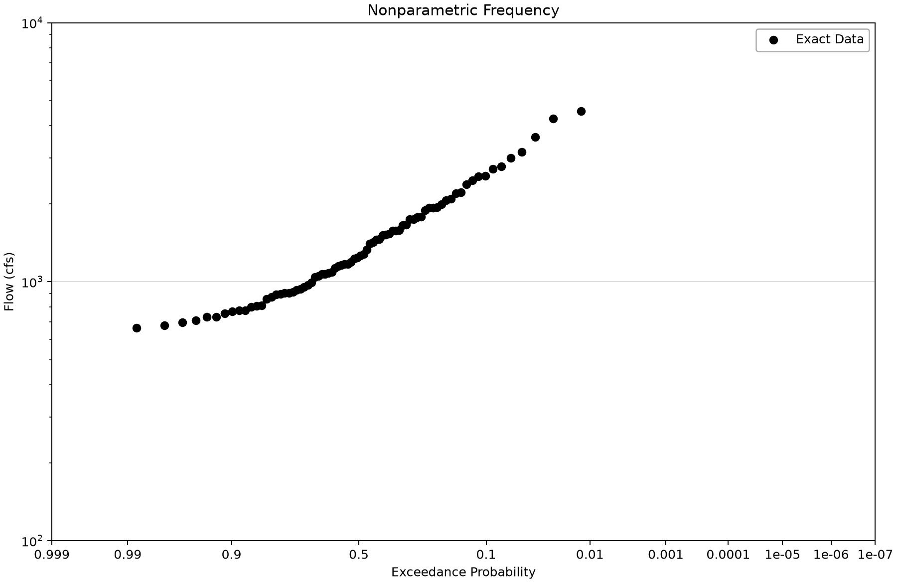
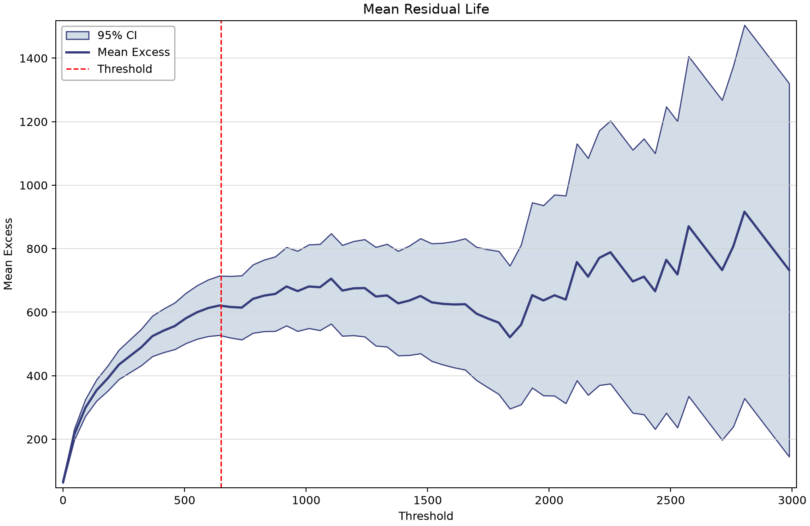
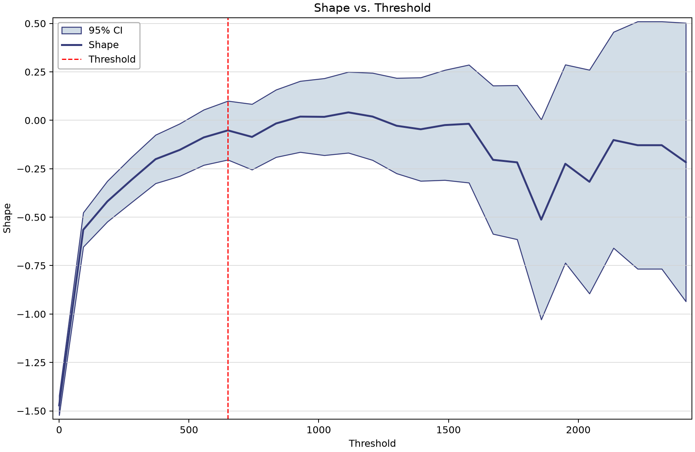

# Orestimba peaks over threshold: event extraction and observation exposure

This exercise selects separated high daily flows from Orestimba Creek near Newman, California (USGS 11274500). A peaks-over-threshold (POT) sample may contain several events in one year and none in another. Learn why the event magnitudes, separation rule and total observed exposure must all be reviewed before assigning annual probabilities.

## Open and inspect the source

Open [usgs-peaks-over-threshold-example.bestfit](usgs-peaks-over-threshold-example.bestfit) in BestFit and save a working copy before refreshing or processing data. The figures below use the saved observations and current desktop display routines.

The source contains 34,438 daily means in cfs, from 1932-04-01 through 2026-07-14, with no stored missing ordinates. The saved event sample has 78 peaks whose year indexes span 1937–2025. These event dates do not define the full period during which the station could have observed an event.

## Saved configuration and sample

| Saved setting or result | Value |
|---|---|
| Input element | USGS - 11274500 - Peaks-Over-Threshold |
| Threshold | 650 cfs |
| Minimum steps between peaks | 5 daily steps |
| Smoothing | None; retained Period = 1 |
| Selected events | 78 |
| Saved Lambda | 0.8764044944 per year (78 / 89) |
| Explicit source-exposure field | Absent in this older saved input |

## Work through the example

1. Select **USGS - 11274500 - Daily Discharge** and inspect the hydrograph, including zero-flow periods and the source boundaries.
2. Select **USGS - 11274500 - Peaks-Over-Threshold**. Confirm the source reference, 650 cfs threshold, five-step separation and no smoothing in Properties.
3. Read the 78 event rows and their actual dates. Five daily steps enforce a selection rule; they do not prove that storms or catchment responses are independent.
4. Open **Chronology** and **Frequency**. Multiple observations can share a year index. The frequency display concerns the saved event sample; its exceedance probability is not automatically annual exceedance probability.
5. Open **Threshold Diagnostics** and inspect mean residual life, modified scale and shape stability. Look for a defensible range, adequate exceedance counts and uncertainty rather than choosing the smoothest-looking point.
6. Compare the saved event span (89 indexed years) with the longer source record. The saved rate uses the former. Document full observation exposure, partial years and any gaps before using these events in a new annual-frequency calculation.
7. For a sensitivity exercise, duplicate the input and vary one threshold or separation setting at a time. Retain the original and document the consequences; do not silently overwrite the teaching snapshot.

## Read the plots

*The 78 saved event peaks. Years without events remain part of the exposure question.* [SVG](images/usgs-peaks-over-threshold-example-chronology.svg) · [Plot data](images/usgs-peaks-over-threshold-example-chronology.plotspec.json.gz)

*Empirical exceedance of event magnitudes; do not read this as an accepted annual-frequency curve.* [SVG](images/usgs-peaks-over-threshold-example-frequency.svg) · [Plot data](images/usgs-peaks-over-threshold-example-frequency.plotspec.json.gz)

*Mean excess over candidate thresholds, calculated by the desktop diagnostic routine from the saved daily source.* [SVG](images/usgs-peaks-over-threshold-example-mean-residual-life.svg) · [Plot data](images/usgs-peaks-over-threshold-example-mean-residual-life.plotspec.json.gz)

*GPD shape stability from the desktop diagnostics. Review uncertainty and sparse high-threshold support.* [SVG](images/usgs-peaks-over-threshold-example-shape-stability.svg) · [Plot data](images/usgs-peaks-over-threshold-example-shape-stability.plotspec.json.gz)

## Interpretation and limits

The stored Lambda is a legacy event-span rate: 78 events divided by 1937–2025 inclusive gives 0.8764044944. The source also includes leading and trailing years with no selected event. Current extraction retains the inclusive source calendar-year span; rerunning extraction can therefore change the exposure and rate even when many event magnitudes remain identical. This guide preserves the older input and makes the difference visible.

For study use, resolve exposure from the observation history, including partial years and outages. Neither the first-to-last event span nor a raw count of calendar years by itself establishes effective observed time. A POT event CDF needs an occurrence model and justified exposure before it can support an annual exceedance statement.

The desktop threshold diagnostics use the source series after the configured smoothing; here smoothing is disabled. They do not apply the final five-step event-selection rule at every candidate threshold. Their diagnostic GPD fits help assess tail behavior but do not establish event independence or replace the full frequency analysis. Very high thresholds leave few observations and can produce wide or unstable intervals.

## Check your understanding

Reproduce 78 / 89 from the saved event indexes. Explain why the zero-event boundary years should still matter, and identify the evidence needed to convert an event distribution into annual frequency.

Compare [Big Bear precipitation POT](ghcn-peaks-over-threshold-example.md), then read the [point-process examples](../../4-univariate-distribution-analysis/3-point-process-analysis/point-process-examples.md).

## Reproduce the figures

Follow the [shared figure-generation instructions](../../README.md#reproducing-the-figures) with `--only usgs-peaks-over-threshold-example`. No saved analysis is refitted. Threshold views, where present, call the desktop diagnostic fits on the saved source; the Python package renders their returned geometry.
