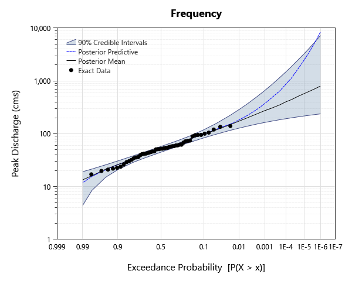
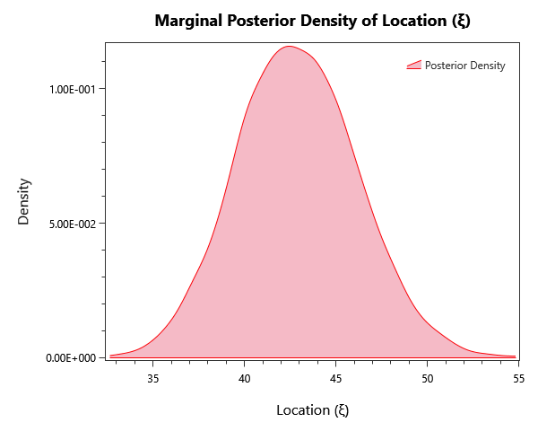
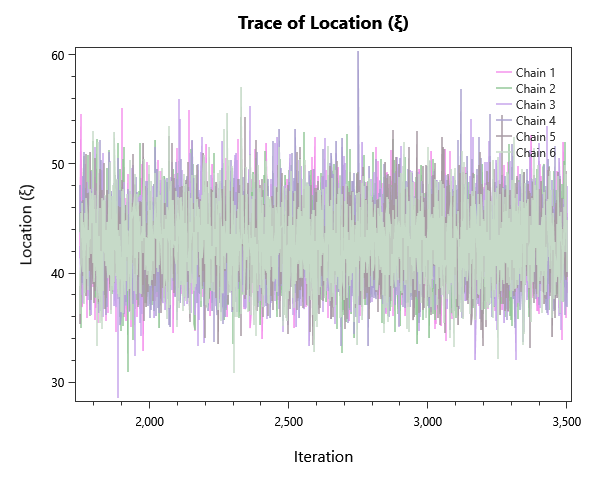
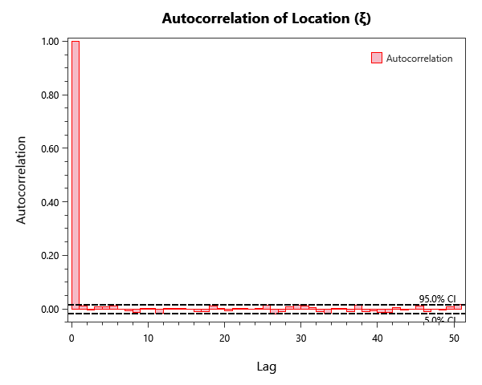

# viglione-et-al-2013

## Overview

Replicates the systematic, temporal-expansion, and causal-information examples from Viglione et al. (2013). Compares Bayesian MCMC fits at the Kamp at Zwettl, Austria gage with and without quantile priors and historical record extensions.

## What's Inside

### Input Data

| Element | Description |
|---|---|
| `Systematic (1951-2001)` | Kamp at Zwettl, 1951-2001 |
| `Systematic (1951-2005)` | Kamp at Zwettl, 1951-2005 |
| `Systematic (1951-2001) + Temporal Expansion` | Kamp at Zwettl, 1951-2001 |
| `Systematic (1951-2005) + Temporal Expansion` | Kamp at Zwettl, 1951-2005 |

### Distribution Fitting Analysis

| Element | Description |
|---|---|
| `Fit - Systematic (1951-2001)` | Distribution-fitting comparison across LP-III, GEV, Gumbel, and other distributions on the 1951-2001 systematic record. |
| `Fit - Systematic (1951-2005)` | Distribution-fitting comparison on the 1951-2005 systematic record. |
| `Fit - Systematic (1951-2001) + Temporal Expansion` | Distribution-fitting comparison with the 1951-2001 record extended via historical / paleoflood data. |
| `Fit - Systematic (1951-2005) + Temporal Expansion` | Distribution-fitting comparison with the 1951-2005 record extended via historical / paleoflood data. |

### Univariate Distribution

| Element | Description |
|---|---|
| `MCMC - Systematic (1951-2001)` | Bayesian MCMC fit of the LP-III distribution using only the 1951-2001 systematic record. |
| `MCMC - Systematic (1951-2005)` | Bayesian MCMC fit using the 1951-2005 systematic record (includes the August 2002 flood). |
| `MCMC - Systematic (1951-2001) + Temporal` | Bayesian MCMC fit incorporating temporal information expansion (historical record extension). |
| `MCMC - Systematic (1951-2005) + Temporal` | Bayesian MCMC fit on the 1951-2005 record with temporal information expansion. |
| `MCMC - Systematic (1951-2001) + Causal` | Bayesian MCMC fit incorporating causal information expansion (atmospheric / hydrologic covariate prior). |
| `MCMC - Systematic (1951-2005) + Causal` | Bayesian MCMC fit on the 1951-2005 record with causal information expansion. |
| `MCMC - Systematic (1951-2001) + Temporal + Causal` | Bayesian MCMC fit combining temporal and causal information expansion on the 1951-2001 record. |
| `MCMC - Systematic (1951-2005) + Temporal + Causal` | Bayesian MCMC fit combining temporal and causal information expansion on the 1951-2005 record. |
| `MCMC - Systematic (1951-2001) + 3 Quantile Priors` | Bayesian MCMC fit using three quantile priors for engineering-judgement information expansion. |

## Step-by-Step Walkthrough

### Opening the Project

1. Open RMC-BestFit 2.0.
2. Select **File > Open** and navigate to `examples/4-univariate-distribution-analysis/1-univariate-analysis/1-information-expansion/`.
3. Open `viglione-et-al-2013.bestfit`.

### Exploring the Elements

For each Univariate Distribution analyis:

1. Click the anlaysis in the Project Explorer.
2. The **Distirbution Results** tab to the left shoudld automatically open. Navigate to the **Frequency** tab to view the AEP-vs-quantile plot.
3. Open the **Markov Chain Traces** tab on the left to confirm chain mixing (well-mixed traces look like fuzzy caterpillars).
4. Open the **Autocorrelation** tab on the left to check effective sample size.
5. Inspect the **Properties** panel on the right for sampler settings (iterations, warmup, point estimator, credible-interval width).

These will be explored more below in the Expected results section.

## Analysis Settings

Each Bayesian analysis in this project uses the DEMCzs sampler with project-specific iteration / warm-up settings. Open the **Properties** panel of any analysis to inspect:

- **Sampler type** (DEMCzs, ARWMH, HMC).
- **Iterations / Warm-up Iterations** — total post-warmup samples per chain.
- **Number of Chains** — typically 6 for routine work.
- **Thinning Interval** — keeps every Nth sample to reduce storage / autocorrelation.
- **Point Estimator** — Posterior Mean (default), Posterior Median, or Posterior Mode (MAP).
- **Credible Interval Width** — typically 0.90 or 0.95.

## Expected Results

Below are the expected results for Univariate Distribution Analysis labeled "MCMC - Systematic (1995 - 2001)"; this should be the first analysis in the list.
Be sure to explore all of the analyses provided!

### Parameter Estimates
The parameter estimates are found under the **MCMC Report** tab to the left as parameter summary statistics.

| Parameter | Mean | Std Dev | 5% | Median | 95% |R-hat | ESS |
|---|---|---|---|---|---|---|---|
| Location (ξ) | 42.8714 | 3.3179 | 37.4957 | 42.7888 | 48.4046 | 1.0000 | 9171 |
| Scale (α) | 21.1847 | 2.70008 | 17.102 | 20.9951 | 25.8941 | 0.9999 | 9336 |
| Shape (κ) | -0.119352 | 0.129605 | -0.347584 | -0.107699 | 0.0746618 | 1.0002 | 9891 |

### Frequency / Quantile Table
While in the **Distribution Results** tab to the left, select Tabular Results to see the frequency plot's value at each return level probability,

| Probability | 95.0% CI | 5.0% CI | Posterior Predictive| Posterior Mean |
|---|---|---|---|---|
| 1E-06 | 7249.176548828858	| 237.54234615755306 | 8390.690759368497 | 788.5930275814509 |
| 2E-06 | 5705.736416643618 | 231.49970381965838 | 5668.775898832316 | 715.2902545320234 |
| 5E-06 | 4134.750133527632 | 223.15198402836 | 3466.1612847573515 | 627.2443151845657 |
| 1E-05 | 3262.805726910052 | 216.50974349623468 | 2438.3068758722948 | 566.7523243585697 |
| 2E-05 | 2579.6089061769007 | 209.81963743427042 | 1746.0383177683632 | 511.06316645094137 |
| 5E-05 | 1872.8857357208667 | 200.04291835368343 | 1153.7815035730528 | 444.1729355447143 |
| 0.0001 | 1475.2532905445878 | 192.27252515413468 | 860.5981933961027 | 398.21526477980336 |
| 0.0002 | 1156.5279016580841 | 184.30870430613777 | 653.0555082255905 | 355.9052535325247 |
| 0.0005 | 836.018630415943	| 172.56666960307558 | 465.09924810101097 | 305.0815429201984 |
| 0.001 | 654.8655313176822 | 163.29167230899745 | 366.5306999472315 | 270.1571063577628 |
| 0.002	| 511.66874024571604 | 153.38936412546704 | 293.2095483007016 | 237.99545883063502 |
| 0.005 | 367.7219653043677 | 139.05424038588217	| 222.93011315633413 | 199.33434770123495 |
| 0.01	| 285.78720750480903 | 127.46298159393109 | 183.5628680112678 | 172.72592896638844 |
| 0.02 | 220.96432159683343 | 115.31563330823505 | 152.29151249747403 | 148.15155180033372 |
| 0.05 | 155.93324453677647	| 97.78605649867892	| 119.07572149349717 | 118.39058694741834 |
| 0.1	| 118.86430603517661 | 83.5002137676054 | 97.60306503667266 | 97.56077359456074 |
| 0.2	| 89.4684085584898 | 67.97670971704888 | 77.62314039720046 | 77.66905445312321 |
| 0.3	| 74.91188737933767 | 58.17930829986319 | 66.06015423494782 | 66.11185111368104 |
| 0.5	| 57.23605016683286 | 44.65421612174257 | 50.694071426543566 | 50.80823064916835 |
| 0.7	| 44.15409817301191 | 33.97676379270088 | 38.81336731201928 | 38.98224500624102 |
| 0.8	| 37.76183858420439 | 28.396287065632137 | 32.88665728961099 | 33.070936233524165 |
| 0.9 | 30.518877484249863 | 20.856390137718 | 25.86150386272506 | 26.053676228172517 |
| 0.95 | 25.746206462508045 | 14.955666197182342 | 20.78341382834486 | 21.085444342833004 |
| 0.98 | 21.424981348478372 | 8.422376044223254 | 15.470855064508827 | 16.20403514641554 | 
| 0.99 | 19.092326436429126 | 4.414411150570132 | 11.951552128180449 | 13.295883772014633 |

### Plots
There are also plenty of plots to explore our results with. Under the **Distribution Results** tab we have a frequency curve.

*Figure 1: Frequency curve (AEP versus quantile), with the credible band.*

The **Kernal Density** tab shows an estimate for the pdf of each parameter.

*Figure 2: Posterior kernel density for location parameter (ξ).*

The **Markov Chain Traces** tab explores the traces of each Markov chain as it explores the posterior space in order to converge.

*Figure 3: Markov-chain trace for location parameter (ξ).*

Finally, we can investigate the autocorrelation of the chains under the **Autocorrelation** tab.

*Figure 4: Autocorrelation function of the chains, used to estimate effective sample size, for location parameter (ξ).*

### MCMC Diagnostics

One should always verify chain convergence before interpreting any results. There are a variety of ways including:

- **R-hat** — should be < 1.01 for every parameter.
- **Effective Sample Size (ESS)** — at least a few hundred per parameter.
- **Trace plots** — should look like fuzzy, well-mixed caterpillars (no drift, no sticking).
- **Posterior** — overall posterior log-likelihood should be visually stationary in the mean-likelihood plot.

These can be found under the **Markov Chain Traces** and **MCMC Reports** tabs.

## Next Steps
- Compare analyses via the **Bayesian Model Average** element to combine results from multiple distributions. 
	- Right click the **Univariate Distribution Analysis** drop down and select "New Composite Distribution Analysis"
	- Select from the available options in the **Properties** panel to the right
- Compute **return-period quantiles** (1%, 0.5%, 0.2% AEP) from the frequency-curve table.
- Re-run with informative **quantile priors** if engineering judgment suggests specific upper-bound flood magnitudes.
- Cross-check the LP-III fit against a **Bulletin 17C** fit on the same input data.