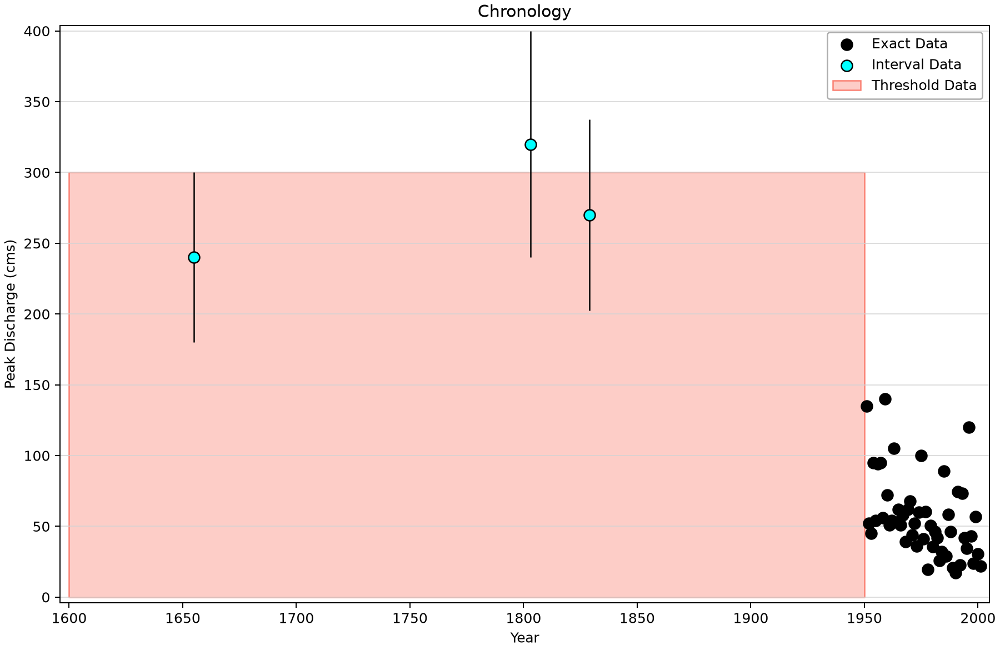
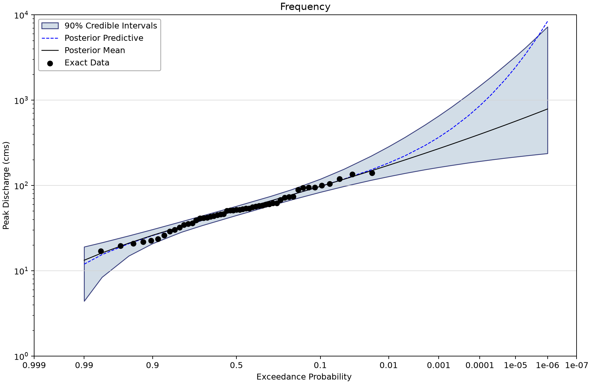
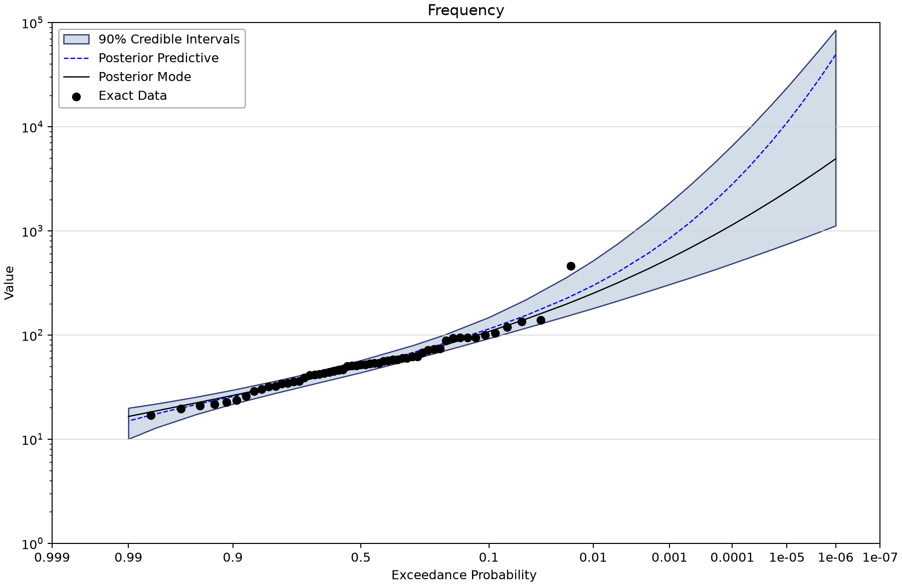
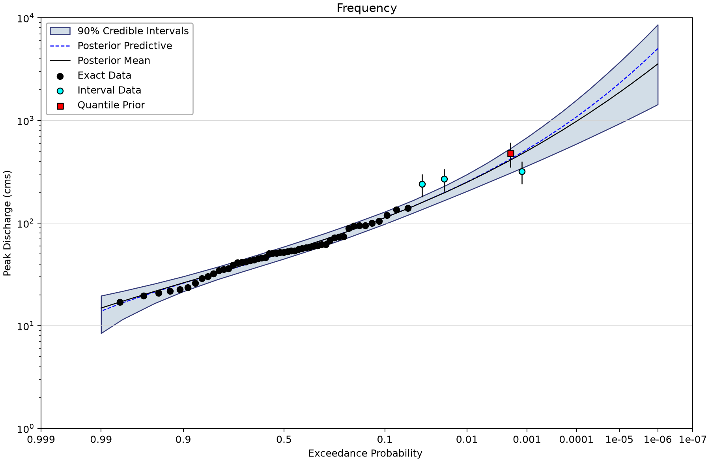
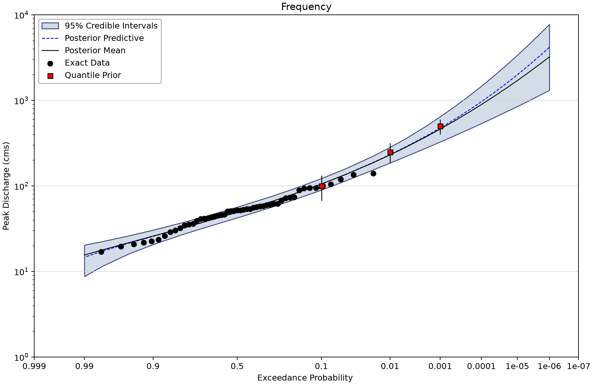
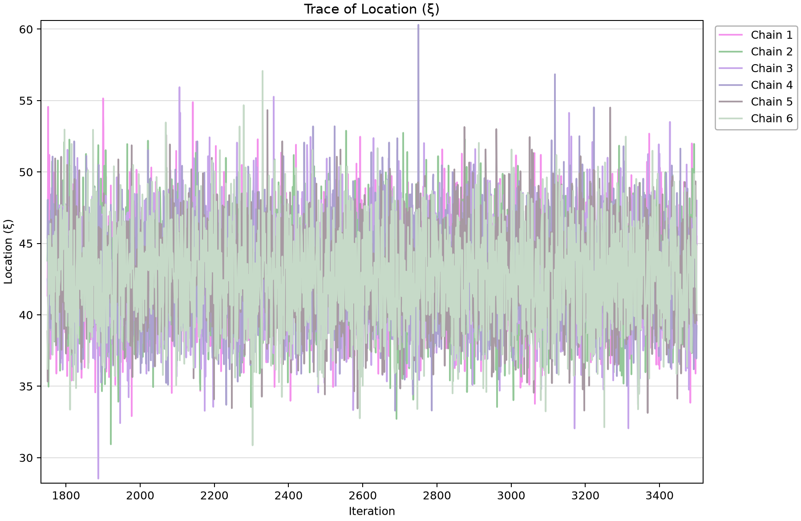

# Kamp at Zwettl: adding historical evidence and quantile priors

This project compares nine stationary Generalized Extreme Value (GEV) analyses for the Kamp River at Zwettl, Austria. It teaches how a longer systematic record, historical floods and a quantified external estimate affect a frequency curve. The saved models are GEV; descriptions in older copies that say LP3 are incorrect.

## Open the saved project

Open [viglione-et-al-2013.bestfit](viglione-et-al-2013.bestfit) with **File > Open** and save a separate working copy before editing or rerunning.

The figures display saved BestFit results through the shared Python renderer; no analysis was refitted for this tutorial. AEP is annual exceedance probability: 0.01 is 1% per year under the model, not a schedule of one flood every 100 years.

The point curve evaluates the distribution at the selected posterior mean or mode **parameter vector**. It is not necessarily the posterior median of each quantile. The curve labeled Posterior Predictive averages over parameter uncertainty. A credible band describes uncertainty about a quantile; it is not a band containing 90% of future floods.

## Source and observation model

The study context is [Viglione et al. (2013), *Flood frequency hydrology: 3. A Bayesian analysis*](https://doi.org/10.1029/2011WR010782). Its Kamp example examines the effect of including the extreme 2002 flood and additional evidence. The supplied [earlier BestFit verification comparison](Comparison%20with%20Viglione%20et%20al.%202013%20-%20Verification%20Report.pdf) documents the eight systematic/temporal/causal combinations and an additional quantile-prior comparison. It is historical verification evidence, not a fresh acceptance test for the current saved runs.

The historical intervals are 180–300 m³/s in 1655, 240–400 in 1803 and 202.5–337.5 in 1829. The saved perception window spans 1600–1950 at 300 m³/s, with 348 events below and zero additional unentered events above. Keep the explicitly entered historical events separate from these counts.

The four alternatives named Causal enable one Normal quantile prior at AEP 0.002, mean 480 m³/s and standard deviation 80 m³/s. The separate three-prior alternative enables Normal priors at AEP 0.1, 0.01 and 0.001, with means 100, 250 and 500 m³/s and standard deviations 20, 40 and 60 m³/s. These settings encode supplied information; their presence does not independently establish its reliability.

| Input element | Meaning | Exact rows and index span | Other saved input rows |
| --- | --- | --- | --- |
| Systematic (1951-2001) | Kamp annual peak discharge, m³/s; systematic period before the 2002 flood. | 51 (1951–2001) | Uncertain: 0; intervals: 0; windows: 0; low flags: 0. |
| Systematic (1951-2005) | Kamp annual peak discharge, m³/s; extended systematic period including 2002. The retained axis label is Value. | 55 (1951–2005) | Uncertain: 0; intervals: 0; windows: 0; low flags: 0. |
| Systematic (1951-2001) + Temporal Expansion | 1951–2001 systematic peaks plus three historical intervals and one perception window; m³/s. | 51 (1951–2001) | Uncertain: 0; intervals: 3; windows: 1; low flags: 0. |
| Systematic (1951-2005) + Temporal Expansion | 1951–2005 systematic peaks plus the same historical evidence; m³/s. The retained axis label is Value. | 55 (1951–2005) | Uncertain: 0; intervals: 3; windows: 1; low flags: 0. |

Counts describe stored series entries. Threshold windows are not a count of measured floods; low flags are included in the exact-row count.

## Work through the example

1. Open the systematic 1951–2001 input and compare its 51 exact peaks with the 55 peaks in 1951–2005. Locate the 2002 event in the latter record.

2. Open each Temporal Expansion input. Read the three interval bounds and the 1600–1950 threshold window before viewing its chronology.

3. Select MCMC - Systematic (1951-2001), then compare the 1951–2005 alternative. Note that the latter selects Posterior Mode while the first selects Posterior Mean.

4. Compare the 1951–2001 baseline with its Temporal + Causal alternative. Inspect the enabled quantile prior in Properties and its plotted annotation.

5. Open the three-quantile-prior alternative. Its 95% credible interval and 1,200/2,400 warmup/iteration settings differ from the 90% intervals and 1,750/3,500 settings in the other eight fits.

6. Inspect parameter trace and autocorrelation views. The four Fit - elements are separate distribution-fitting comparisons on the named inputs, not additional Bayesian information sources.

## Saved settings and results

All Bayesian alternatives retain DEMCzs, six chains, thinning interval 30, seed 12345 and output length 10,000. The usual stored settings are 1,750 warmup iterations and 3,500 iterations. These are the saved setting names; output length is not a count of independent observations. Each fit retains the Jeffreys-rule setting for scale. Review parameter-prior bounds as well as named informative priors before adopting a configuration elsewhere.

The table reports the largest parameter R-hat and smallest parameter effective sample size (ESS) stored in each run. R-hat near one and substantial ESS are useful screening evidence. Inspect every parameter's chains, autocorrelation and tail uncertainty before accepting a result; successful completion alone does not establish convergence or model adequacy.

| Saved alternative | Model | Parameter estimate | 1% AEP point | Credible limits | Width | Max R-hat | Min ESS |
| --- | --- | --- | --- | --- | --- | --- | --- |
| MCMC - Systematic (1951-2001) | GEV | Mean | 172.726 | 127.463–285.787 | 90% | 1.00015 | 9,429 |
| MCMC - Systematic (1951-2005) | GEV | Mode | 251.85 | 180.951–519.734 | 90% | 1.00036 | 9,057 |
| MCMC - Systematic (1951-2001) + Temporal | GEV | Mean | 221.1 | 174.631–289.824 | 90% | 1.00037 | 9,230 |
| MCMC - Systematic (1951-2005) + Temporal | GEV | Mean | 249.898 | 195.755–331.057 | 90% | 1.00036 | 9,642 |
| MCMC - Systematic (1951-2001) + Causal | GEV | Mean | 246.934 | 192.085–304.608 | 90% | 1.00105 | 9,097 |
| MCMC - Systematic (1951-2005) + Causal | GEV | Mean | 263.651 | 213.74–313.861 | 90% | 1.00026 | 9,538 |
| MCMC - Systematic (1951-2001) + Temporal + Causal | GEV | Mean | 250.039 | 204.608–298.046 | 90% | 1.00027 | 9,339 |
| MCMC - Systematic (1951-2005) + Temporal + Causal | GEV | Mean | 260.861 | 217.955–306.113 | 90% | 1.00043 | 9,591 |
| MCMC - Systematic (1951-2001) + 3 Quantile Priors | GEV | Mean | 230.439 | 185.761–283.794 | 95% | 1.00052 | 8,952 |

Magnitudes are m³/s. Values are rounded from the saved 0.01 AEP ordinate without interpolation or refitting. The selected parameter estimator and interval width are shown explicitly.

For **MCMC - Systematic (1951-2001)**, the saved parameter summaries are:

| Parameter | Posterior mean | Posterior median | Lower credible limit | Upper credible limit |
| --- | --- | --- | --- | --- |
| Location (ξ) | 42.871 | 42.789 | 37.496 | 48.405 |
| Scale (α) | 21.185 | 20.995 | 17.102 | 25.894 |
| Shape (κ) | -0.119 | -0.108 | -0.348 | 0.075 |

These are parameter credible limits, distinct from the frequency-quantile limits above.

## Read the figures

*Historical chronology: interval observations and the retained perception threshold.* [SVG](images/viglione-et-al-2013-historical-chronology.svg) · [Plot data](images/viglione-et-al-2013-historical-chronology.plotspec.json.gz)

*1951–2001 systematic GEV fit with its saved 90% credible band.* [SVG](images/viglione-et-al-2013-systematic-2001.svg) · [Plot data](images/viglione-et-al-2013-systematic-2001.plotspec.json.gz)

*1951–2005 GEV fit. This alternative selects the posterior mode parameter vector.* [SVG](images/viglione-et-al-2013-systematic-2005.svg) · [Plot data](images/viglione-et-al-2013-systematic-2005.plotspec.json.gz)

*Historical evidence and the enabled 0.2% AEP quantile prior in the 1951–2001 analysis.* [SVG](images/viglione-et-al-2013-temporal-causal.svg) · [Plot data](images/viglione-et-al-2013-temporal-causal.plotspec.json.gz)

*Three enabled quantile priors; this saved fit uses a 95% credible band.* [SVG](images/viglione-et-al-2013-three-priors.svg) · [Plot data](images/viglione-et-al-2013-three-priors.plotspec.json.gz)

*Saved baseline chain trace for the desktop-selected parameter; inspect the other parameters in BestFit.* [SVG](images/viglione-et-al-2013-trace.svg) · [Plot data](images/viglione-et-al-2013-trace.plotspec.json.gz)

## Interpretation and limits

The differences combine data, prior and point-estimator choices. For example, the 1951–2001 and 1951–2005 baseline point curves use different estimators. Do not attribute every change to the 2002 observation alone. Compare equal interval widths before judging whether uncertainty narrowed.

Do not rank DIC, WAIC or LOO values across different observation sets as though they were competing fits to the same data. The earlier report used posterior modes and a larger output ensemble; its rounded tables need not equal these saved posterior-mean results. The current project includes temporal and quantile-prior alternatives, but does not reproduce every regional-information branch of the published paper.

## Check your understanding

Explain which additions enter as observed historical information and which enter as priors. Why is a 95% band not directly comparable in width to a 90% band?

## Reproduce the figures

Follow the [shared figure instructions](../../../README.md#reproducing-the-figures) with `--only viglione-et-al-2013`. PNG, SVG and compressed PlotSpec files come from the same desktop-owned coordinates. The manifest names the selected element for each view; a representative diagnostic figure does not replace inspection of all parameters.
