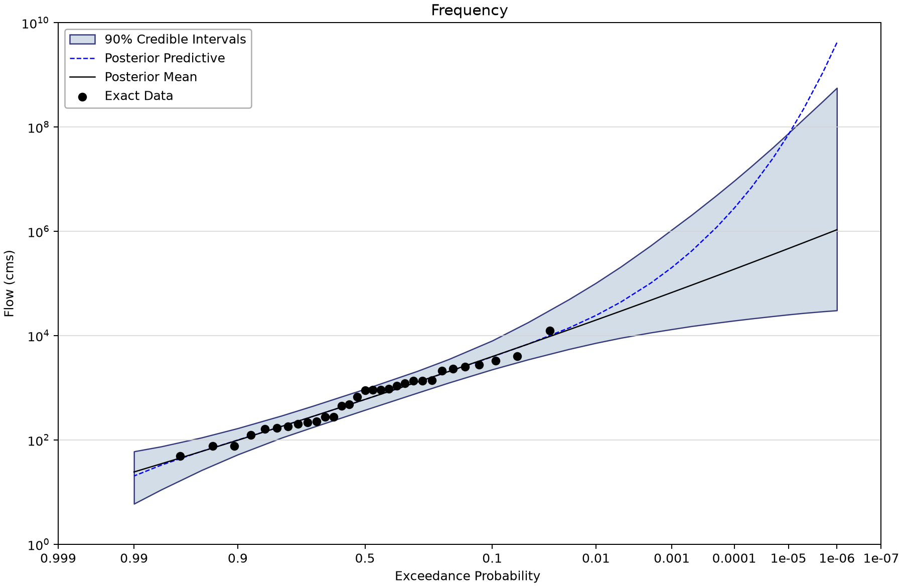
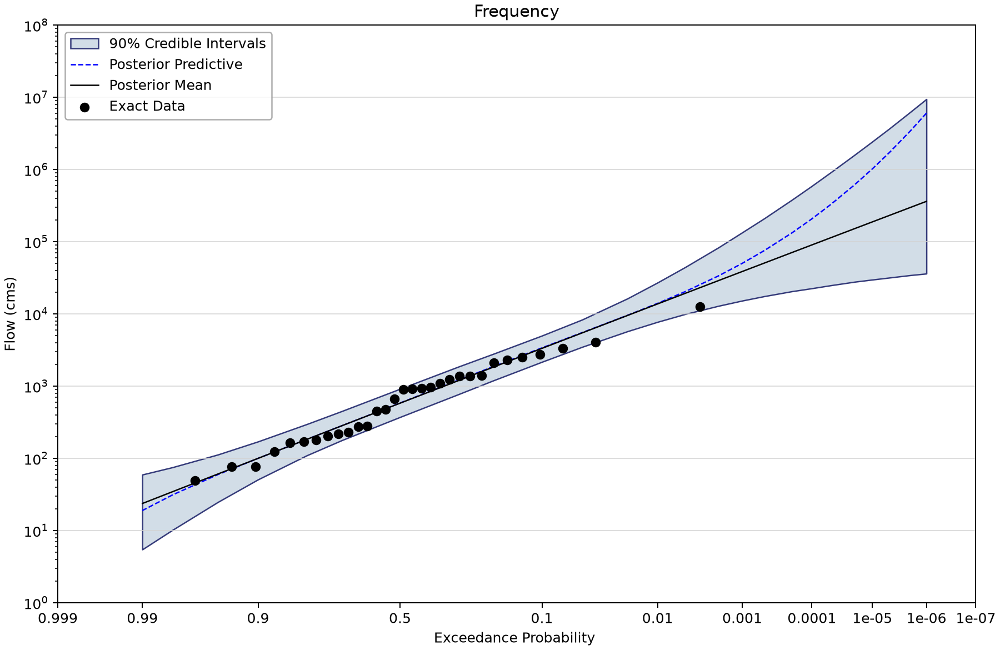
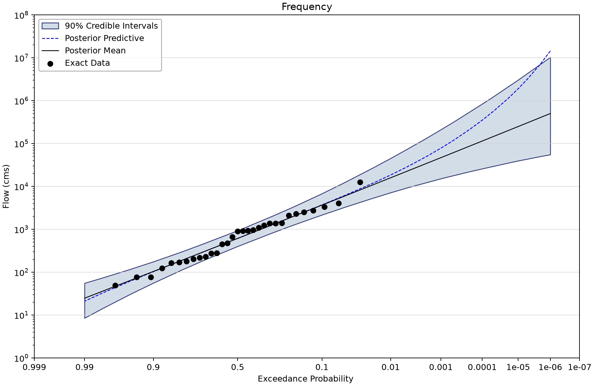
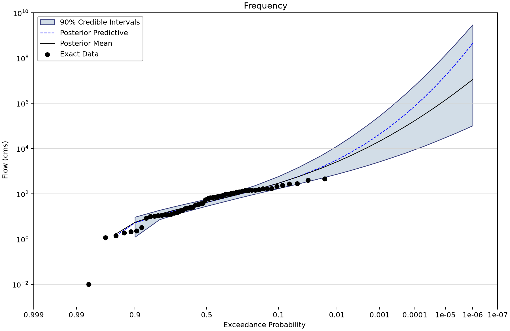
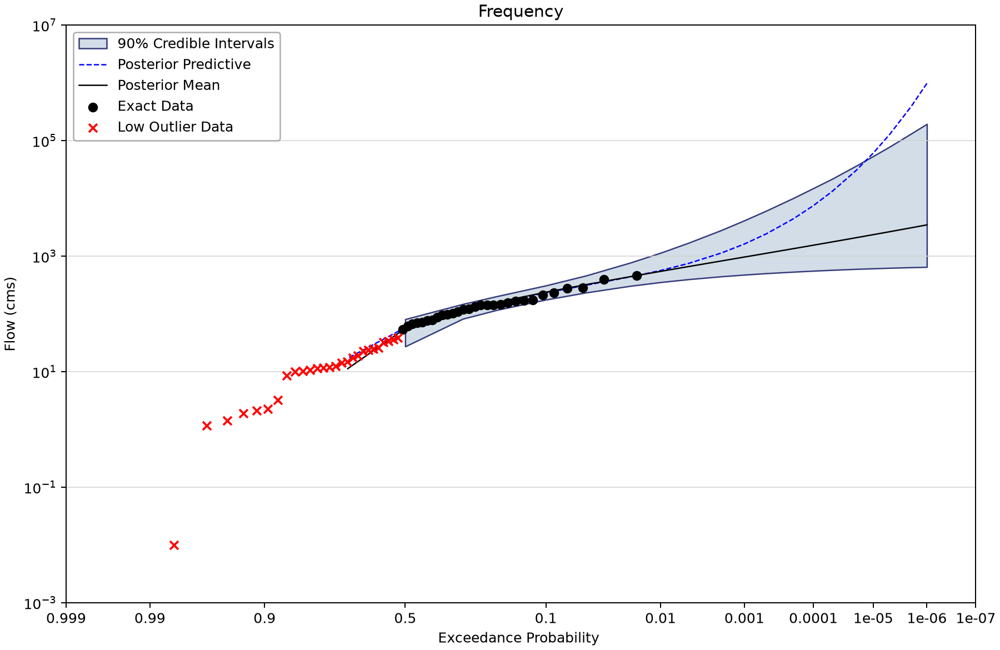
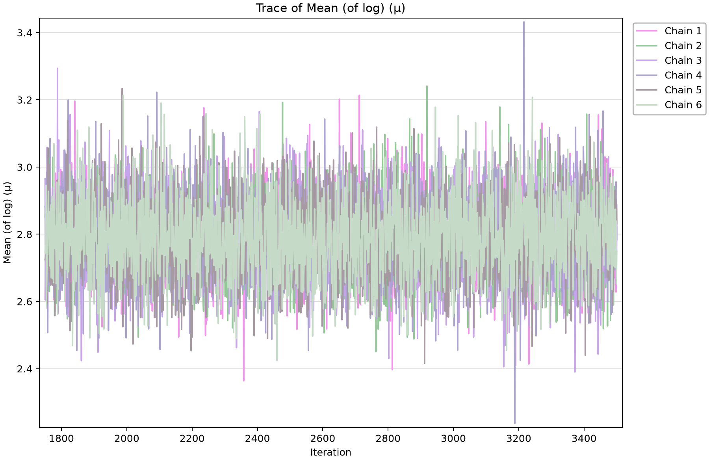

# ARR and FLIKE: systematic records, historical counts and regional skew

Five saved Bayesian fits demonstrate distinct information choices in the Australian Rainfall and Runoff examples. Examples 3–5 use Log-Pearson Type III (LP3); examples 6a and 6b use GEV. Start with the Hunter River baseline, then change one source of information at a time when interpreting the alternatives.

## Open the saved project

Open [arr-flike-examples.bestfit](arr-flike-examples.bestfit) with **File > Open** and save a separate working copy before editing or rerunning.

The figures display saved BestFit results through the shared Python renderer; no analysis was refitted for this tutorial. AEP is annual exceedance probability: 0.01 is 1% per year under the model, not a schedule of one flood every 100 years.

The point curve evaluates the distribution at the selected posterior mean or mode **parameter vector**. It is not necessarily the posterior median of each quantile. The curve labeled Posterior Predictive averages over parameter uncertainty. A credible band describes uncertainty about a quantile; it is not a band containing 90% of future floods.

## Source and observation model

See [ARR Book 3, At-Site Flood Frequency Analysis](https://www.arr-software.org/pdfs/ARR_190514_Book3_V4.2.pdf) and the supplied [BestFit–FLIKE verification comparison](Comparison%20with%20Flike%20-%20Verification%20Report.pdf). The local `ARR-FLIKE Example #3.xlsb` through `#6b.xlsb` files are supporting workbooks. The earlier report describes an old workaround for above-threshold historical information; the current Example 4 directly stores a threshold window with `NumberAbove = 1`. Do not recreate an artificial extreme upper bound from the old instructions.

Example 5 uses input Example #3, not a fifth input element. Its skew prior is Normal with mean 0 and standard deviation 0.30 (variance 0.09); it illustrates regional information rather than low-outlier censoring. Default-flat-prior mode is disabled for this alternative. Examples 6a/6b contrast the treatment of low observations in the same supplied magnitude sample. The active SQLite file contains five Bayesian alternatives and no Bulletin 17C alternatives; the B17C items listed in older prose are absent.

| Input element | Meaning | Exact rows and index span | Other saved input rows |
| --- | --- | --- | --- |
| Example #3 | Hunter River at Singleton: 31 annual peaks in m³/s. | 31 (1938–1968) | Uncertain: 0; intervals: 0; windows: 0; low flags: 0. |
| Example #4 | Hunter River systematic sample plus 1820–1937 historical counts at 12,525 m³/s: 117 below and one above. | 31 (1938–1968) | Uncertain: 0; intervals: 0; windows: 1; low flags: 0. |
| Example #6a | Wimmera River at Glynwylin: 56 flows supplied in descending order without event years; stored 1960–2015 indexes are artificial. | 56 (1960–2015) | Uncertain: 0; intervals: 0; windows: 0; low flags: 0. |
| Example #6b | Same Wimmera teaching sample with 27 saved low-outlier flags; artificial indexes do not support chronology or trend analysis. | 56 (1960–2015) | Uncertain: 0; intervals: 0; windows: 0; low flags: 27. |

Counts describe stored series entries. Threshold windows are not a count of measured floods; low flags are included in the exact-row count.

## Work through the example

1. Select input Example #3 and confirm 31 exact annual flows in m³/s. Open analysis Example #3 as the LP3 baseline.

2. Open input Example #4 and inspect the historical window: 1820–1937, threshold 12,525 m³/s, 117 below and one unentered event above. Compare its analysis with Example #3.

3. Open analysis Example #5. It references Example #3 and changes the skew prior to Normal(0, 0.30), with 0.30 expressed as a standard deviation.

4. Compare Example #6a with #6b in frequency space. Both are GEV fits to 56 supplied Wimmera magnitudes; #6b retains 27 flagged low observations.

5. Inspect the saved posterior diagnostics for each model. Do not interpret the artificial Wimmera index ordering as a physical trend, or delete low observations from the source sample.

## Saved settings and results

All Bayesian alternatives retain DEMCzs, six chains, thinning interval 30, seed 12345 and output length 10,000. The usual stored settings are 1,750 warmup iterations and 3,500 iterations. These are the saved setting names; output length is not a count of independent observations. Each fit retains the Jeffreys-rule setting for scale. Review parameter-prior bounds as well as named informative priors before adopting a configuration elsewhere.

The table reports the largest parameter R-hat and smallest parameter effective sample size (ESS) stored in each run. R-hat near one and substantial ESS are useful screening evidence. Inspect every parameter's chains, autocorrelation and tail uncertainty before accepting a result; successful completion alone does not establish convergence or model adequacy.

| Saved alternative | Model | Parameter estimate | 1% AEP point | Credible limits | Width | Max R-hat | Min ESS |
| --- | --- | --- | --- | --- | --- | --- | --- |
| Example #3 | LP3 | Mean | 19,933.992 | 7,239.394–102,334.579 | 90% | 1.00043 | 9,157 |
| Example #4 | LP3 | Mean | 13,787.128 | 7,754.179–27,214.116 | 90% | 1.00031 | 8,745 |
| Example #5 | LP3 | Mean | 15,931.58 | 7,180.378–45,324.538 | 90% | 1.00022 | 9,715 |
| Example #6a | GEV | Mean | 2,590.881 | 741.838–12,838.827 | 90% | 1.00009 | 9,079 |
| Example #6b | GEV | Mean | 546.057 | 354.35–1,141.581 | 90% | 1.00062 | 8,439 |

Magnitudes are m³/s. Values are rounded from the saved 0.01 AEP ordinate without interpolation or refitting. The selected parameter estimator and interval width are shown explicitly.

For **Example #3**, the saved parameter summaries are:

| Parameter | Posterior mean | Posterior median | Lower credible limit | Upper credible limit |
| --- | --- | --- | --- | --- |
| Mean (of log) (µ) | 2.79 | 2.79 | 2.605 | 2.974 |
| Std Dev (of log) (σ) | 0.626 | 0.614 | 0.497 | 0.795 |
| Skew (of log) (γ) | 0.116 | 0.099 | -0.666 | 0.932 |

These are parameter credible limits, distinct from the frequency-quantile limits above.

## Read the figures

*Hunter River baseline LP3 fit, Example 3.* [SVG](images/arr-flike-examples-example-3.svg) · [Plot data](images/arr-flike-examples-example-3.plotspec.json.gz)

*Hunter River LP3 fit including the historical exceedance count, Example 4.* [SVG](images/arr-flike-examples-example-4.svg) · [Plot data](images/arr-flike-examples-example-4.plotspec.json.gz)

*Hunter River LP3 fit with an informative skew prior, Example 5.* [SVG](images/arr-flike-examples-example-5.svg) · [Plot data](images/arr-flike-examples-example-5.plotspec.json.gz)

*Wimmera GEV fit without saved low-outlier flags, Example 6a.* [SVG](images/arr-flike-examples-example-6a.svg) · [Plot data](images/arr-flike-examples-example-6a.plotspec.json.gz)

*Wimmera GEV fit with 27 low-outlier flags, Example 6b.* [SVG](images/arr-flike-examples-example-6b.svg) · [Plot data](images/arr-flike-examples-example-6b.plotspec.json.gz)

*Saved Hunter River baseline parameter trace.* [SVG](images/arr-flike-examples-trace.svg) · [Plot data](images/arr-flike-examples-trace.plotspec.json.gz)

## Interpretation and limits

The Wimmera values were supplied without observation years and entered in descending order. The 1960–2015 indexes are storage labels; a downward chronology would be an input-order artifact. Use frequency plots for this comparison.

The historical report compares selected outputs from earlier BestFit and FLIKE runs. This tutorial reports the current saved BestFit results and does not certify a new cross-software replication. Differences in parameter priors, selected point estimators and uncertainty definitions must be reconciled before comparing tables. These are two different catchments; information criteria do not rank the Hunter and Wimmera models against one another.

## Check your understanding

Explain the different roles of the single historical exceedance in Example 4, the skew prior in Example 5 and the low-outlier flags in Example 6b.

## Reproduce the figures

Follow the [shared figure instructions](../../../README.md#reproducing-the-figures) with `--only arr-flike-examples`. PNG, SVG and compressed PlotSpec files come from the same desktop-owned coordinates. The manifest names the selected element for each view; a representative diagnostic figure does not replace inspection of all parameters.
