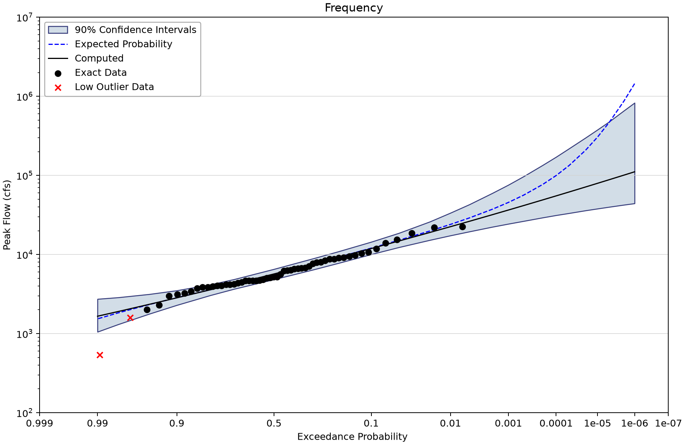
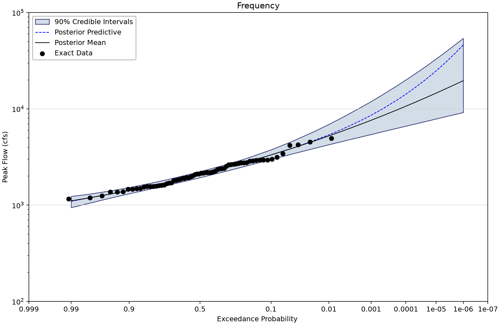
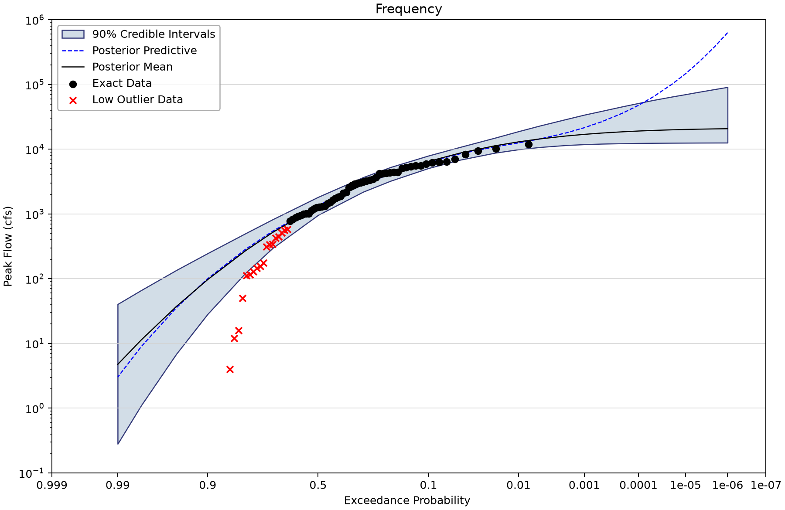
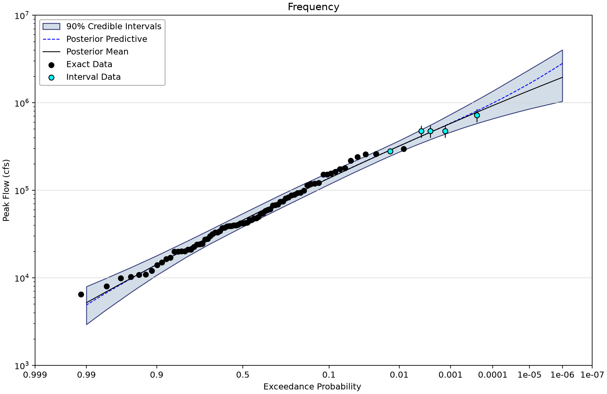
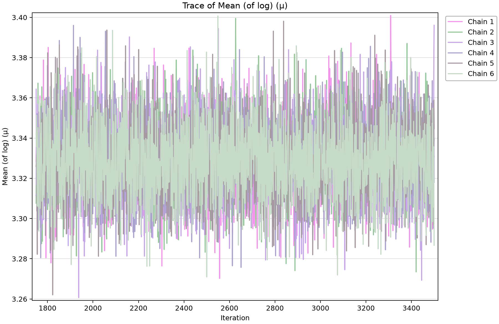

# Bulletin 17C datasets: Bayesian fits and a GMM comparison

This project uses seven familiar U.S. flood records to teach systematic, historical, censored and paleoflood evidence. Six alternatives are Bayesian LP3 fits. B17C Example #3 is the existing Back Creek GMM fit with multivariate-normal uncertainty. It has been restored to the project tree with the author's approval; its inputs, settings and saved results are unchanged. Identify the estimator before interpreting an interval or a diagnostic.

## Open the saved project

Open [bulletin-17c-bayesian-examples.bestfit](bulletin-17c-bayesian-examples.bestfit) with **File > Open** and save a separate working copy before editing or rerunning.

The figures display saved BestFit results through the shared Python renderer; no analysis was refitted for this tutorial. AEP is annual exceedance probability: 0.01 is 1% per year under the model, not a schedule of one flood every 100 years.

For the Bayesian fits, the point curve evaluates the distribution at the selected posterior mean or mode **parameter vector**. It is not necessarily the posterior median of each quantile. The curve labeled Posterior Predictive averages over parameter uncertainty. A credible band describes uncertainty about a quantile; it is not a band containing 90% of future floods.

## Source and observation model

[Bulletin 17C (USGS Techniques and Methods 4–B5)](https://doi.org/10.3133/tm4B5) supplies the federal flood-frequency context and worked datasets. The [earlier BestFit–EMA comparison](Comparison%20with%20EMA%20-%20Verification%20Report.pdf) is historical verification material. The current Bayesian fits are not official EMA results, and the retained GMM comparison is not an EMA execution.

For American River, the five explicitly entered intervals occur in 650, 1437, 1574, 1711 and 1862. Earlier perception windows and gaps within the systematic period are additional evidence, not thousands of exact measured floods. For Bear Creek, nine threshold windows describe changes in observation sensitivity. Read the actual start/end years and counts rather than treating the entire index span as complete measurement.

| Input element | Meaning | Exact rows and index span | Other saved input rows |
| --- | --- | --- | --- |
| Example #1 | Moose River at Victory, VT; systematic peaks, cfs. | 68 (1947–2014) | Uncertain: 0; intervals: 0; windows: 0; low flags: 0. |
| Example #2 | Orestimba Creek near Newman, CA; peaks with 30 saved low-outlier flags, cfs. | 82 (1932–2013) | Uncertain: 0; intervals: 0; windows: 0; low flags: 30. |
| Example #3 | Back Creek near Jones Springs, WV; broken record with three perception windows, cfs. | 56 (1929–2012) | Uncertain: 0; intervals: 0; windows: 3; low flags: 2. |
| Example #4 | Arkansas River at Pueblo, CO; four historical intervals and four threshold windows, cfs. | 81 (1895–1976) | Uncertain: 0; intervals: 4; windows: 4; low flags: 0. |
| Example #5 | Bear Creek at Ottumwa, IA; crest-stage observation thresholds and nine low flags, cfs. | 50 (1965–2014) | Uncertain: 0; intervals: 0; windows: 9; low flags: 9. |
| Example #6 | Santa Cruz River at Lochiel, AZ; historical threshold and ten low flags, cfs. | 65 (1949–2013) | Uncertain: 0; intervals: 0; windows: 1; low flags: 10. |
| Example #7 | American River at Fair Oaks, CA; five historical/paleoflood intervals and ten threshold windows, cfs. | 77 (1905–1997) | Uncertain: 0; intervals: 5; windows: 10; low flags: 0. |

Counts describe stored series entries. Threshold windows are not a count of measured floods; low flags are included in the exact-row count.

## Work through the example

1. Begin with Example #1 and Bayes Example #1. Inspect systematic observations, LP3 parameters, the frequency curve and saved diagnostics.

2. Move to Example #2. Inspect all 82 exact-series rows, the 30 low-outlier flags and the retained low-outlier threshold; flags are not missing records.

3. Read the interval and threshold tables for Examples #4 and #7 before their plots. Explain each observation window in words.

4. Select **B17C Example #3** for Back Creek. Its saved confidence band comes from GMM with multivariate-normal uncertainty, so Bayesian R-hat and ESS do not apply. The entry is selectable, but the current app does not hydrate its older result format; use the explicitly preserved-array figure below to read that saved fit. Compare the input windows with the separate [Bulletin 17C collection](../../2-bulletin-17C-analysis/1-bulletin17C-examples/bulletin-17c-examples.md) before comparing saved fits.

5. Inspect Bayes Example #2 priors: custom uniform bounds are used for log-mean, log-standard-deviation and skew, with Jeffreys scale enabled. The other five Bayesian alternatives retain default-flat-prior mode.

6. Compare with the separate Bulletin 17C tutorial only after matching the dataset, prior or penalty inputs, point estimator and interval definition.

## Saved settings and results

All Bayesian alternatives retain DEMCzs, six chains, thinning interval 30, seed 12345 and output length 10,000. The usual stored settings are 1,750 warmup iterations and 3,500 iterations. These are the saved setting names; output length is not a count of independent observations. Each fit retains the Jeffreys-rule setting for scale. Review parameter-prior bounds as well as named informative priors before adopting a configuration elsewhere.

The table reports the largest parameter R-hat and smallest parameter effective sample size (ESS) stored in each run. R-hat near one and substantial ESS are useful screening evidence. Inspect every parameter's chains, autocorrelation and tail uncertainty before accepting a result; successful completion alone does not establish convergence or model adequacy.

| Saved alternative | Model | Parameter estimate | 1% AEP point | Credible limits | Width | Max R-hat | Min ESS |
| --- | --- | --- | --- | --- | --- | --- | --- |
| Bayes Example #1 | LP3 | Mean | 5,231.877 | 4,248.95–6,902.67 | 90% | 0.99988 | 9,300 |
| Bayes Example #2 | LP3 | Mean | 12,999.086 | 9,898.143–18,829.796 | 90% | 1.00013 | 7,452 |
| Bayes Example #4 | LP3 | Mean | 37,433.876 | 28,905.245–50,444.26 | 90% | 1.00057 | 9,138 |
| Bayes Example #5 | LP3 | Mean | 4,372.461 | 3,930.256–5,283.586 | 90% | 1.00014 | 7,941 |
| Bayes Example #6 | LP3 | Mean | 12,300.194 | 8,330.79–20,737.466 | 90% | 1.00003 | 8,573 |
| Bayes Example #7 | LP3 | Mean | 320,554.217 | 274,138.344–369,195.561 | 90% | 1.00005 | 9,373 |

Magnitudes are cfs. Values are rounded from the saved 0.01 AEP ordinate without interpolation or refitting. The selected parameter estimator and interval width are shown explicitly.

For **Bayes Example #1**, the saved parameter summaries are:

| Parameter | Posterior mean | Posterior median | Lower credible limit | Upper credible limit |
| --- | --- | --- | --- | --- |
| Mean (of log) (µ) | 3.329 | 3.329 | 3.3 | 3.359 |
| Std Dev (of log) (σ) | 0.145 | 0.144 | 0.124 | 0.171 |
| Skew (of log) (γ) | 0.495 | 0.508 | -0.042 | 0.982 |

These are parameter credible limits, distinct from the frequency-quantile limits above.

The restored **B17C Example #3** retains a 1% AEP point estimate of **22,479.428 cfs**, with **90% confidence limits of 17,349.951–33,555.869 cfs**. Its saved iterative GMM configuration uses Nelder–Mead, 10,000 multivariate-normal uncertainty draws and seed 12345; no parameter or quantile penalty is enabled. These values come from the original result cells, which were not rerun or rewritten.

The current app loader expects a newer model-column name than this legacy Back Creek row supplies, so it currently shows the observations without restoring the fitted curves. For this tutorial only, the Python display overlays the exact original ProbabilityOrdinates, ModeCurve, MeanCurve and ConfidenceIntervals arrays onto the desktop observation geometry. No parameter conversion, uncertainty reconstruction, interpolation or new fit is performed. The PlotSpec records this exception; a separate app-loading repair remains in the [author issue log](../../../../docs/example-issues-for-haden.md).

## Read the figures

*Back Creek GMM: original saved curves and 90% confidence bounds over desktop observation positions; the current app does not yet restore this legacy fit.* [SVG](images/bulletin-17c-bayesian-examples-back-creek-gmm.svg) · [Plot data](images/bulletin-17c-bayesian-examples-back-creek-gmm.plotspec.json.gz)

*Moose River Bayesian LP3 fit with a 90% credible band.* [SVG](images/bulletin-17c-bayesian-examples-moose.svg) · [Plot data](images/bulletin-17c-bayesian-examples-moose.plotspec.json.gz)

*Orestimba Bayesian LP3 fit; low-outlier marks retain their desktop classification.* [SVG](images/bulletin-17c-bayesian-examples-orestimba.svg) · [Plot data](images/bulletin-17c-bayesian-examples-orestimba.plotspec.json.gz)

*American River chronology with explicit interval events and perception windows.* [SVG](images/bulletin-17c-bayesian-examples-american-chronology.svg) · [Plot data](images/bulletin-17c-bayesian-examples-american-chronology.plotspec.json.gz)

*American River Bayesian fit combining systematic and historical/paleoflood information.* [SVG](images/bulletin-17c-bayesian-examples-american-frequency.svg) · [Plot data](images/bulletin-17c-bayesian-examples-american-frequency.plotspec.json.gz)

*Saved Moose River baseline parameter trace.* [SVG](images/bulletin-17c-bayesian-examples-trace.svg) · [Plot data](images/bulletin-17c-bayesian-examples-trace.plotspec.json.gz)

## Interpretation and limits

The dataset names describe teaching cases; they are not a recommendation to carry the same regional information or perception assumptions into another watershed. These are saved historic samples and differ from the more recent download tutorials.

Low flags remain attached to exact-series rows. A flag is not evidence that a flood is erroneous or belongs to a separate generating mechanism. The saved custom priors for Bayes Example #2 bound log-mean approximately 0–4, log-standard-deviation approximately 0–3 and skew −6–6. An enabled Jeffreys rule also affects the scale prior.

The results table includes the six Bayesian fits only. The restored Back Creek GMM comparison is reported separately and appears in its own figure. Do not relabel its uncertainty ensemble as a posterior or combine its diagnostics with MCMC R-hat/ESS.

## Check your understanding

Explain why the Back Creek confidence band and the Moose River credible band have different interpretations, even though both have a nominal width of 90%.

## Reproduce the figures

Follow the [shared figure instructions](../../../README.md#reproducing-the-figures) with `--only bulletin-17c-bayesian-examples`. PNG, SVG and compressed PlotSpec files come from the same desktop-owned coordinates. The manifest names the selected element for each view; a representative diagnostic figure does not replace inspection of all parameters.
