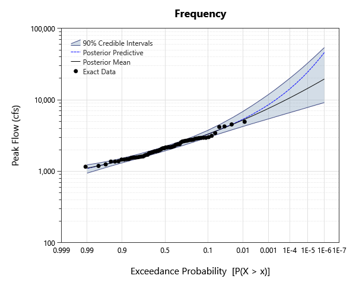
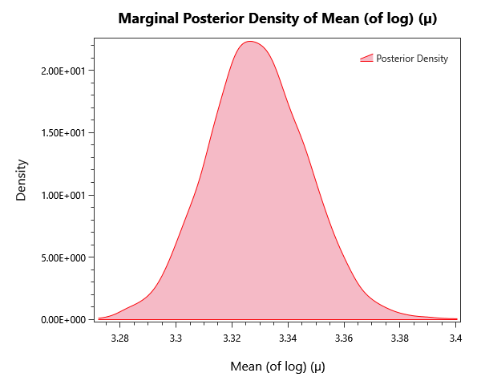
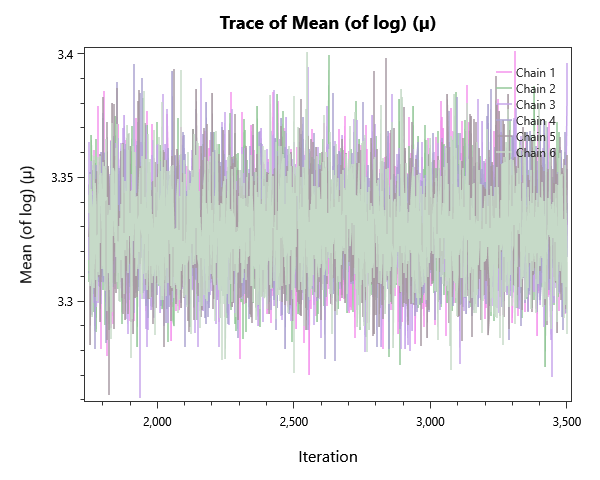
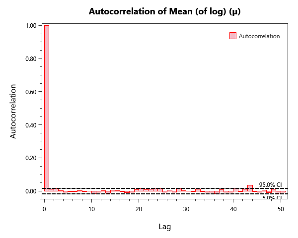

# bulletin-17c-bayesian-examples

## Overview

Bayesian re-fits of the seven Bulletin 17C example datasets (Moose River, Orestimba Creek, Back Creek, Arkansas River, Bear Creek, Santa Cruz River, American River) using the Log-Pearson Type III distribution. Companion to bulletin-17c-examples.

## What's Inside

### Input Data

| Element | Description |
|---|---|
| `Example #1` | Systematic Record – Moose River at Victory, VT |
| `Example #2` | Analysis with Low Outliers – Orestimba Creek near Newman, CA |
| `Example #3` | Broken Record – Back Creek near Jones Springs, WV |
| `Example #4` | Historical Data – Arkansas River at Pueblo, CO |
| `Example #5` | Crest Stage Gage Censored Data – Bear Creek at Ottumwa, IA |
| `Example #6` | Historic Data and Low Outliers – Santa Cruz River at Lochiel, AZ |
| `Example #7` | Paleoflood Record Example – American River at Fair Oaks, California |

### Univariate Distribution

| Element | Description |
|---|---|
| `Bayes Example #1` | Bayesian LP-III fit of Example #1 (Moose River systematic record). |
| `Bayes Example #2` | Bayesian LP-III fit of Example #2 (Orestimba Creek with low outliers). |
| `Bayes Example #3` | Bayesian LP-III fit of Example #3 (Back Creek broken record). |
| `Bayes Example #4` | Bayesian LP-III fit of Example #4 (Arkansas River with historical data). |
| `Bayes Example #5` | Bayesian LP-III fit of Example #5 (Bear Creek crest-stage gage censored data). |
| `Bayes Example #6` | Bayesian LP-III fit of Example #6 (Santa Cruz River with historic data and low outliers). |
| `Bayes Example #7` | Bayesian LP-III fit of Example #7 (American River paleoflood record). |

### Bulletin 17C

| Element | Description |
|---|---|
| `B17C Example #1` | B17C fit of Example #1 (Moose River systematic record). |
| `B17C Example #2` | B17C fit of Example #2 (Orestimba Creek with low outliers). |
| `B17C Example #3` | B17C fit of Example #3 (Back Creek broken record). |
| `B17C Example #4` | B17C fit of Example #4 (Arkansas River with historical data). |
| `B17C Example #5` | B17C fit of Example #5 (Bear Creek crest-stage gage censored data). |
| `B17C Example #6` | B17C fit of Example #6 (Santa Cruz River with historic data and low outliers). |
| `B17C Example #7` | B17C fit of Example #7 (American River paleoflood record). |

## Step-by-Step Walkthrough

### Opening the Project

1. Open RMC-BestFit 2.0.
2. Select **File > Open** and navigate to `examples/4-univariate-distribution-analysis/1-univariate-analysis/3-bulletin17C-examples/`.
3. Open `bulletin-17c-bayesian-examples.bestfit`.

### Exploring the Elements

For each Univariate Distribution anlysis:

1. Click the analysis in the Project Explorer.
2. The **Distirbution Results** tab to the left shoudld automatically open. Navigate to the **Frequency** tab to view the AEP-vs-quantile plot.
3. Open the **Markov Chain Traces** tab on the left to confirm chain mixing (well-mixed traces look like fuzzy caterpillars).
4. Open the **Autocorrelation** tab on the left to check effective sample size.
5. Inspect the **Properties** panel on the right for sampler settings (iterations, warmup, point estimator, credible-interval width).

These will be explored more below in the Expected results section.

## Analysis Settings

Each Bayesian analysis in this project uses the DEMCzs sampler with project-specific iteration / warm-up settings. Open the **Properties** panel to the right of any analysis to inspect:

- **Sampler type** (DEMCzs, ARWMH, HMC).
- **Iterations / Warm-up Iterations** — total post-warmup samples per chain.
- **Number of Chains** — typically 6 for routine work.
- **Thinning Interval** — keeps every Nth sample to reduce storage / autocorrelation.
- **Point Estimator** — Posterior Mean (default), Posterior Median, or Posterior Mode (MAP).
- **Credible Interval Width** — typically 0.90 or 0.95.

## Expected Results
Below are the expected results for Univariate Distribution Analysis labeled "Bayes Example #1"; this should be the first analysis in the list.
Be sure to explore all of the analyses provided!

### Parameter Estimates

The parameter estimates are found under the **MCMC Report** tab to the left as parameter summary statistics.

| Parameter | Mean | Std Dev | 5% | Median | 95% |R-hat | ESS |
|---|---|---|---|---|---|---|---|
| Mean (of log) (µ) | 3.32903 | 0.017966 | 3.30022 | 3.32859 | 3.35871 | 0.9998 | 9300 |
| Std Dev (of log) (σ) | 0.145275 | 0.0144659 | 0.123724 | 0.144058  | 0.170841 | 0.9999 | 9491 |
| Skew (of log) (γ) | 0.494699 | 0.309876  | -0.0420235 | 0.508394 | 0.981615 | 0.9999 | 9759 |

### Frequency / Quantile Table
While in the **Distribution Results** tab to the left, select Tabular Results to see the frequency plot's value at each return level probability,

| Probability | 95.0% CI | 5.0% CI | Posterior Predictive| Posterior Mean |
|---|---|---|---|---|
| 1E-06 | 54031.316257562066 | 9165.110307410034 | 46116.62582137766 | 19617.021917559636 | 
| 2E-06 | 46721.50839543596 | 8779.767395965824 | 37999.18439573705 | 17965.084607220688 | 
| 5E-06 | 38385.61143470683 | 8269.365768389314 | 29698.795720175534 | 15964.011187079663 | 
| 1E-05 | 33100.93711300119 | 7872.498753694969 | 24819.409863879744 | 14577.69791315477 | 
| 2E-05 | 28433.7841684319 | 7483.270018967832 | 20860.461018886417 | 13292.54052225392 | 
| 5E-05 | 23308.201627629398 | 6995.57167680981 | 16716.233177873124 | 11736.641442315871 | 
| 0.0001 | 20036.42034911222 | 6626.163991018255 | 14221.25450638549 | 10659.157590427467 | 
| 0.0002 | 17188.272175283582 | 6264.134782619214 | 12155.928150363157 | 9660.40921577915 | 
| 0.0005 | 13978.206991629932 | 5787.573628833811 | 9945.167803281185 | 8450.963923210415 | 
| 0.001 | 11930.629825356993 | 5425.291678366462 | 8583.160724172734 | 7612.740533980664 | 
| 0.002 | 10190.960228425516 | 5071.861151707566 | 7433.63755040204 | 6834.701293487262 | 
| 0.005 | 8188.712929452412 | 4607.7599330020585 | 6171.932667642047 | 5889.859006677785 | 
| 0.01 | 6902.670113275914 | 4248.949920095394 | 5371.716882925127 | 5231.877346858234 | 
| 0.02 | 5797.470134115837 | 3882.760729657046 | 4674.052814483974 | 4616.972480559368 | 
| 0.05 | 4554.011152929869 | 3383.3208619584093 | 3868.155091079058 | 3860.1791365128565 | 
| 0.1 | 3756.6719505125143 | 2986.5413396786366 | 3317.935606324538 | 3320.4337669088036 | 
| 0.2 | 3064.777008244417 | 2561.095394666336 | 2792.8827845281053 | 2795.8717674915224 | 
| 0.3 | 2692.5667854387993 | 2295.990171541417 | 2485.0020328369114 | 2487.090566368095 | 
| 0.5 | 2228.5658447325054 | 1930.7675660324815 | 2073.9297901925297 | 2075.3669093598874 | 
| 0.7 | 1882.4383041609392 | 1642.391138926227 | 1757.0141944841844 | 1758.2226064762099 | 
| 0.8 | 1715.023252836066 | 1495.654301211657 | 1601.0474527329357 | 1601.7874536498475 | 
| 0.9 | 1523.3610690481812 | 1314.3014473936146 | 1420.363783116202 | 1419.8095173319493 | 
| 0.95 | 1399.6843891019073	| 1175.8186655724626 | 1295.7336283611808 | 1294.6972551553101 | 
| 0.98 | 1290.3527128117498 | 1030.5892726380414 | 1173.407246505538 | 1176.0218461308664 | 
| 0.99 | 1234.5580479002801 | 943.2936688860141 | 1096.4923209429799 | 1107.8531207669682 | 

### Plots
There are also plenty of plots to explore our results with. Under the **Distribution Results** tab we have a frequency curve.

*Figure 1: Frequency curve (AEP versus quantile), with the credible band.*

The **Kernal Density** tab shows an estimate for the pdf of each parameter.

*Figure 2: Posterior kernel density for mean parameter (µ).*

The **Markov Chain Traces** tab explores the traces of each Markov chain as it explores the posterior space in order to converge.

*Figure 3: Markov-chain traces for mean parameter (µ).*

Finally, we can investigate the autocorrelation of the chains under the **Autocorrelation** tab.

*Figure 4: Autocorrelation function of the chains, used to estimate effective sample size, for mean parameter (µ).*

### MCMC Diagnostics

One should always verify chain convergence before interpreting any results. There are a variety of ways including:

- **R-hat** — should be < 1.01 for every parameter.
- **Effective Sample Size (ESS)** — at least a few hundred per parameter.
- **Trace plots** — should look like fuzzy, well-mixed caterpillars (no drift, no sticking).
- **Posterior** — overall posterior log-likelihood should be visually stationary in the mean-likelihood plot.

These can be found under the **Markov Chain Traces** and **MCMC Reports** tabs.

## Next Steps
- Compare analyses via the **Bayesian Model Average** element to combine results from multiple distributions. 
	- Right click the **Univariate Distribution Analysis** drop down and select "New Composite Distribution Analysis"
	- Select from the available options in the **Properties** panel to the right
- Compute **return-period quantiles** (1%, 0.5%, 0.2% AEP) from the frequency-curve table.
- Re-run with informative **quantile priors** if engineering judgment suggests specific upper-bound flood magnitudes.
- Cross-check the LP-III fit against a **Bulletin 17C** fit on the same input data.