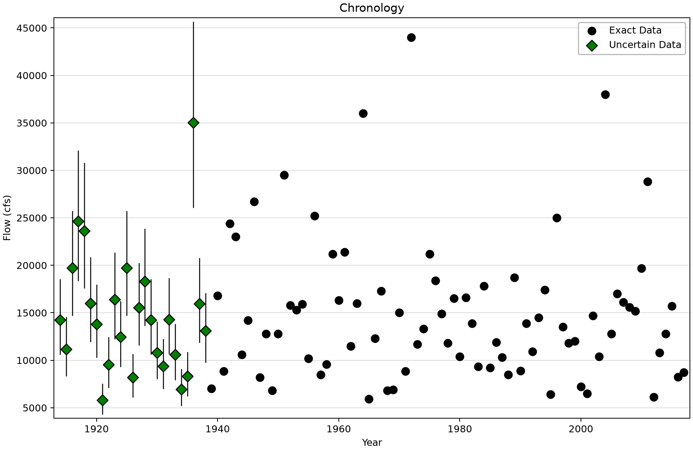
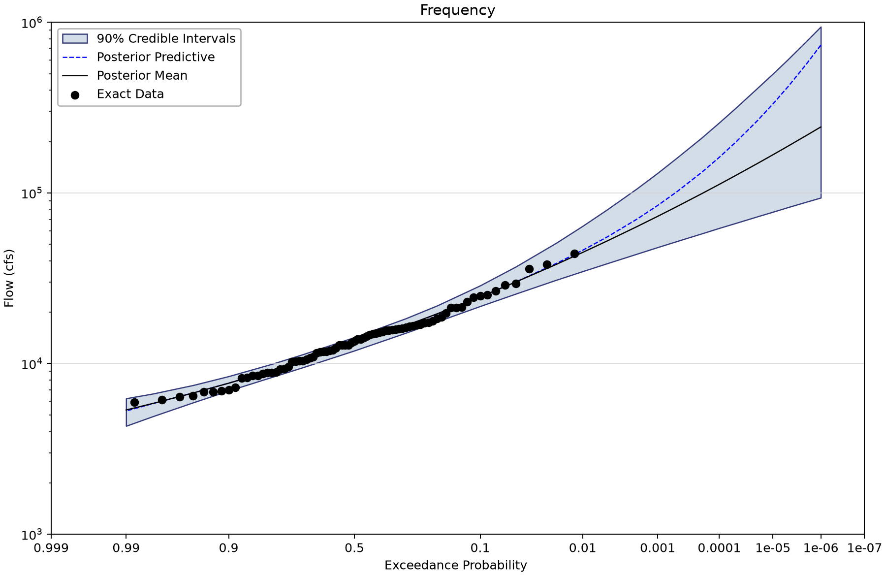
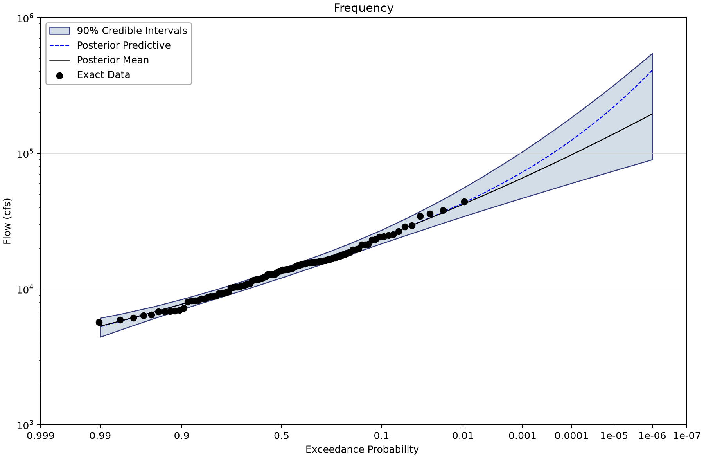
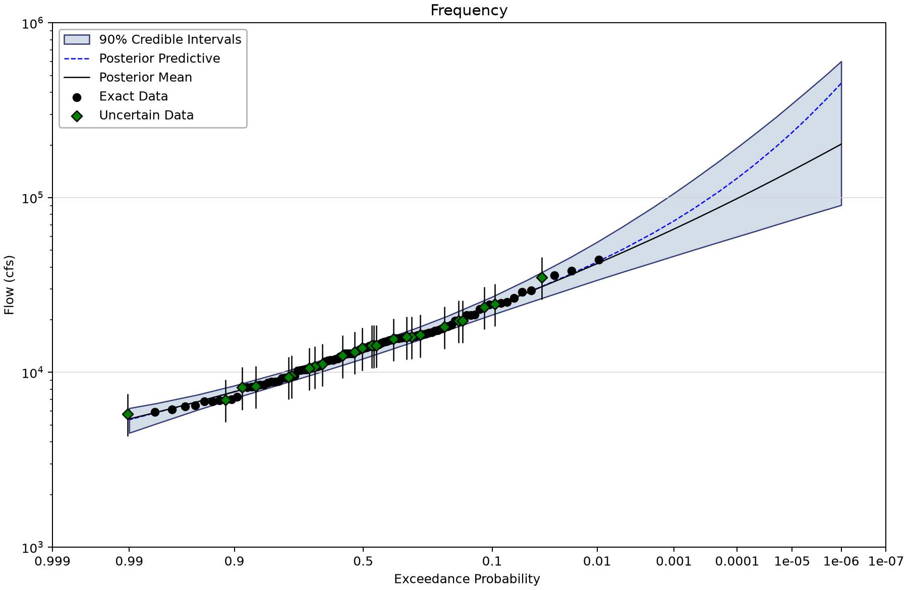
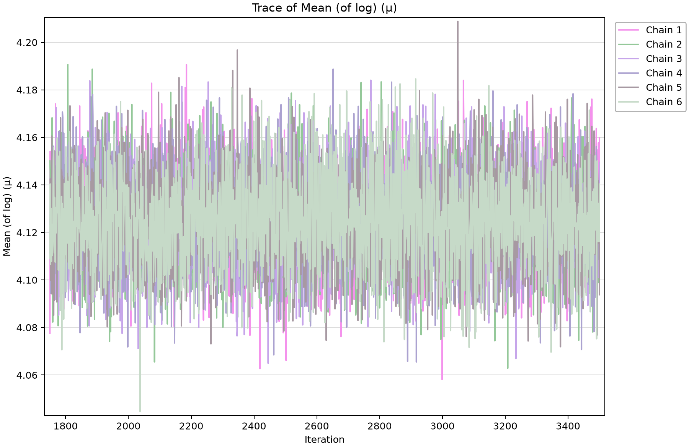

# Sinnemahoning Creek: record extension with measurement uncertainty

Three saved Bayesian LP3 fits compare a systematic flood record with two ways of entering a MOVE.3 extension. The main lesson is to separate observed peaks from estimated peaks and to carry the supplied uncertainty explicitly when it is supported by the extension study.

## Open the saved project

Open [sinnemahoning-move3-bayesian.bestfit](sinnemahoning-move3-bayesian.bestfit) with **File > Open** and save a separate working copy before editing or rerunning.

The figures display saved BestFit results through the shared Python renderer; no analysis was refitted for this tutorial. AEP is annual exceedance probability: 0.01 is 1% per year under the model, not a schedule of one flood every 100 years.

The point curve evaluates the distribution at the selected posterior mean or mode **parameter vector**. It is not necessarily the posterior median of each quantile. The curve labeled Posterior Predictive averages over parameter uncertainty. A credible band describes uncertainty about a quantile; it is not a band containing 90% of future floods.

## Source and observation model

The project identifies the extension as MOVE.3 and the systematic record as Sinnemahoning Creek (USGS 01543500). It stores the resulting values and uncertainty distributions, but does not establish the donor-gage selection, regression calculation or dependence among the 25 estimated years. Those study records are needed before reuse in a design analysis.

The uncertain extension uses BestFit `LogNormal` distributions with a year-specific log-location and common log10 standard deviation 0.074. That value is neither 0.074 cfs nor a blanket 7.4% flow error. Keep the stored distribution type and log convention when reproducing it. This tutorial does not estimate a new MOVE.3 relationship.

| Input element | Meaning | Exact rows and index span | Other saved input rows |
| --- | --- | --- | --- |
| Sinnemahoning - MOVE.3 - No Errors | 104 exact-valued entries; 1914–1938 are MOVE.3 estimates treated as exact, not additional direct measurements. | 104 (1914–2017) | Uncertain: 0; intervals: 0; windows: 0; low flags: 0. |
| Sinnemahoning - MOVE.3 - With Errors | 79 systematic peaks plus 25 LogNormal uncertain observations for 1914–1938; flow in cfs. Each retained log10-space sigma is 0.074. | 79 (1939–2017) | Uncertain: 25; intervals: 0; windows: 0; low flags: 0. |
| Sinnemahoning - No Extension | 79 systematic peaks for 1939–2017, flow in cfs. | 79 (1939–2017) | Uncertain: 0; intervals: 0; windows: 0; low flags: 0. |

Counts describe stored series entries. Threshold windows are not a count of measured floods; low flags are included in the exact-row count.

## Work through the example

1. Open Sinnemahoning - No Extension and confirm 79 exact peaks from 1939 through 2017.

2. Open the No Errors input. Identify the 25 extension years, 1914–1938, within its 104 exact-valued rows.

3. Open the With Errors input. Confirm the same extension period appears in Uncertain Data and inspect each LogNormal distribution rather than replacing it with its center.

4. Compare LPIII - No Extension, LPIII - No Errors and LPIII - With Errors. All three use posterior mean parameters and 90% credible intervals.

5. Inspect all parameter diagnostics and compare the same AEP across alternatives. Keep uncertainty about extension magnitude distinct from uncertainty in the fitted frequency quantile.

6. Document the donor station, concurrent calibration period, extension procedure and error dependence before using an extension in an engineering study.

## Saved settings and results

All Bayesian alternatives retain DEMCzs, six chains, thinning interval 30, seed 12345 and output length 10,000. The usual stored settings are 1,750 warmup iterations and 3,500 iterations. These are the saved setting names; output length is not a count of independent observations. Each fit retains the Jeffreys-rule setting for scale. Review parameter-prior bounds as well as named informative priors before adopting a configuration elsewhere.

The table reports the largest parameter R-hat and smallest parameter effective sample size (ESS) stored in each run. R-hat near one and substantial ESS are useful screening evidence. Inspect every parameter's chains, autocorrelation and tail uncertainty before accepting a result; successful completion alone does not establish convergence or model adequacy.

| Saved alternative | Model | Parameter estimate | 1% AEP point | Credible limits | Width | Max R-hat | Min ESS |
| --- | --- | --- | --- | --- | --- | --- | --- |
| LPIII - No Extension | LP3 | Mean | 44,801.943 | 34,688.792–63,941.632 | 90% | 1.00031 | 9,262 |
| LPIII - No Errors | LP3 | Mean | 42,156.645 | 34,184.869–55,394.5 | 90% | 1.00029 | 9,436 |
| LPIII - With Errors | LP3 | Mean | 41,908.746 | 33,738.768–55,712.337 | 90% | 0.99994 | 9,072 |

Magnitudes are cfs. Values are rounded from the saved 0.01 AEP ordinate without interpolation or refitting. The selected parameter estimator and interval width are shown explicitly.

For **LPIII - No Extension**, the saved parameter summaries are:

| Parameter | Posterior mean | Posterior median | Lower credible limit | Upper credible limit |
| --- | --- | --- | --- | --- |
| Mean (of log) (µ) | 4.129 | 4.129 | 4.093 | 4.166 |
| Std Dev (of log) (σ) | 0.199 | 0.197 | 0.173 | 0.23 |
| Skew (of log) (γ) | 0.417 | 0.42 | -0.094 | 0.92 |

These are parameter credible limits, distinct from the frequency-quantile limits above.

## Read the figures

*Sinnemahoning chronology distinguishing uncertain extension years from exact systematic peaks.* [SVG](images/sinnemahoning-move3-bayesian-uncertain-chronology.svg) · [Plot data](images/sinnemahoning-move3-bayesian-uncertain-chronology.plotspec.json.gz)

*Bayesian LP3 fit to the systematic record only.* [SVG](images/sinnemahoning-move3-bayesian-no-extension.svg) · [Plot data](images/sinnemahoning-move3-bayesian-no-extension.plotspec.json.gz)

*Bayesian LP3 fit treating the supplied extension values as exact.* [SVG](images/sinnemahoning-move3-bayesian-exact-extension.svg) · [Plot data](images/sinnemahoning-move3-bayesian-exact-extension.plotspec.json.gz)

*Bayesian LP3 fit retaining the 25 supplied measurement-error distributions.* [SVG](images/sinnemahoning-move3-bayesian-uncertain-extension.svg) · [Plot data](images/sinnemahoning-move3-bayesian-uncertain-extension.plotspec.json.gz)

*Saved parameter trace for the model with uncertain extension data.* [SVG](images/sinnemahoning-move3-bayesian-trace.svg) · [Plot data](images/sinnemahoning-move3-bayesian-trace.plotspec.json.gz)

## Interpretation and limits

Representing each extension year by a marginal measurement-error distribution does not, by itself, represent dependence arising from a shared donor record or regression coefficients. The saved study evidence is insufficient to assess that dependence. Do not describe the extension as 25 independent new measurements.

An uncertainty band is not guaranteed to widen at every AEP when uncertain data replace exact inputs; the fitted distribution also changes. Read the actual values and investigate their physical implications. Do not rank the no-extension and extended models by raw information criteria when they use different data records or observation likelihoods. The [B17C companion](../../2-bulletin-17C-analysis/3-measurement-errors/sinnemahoning-move3-b17c.md) uses a different estimator and uncertainty construction.

## Check your understanding

Explain what additional evidence is needed to justify the error distributions, and why their individual variances do not settle cross-year dependence.

## Reproduce the figures

Follow the [shared figure instructions](../../../README.md#reproducing-the-figures) with `--only sinnemahoning-move3-bayesian`. PNG, SVG and compressed PlotSpec files come from the same desktop-owned coordinates. The manifest names the selected element for each view; a representative diagnostic figure does not replace inspection of all parameters.
