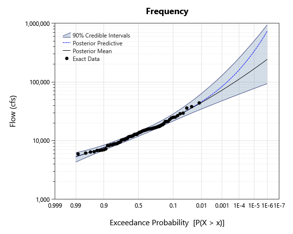
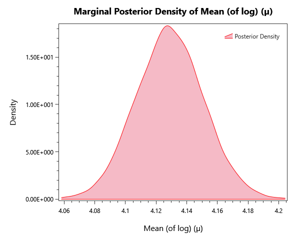
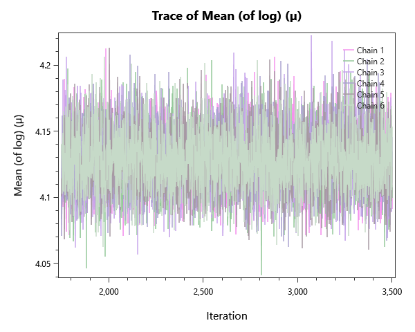
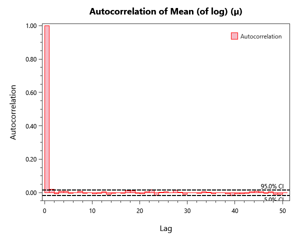

# sinnemahoning-move3-bayesian

## Overview

Bayesian flood-frequency analysis for Sinnemahoning Creek (USGS gage 01543500) demonstrating record extension via MOVE.3 regression. Compares fits that ignore measurement error against fits that propagate the regression uncertainty using uncertain data points.

## What's Inside

### Input Data

| Element | Description |
|---|---|
| `Sinnemahoning - MOVE.3 - No Errors` | The years 1914-1938 were derived from MOVE.3 record extension. Typically, errors from the regression are ignored. |
| `Sinnemahoning - MOVE.3 - With Errors` | The years 1914-1938 were derived from MOVE.3 record extension. Errors from the regression are incorporated using uncertain data. |
| `Sinnemahoning - No Extension` | Sinnemahoning Creek peak-flow record with no MOVE.3 extension applied (systematic record only). |

### Univariate Distribution

| Element | Description |
|---|---|
| `LPIII - No Extension` | Bayesian LP-III fit on the systematic record only (no MOVE.3 extension). |
| `LPIII - No Errors` | Bayesian LP-III fit on the MOVE.3-extended record, ignoring the regression measurement errors. |
| `LPIII - With Errors` | Bayesian LP-III fit on the MOVE.3-extended record with regression measurement errors propagated as uncertain data. |

## Step-by-Step Walkthrough

### Opening the Project

1. Open RMC-BestFit 2.0.
2. Select **File > Open** and navigate to `examples/4-univariate-distribution-analysis/1-univariate-analysis/4-measurement-errors/`.
3. Open `sinnemahoning-move3-bayesian.bestfit`.

### Exploring the Elements
For each Univariate Distribution anlysis:

1. Click the analysis in the Project Explorer.
2. The **Distirbution Results** tab to the left shoudld automatically open. Navigate to the **Frequency** tab to view the AEP-vs-quantile plot.
3. Open the **Markov Chain Traces** tab on the left to confirm chain mixing (well-mixed traces look like fuzzy caterpillars).
4. Open the **Autocorrelation** tab on the left to check effective sample size.
5. Inspect the **Properties** panel on the right for sampler settings (iterations, warmup, point estimator, credible-interval width).

These will be explored more below in the Expected results section.

## Analysis Settings

Each Bayesian analysis in this project uses the DEMCzs sampler with project-specific iteration / warm-up settings. Open the **Properties** panel of any analysis to inspect:

- **Sampler type** (DEMCzs, ARWMH, HMC).
- **Iterations / Warm-up Iterations** — total post-warmup samples per chain.
- **Number of Chains** — typically 6 for routine work.
- **Thinning Interval** — keeps every Nth sample to reduce storage / autocorrelation.
- **Point Estimator** — Posterior Mean (default), Posterior Median, or Posterior Mode (MAP).
- **Credible Interval Width** — typically 0.90 or 0.95.

## Expected Results
Below are the expected results for Univariate Distribution Analysis labeled "LPIII - No Extension"; this should be the first analysis in the list.
Be sure to explore all of the analyses provided!

### Parameter

The parameter estimates are found under the **MCMC Report** tab to the left as parameter summary statistics.

| Parameter | Mean | Std Dev | 5% | Median | 95% |R-hat | ESS |
|---|---|---|---|---|---|---|---|
| Mean (of log) (µ) | 4.12892 | 0.0221622 | 4.09276 | 4.12874 | 4.16581 | 0.9999 | 9547 |
| Std Dev (of log) (σ) | 0.198843 | 0.0177867 | 0.172888 | 0.197371 | 0.230417 | 1.0003 | 9384 |
| Skew (of log) (γ) | 0.41654 | 0.308091 | -0.0942991 | 0.419552 | 0.920473 | 1.0001 | 9262 |

### Frequency / Quantile Table
While in the **Distribution Results** tab to the left, select Tabular Results to see the frequency plot's value at each return level probability,

| Probability | 95.0% CI | 5.0% CI | Posterior Predictive| Posterior Mean |
|---|---|---|---|---|
| 1E-06 | 941895.394631862 | 93697.05380690159 | 735267.3379703702 | 243612.53274078039 | 
| 2E-06 | 779381.079678741 | 88712.06233954296 | 573917.6588298439 | 217996.50974451596 | 
| 5E-06 | 604406.8805348062 | 82275.24207965579 | 418260.221232814 | 187736.2031513548 | 
| 1E-05 | 498772.12540904374 | 77346.54639604903 | 331969.9443677477 | 167308.4285876564 | 
| 2E-05 | 411370.11613768426 | 72679.52437641469 | 265323.3971223406 | 148796.90039229096 | 
| 5E-05 | 316030.8276633807 | 66581.13655484354 | 199351.1570918021 | 126981.34093665762 | 
| 0.0001 | 258389.40949075267 | 62195.508958255064 | 161799.3893378456 | 112290.22877764553 | 
| 0.0002 | 210535.61685370025 | 57732.20230483466 | 132140.01222554533 | 99004.87478072522 | 
| 0.0005 | 161058.1285424831 | 52132.54054404573 | 102009.13587884528 | 83384.57556976251 | 
| 0.001 | 130653.34196926317 | 47981.16125926004 | 84384.38659480437 | 72888.22365639833 |
| 0.002 | 105817.51922835206 | 43860.27173378878 | 70120.35691466517 | 63410.9785015336 | 
| 0.005 | 79806.03681193502 | 38594.861742680354 | 55179.32817845139 | 52280.894544392395 | 
| 0.01 | 63941.63232193175 | 34688.79163660984 | 46120.712568126764 | 44801.94250531572 | 
| 0.02 | 50752.13456119727 | 30820.354445442663 | 38508.26558266601 | 38037.394600010404 | 
| 0.05 | 36928.57393790966 | 25619.23702522122 | 30075.42876025844 | 30046.072956148684 | 
| 0.1 | 28628.087872599037 | 21663.4206922105 | 24561.849053410035 | 24601.486246747107 | 
| 0.2 | 21823.11134057623 | 17588.170948540053 | 19516.948029978474 | 19543.11907992385 | 
| 0.3 | 18374.222692953346 | 15111.841302030358 | 16673.597092675856 | 16686.620244069974 | 
| 0.5 | 14247.694600625573 | 11895.375653663723 | 13029.071781658113 | 13036.175880294659 |
| 0.7 | 11312.84821600125 | 9487.161586348799 | 10356.688183756674 | 10363.694127181378 |
| 0.8 | 9927.48413052725 | 8316.149909350368 | 9092.421454693196 | 9095.640884424865 |
| 0.9 | 8413.43431340079 | 6924.188803605242 | 7673.085776103146 | 7666.453647602048 |
| 0.95 | 7458.241617502503 | 5900.295452883388 | 6725.120214136634 | 6714.674314428059 |
| 0.98 | 6651.828039832808 | 4899.74510927318 | 5821.966982130119 | 5836.695473679198 |
| 0.99 | 6242.04360422965 | 4305.4392581579505 | 5272.358675896718 | 5343.845238727602 |

### Plots
There are also plenty of plots to explore our results with. Under the **Distribution Results** tab we have a frequency curve.

*Figure 1: Frequency curve (AEP versus quantile), with the credible band.*

The **Kernal Density** tab shows an estimate for the pdf of each parameter.

*Figure 2: Posterior kernel density for mean parameter (µ).*

The **Markov Chain Traces** tab explores the traces of each Markov chain as it explores the posterior space in order to converge.

*Figure 3: Markov-chain traces for mean parameter (µ).*

Finally, we can investigate the autocorrelation of the chains under the **Autocorrelation** tab.

*Figure 4: Autocorrelation function of the chains, used to estimate effective sample size, for mean parameter (µ).*

### MCMC Diagnostics

One should always verify chain convergence before interpreting any results. There are a variety of ways including:

- **R-hat** — should be < 1.01 for every parameter.
- **Effective Sample Size (ESS)** — at least a few hundred per parameter.
- **Trace plots** — should look like fuzzy, well-mixed caterpillars (no drift, no sticking).
- **Posterior** — overall posterior log-likelihood should be visually stationary in the mean-likelihood plot.

These can be found under the **Markov Chain Traces** and **MCMC Reports** tabs.

## Next Steps
- Compare analyses via the **Bayesian Model Average** element to combine results from multiple distributions. 
	- Right click the **Univariate Distribution Analysis** drop down and select "New Composite Distribution Analysis"
	- Select from the available options in the **Properties** panel to the right
- Compute **return-period quantiles** (1%, 0.5%, 0.2% AEP) from the frequency-curve table.
- Re-run with informative **quantile priors** if engineering judgment suggests specific upper-bound flood magnitudes.
- Cross-check the LP-III fit against a **Bulletin 17C** fit on the same input data.