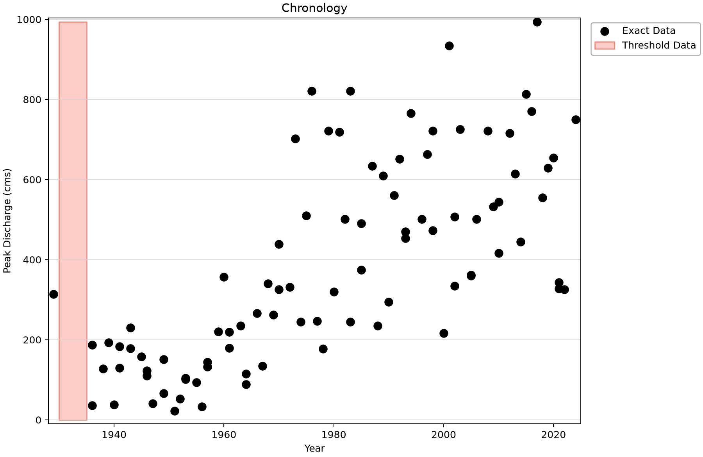
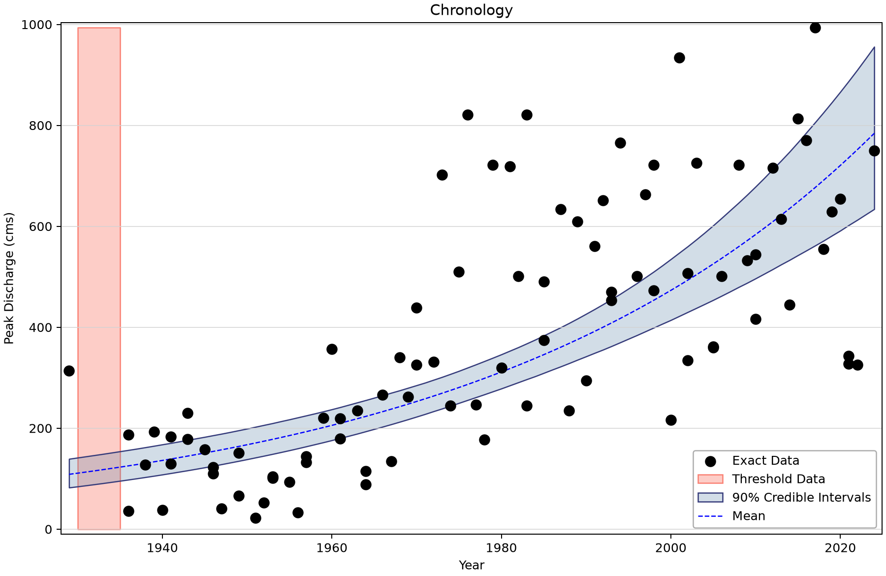
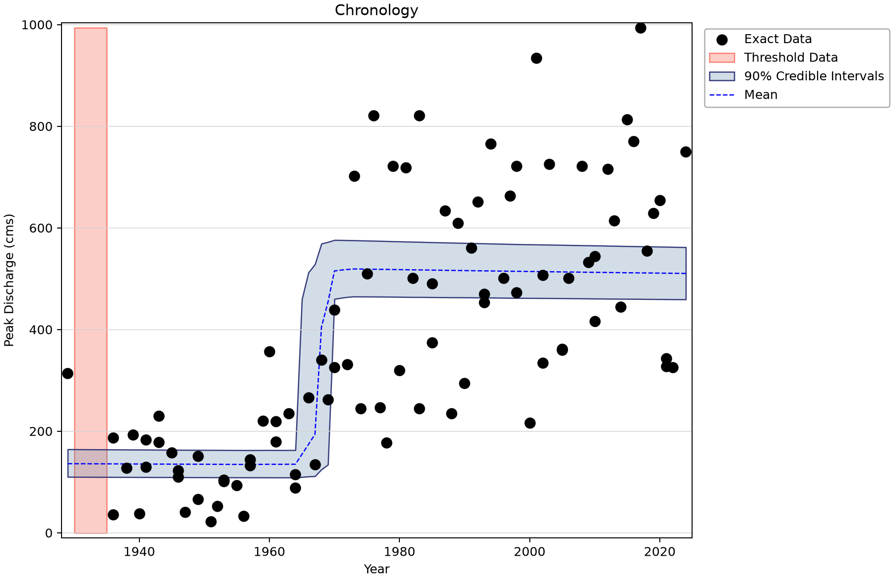
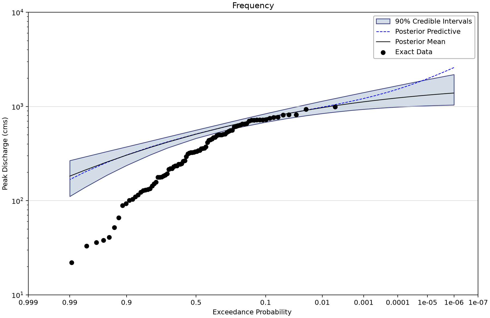
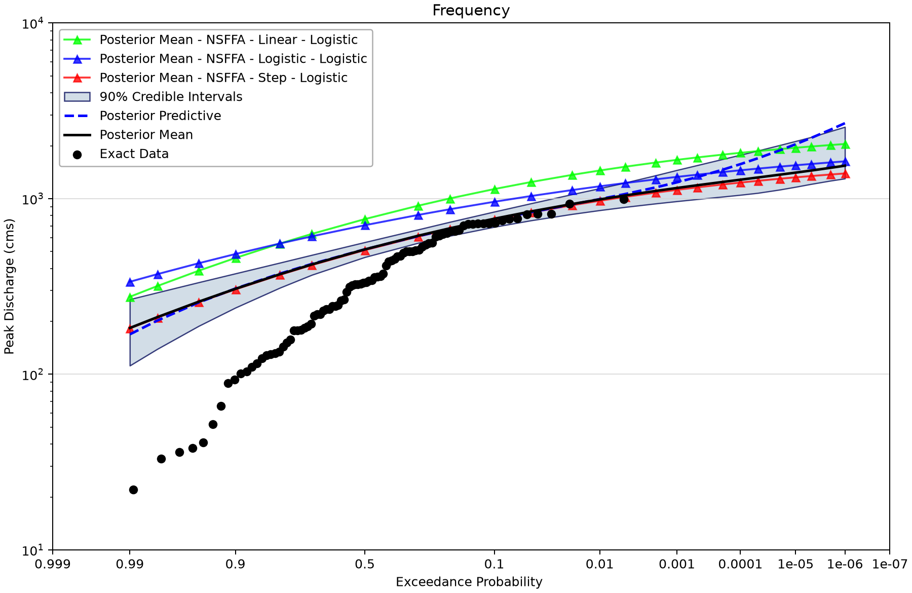

# Brays Bayou: conditional flood frequency with changing parameters

Open [nsffa-brays-bayou-texas.bestfit](nsffa-brays-bayou-texas.bestfit) and save a working copy. This example compares seven log-Pearson Type III (LP3) models for USGS 08075000. Its purpose is to show how assumptions about time-varying parameters affect a frequency curve at a specified year.

## Understand the observations

| Input element | Meaning | Exact rows and index span | Other saved input rows |
| --- | --- | --- | --- |
| USGS 08075000 Brays Bayou | Brays Bayou annual peaks, 90 exact observations during 1929–2024, cfs. The 1930–1935 gap is represented by six nonexceedances below 35,100 cfs. Retained source copy; the seven fits use the metric input. | 90 (1929–2024) | Uncertain: 0; intervals: 0; windows: 1; low flags: 0. |
| USGS 08075000 Brays Bayou - Metric | Brays Bayou annual peaks, 90 exact observations during 1929–2024, m³/s. The 1930–1935 gap is represented by six nonexceedances below 994 m³/s. Input used by all seven saved LP3 fits. | 90 (1929–2024) | Uncertain: 0; intervals: 0; windows: 1; low flags: 0. |
| USGS 08075000 Brays Bayou_copy | Brays Bayou annual peaks, 90 exact observations during 1929–2024, cfs. The 1930–1935 gap is represented by six nonexceedances below 35,100 cfs. Retained source copy; the seven fits use the metric input. | 90 (1929–2024) | Uncertain: 0; intervals: 0; windows: 1; low flags: 0. |
| USGS 08075000 Brays Bayou_copy_copy | Brays Bayou annual peaks, 90 exact observations during 1929–2024, cfs. The 1930–1935 gap is represented by six nonexceedances below 35,100 cfs. Retained source copy; the seven fits use the metric input. | 90 (1929–2024) | Uncertain: 0; intervals: 0; windows: 1; low flags: 0. |

All fits use the metric input. The two additional cfs copies remain in the project; they are not additional independent records. Historical threshold values describe a completeness assumption during the six-year gap, not six measured floods. Its source and the intended engineering interpretation of the fitted changes remain questions for the study author.

## Work through the models

1. Select the metric input and inspect the exact observations and perception threshold.
2. Open NSFFA - Constant, then NSFFA - Linear. The three parameter trends are the mean, standard deviation and skew of log10 flow, in that order.
3. Inspect the Chronology plots. Linear, logistic and step functions on the mean represent different assumptions; the last three alternatives also allow the standard deviation of log flow to change. Skew stays constant.
4. Read the saved evaluation index, **2024**, before comparing Frequency plots. A curve conditional on 2024 is not an average over the 1929–2024 record or a forecast that the parameters will stay fixed.
5. Open Bayesian Model Average and inspect its three component names and DIC weights. Do not assume that every alternative in the project contributes.

| Alternative | Parameter trend types in model order | Trend start index | Evaluation index |
| --- | --- | --- | --- |
| NSFFA - Constant | Constant / Constant / Constant | 1929 | 2024 |
| NSFFA - Linear | Linear / Constant / Constant | 1929 | 2024 |
| NSFFA - Logistic | Logistic / Constant / Constant | 1929 | 2024 |
| NSFFA - Step | StepFunction / Constant / Constant | 1929 | 2024 |
| NSFFA - Linear - Logistic | Linear / Logistic / Constant | 1929 | 2024 |
| NSFFA - Logistic - Logistic | Logistic / Logistic / Constant | 1929 | 2024 |
| NSFFA - Step - Logistic | StepFunction / Logistic / Constant | 1929 | 2024 |

No quantile priors are enabled. Default flat parameter priors and the Jeffreys scale setting are retained; inspect the actual bounds before reuse. Even Constant uses the nonstationary wrapper with constant trend functions.

## Read the saved results

All listed Bayesian fits retain DEMCzs, seed 12345, posterior-mean point parameters and 90% credible intervals. The table shows the saved chain count, thinning interval and output length. Draw count is not effective sample size (ESS). Read warmup, iteration settings and every parameter prior in the saved properties before copying a model.

R-hat near one and adequate ESS are useful screening evidence, not proof of convergence or model adequacy. Inspect every parameter's trace and autocorrelation, then check the stability of the tail quantities needed for the study. No saved results were rerun for these figures.
| Saved alternative | Chains / thinning / draws | DIC | 1% AEP point | 90% credible limits | Max R-hat | Min ESS |
| --- | --- | --- | --- | --- | --- | --- |
| NSFFA - Constant | 6/30/10000 | 1,228.347 | 992.122 | 912.23–1,122.722 | 1.00006 | 8,762 |
| NSFFA - Linear | 8/40/10000 | 1,180.365 | 2,290.874 | 1,705.76–3,236.131 | 1.00050 | 9,367 |
| NSFFA - Logistic | 8/40/10000 | 1,178.943 | 2,565.012 | 1,924.624–3,433.781 | 1.00075 | 7,392 |
| NSFFA - Step | 10/50/10000 | 1,158.12 | 1,111.165 | 960.12–1,348.675 | 1.00025 | 8,497 |
| NSFFA - Linear - Logistic | 10/50/10000 | 1,172.296 | 1,445.906 | 1,141.636–1,934.591 | 1.00009 | 9,309 |
| NSFFA - Logistic - Logistic | 10/50/20000 | 1,161.831 | 1,175.09 | 888.553–1,406.932 | 1.00482 | 918 |
| NSFFA - Step - Logistic | 12/60/10000 | 1,154.834 | 972.381 | 843.204–1,141.713 | 1.00042 | 8,619 |

Quantiles and limits are m³/s at 2024. The Logistic–Logistic fit has the least favorable scalar diagnostics here, including minimum ESS about 918 despite 20,000 retained draws. The plotted point is a quantile evaluated at posterior-mean parameters, not necessarily the median of posterior quantiles.

The model average uses DIC weights of 0.000156752 (Linear–Logistic), 0.029356226 (Logistic–Logistic), and 0.970487022 (Step–Logistic). These weights summarize this selected model set and do not prove a causal mechanism.

All saved nonstationary models set Alpha = 0.5. Their Chronology curve is the **50% AEP return level (the conditional median)** and its posterior uncertainty; the band does not contain 90% of annual observations. Frequency plots instead show a range of AEPs at the specified evaluation index. Black observation plotting positions describe the full record, not a sample drawn only under the selected evaluation-index condition.

## Inspect the figures

*Metric peaks and the retained six-year perception window.* [SVG](images/nsffa-brays-bayou-texas-input-chronology.svg) · [Plot data](images/nsffa-brays-bayou-texas-input-chronology.plotspec.json.gz)

*Time-varying quantiles under the linear mean-of-log-flow model.* [SVG](images/nsffa-brays-bayou-texas-linear-chronology.svg) · [Plot data](images/nsffa-brays-bayou-texas-linear-chronology.plotspec.json.gz)

*Step mean and logistic standard-deviation trends; skew remains constant.* [SVG](images/nsffa-brays-bayou-texas-step-logistic-chronology.svg) · [Plot data](images/nsffa-brays-bayou-texas-step-logistic-chronology.plotspec.json.gz)

*Conditional frequency at 2024 for the saved Step–Logistic fit.* [SVG](images/nsffa-brays-bayou-texas-step-logistic-frequency.svg) · [Plot data](images/nsffa-brays-bayou-texas-step-logistic-frequency.plotspec.json.gz)

*DIC-weighted frequency result for the three selected nonstationary alternatives at 2024; this element is a model average.* [SVG](images/nsffa-brays-bayou-texas-model-average.svg) · [Plot data](images/nsffa-brays-bayou-texas-model-average.plotspec.json.gz)

## Interpretation

A fitted change near an estimated date does not establish urbanization, channel change or another cause. Compare trend shapes with independent physical evidence and study purpose. A nonstationary AEP depends on time; a constant “100-year return period” interpretation becomes misleading when annual risk changes.

## Reproduce and check your understanding

The shared Python renderer uses BestFit desktop plot coordinates from a disposable copy of the saved project. See the [figure-generation instructions](../../../README.md#reproducing-the-figures); use this tutorial's filename stem with `--only`. Each figure includes an SVG and compressed PlotSpec containing its source identity and displayed values.

Before using a result in a study, explain the target variable, the represented observation period, the information added through thresholds or priors, and what the plotted interval means. Separate a teaching example's saved settings from a justified engineering choice for another site.
