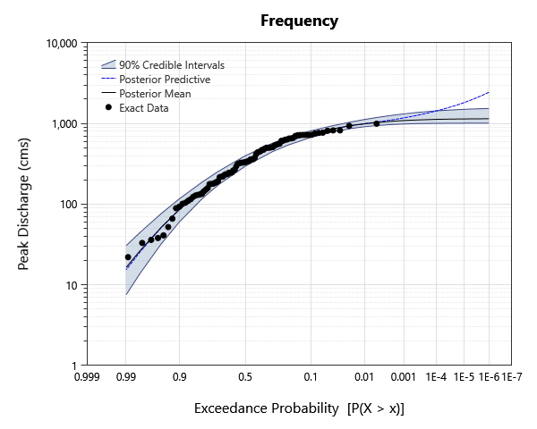
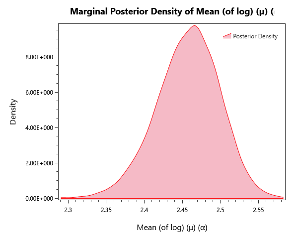
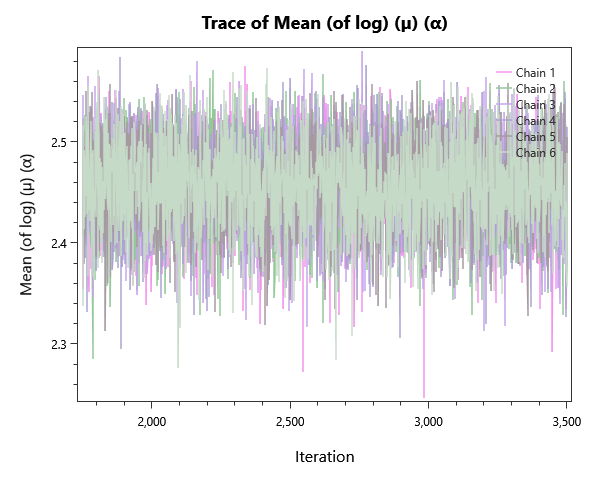
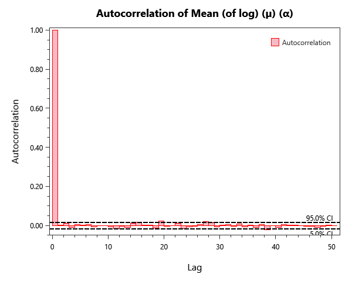

# nsffa-brays-bayou-texas

## Overview

Nonstationary flood-frequency analysis (NSFFA) for Brays Bayou (USGS gage 08075000), Texas. Compares constant, linear, logistic, and step trend functions on the LP-III parameters and aggregates results via Bayesian model averaging.

## What's Inside

### Input Data

| Element | Description |
|---|---|
| `USGS 08075000 Brays Bayou` | Annual peak discharge for Brays Bayou at Houston, TX (USGS gage 08075000), in cubic feet per second. |
| `USGS 08075000 Brays Bayou - Metric` | Annual peak discharge for Brays Bayou at Houston, TX, converted to metric units (cubic meters per second). |

### Univariate Distribution

| Element | Description |
|---|---|
| `NSFFA - Constant` | Stationary LP-III fit (constant trend on all parameters) — baseline for the non-stationary comparisons. |
| `NSFFA - Linear` | Non-stationary LP-III fit with a linear trend on the location parameter. |
| `NSFFA - Logistic` | Non-stationary LP-III fit with a logistic trend on the location parameter. |
| `NSFFA - Step` | Non-stationary LP-III fit with a step-change trend on the location parameter. |
| `NSFFA - Linear - Logistic` | Non-stationary LP-III fit with a linear trend on location and a logistic trend on scale. |
| `NSFFA - Logistic - Logistic` | Non-stationary LP-III fit with a logistic trend on both location and scale. |
| `NSFFA - Step - Logistic` | Non-stationary LP-III fit with a step-change on location and a logistic trend on scale. |

### Composite Distribution

| Element | Description |
|---|---|
| `Bayesian Model Average` | Bayesian model average over the seven NSFFA alternatives, weighted by DIC / WAIC. |

## Step-by-Step Walkthrough

### Opening the Project

1. Open RMC-BestFit 2.0.
2. Select **File > Open** and navigate to `examples/4-univariate-distribution-analysis/1-univariate-analysis/5-nonstationary-ffa/`.
3. Open `nsffa-brays-bayou-texas.bestfit`.

### Exploring the Elements
For each Univariate Distribution anlysis:

1. Click the analysis in the Project Explorer.
2. The **Distirbution Results** tab to the left shoudld automatically open. Navigate to the **Frequency** tab. The displayed curve is conditional on the time index in the **Properties** panel — change it to see how the curve evolves.
3. Open the **Chronology** tab to view the time-varying location / scale through the record.
4. Use the **Bayesian Model Average** Composite Distribution element to view the trend-marginalized AEP curve.

## Analysis Settings

Each Bayesian analysis in this project uses the DEMCzs sampler with project-specific iteration / warm-up settings. Open the **Properties** panel of any analysis to inspect:

- **Sampler type** (DEMCzs, ARWMH, HMC).
- **Iterations / Warm-up Iterations** — total post-warmup samples per chain.
- **Number of Chains** — typically 6 for routine work.
- **Thinning Interval** — keeps every Nth sample to reduce storage / autocorrelation.
- **Point Estimator** — Posterior Mean (default), Posterior Median, or Posterior Mode (MAP).
- **Credible Interval Width** — typically 0.90 or 0.95.

## Expected Results
Below are the expected results for Univariate Distribution Analysis labeled "NSFFA - Constant"; this should be the first analysis in the list.
Be sure to explore all of the analyses provided!

### Parameter Estimates
The parameter estimates are found under the **MCMC Report** tab to the left as parameter summary statistics.

| Parameter | Mean | Std Dev | 5% | Median | 95% |R-hat | ESS |
|---|---|---|---|---|---|---|---|
| Mean (of log) (µ) (α) | 2.45714 | 0.0417119 | 2.38506 | 2.45938 | 2.52123 | 1.0003 | 9789 | 
| Std Dev (of log) (σ) (α) | 0.387815 | 0.0406779 | 0.328395 | 0.383662 | 0.460926 | 1.0002 | 8966 | 
| Skew (of log) (γ) (α) | -1.28685 | 0.182 | -1.55975 | -1.29898 | -0.971748 | 0.9998 | 9146 | 

### Frequency / Quantile Table
While in the **Distribution Results** tab to the left, select Tabular Results to see the frequency plot's value at each return level probability,

| Probability | 95.0% CI | 5.0% CI | Posterior Predictive| Posterior Mean |
|---|---|---|---|---|
| 1E-06 | 1535.6750409383017 | 1011.3231604415923 | 2440.947062471401 | 1144.3953911425606 | 
| 2E-06 | 1526.439921163896 | 1011.079221717383 | 2218.040197672377 | 1143.2570810365887 | 
| 5E-06 | 1511.4053083298231 | 1010.4816080990164 | 1968.8288912874468 | 1141.151954429344 | 
| 1E-05 | 1497.73854393094 | 1009.7284511172976 | 1811.6787182064893 | 1138.9354898325948 | 
| 2E-05 | 1480.3540408128738 | 1008.9045196093269 | 1677.3451624765587 | 1135.9821998684095 | 
| 5E-05 | 1455.9624769722536 | 1006.7266330158031 | 1526.309801049989 | 1130.5202963793236 |
| 0.0001 | 1433.776267121642 | 1004.5605228995514 | 1428.0407632781198 | 1124.7691496081466 | 
| 0.0002 | 1403.7469000769092 | 1001.6825865359498 | 1340.4357817893417 | 1117.10552273515 | 
| 0.0005 | 1357.5733267806688 | 994.8291177658533 | 1239.0712280329808 | 1102.9302385350177 | 
| 0.001 | 1314.874114346102 | 986.6121658938863 | 1172.7881013391584 | 1088.001357538545 | 
| 0.002 | 1266.3892117339851 | 973.426289748229 | 1113.576609949211 | 1068.1029401725586 | 
| 0.005 | 1190.5927019894484 | 945.032146556927 | 1043.396857466372 | 1031.2797199485976 | 
| 0.01 | 1122.4461270470747 | 912.5069113102742 | 993.9666579292534 | 992.4701399073111 | 
| 0.02 | 1043.0371108015129 | 865.816274127052 | 940.3909776201293 | 940.6855709693796 | 
| 0.05 | 921.5118924019764 | 773.2886054946199 | 845.0843270080293 | 844.6318418131355 | 
| 0.1 | 813.5626684689445 | 673.5684248316068 | 744.1517180677334 | 742.9503885233227 | 
| 0.2 | 673.384299209667 | 542.7642399538721 | 607.4692730268941 | 606.1456459369981 | 
| 0.3 | 568.3695908425519 | 446.4669942344964 | 505.59004692251887 | 504.427413237681 | 
| 0.5 | 398.78006110194895 | 296.56343867929337 | 346.0681286904276 | 345.11691735411614 | 
| 0.7 | 255.86812537244407 | 174.22598352451647 | 213.6729766403919 | 212.8479705344418 | 
| 0.8 | 187.99954780107595 | 117.38013550359746 | 151.09871611509578 | 150.5027531405478 | 
| 0.9 | 117.27357905965948 | 60.8193904095075 | 86.67911029592749 | 86.64544936715555 | 
| 0.95 | 76.19661824735317 | 32.04391250293293 | 50.94992563768222 | 51.4557686382786 | 
| 0.98 | 44.674889821465655 | 13.92604975981927 | 25.665899186517873 | 26.609078077867363 | 
| 0.99 | 30.568587417174797 | 7.530532660844613 | 15.34745692572472 | 16.404741950947624 | 

### Plots
There are also plenty of plots to explore our results with. Under the **Distribution Results** tab we have a frequency curve.

*Figure 1: Frequency curve (AEP versus quantile), with the credible band.*

The **Kernal Density** tab shows an estimate for the pdf of each parameter.

*Figure 2: Posterior kernel density for mean parameter (µ).*

The **Markov Chain Traces** tab explores the traces of each Markov chain as it explores the posterior space in order to converge.

*Figure 3: Markov-chain traces for mean parameter (µ).*

Finally, we can investigate the autocorrelation of the chains under the **Autocorrelation** tab.

*Figure 4: Autocorrelation function of the chains, used to estimate effective sample size,for mean parameter (µ).*

### MCMC Diagnostics

One should always verify chain convergence before interpreting any results. There are a variety of ways including:

- **R-hat** — should be < 1.01 for every parameter.
- **Effective Sample Size (ESS)** — at least a few hundred per parameter.
- **Trace plots** — should look like fuzzy, well-mixed caterpillars (no drift, no sticking).
- **Posterior** — overall posterior log-likelihood should be visually stationary in the mean-likelihood plot.

These can be found under the **Markov Chain Traces** and **MCMC Reports** tabs.

## Next Steps
- Compare analyses by **DIC**, **WAIC**, and **LOO-CV** information criteria.
- Average results across analyses via the **Bayesian Model Average** Composite Distribution element.
- Project **conditional return-period quantiles** for future time indices using the trend functions.
