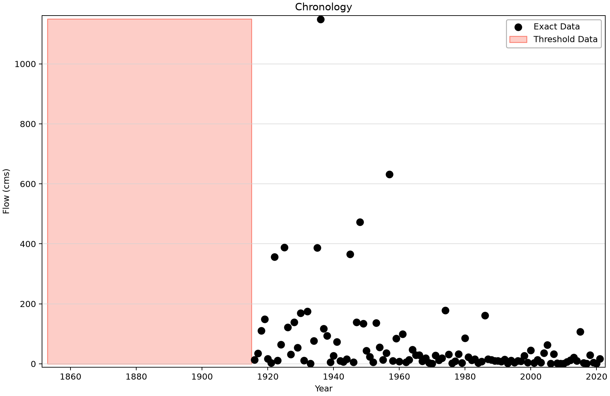
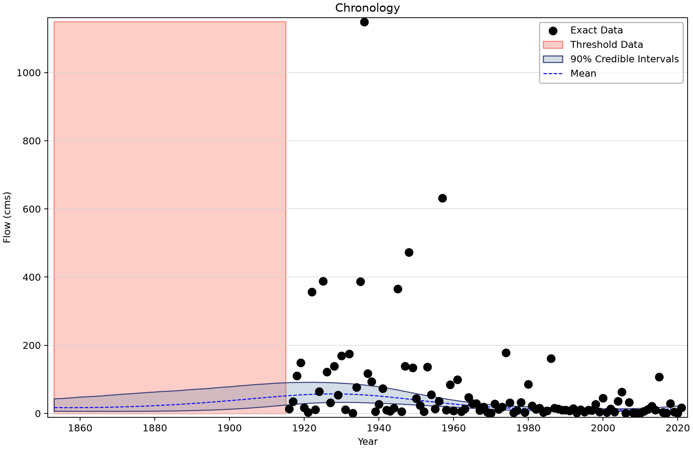
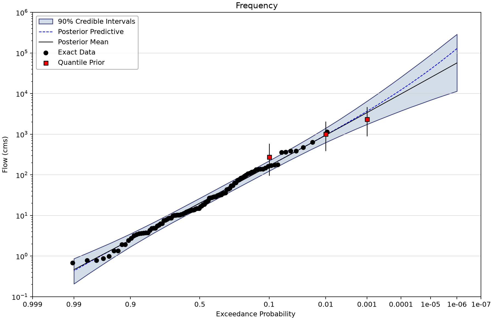
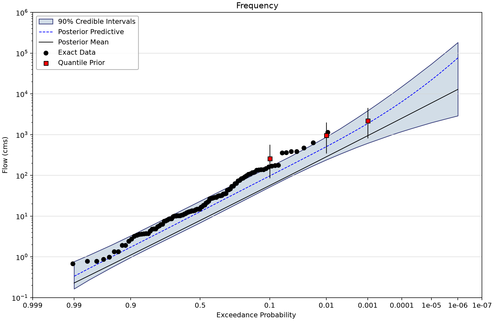
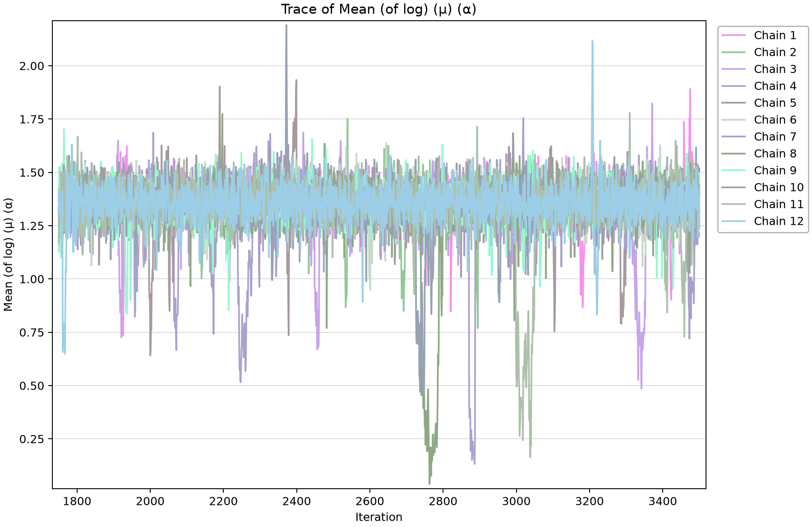

# OC Fisher Dam: trend assumptions and quantile priors

Open [nsffa-oc-fisher-dam.bestfit](nsffa-oc-fisher-dam.bestfit) and save a working copy. Five saved LP3 fits compare a stationary model with constant, linear, step and sinusoidal mean-of-log-flow trends. The example also shows why prior differences and incomplete outputs must be checked before interpreting a comparison.

## Inspect the evidence

| Input element | Meaning | Exact rows and index span | Other saved input rows |
| --- | --- | --- | --- |
| OC Fisher Inflows | OC Fisher inflow record in m³/s: 106 exact annual values, 1916–2021, plus a 1,150 m³/s threshold during 1853–1915 with 62 nonexceedances and one additional undated exceedance. Inflow duration and study/prior provenance need confirmation. | 106 (1916–2021) | Uncertain: 0; intervals: 0; windows: 1; low flags: 0. |

The historical window has one aggregate exceedance whose year is not supplied. Do not invent a dated historical flood or add it to the count twice. The accompanying README mentions an ANCOLD approach but does not identify a complete citation. The exact study/report, inflow duration, threshold evidence and quantile-prior derivation remain required references.

## Work through the alternatives

1. Inspect OC Fisher Inflows, including the historical threshold and its below/above counts.
2. Open SFFA and inspect its quantile priors. Then open NSFFA - Constant and compare those priors before comparing curves: these are not otherwise identical cases.
3. Inspect the mean-of-log-flow trends in the four NSFFA analyses. The standard deviation and skew of log flow remain constant.
4. Read each conditional frequency plot at its saved evaluation index, **2021**. SFFA is stationary and has no time conditioning.
5. Inspect the sinusoidal trace and all parameter diagnostics. Its saved frequency coefficient is about 0.0064835 cycles/year, a period of roughly 154 years. It is not an annual seasonal cycle.
6. Inspect the configured model-average components, but do not expect a saved composite curve: **its AnalysisResults cell is empty**. The individual fits below remain available.

| Alternative | Parameter trend types in model order | Trend start index | Evaluation index |
| --- | --- | --- | --- |
| SFFA | Constant / Constant / Constant | 1853 | 0 |
| NSFFA - Constant | Constant / Constant / Constant | 1853 | 2021 |
| NSFFA - Linear Trend | Linear / Constant / Constant | 1853 | 2021 |
| NSFFA - Step Function | StepFunction / Constant / Constant | 1853 | 2021 |
| NSFFA - Sinusoidal Trend | Sinusoidal / Constant / Constant | 1853 | 2021 |

## Quantile-prior assumptions

All five fits enable LnNormal priors at the same AEPs. These parameters are the prior distribution's natural-space mean and standard deviation in m³/s, not log-space parameters.

| AEP | SFFA prior mean | NSFFA prior mean | Prior SD for both |
| --- | --- | --- | --- |
| 0.1 | 275 | 261 | 164 |
| 0.01 | 1014 | 963 | 550 |
| 0.001 | 2330 | 2214 | 1252 |

The source of the prior information, its dependence across quantiles and the reason for the two sets of means must be justified independently. Do not attribute the entire SFFA/NSFFA difference to trend structure.

## Saved individual results

All listed Bayesian fits retain DEMCzs, seed 12345, posterior-mean point parameters and 90% credible intervals. The table shows the saved chain count, thinning interval and output length. Draw count is not effective sample size (ESS). Read warmup, iteration settings and every parameter prior in the saved properties before copying a model.

R-hat near one and adequate ESS are useful screening evidence, not proof of convergence or model adequacy. Inspect every parameter's trace and autocorrelation, then check the stability of the tail quantities needed for the study. No saved results were rerun for these figures.
| Saved alternative | Chains / thinning / draws | DIC | 1% AEP point | 90% credible limits | Max R-hat | Min ESS |
| --- | --- | --- | --- | --- | --- | --- |
| SFFA | 6/30/10000 | 1,051.796 | 944.552 | 624.787–1,408.868 | 1.00020 | 9,545 |
| NSFFA - Constant | 6/30/10000 | 1,051.838 | 933.205 | 619.449–1,396.259 | 1.00050 | 9,373 |
| NSFFA - Linear Trend | 8/40/10000 | 1,034.034 | 401.6 | 209.852–747.362 | 1.00032 | 9,796 |
| NSFFA - Step Function | 10/50/10000 | 1,029.198 | 426.637 | 235.543–767.055 | 1.00026 | 5,935 |
| NSFFA - Sinusoidal Trend | 12/60/10000 | 1,022.595 | 286.469 | 240.879–879.679 | 1.00426 | 553 |

Values are m³/s; the nonstationary quantiles are conditional on 2021. The sinusoidal fit retains a minimum ESS near 553 and maximum R-hat 1.00426. These diagnostics deserve attention before using its tail estimate. The configured model average contains Linear, Sinusoidal and Step only, with DIC weights 0.003153451, 0.961453939 and 0.035392610. There is no calculated composite result to display, and an unestimated wrapper's DIC=0 is not a model-selection result.

All saved nonstationary models set Alpha = 0.5. Their Chronology curve is the **50% AEP return level (the conditional median)** and its posterior uncertainty; the band does not contain 90% of annual observations. Frequency plots instead show a range of AEPs at the specified evaluation index. Black observation plotting positions describe the full record, not a sample drawn only under the selected evaluation-index condition.

## Read the figures

*Systematic inflows and historical perception information; no event year is invented for the aggregate exceedance.* [SVG](images/nsffa-oc-fisher-dam-historical-chronology.svg) · [Plot data](images/nsffa-oc-fisher-dam-historical-chronology.plotspec.json.gz)

*Saved long-period sinusoidal trend through the inflow record.* [SVG](images/nsffa-oc-fisher-dam-sinusoidal-chronology.svg) · [Plot data](images/nsffa-oc-fisher-dam-sinusoidal-chronology.plotspec.json.gz)

*Stationary LP3 frequency curve and its enabled quantile priors.* [SVG](images/nsffa-oc-fisher-dam-stationary-priors.svg) · [Plot data](images/nsffa-oc-fisher-dam-stationary-priors.plotspec.json.gz)

*Conditional LP3 frequency at 2021 under the sinusoidal model.* [SVG](images/nsffa-oc-fisher-dam-sinusoidal-frequency.svg) · [Plot data](images/nsffa-oc-fisher-dam-sinusoidal-frequency.plotspec.json.gz)

*Saved first-parameter trace for the sinusoidal fit; inspect the other parameters in the app as well.* [SVG](images/nsffa-oc-fisher-dam-sinusoidal-trace.svg) · [Plot data](images/nsffa-oc-fisher-dam-sinusoidal-trace.plotspec.json.gz)

## Interpretation

A long-period fitted oscillation over a limited record does not establish a repeatable physical cycle. Require independent evidence for its mechanism and extrapolation. The missing composite output and unresolved prior sources are recorded for the project author; no output has been filled or replaced.

## Reproduce and check your understanding

The shared Python renderer uses BestFit desktop plot coordinates from a disposable copy of the saved project. See the [figure-generation instructions](../../../README.md#reproducing-the-figures); use this tutorial's filename stem with `--only`. Each figure includes an SVG and compressed PlotSpec containing its source identity and displayed values.

Before using a result in a study, explain the target variable, the represented observation period, the information added through thresholds or priors, and what the plotted interval means. Separate a teaching example's saved settings from a justified engineering choice for another site.
