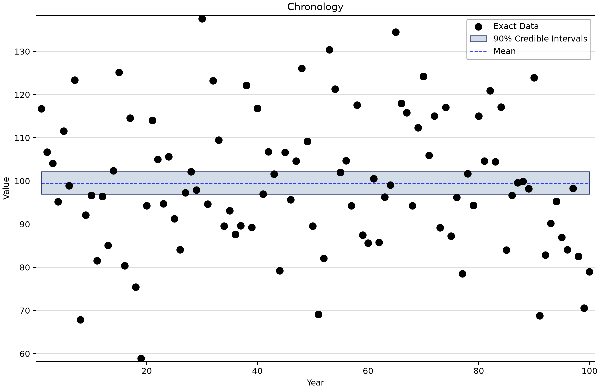
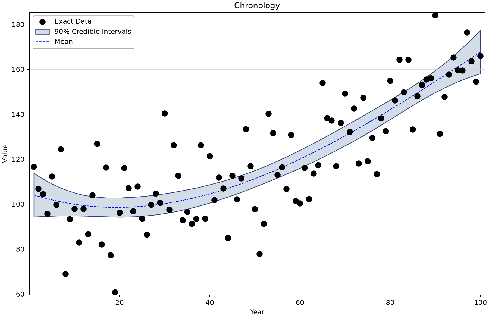
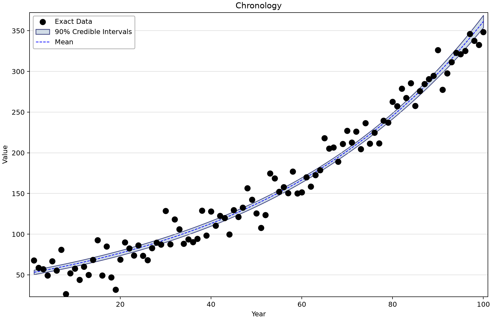
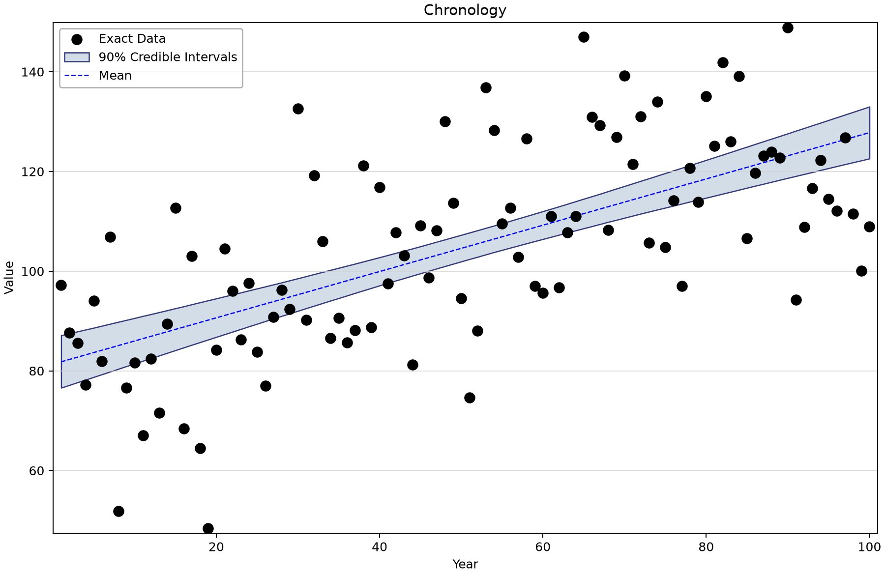
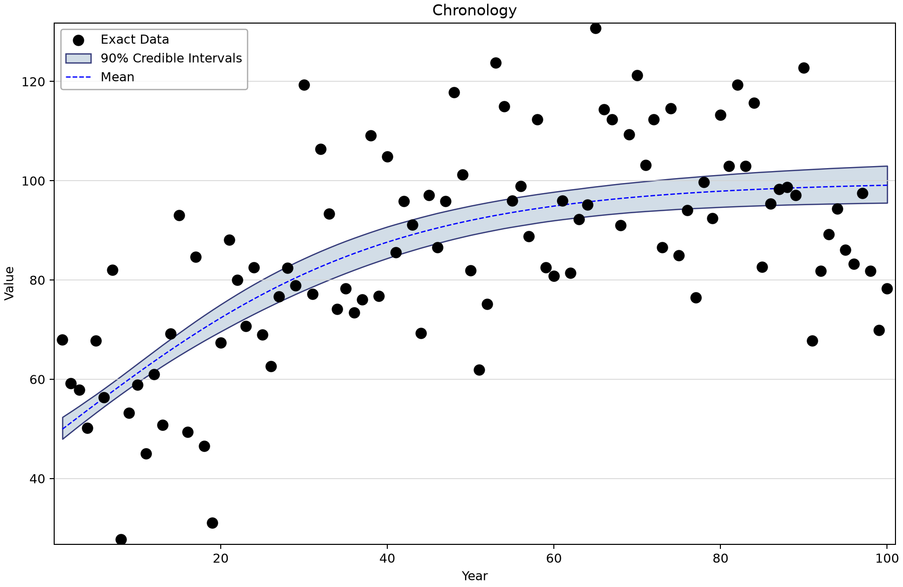
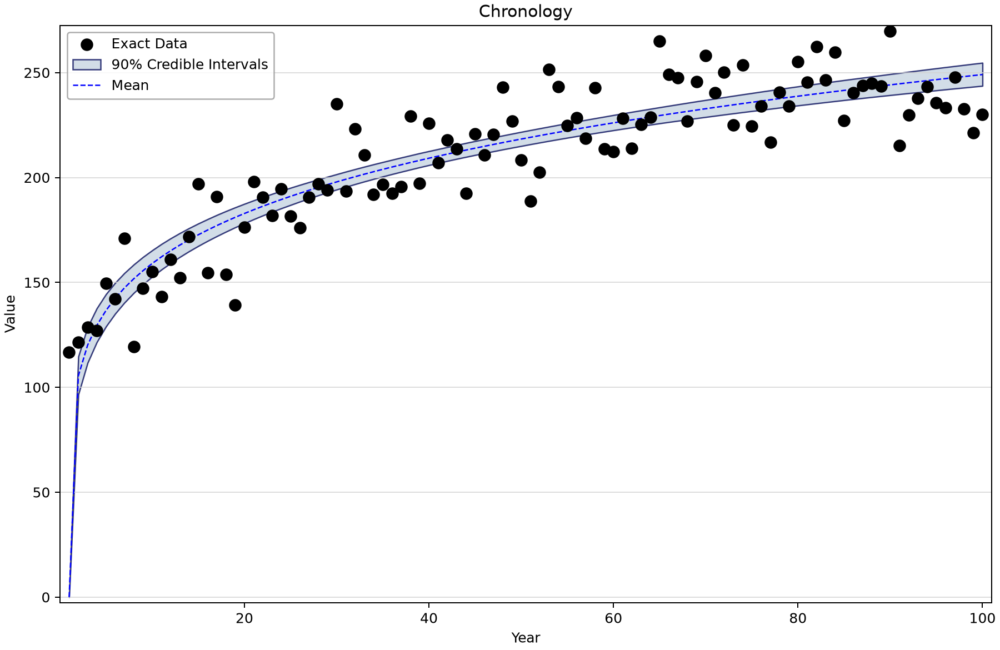
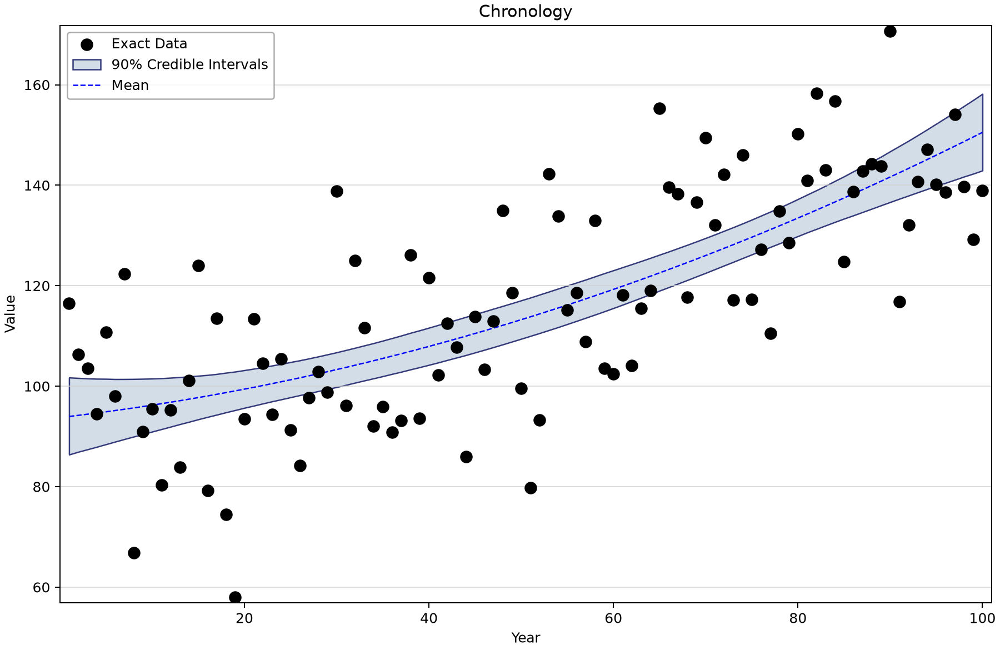
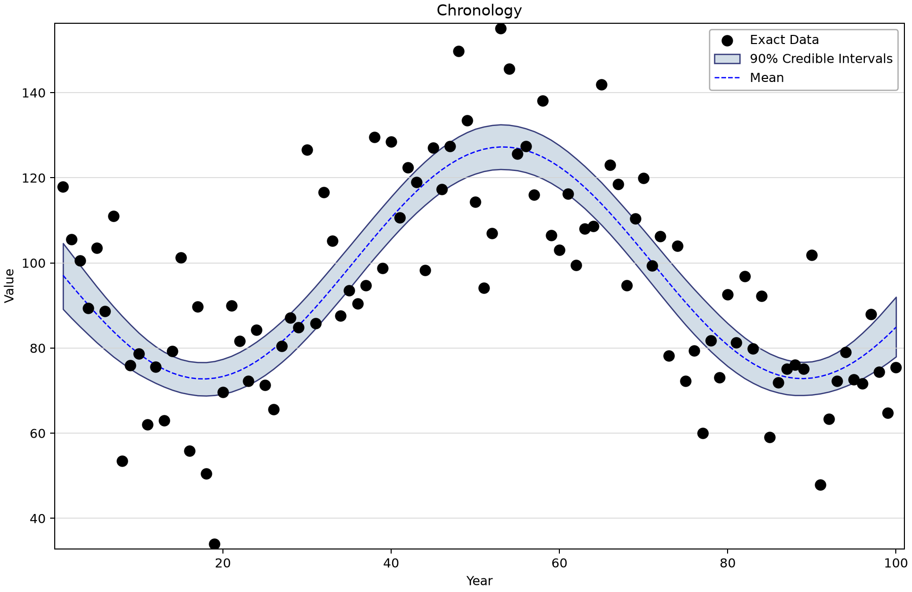
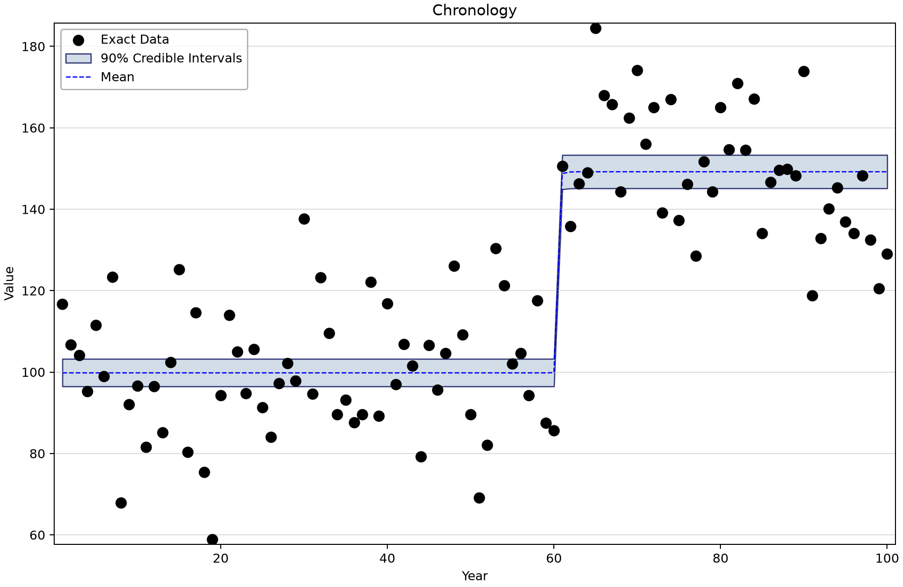
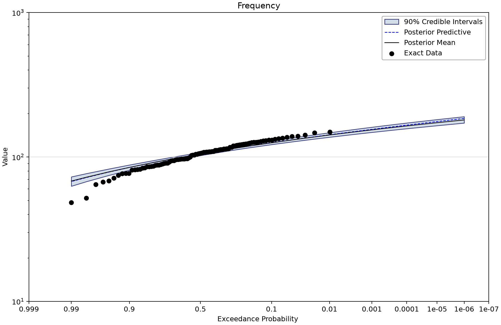

# Synthetic data: recognizing nonstationary trend shapes

Open [nsffa-synthetic-data.bestfit](nsffa-synthetic-data.bestfit) and save a working copy. Nine separate datasets illustrate how a mean function changes a **Normal** distribution through an index. The saved models are not LP3 fits, despite older descriptions in this collection.

## Data and model scope

Each input contains 100 exact values at indexes 1–100, with generic Value units, no uncertain observations, no intervals or thresholds, and no flagged low outliers. A plot axis labeled Year does not establish real calendar dates. Each trend has its own dataset; these are not nine candidate fits to one common observation vector.

The supplied [Synthetic Test Data workbook](Synthetic%20Test%20Data.xlsx) is the place to establish the generator and its known parameters. The figures here describe saved fits only. A fitted curve that resembles the data is not evidence of numerical recovery of the generator.

## Work through the example

1. Select Constant Trend Data and its NSFFA analysis. Identify the observations and fitted time-varying quantiles in Chronology.
2. Repeat for linear, quadratic and cubic trends, then exponential, power and logistic trends. Look for the different shapes rather than interpreting the index as a site history.
3. Compare Sinusoidal and Step Function. The saved sinusoidal frequency is approximately 0.0140238 cycles per index unit, not an annual cycle.
4. Read Frequency at the saved index **51**. This is a slice through the time-varying distribution, not the distribution of all 100 values pooled together.
5. Inspect priors and MCMC diagnostics. There is no model-average element to select and no meaningful cross-dataset DIC ranking of these nine fits.

| Alternative | Parameter trend types in model order | Trend start index | Evaluation index |
| --- | --- | --- | --- |
| NSFFA - Constant Trend | Constant / Constant | 1 | 51 |
| NSFFA - Cubic Trend | Cubic / Constant | 1 | 51 |
| NSFFA - Exponential Trend | Exponential / Constant | 1 | 51 |
| NSFFA - Linear Trend | Linear / Constant | 1 | 51 |
| NSFFA - Logistic Trend | Logistic / Constant | 1 | 51 |
| NSFFA - Power Trend | Power / Constant | 1 | 51 |
| NSFFA - Quadratic Trend | Quadratic / Constant | 1 | 51 |
| NSFFA - Sinusoidal Trend | Sinusoidal / Constant | 1 | 51 |
| NSFFA - Step Function | StepFunction / Constant | 1 | 51 |

The trend triplet used by LP3 does not apply here: Normal has two parameters, mean and standard deviation. Each model varies the mean using the named function and keeps standard deviation constant. No quantile priors are enabled.

## Saved conditional results

All listed Bayesian fits retain DEMCzs, seed 12345, posterior-mean point parameters and 90% credible intervals. The table shows the saved chain count, thinning interval and output length. Draw count is not effective sample size (ESS). Read warmup, iteration settings and every parameter prior in the saved properties before copying a model.

R-hat near one and adequate ESS are useful screening evidence, not proof of convergence or model adequacy. Inspect every parameter's trace and autocorrelation, then check the stability of the tail quantities needed for the study. No saved results were rerun for these figures.
| Saved alternative | Chains / thinning / draws | DIC | 1% AEP point | 90% credible limits | Max R-hat | Min ESS |
| --- | --- | --- | --- | --- | --- | --- |
| NSFFA - Constant Trend | 4/20/10000 | 837.739 | 136.38 | 131.593–141.608 | 0.99979 | 9,148 |
| NSFFA - Cubic Trend | 10/50/10000 | 831.867 | 147.297 | 142.032–153.179 | 1.00004 | 9,028 |
| NSFFA - Exponential Trend | 6/30/10000 | 836.514 | 176.446 | 171.427–181.93 | 1.00019 | 9,296 |
| NSFFA - Linear Trend | 6/30/10000 | 839.377 | 141.964 | 137.165–147.315 | 1.00040 | 9,625 |
| NSFFA - Logistic Trend | 6/30/10000 | 838.575 | 129.566 | 124.427–134.66 | 1.00001 | 9,167 |
| NSFFA - Power Trend | 6/30/10000 | 883.869 | 265.622 | 259.279–272.123 | 1.00029 | 9,629 |
| NSFFA - Quadratic Trend | 8/40/10000 | 836.951 | 150.104 | 144.569–156.122 | 1.00004 | 8,762 |
| NSFFA - Sinusoidal Trend | 10/50/10000 | 835.068 | 162.661 | 156.151–169.633 | 1.00020 | 9,230 |
| NSFFA - Step Function | 8/40/10000 | 839.985 | 136.883 | 131.574–142.89 | 1.00008 | 8,721 |

Values are in generic units at index 51. DIC is shown to identify the stored reports, not to rank fits to different datasets. All listed minimum ESS values exceed 8,700; that is diagnostic evidence, not a generator-recovery validation.

All saved nonstationary models set Alpha = 0.5. Their Chronology curve is the **50% AEP return level (the conditional median)** and its posterior uncertainty; the band does not contain 90% of annual observations. Frequency plots instead show a range of AEPs at the specified evaluation index. Black observation plotting positions describe the full record, not a sample drawn only under the selected evaluation-index condition.

## Compare the nine chronology plots

*NSFFA - Constant Trend: its own synthetic observations and fitted time-varying quantiles.* [SVG](images/nsffa-synthetic-data-constant-trend.svg) · [Plot data](images/nsffa-synthetic-data-constant-trend.plotspec.json.gz)

*NSFFA - Cubic Trend: its own synthetic observations and fitted time-varying quantiles.* [SVG](images/nsffa-synthetic-data-cubic-trend.svg) · [Plot data](images/nsffa-synthetic-data-cubic-trend.plotspec.json.gz)

*NSFFA - Exponential Trend: its own synthetic observations and fitted time-varying quantiles.* [SVG](images/nsffa-synthetic-data-exponential-trend.svg) · [Plot data](images/nsffa-synthetic-data-exponential-trend.plotspec.json.gz)

*NSFFA - Linear Trend: its own synthetic observations and fitted time-varying quantiles.* [SVG](images/nsffa-synthetic-data-linear-trend.svg) · [Plot data](images/nsffa-synthetic-data-linear-trend.plotspec.json.gz)

*NSFFA - Logistic Trend: its own synthetic observations and fitted time-varying quantiles.* [SVG](images/nsffa-synthetic-data-logistic-trend.svg) · [Plot data](images/nsffa-synthetic-data-logistic-trend.plotspec.json.gz)

*NSFFA - Power Trend: its own synthetic observations and fitted time-varying quantiles.* [SVG](images/nsffa-synthetic-data-power-trend.svg) · [Plot data](images/nsffa-synthetic-data-power-trend.plotspec.json.gz)

*NSFFA - Quadratic Trend: its own synthetic observations and fitted time-varying quantiles.* [SVG](images/nsffa-synthetic-data-quadratic-trend.svg) · [Plot data](images/nsffa-synthetic-data-quadratic-trend.plotspec.json.gz)

*NSFFA - Sinusoidal Trend: its own synthetic observations and fitted time-varying quantiles.* [SVG](images/nsffa-synthetic-data-sinusoidal-trend.svg) · [Plot data](images/nsffa-synthetic-data-sinusoidal-trend.plotspec.json.gz)

*NSFFA - Step Function: its own synthetic observations and fitted time-varying quantiles.* [SVG](images/nsffa-synthetic-data-step-function.svg) · [Plot data](images/nsffa-synthetic-data-step-function.plotspec.json.gz)

*Linear-trend Normal distribution conditional on index 51, with saved uncertainty.* [SVG](images/nsffa-synthetic-data-index-51-frequency.svg) · [Plot data](images/nsffa-synthetic-data-index-51-frequency.plotspec.json.gz)

## Reproduce and check your understanding

The shared Python renderer uses BestFit desktop plot coordinates from a disposable copy of the saved project. See the [figure-generation instructions](../../../README.md#reproducing-the-figures); use this tutorial's filename stem with `--only`. Each figure includes an SVG and compressed PlotSpec containing its source identity and displayed values.

Before using a result in a study, explain the target variable, the represented observation period, the information added through thresholds or priors, and what the plotted interval means. Separate a teaching example's saved settings from a justified engineering choice for another site.
