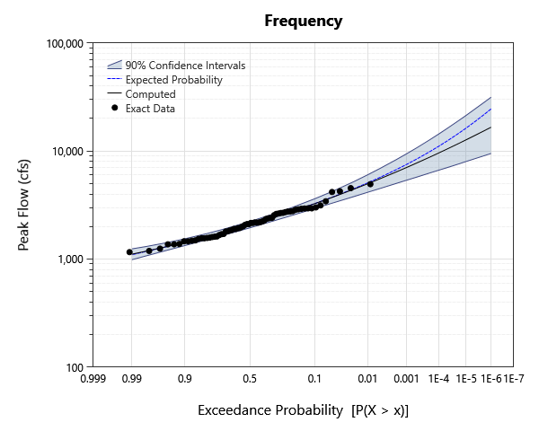
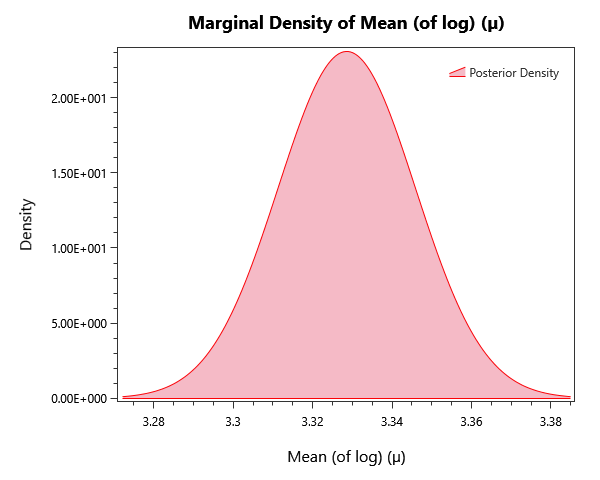

# Bulletin-17C-examples

## Overview

B17C-method fits of the seven Bulletin 17C example datasets, including both multivariate-normal (MVN) quantile confidence intervals and bias-corrected bootstrap (BCB) intervals. Companion to bulletin-17c-bayesian-examples.

## What's Inside

### Input Data

| Element | Description |
|---|---|
| `Example #1 - Data` | Systematic Record – Moose River at Victory, VT |
| `Example #2 - Data` | Analysis with Low Outliers – Orestimba Creek near Newman, CA |
| `Example #3 - Data` | Broken Record – Back Creek near Jones Springs, WV.  Manual threshold value is used to match PeakFQ because PeakFQ treated historical data and systematic data differently, even though both were exact data types. The 1936 flood is coded as historical in PeakFQ even though it is entered as exact data. |
| `Example #4 - Data` | Historical Data — Arkansas River at Pueblo, CO (Bulletin 17C Example #4). |
| `Example #5 - Data` | Crest Stage Gage Censored Data – Bear Creek at Ottumwa, IA.  Manual threshold is used to match PeakFQ, which uses different data types. In PeakFQ several systematic values are coded with lower bound = 0, which results in different data being used in the MGBT test. |
| `Example #6 - Data` | Historic Data and Low Outliers – Santa Cruz River at Lochiel, AZ |
| `Example #7 - Data` | Paleoflood Record Example – American River at Fair Oaks, California |

### Bulletin 17C

| Element | Description |
|---|---|
| `Example #1` | B17C fit of Example #1 (Moose River systematic record) using MVN quantile confidence intervals. |
| `Example #2` | B17C fit of Example #2 (Orestimba Creek with low outliers) using MVN quantile confidence intervals. |
| `Example #3` | B17C fit of Example #3 (Back Creek broken record) using MVN quantile confidence intervals. |
| `Example #4` | B17C fit of Example #4 (Arkansas River with historical data) using MVN quantile confidence intervals. |
| `Example #5` | B17C fit of Example #5 (Bear Creek crest-stage censored data) using MVN quantile confidence intervals. |
| `Example #6` | B17C fit of Example #6 (Santa Cruz River with historic data and low outliers) using MVN quantile confidence intervals. |
| `Example #7` | B17C fit of Example #7 (American River paleoflood record) using MVN quantile confidence intervals. |
| `Example #1 - BCB` | B17C fit of Example #1 using bias-corrected bootstrap (BCB) confidence intervals. |
| `Example #2 - BCB` | B17C fit of Example #2 using bias-corrected bootstrap (BCB) confidence intervals. |
| `Example #3 - BCB` | B17C fit of Example #3 using bias-corrected bootstrap (BCB) confidence intervals. |
| `Example #4 - BCB` | B17C fit of Example #4 using bias-corrected bootstrap (BCB) confidence intervals. |
| `Example #5 - BCB` | B17C fit of Example #5 using bias-corrected bootstrap (BCB) confidence intervals. |
| `Example #6 - BCB` | B17C fit of Example #6 using bias-corrected bootstrap (BCB) confidence intervals. |
| `Example #7 - BCB` | B17C fit of Example #7 using bias-corrected bootstrap (BCB) confidence intervals. |

## Step-by-Step Walkthrough

### Opening the Project

1. Open RMC-BestFit 2.0.
2. Select **File > Open** and navigate to `examples/4-univariate-distribution-analysis/2-bulletin-17C-analysis/1-bulletin17C-examples/`.
3. Open `bulletin-17c-examples.bestfit`.

### Exploring the Elements
For each B17C analysis:

1. Click the alternative in the Project Explorer.
2. Open the **Frequency** tab — the central LP-III curve plus the chosen confidence intervals are shown.
3. Switch the confidence-interval type in the **Properties** panel under Options between **MVN** and **BCB** (Bias-Corrected Bootstrap) to compare.

## Expected Results
Below are the expected results for B17C Analysis labeled "Example 1"; this should be the first analysis in the list.
Be sure to explore all of the analyses provided!

### Parameter Estimates
The parameter estimates are found under the **GMM Report** tab to the left as parameter summary statistics.

| Parameter | Mean | Std Dev | 5% | Median | 95% |
|---|---|---|---|---|---|---|---|
| Mean (of log) (µ) | 3.32859 | 0.0170513 | 3.30056 | 3.32859 | 3.35661 | 
| Std Dev (of log) (σ) | 0.140591 | 0.0124871 | 0.120003 | 0.140536 | 0.161152 | 
| Skew (of log) (γ) | 0.422345 | 0.214745 | 0.0703177 | 0.422267 | 0.774578 | 

### Frequency / Quantile Table
While in the **Distribution Results** tab to the left, select Tabular Results to see the frequency plot's value at each return level probability,

| Probability | 95.0% CI | 5.0% CI | Expected Probability | Computed |
|---|---|---|---|---|
| 1E-06 | 31536.45476960882 | 9504.478431532647 | 24554.49950471727 | 16637.381290694262 | 
| 2E-06 | 28149.802168541166 | 9040.75064415998 | 21698.320005194113 | 15373.041485536076 | 
| 5E-06 | 24160.94198954819 | 8453.443850597601 | 18465.22493642291 | 13822.796830244182 | 
| 1E-05 | 21455.61220838344 | 8018.426746788033 | 16368.642332507934 | 12735.491236413278 | 
| 2E-05 | 19059.420515419384 | 7584.834601256706 | 14529.108611032698 | 11716.700271971204 | 
| 5E-05 | 16227.689492312738 | 7036.676121218768 | 12431.682956323782 | 10467.780043029716 | 
| 0.0001 | 14352.979242152784 | 6646.968110248417 | 11061.167218506842 | 9591.790229464237 | 
| 0.0002 | 12681.090740368469 | 6260.81983404009 | 9849.412895354815 | 8770.75246602347 | 
| 0.0005 | 10739.197536045618 | 5748.645545945168 | 8454.21602532957 | 7763.446819612117 | 
| 0.001 | 9456.728000321902 | 5377.2843046125 | 7532.75915104478 | 7055.894046242264 | 
| 0.002 | 8302.127673152962 | 5008.506131955913 | 6707.646530666868 | 6391.361951623581 | 
| 0.005 | 6950.922731163299 | 4521.195397698769 | 5743.428623397382 | 5572.971134836763 | 
| 0.01 | 6048.389460148426 | 4162.263351862811 | 5093.009853602178 | 4994.660836353398 | 
| 0.02 | 5228.424298909672 | 3799.8948635549073 | 4498.148210293506 | 4447.087767122384 | 
| 0.05 | 4270.277948099271 | 3319.851153928296 | 3778.9736925918733 | 3762.259385065009 | 
| 0.1 | 3624.548453911838 | 2945.4644456014116 | 3270.0420861902307 | 3265.250637410281 | 
| 0.2 | 3018.199431766434 | 2549.418823517292 | 2774.225196097636 | 2774.0651594381807 | 
| 0.3 | 2675.8403847879326 | 2299.9841323734913 | 2479.7934268715235 | 2480.5351134262696 | 
| 0.5 | 2227.0001382334076 | 1948.8026579103694 | 2082.108332033603 | 2083.1343664241135 | 
| 0.7 | 1889.0073300093154 | 1662.0699593897555 | 1770.3603956366273 | 1771.433478893447 | 
| 0.8 | 1725.6343417562318 | 1515.1032598389882 | 1614.4240965923188 | 1615.5331366620323 | 
| 0.9 | 1541.3255961148857 | 1335.0431447889257 | 1430.5903005331681 | 1432.0541875729045 | 
| 0.95 | 1417.3600581301248 | 1203.0906894783586 | 1301.5522975174601 | 1304.365272636727 | 
| 0.98 | 1305.492656087999 | 1068.6123887847205 | 1174.5910966211009 | 1181.8601363704101 | 
| 0.99 | 1243.1832472499386 | 986.9285193815624 | 1097.7448455996291 | 1110.7760005372197 | 

### Plots
There are also plenty of plots to explore our results with. Under the **Distribution Results** tab we have a frequency curve.

*Figure 1: Frequency curve (AEP versus quantile), with the credible band.*

The **Kernal Density** tab shows an estimate for the pdf of each parameter.

*Figure 2: Posterior kernel density for mean parameter (µ).*

## Next Steps

- Compare MVN-quantile and bias-corrected bootstrap (BCB) confidence intervals on the same dataset.
- Re-run on the same input data using the **Bayesian Univariate** workflow and compare AEPs and confidence intervals.
- Add a **regional skew** weighting if a regional skew estimate is available.
