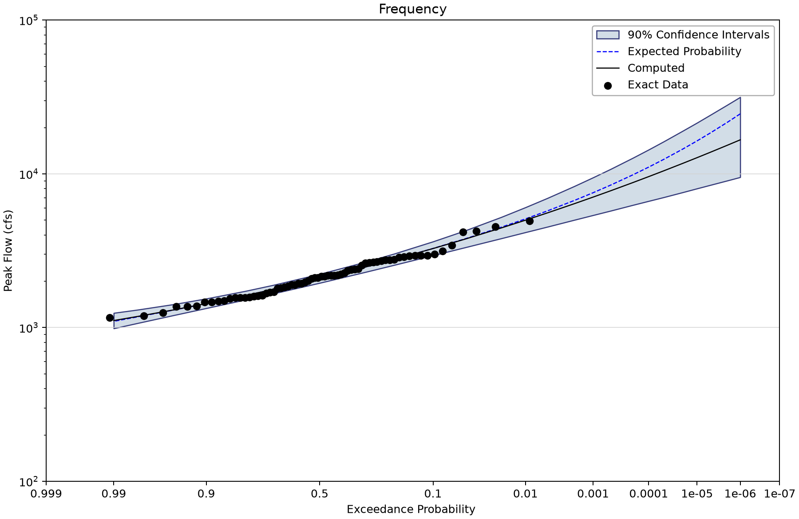
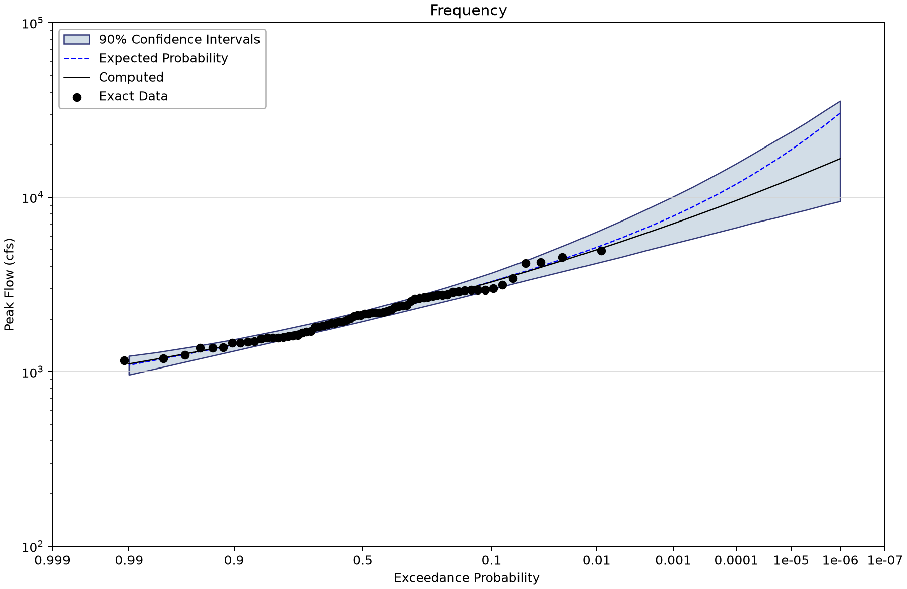
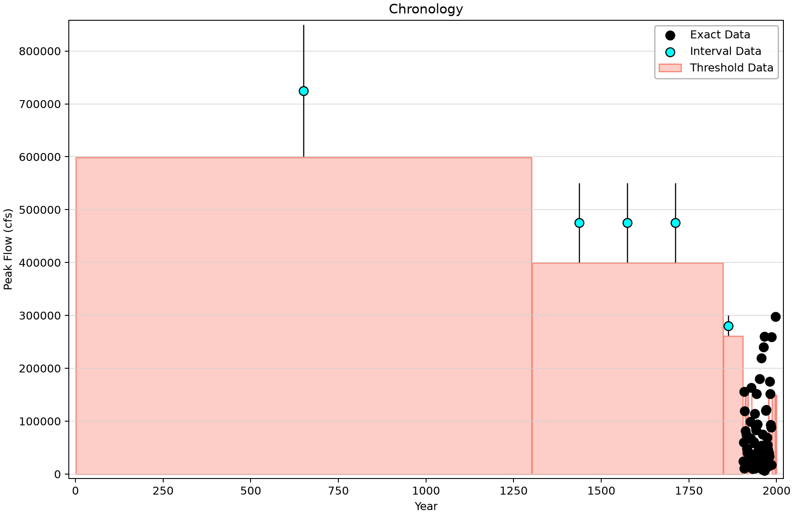
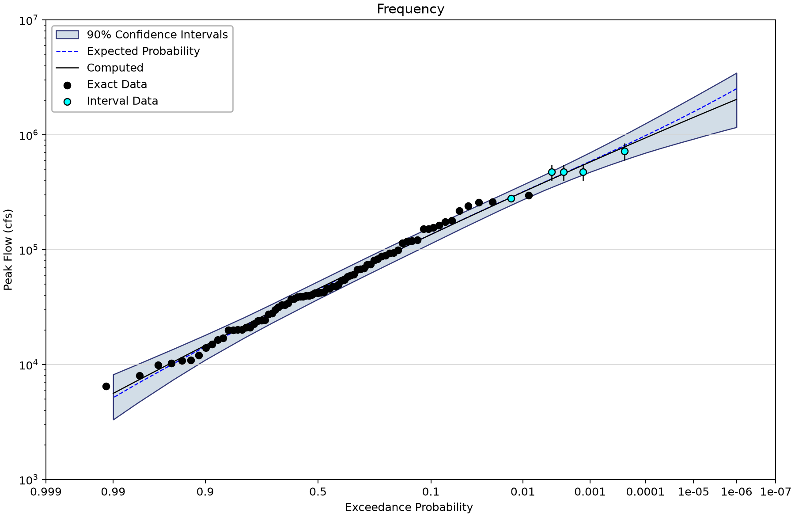
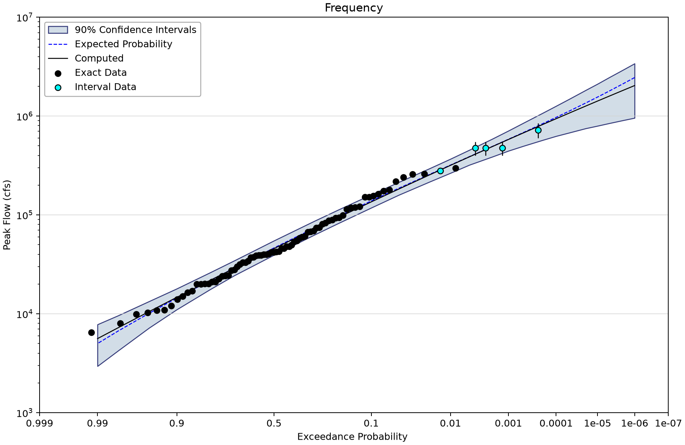
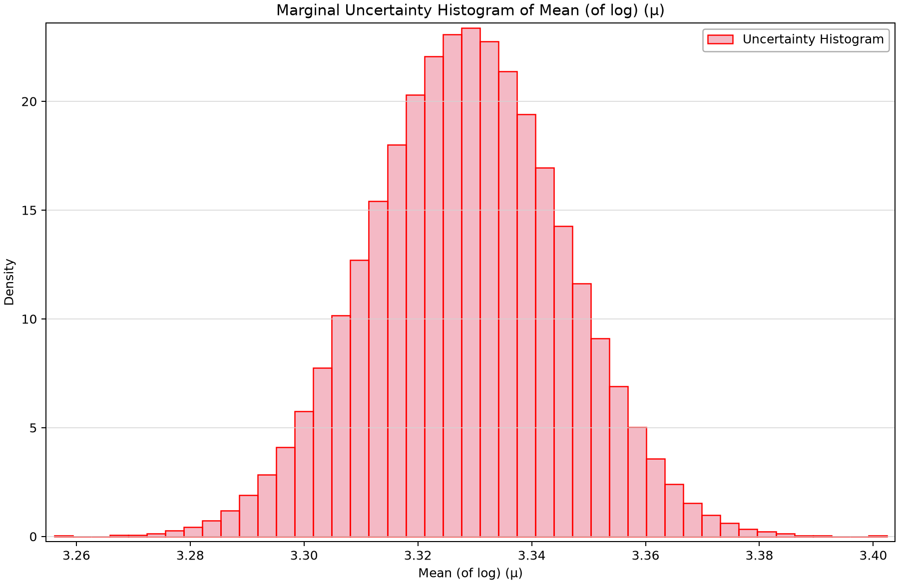

# Bulletin 17C datasets: GMM fits and uncertainty methods

Open [bulletin-17c-examples.bestfit](bulletin-17c-examples.bestfit) in BestFit and save a working copy. This collection pairs two uncertainty calculations for each of seven flood records, allowing you to compare confidence limits while keeping the parent GMM fit fixed.

The computed curve comes from BestFit's Generalized Method of Moments (GMM) LP3 fit. Uncertainty is represented by a frequentist parameter ensemble or bootstrap. These are **confidence limits**, not Bayesian credible limits. Shared storage names such as BayesianAnalysis or ModeCurve do not change that interpretation. Some saved GMM reports also retain the legacy label “Credible Interval”; for these frequentist results, read it as the stated confidence level. This tutorial does not claim that BestFit ran the USGS Expected Moments Algorithm (EMA).

Inspect GMM optimizer status, convergence, the objective and uncertainty diagnostics before interpreting a curve. R-hat, chain mixing and posterior ESS are not acceptance measures for these GMM ensembles. An empty or NaN diagnostic means it is unavailable or inapplicable, not zero.
## Data and source representation

[Bulletin 17C, USGS Techniques and Methods 4–B5](https://doi.org/10.3133/tm4B5) is the primary reference for the worked datasets and flow-interval/perception-threshold concepts. The [repository verification chapter](../../../../docs/verification/report/data-distributions-b17c.md) explains the source-backed comparison scope. The tables here report saved project results; they are not a newly executed verification study.

| Input element | Meaning | Exact rows and index span | Other saved input rows |
| --- | --- | --- | --- |
| Example #1 - Data | Systematic Record – Moose River at Victory, VT Saved input magnitudes are in cfs; retain the documented manual screening and perception assumptions. | 68 (1947–2014) | Uncertain: 0; intervals: 0; windows: 0; low flags: 0. |
| Example #2 - Data | Analysis with Low Outliers – Orestimba Creek near Newman, CA Saved input magnitudes are in cfs; retain the documented manual screening and perception assumptions. | 82 (1932–2013) | Uncertain: 0; intervals: 0; windows: 0; low flags: 30. |
| Example #3 - Data | Broken Record – Back Creek near Jones Springs, WV.  Manual threshold value is used to match PeakFQ because PeakFQ treated historical data and systematic data differently, even though both were exact data types. The 1936 flood is coded as historical in PeakFQ even though it is entered as exact data. Saved input magnitudes are in cfs; retain the documented manual screening and perception assumptions. | 56 (1929–2012) | Uncertain: 0; intervals: 0; windows: 3; low flags: 2. |
| Example #4 - Data | Historical Data — Arkansas River at Pueblo, CO (Bulletin 17C Example #4). Saved input magnitudes are in cfs; retain the documented manual screening and perception assumptions. | 81 (1895–1976) | Uncertain: 0; intervals: 4; windows: 4; low flags: 0. |
| Example #5 - Data | Crest Stage Gage Censored Data – Bear Creek at Ottumwa, IA.  Manual threshold is used to match PeakFQ, which uses different data types. In PeakFQ several systematic values are coded with lower bound = 0, which results in different data being used in the MGBT test. Saved input magnitudes are in cfs; retain the documented manual screening and perception assumptions. | 50 (1965–2014) | Uncertain: 0; intervals: 0; windows: 9; low flags: 9. |
| Example #6 - Data | Historic Data and Low Outliers – Santa Cruz River at Lochiel, AZ Saved input magnitudes are in cfs; retain the documented manual screening and perception assumptions. | 65 (1949–2013) | Uncertain: 0; intervals: 0; windows: 1; low flags: 10. |
| Example #7 - Data | Paleoflood Record Example – American River at Fair Oaks, California Saved input magnitudes are in cfs; retain the documented manual screening and perception assumptions. | 77 (1905–1997) | Uncertain: 0; intervals: 5; windows: 10; low flags: 0. |

The exact-row count includes flagged low observations. The index span can include gaps and does not count historical exposure. Example 3 and Example 5 retain deliberately manual low-outlier thresholds from the comparison setup: Back Creek's 1936 historical coding and Bear Creek's crest-stage bounds affect which cohort is screened in the reference representation. Read that provenance rather than silently rerunning MGBT with a different sample.

## Work through the comparison

1. Select Example #1 - Data (Moose River), then Example #1. Inspect the 68 peaks, LP3 parameters and computed frequency curve.
2. Open its regional-skew penalty: mean 0.44 and mean squared error (MSE) 0.078. MSE is a variance-like uncertainty quantity, not a standard deviation. Other examples have no enabled penalties.
3. Compare Example #1 with Example #1 - BCB. The parent computed curve is the same; the uncertainty construction and retained ensemble size differ.
4. Repeat with Example #7 and its BCB copy after inspecting the American River historical intervals and perception windows. The long exposure is not a long instrumental record.
5. Read the GMM report, including bootstrap attempted/retained counts, retries, substitutions, optimizer fallbacks and clipping. A full output ensemble does not imply that every internal optimization attempt succeeded.

## Saved configuration and results

All fourteen parent fits retain iterative GMM, BFGS, maximum 100 GMM iterations and absolute/relative tolerances of 1e-8. The stored parent fits report Success and convergence within tolerance. Seed 12345 and 90% interval width are retained. Examples 1–2 use natural-space MultivariateNormal; Examples 3–7 use LinkedMultivariateNormal. Each non-bootstrap ensemble has 10,000 draws; each BCB ensemble has 1,000.

| Analysis | Uncertainty method | Draws | Saved optimizer status | 1% AEP computed | 90% confidence limits |
| --- | --- | --- | --- | --- | --- |
| Example #1 | MultivariateNormal | 10000 | Success | 4,994.651 | 4,162.258–6,048.374 |
| Example #2 | MultivariateNormal | 10000 | Success | 13,823.815 | 9,276.134–17,912.057 |
| Example #3 | LinkedMultivariateNormal | 10000 | Success | 22,479.428 | 17,626.626–32,717.991 |
| Example #4 | LinkedMultivariateNormal | 10000 | Success | 39,780.299 | 29,087.21–68,407.592 |
| Example #5 | LinkedMultivariateNormal | 10000 | Success | 4,585.886 | 3,819.165–5,315.172 |
| Example #6 | LinkedMultivariateNormal | 10000 | Success | 10,973.628 | 7,139.819–17,193.733 |
| Example #7 | LinkedMultivariateNormal | 10000 | Success | 317,458.051 | 272,749.028–366,762.306 |
| Example #1 - BCB | BiasCorrectedBootstrap | 1000 | Success | 4,994.651 | 4,189.959–6,331.611 |
| Example #2 - BCB | BiasCorrectedBootstrap | 1000 | Success | 13,823.815 | 8,735.409–17,720.516 |
| Example #3 - BCB | BiasCorrectedBootstrap | 1000 | Success | 22,479.428 | 17,224.273–35,416.426 |
| Example #4 - BCB | BiasCorrectedBootstrap | 1000 | Success | 39,780.299 | 28,901.371–68,146.434 |
| Example #5 - BCB | BiasCorrectedBootstrap | 1000 | Success | 4,585.886 | 3,638.675–5,328.071 |
| Example #6 - BCB | BiasCorrectedBootstrap | 1000 | Success | 10,973.628 | 6,360.233–18,929.878 |
| Example #7 - BCB | BiasCorrectedBootstrap | 1000 | Success | 317,458.051 | 265,210.604–368,346.588 |

Magnitudes are cfs, rounded from the exact saved 0.01 AEP ordinate. The GMM sample size includes represented exposure where applicable; it is not generally the number of exact peaks.

All seven BCB reports retain 1,000 of 1,000 requested replicates, with zero parent-fit substitutions and zero retries. Their internal optimizer fallback counts still differ:

| BCB example | Optimizer fallbacks | Candidate evaluation-limit statuses | Pivot z-limit clips |
| --- | --- | --- | --- |
| 1 | 77 | 0 | Not reported |
| 2 | 33 | 3 | 5 |
| 3 | 122 | 17 | 12 |
| 4 | 1 | 0 | Not reported |
| 5 | 15 | 0 | 1 |
| 6 | 86 | 16 | 19 |
| 7 | 267 | 42 | 26 |

These are different diagnostic counters. A candidate evaluation-limit status is not a discarded replicate when another candidate supplied its retained solution. Inspect the report before deciding whether an uncertainty result is adequate for the intended use.

## Compare the saved figures

*Moose River GMM curve with natural-space MVN confidence limits.* [SVG](images/bulletin-17c-examples-moose-mvn.svg) · [Plot data](images/bulletin-17c-examples-moose-mvn.plotspec.json.gz)

*Same Moose River parent curve with bias-corrected-bootstrap confidence limits.* [SVG](images/bulletin-17c-examples-moose-bootstrap.svg) · [Plot data](images/bulletin-17c-examples-moose-bootstrap.plotspec.json.gz)

*American River explicit paleoflood intervals and perception windows.* [SVG](images/bulletin-17c-examples-american-chronology.svg) · [Plot data](images/bulletin-17c-examples-american-chronology.plotspec.json.gz)

*American River GMM curve with linked-MVN confidence limits.* [SVG](images/bulletin-17c-examples-american-linked-mvn.svg) · [Plot data](images/bulletin-17c-examples-american-linked-mvn.plotspec.json.gz)

*American River GMM curve with bootstrap confidence limits.* [SVG](images/bulletin-17c-examples-american-bootstrap.svg) · [Plot data](images/bulletin-17c-examples-american-bootstrap.plotspec.json.gz)

*Moose River frequentist parameter-ensemble histogram. The legacy plot selector is named posterior; the draws are not an MCMC posterior.* [SVG](images/bulletin-17c-examples-parameter-ensemble.svg) · [Plot data](images/bulletin-17c-examples-parameter-ensemble.plotspec.json.gz)

## Interpretation and checks

Natural-space MVN, linked-MVN and bootstrap are different uncertainty procedures. Linked-MVN samples in transformed parameter space; it should not be described as the same natural-space sampling with a different label. Compare intervals at the same AEP and examine physical plausibility in the tails.

The [Bayesian companion](../../1-univariate-analysis/3-bulletin17C-examples/bulletin-17c-bayesian-examples.md) illustrates another estimator. A comparison requires matching the actual observations and information terms, not just matching the example number. Explain why a 2,000-year represented record for American River does not mean 2,000 measured annual flows, and why bootstrap diagnostics matter even when all requested draws were retained.

## Reading and reproducing the figures

AEP is annual exceedance probability; 0.01 means 1% per year under the model. Plotting positions summarize observations and are not fitted probabilities. A 90% confidence band describes uncertainty in a flood quantile, not the range containing 90% of future floods.

The shared Python renderer draws coordinates from the saved project's desktop plotting routines. Follow the [figure-generation instructions](../../../README.md#reproducing-the-figures) with the tutorial filename stem as `--only`. No original observations, fitted parameters or uncertainty draws are replaced. The figures retain source hashes and exact display coordinates in their compressed PlotSpec files.
