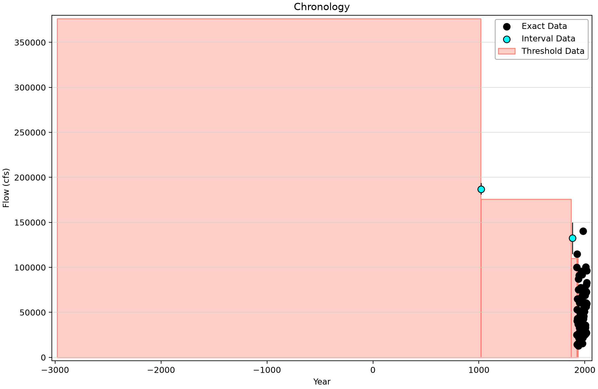
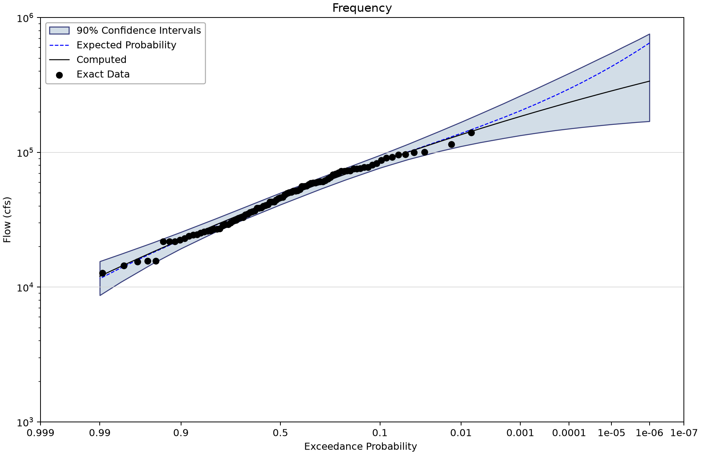
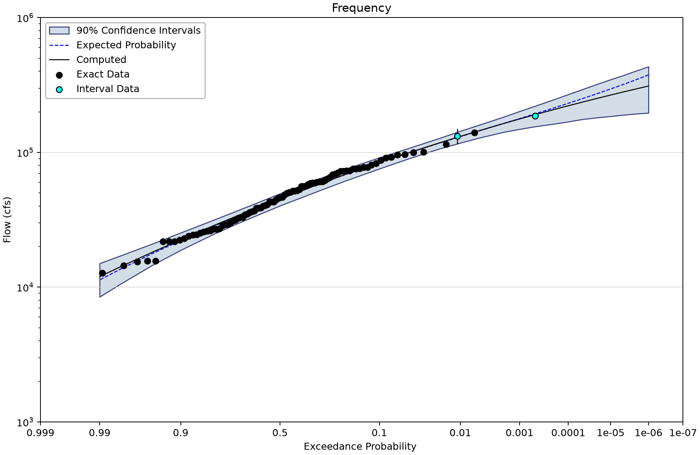
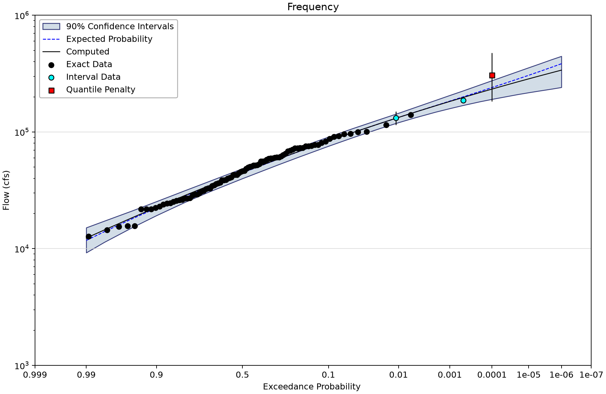

# Blakely Mountain Dam: one-day inflows and information expansion

This tutorial covers both [the imperial project](blakely-mountain-dam-b17c.bestfit) and [the metric Case Study project](Case%20Study/blakely-mountain-dam-b17c-metric.bestfit). Open a working copy. The target variable is annual maximum **one-day inflow**: cfs in the first project and m³/s in the second. Do not substitute a three-day volume-frequency curve from the study report.

The computed curve comes from BestFit's Generalized Method of Moments (GMM) LP3 fit. Uncertainty is represented by a frequentist parameter ensemble or bootstrap. These are **confidence limits**, not Bayesian credible limits. Shared storage names such as BayesianAnalysis or ModeCurve do not change that interpretation. Some saved GMM reports also retain the legacy label “Credible Interval”; for these frequentist results, read it as the stated confidence level. This tutorial does not claim that BestFit ran the USGS Expected Moments Algorithm (EMA).

Inspect GMM optimizer status, convergence, the objective and uncertainty diagnostics before interpreting a curve. R-hat, chain mixing and posterior ESS are not acceptance measures for these GMM ensembles. An empty or NaN diagnostic means it is unavailable or inapplicable, not zero.
## Source evidence and retained assumptions

The supplied [Hydrologic Hazard Report, Appendix E2](Case%20Study/IES%20Appendix%20E2%20Hydrologic%20Hazard%20Report.pdf) and [Input-Data workbook](Case%20Study/Input-Data.xlsx) provide case-study material. The report includes one-day Bulletin 17C analyses and a separate three-day Bayesian information-expansion sequence. The settings below describe these saved one-day GMM teaching projects; they do not establish that each adopted penalty is justified for every flow duration.

All three inputs contain 91 exact annual peaks during 1923–2018. The five missing years 1931–1935 are represented by a 110,000 cfs perception threshold, so even Systematic - 1Day is not an exact-only input. The historical input adds an 1882 interval of 115,000–150,000 cfs, with display value 132,500, and a 1870–1922 threshold of 110,000 cfs. The paleo input additionally stores a 1020 event at 181,000–194,000 cfs, with display value 187,000.

| Paleo-input window | Threshold (cfs) | Number below | Additional unentered events above |
| --- | --- | --- | --- |
| −2980–1018 | 376,500 | 3,999 | 0 |
| 1019–1869 | 175,900 | 850 | 0 |
| 1870–1922 | 110,000 | 52 | 0 |
| 1931–1935 | 110,000 | 5 | 0 |

Explicit interval events remain separate from window counts. Negative year indexes express the saved long chronology; they are not an invented precise modern observation record.

## Work through the alternatives

1. Select Systematic - 1Day and read its 1931–1935 gap threshold. Then open analysis Systematic and inspect the computed curve and report.
2. Add the Historical input and compare its chronology. Distinguish the explicit 1882 interval from years without an entered event.
3. Inspect Systematic + Historical + Paleo - 1Day, including both intervals and all four threshold windows. Compare its analysis with the historical-only result.
4. Open the Reg Skew alternatives. The enabled skew penalty has mean −0.17 and MSE 0.12.
5. Open the final QPen alternative. Its enabled quantile penalty is at AEP 0.0001, with log10 mean 5.4689 and log10-space MSE 0.016. A log-space MSE is not a discharge variance; keep its space explicit.
6. Open the metric project separately. It includes twelve alternatives, including QPen-only combinations absent from the seven-alternative imperial project.

## Saved imperial results

All imperial alternatives use linked-MVN uncertainty, seed 12345 and 90% confidence limits. Ensemble sizes differ. One stored fit, **Systematic + Historical + Paleo + Reg Skew**, reports **MaximumFunctionEvaluationsReached**. Its archived numbers below are diagnostic evidence, not an accepted converged fit. No optimizer settings have been tuned to make it pass.

| Analysis | Uncertainty method | Draws | Saved optimizer status | 1% AEP computed | 90% confidence limits |
| --- | --- | --- | --- | --- | --- |
| Systematic | LinkedMultivariateNormal | 10000 | Success | 135,318.409 | 110,938.936–167,810.735 |
| Systematic + Historical | LinkedMultivariateNormal | 1000 | Success | 131,339.869 | 113,768.505–153,199.084 |
| Systematic + Historical + Paleo | LinkedMultivariateNormal | 1000 | Success | 131,472.797 | 117,589.716–143,797.842 |
| Systematic + Reg Skew | LinkedMultivariateNormal | 1000 | Success | 136,488.768 | 115,687.472–165,044.246 |
| Systematic + Historical + Reg Skew | LinkedMultivariateNormal | 1000 | Success | 132,397.222 | 116,086.68–154,175.891 |
| Systematic + Historical + Paleo + Reg Skew | LinkedMultivariateNormal | 1000 | MaximumFunctionEvaluationsReached | 131,630.822 | 118,816.452–144,338.939 |
| Systematic + Historical + Paleo + Reg Skew + QPen | LinkedMultivariateNormal | 2000 | Success | 133,223.803 | 120,534.936–145,010.734 |

Imperial values are cfs. The failed-status alternative is excluded from the primary figure sequence; its data and results remain intact for investigation.

## Saved metric results

All twelve metric alternatives retain linked-MVN uncertainty with 10,000 draws and saved Success/convergence-within-tolerance status. The skew penalty remains −0.17/MSE 0.12; the quantile penalty uses log10 mean 3.920947241 and MSE 0.016 at AEP 0.0001. The retained 110,000 cfs threshold is stored as 3,114.87 m³/s. Preserve the project's rounded metric inputs.

| Analysis | Uncertainty method | Draws | Saved optimizer status | 1% AEP computed | 90% confidence limits |
| --- | --- | --- | --- | --- | --- |
| Systematic | LinkedMultivariateNormal | 10000 | Success | 3,831.811 | 3,141.458–4,751.897 |
| Systematic + Historical | LinkedMultivariateNormal | 10000 | Success | 3,719.151 | 3,198.396–4,365.361 |
| Systematic + Historical + Paleo | LinkedMultivariateNormal | 10000 | Success | 3,722.915 | 3,329.594–4,088.78 |
| Systematic + Reg Skew | LinkedMultivariateNormal | 10000 | Success | 3,864.96 | 3,235.376–4,734.961 |
| Systematic + Historical + Reg Skew | LinkedMultivariateNormal | 10000 | Success | 3,749.09 | 3,262.677–4,367.598 |
| Systematic + Historical + Paleo + Reg Skew | LinkedMultivariateNormal | 10000 | Success | 3,727.391 | 3,349.138–4,092.369 |
| Systematic + Historical + Paleo + Reg Skew + QPen | LinkedMultivariateNormal | 10000 | Success | 3,772.535 | 3,421.37–4,114.96 |
| Systematic + QPen | LinkedMultivariateNormal | 10000 | Success | 4,012.95 | 3,444.511–4,789.651 |
| Systematic + Historical + QPen | LinkedMultivariateNormal | 10000 | Success | 3,868.952 | 3,402.122–4,449.323 |
| Systematic + Historical + Paleo + QPen | LinkedMultivariateNormal | 10000 | Success | 3,772.47 | 3,415.448–4,111.961 |
| Systematic + Reg Skew + QPen | LinkedMultivariateNormal | 10000 | Success | 4,009.638 | 3,461.112–4,763.693 |
| Systematic + Historical + Reg Skew + QPen | LinkedMultivariateNormal | 10000 | Success | 3,870.582 | 3,415.333–4,442.277 |

Metric values are m³/s. Different fitted runs, ensemble sizes and input rounding mean that every metric confidence limit need not be an exact scalar conversion of the imperial limit. This is a separate saved comparison matrix, not merely an axis-label switch.

## Read the saved figures

*Full one-day input chronology in cfs, including paleoflood intervals and perception windows.* [SVG](images/blakely-mountain-dam-b17c-paleo-chronology.svg) · [Plot data](images/blakely-mountain-dam-b17c-paleo-chronology.plotspec.json.gz)

*Imperial systematic GMM fit, including the represented five-year gap.* [SVG](images/blakely-mountain-dam-b17c-systematic-frequency.svg) · [Plot data](images/blakely-mountain-dam-b17c-systematic-frequency.plotspec.json.gz)

*Imperial one-day GMM fit after historical and paleoflood information.* [SVG](images/blakely-mountain-dam-b17c-paleo-frequency.svg) · [Plot data](images/blakely-mountain-dam-b17c-paleo-frequency.plotspec.json.gz)

*Imperial final information-penalty alternative; the stored parent fit reports Success.* [SVG](images/blakely-mountain-dam-b17c-penalty-frequency.svg) · [Plot data](images/blakely-mountain-dam-b17c-penalty-frequency.plotspec.json.gz)

*Metric final alternative with its own saved linked-MVN ensemble.* [SVG](Case%20Study/images/blakely-mountain-dam-b17c-metric-penalty-frequency.svg) · [Plot data](Case%20Study/images/blakely-mountain-dam-b17c-metric-penalty-frequency.plotspec.json.gz)

## Interpretation and engineering questions

Historical perception, paleoflood magnitude/age evidence, regional skew and rainfall-runoff-derived quantile information need separate sources and applicability decisions. The report provides study context, but the basis for transferring or constructing each saved one-day penalty must be explicit before design adoption. Do not count the same information twice through observations and penalties.

Explain why the stored one-day inflows cannot be compared directly with a published three-day result, why the metric and imperial ensembles can differ, and why a finite curve does not override an evaluation-limit status. The existing failed-status fit is retained pending the author's presentation decision.

## Reading and reproducing the figures

AEP is annual exceedance probability; 0.01 means 1% per year under the model. Plotting positions summarize observations and are not fitted probabilities. A 90% confidence band describes uncertainty in a flood quantile, not the range containing 90% of future floods.

The shared Python renderer draws coordinates from the saved project's desktop plotting routines. Follow the [figure-generation instructions](../../../README.md#reproducing-the-figures) with the tutorial filename stem as `--only`. No original observations, fitted parameters or uncertainty draws are replaced. The figures retain source hashes and exact display coordinates in their compressed PlotSpec files.
