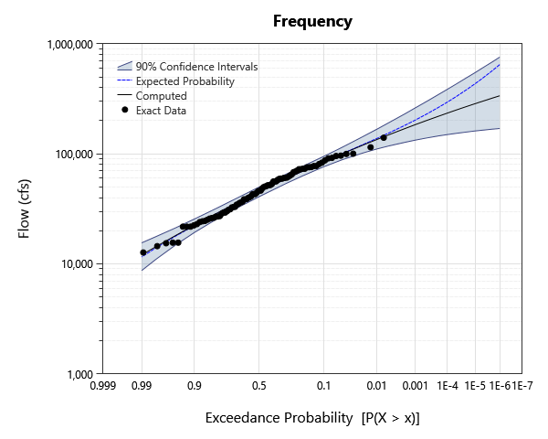
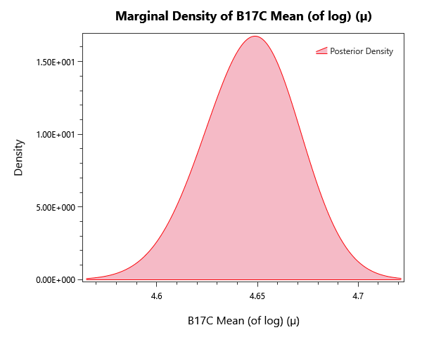

# blakely-mountain-dam-b17c

## Overview

B17C-method flood-frequency analysis for Blakely Mountain Dam, Arkansas. Demonstrates incorporating historical data, paleoflood records, regional skew, quantile penalties, and bias-corrected bootstrap confidence intervals using the Bulletin 17C method.

## What's Inside

### Input Data

| Element | Description |
|---|---|
| `Systematic - 1Day` | Systematic 1-day annual peak inflow record for Blakely Mountain Dam. |
| `Systematic + Historical - 1Day` | Systematic + historical 1-day annual peak inflow record for Blakely Mountain Dam. |
| `Systematic + Historical + Paleo - 1Day` | Systematic + historical + paleoflood 1-day annual peak inflow record for Blakely Mountain Dam. |

### Univariate Distribution

| Element | Description |
|---|---|
| `Univariate Analysis_8` | Bayesian LP-III fit for cross-comparison with the B17C alternatives — placeholder element. |

### Bulletin 17C

| Element | Description |
|---|---|
| `Systematic` | B17C fit using the systematic record only. |
| `Systematic + Historical` | B17C fit incorporating historical record extension. |
| `Systematic + Historical + Paleo` | B17C fit incorporating historical and paleoflood records. |
| `Systematic + Reg Skew` | B17C fit on the systematic record with regional skew weighting. |
| `Systematic + Historical + Reg Skew` | B17C fit with historical record + regional skew weighting. |
| `Systematic + Historical + Paleo + Reg Skew` | B17C fit with historical + paleoflood records + regional skew weighting. |
| `Systematic + Reg Skew_copy` | Duplicate of the systematic + regional-skew fit (kept for comparison; safe to delete). |
| `Systematic + Historical + Paleo + Reg Skew + QPen` | B17C fit with full information expansion + quantile-penalty prior. |
| `Sys + Hist + Paleo + SkewPen + QPen +BC` | B17C fit with full information expansion, skew penalty, quantile penalty, and bias-corrected bootstrap confidence intervals. |
| `Systematic - Linked MVT` | B17C fit on the systematic record with linked MVT (multivariate-t) confidence intervals. |
| `Systematic - MVN` | B17C fit on the systematic record with multivariate-normal confidence intervals. |
| `Systematic - Linked MVN` | B17C fit on the systematic record with linked multivariate-normal confidence intervals. |
| `Systematic + Reg Skew + QPen_copy` | Duplicate of the systematic + regional-skew + quantile-penalty fit (kept for comparison; safe to delete). |

## Step-by-Step Walkthrough

### Opening the Project

1. Open RMC-BestFit 2.0.
2. Select **File > Open** and navigate to `examples/4-univariate-distribution-analysis/2-bulletin-17C-analysis/2-information-expansion/`.
3. Open `blakely-mountain-dam-b17c.bestfit`.

### Exploring the Elements
For each B17C analysis:

1. Click the analysis in the Project Explorer.
2. Open the **Frequency** tab — the central LP-III curve plus the chosen confidence intervals are shown.
3. Switch the confidence-interval type in the Properties panel between **MVN** and **BCB** (Bias-Corrected Bootstrap) to compare.

## Expected Results
Below are the expected results for B17C Analysis labeled "Systematic"; this should be the first analysis in the list.
Be sure to explore all of the analyses provided!

### Parameter Estimates
The parameter estimates are found under the **GMM Report** tab to the left as parameter summary statistics.

| Parameter | Mean | Std Dev | 5% | Median | 95% |
|---|---|---|---|---|---|---|---|
| Mean (of log) (µ) | 4.64664 | 0.0236085 | 4.60689 | 4.64724 | 4.68448 | 
| Std Dev (of log) (σ) | 0.227804 | 0.0181184 | 0.201544 | 0.226036 | 0.260691 | 
| Skew (of log) (γ) | -0.253436 | 0.278591 | -0.728621 | -0.243456 | 0.193487 | 

### Frequency / Quantile Table
While in the **Distribution Results** tab to the left, select Tabular Results to see the frequency plot's value at each return level probability,

| Probability | 95.0% CI | 5.0% CI | Expected Probability | Computed |
|---|---|---|---|---|
| 1E-06 | 758026.0567215704 | 170106.17166955775 | 647985.6785807601 | 337650.2931590468 | 
| 2E-06 | 687457.3608267573 | 167933.4591347272 | 572980.2849303234 | 321974.30619051546 | 
| 5E-06 | 605797.5173862581 | 164359.55052939 | 488427.35917153396 | 301361.24571106234 | 
| 1E-05 | 546896.4929631923 | 161574.43687964996 | 433787.67847244337 | 285854.5761315717 | 
| 2E-05 | 495136.2355250269 | 158260.77686168702 | 385919.11999473925 | 270425.0762090789 | 
| 5E-05 | 430765.4611260562 | 153761.68815122006 | 331416.23129463074 | 250149.65834840835 | 
| 0.0001 | 386524.5324815373 | 149858.91059987794 | 295808.22312915954 | 234904.55681712108 | 
| 0.0002 | 345920.5247566132 | 145633.02421622866 | 264274.20982495 | 219738.59330979967 | 
| 0.0005 | 296392.18815290864 | 139067.20193665382 | 227848.20054746873 | 199807.21091061027 | 
| 0.001 | 262925.86683040817 | 133645.6929320698 | 203645.2496070585 | 184811.1433395044 | 
| 0.002 | 231197.8330765486 | 127380.98625304602 | 181837.30076821716 | 169874.6444131373 | 
| 0.005 | 193750.60818969348 | 118585.84929856933 | 156026.86778769732 | 150193.19373174553 | 
| 0.01 | 167810.73511495857 | 110938.93577506686 | 138321.16547542924 | 135318.4089210235 | 
| 0.02 | 144060.67734699778 | 102158.4833428134 | 121771.92572264813 | 120406.6551113714 | 
| 0.05 | 115220.06936697957 | 88687.80419613553 | 100974.16632702298 | 100503.7235452781 | 
| 0.1 | 95266.65947138361 | 76688.56825309672 | 85416.84921379967 | 85115.03654527031 | 
| 0.2 | 76463.27125700287 | 62694.82939448162 | 69320.57812048237 | 69098.29086959193 | 
| 0.3 | 65247.42053848779 | 53681.62774823276 | 59299.88639259649 | 59158.993978823855 | 
| 0.5 | 50039.98323082939 | 40940.568575556485 | 45337.65867614697 | 45341.52011821188 | 
| 0.7 | 37937.09940381622 | 30814.594915999118 | 34249.709753992225 | 34346.215404511764 | 
| 0.8 | 32099.653846141453 | 25599.78162225028 | 28742.99026062168 | 28867.47121462463 | 
| 0.9 | 25609.52171376839 | 19324.504161574154 | 22360.60024096732 | 22520.537709704982 | 
| 0.95 | 21372.58064185311 | 14981.065839501001 | 18006.187755721705 | 18227.54858386635 | 
| 0.98 | 17610.804373728533 | 10927.222765274915 | 13906.278498730422 | 14265.442755390326 | 
| 0.99 | 15534.709009938304 | 8701.537506635772 | 11567.783109782977 | 12064.31455262698 | 

### Plots
There are also plenty of plots to explore our results with. Under the **Distribution Results** tab we have a frequency curve.

*Figure 1: Frequency curve (AEP versus quantile) for each alternative, with the credible band.*

The **Kernal Density** tab shows an estimate for the pdf of each parameter.

*Figure 2: Posterior kernel density for mean parameter (µ).*

## Next Steps

- Compare MVN-quantile and bias-corrected bootstrap (BCB) confidence intervals on the same dataset.
- Re-run on the same input data using the **Bayesian Univariate** workflow and compare AEPs and confidence intervals.
- Add a **regional skew** weighting if a regional skew estimate is available.