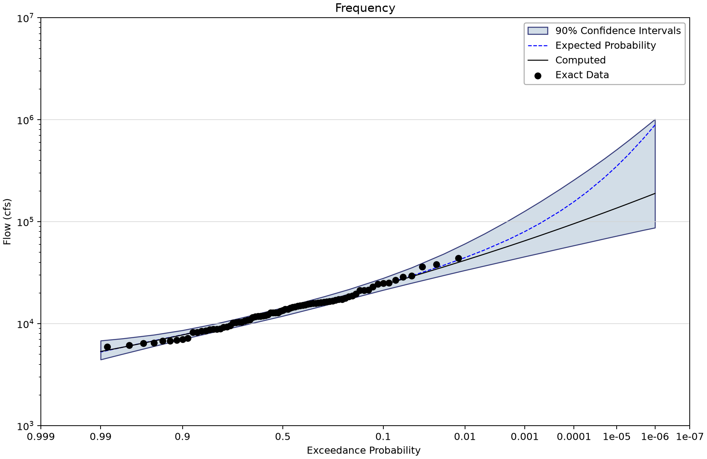
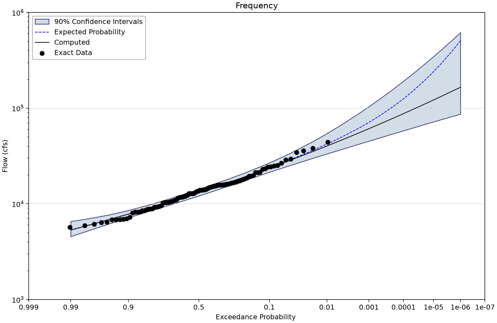
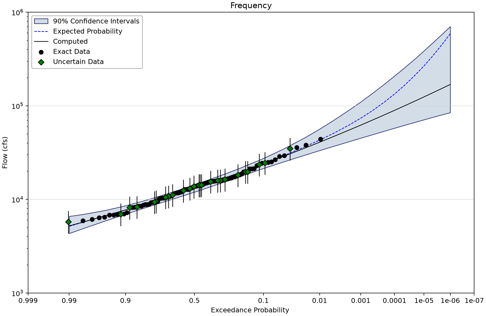

# Sinnemahoning Creek: GMM with an uncertain MOVE.3 extension

Open [sinnemahoning-move3-b17c.bestfit](sinnemahoning-move3-b17c.bestfit) and save a working copy. The three B17C-prefixed alternatives isolate how the supplied record extension is represented. The same project also retains three Bayesian alternatives without that prefix; their posterior results are separate and unchanged. Compare them with the [Bayesian companion](../../1-univariate-analysis/4-measurement-errors/sinnemahoning-move3-bayesian.md) only after checking the estimator and uncertainty interpretation.

The computed curve comes from BestFit's Generalized Method of Moments (GMM) LP3 fit. Uncertainty is represented by a frequentist parameter ensemble or bootstrap. These are **confidence limits**, not Bayesian credible limits. Shared storage names such as BayesianAnalysis or ModeCurve do not change that interpretation. Some saved GMM reports also retain the legacy label “Credible Interval”; for these frequentist results, read it as the stated confidence level. This tutorial does not claim that BestFit ran the USGS Expected Moments Algorithm (EMA).

Inspect GMM optimizer status, convergence, the objective and uncertainty diagnostics before interpreting a curve. R-hat, chain mixing and posterior ESS are not acceptance measures for these GMM ensembles. An empty or NaN diagnostic means it is unavailable or inapplicable, not zero.
## Inspect the extension

| Input element | Meaning | Exact rows and index span | Other saved input rows |
| --- | --- | --- | --- |
| Sinnemahoning - MOVE.3 - No Errors | 104 exact-valued peaks during 1914–2017, cfs; the 25 MOVE.3 reconstructed years 1914–1938 are treated as exact, not direct measurements. | 104 (1914–2017) | Uncertain: 0; intervals: 0; windows: 0; low flags: 0. |
| Sinnemahoning - MOVE.3 - With Errors | 79 systematic peaks plus 25 LogNormal uncertain observations for the 1914–1938 MOVE.3 extension, cfs. Retains supplied log10 sigma 0.074; donor/regression-error dependence provenance remains to be established. | 79 (1939–2017) | Uncertain: 25; intervals: 0; windows: 0; low flags: 0. |
| Sinnemahoning - No Extension | Sinnemahoning Creek systematic annual peaks: 79 exact observations during 1939–2017, cfs. | 79 (1939–2017) | Uncertain: 0; intervals: 0; windows: 0; low flags: 0. |

The 1914–1938 extension uses 25 year-specific LogNormal distributions with common sigma 0.074 in log10 space. This is not 0.074 cfs or a generic 7.4% error. The project preserves these distributions, but does not provide enough evidence to reconstruct the donor-gage regression or its cross-year error dependence. The original MOVE.3 calculation/report remains a required study reference.

## Work through the example

1. Inspect Sinnemahoning - No Extension and its 79 measured-period peaks.
2. Compare the No Errors and With Errors inputs. Identify the 25 reconstructed years in Exact Data versus Uncertain Data.
3. Open the three B17C analyses and read their GMM reports. All use linked-MVN uncertainty and a 90% confidence interval.
4. Compare the computed quantile at the same AEP. Then compare interval width and shape without assuming a particular direction of change.
5. Review provenance and dependence before accepting the extension. Marginal error distributions do not by themselves represent uncertainty shared through a common donor gage or regression model.

Current BestFit GMM integrates the moments and covariance contributed by uncertain observations. Do not discard the uncertain series or apply the obsolete limitation that B17C analyses ignore it. This does not establish equivalence with an external EMA treatment.

## Saved results

| Analysis | Uncertainty method | Draws | Saved optimizer status | 1% AEP computed | 90% confidence limits |
| --- | --- | --- | --- | --- | --- |
| B17C - LPIII - No Extension | LinkedMultivariateNormal | 10000 | Success | 41,820.971 | 33,375.658–60,873.539 |
| B17C - LPIII - No Errors | LinkedMultivariateNormal | 10000 | Success | 40,221.255 | 33,284.916–54,271.765 |
| B17C - LPIII - With Errors | LinkedMultivariateNormal | 10000 | Success | 40,862.386 | 33,336.625–56,521.083 |

Magnitudes are cfs. All three parent fits report Success and convergence within tolerance, and retain seed 12345 and 10,000 uncertainty draws. Settings and results are preserved; this tutorial does not recalculate the extension or adjust the model.

## Read the figures

*Exact systematic peaks and uncertain reconstructed years in the GMM input.* [SVG](images/sinnemahoning-move3-b17c-uncertain-chronology.svg) · [Plot data](images/sinnemahoning-move3-b17c-uncertain-chronology.plotspec.json.gz)

*B17C - LPIII - No Extension: computed GMM curve and linked-MVN confidence band.* [SVG](images/sinnemahoning-move3-b17c-no-extension.svg) · [Plot data](images/sinnemahoning-move3-b17c-no-extension.plotspec.json.gz)

*B17C - LPIII - No Errors: computed GMM curve and linked-MVN confidence band.* [SVG](images/sinnemahoning-move3-b17c-no-errors.svg) · [Plot data](images/sinnemahoning-move3-b17c-no-errors.plotspec.json.gz)

*B17C - LPIII - With Errors: computed GMM curve and linked-MVN confidence band.* [SVG](images/sinnemahoning-move3-b17c-with-errors.svg) · [Plot data](images/sinnemahoning-move3-b17c-with-errors.plotspec.json.gz)

## Interpretation and checks

An error-aware fit can change both the central curve and its uncertainty. The credible bands in the Bayesian companion and confidence bands here answer different statistical questions. Neither an attractive curve nor a successful parent fit establishes the validity of the supplied extension assumptions.

Explain why 104 rows do not mean 104 directly measured floods, which uncertainty is represented by each LogNormal input, and which dependence questions still require the MOVE.3 study record.

## Reading and reproducing the figures

AEP is annual exceedance probability; 0.01 means 1% per year under the model. Plotting positions summarize observations and are not fitted probabilities. A 90% confidence band describes uncertainty in a flood quantile, not the range containing 90% of future floods.

The shared Python renderer draws coordinates from the saved project's desktop plotting routines. Follow the [figure-generation instructions](../../../README.md#reproducing-the-figures) with the tutorial filename stem as `--only`. No original observations, fitted parameters or uncertainty draws are replaced. The figures retain source hashes and exact display coordinates in their compressed PlotSpec files.
