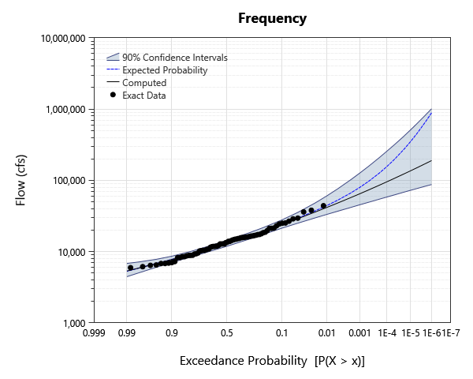
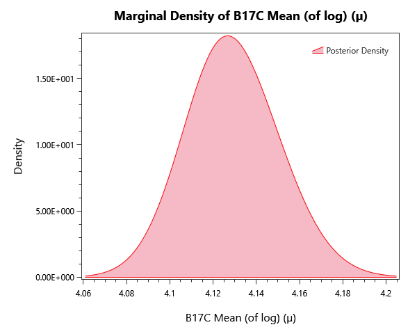

# sinnemahoning-move3-b17c

## Overview

B17C-method flood-frequency analysis for Sinnemahoning Creek (USGS gage 01543500) demonstrating record extension via MOVE.3 regression. Companion to sinnemahoning-move3-bayesian.

## What's Inside

### Input Data

| Element | Description |
|---|---|
| `Sinnemahoning - MOVE.3 - No Errors` | The years 1914-1938 were derived from MOVE.3 record extension. Typically, errors from the regression are ignored. |
| `Sinnemahoning - MOVE.3 - With Errors` | The years 1914-1938 were derived from MOVE.3 record extension. Errors from the regression are incorporated using uncertain data. |
| `Sinnemahoning - No Extension` | Sinnemahoning Creek peak-flow record with no MOVE.3 extension applied (systematic record only). |

### Univariate Distribution

| Element | Description |
|---|---|
| `LPIII - No Extension` | Bayesian LP-III fit on the systematic record only (no MOVE.3 extension). |
| `LPIII - No Errors` | Bayesian LP-III fit on the MOVE.3-extended record, ignoring the regression measurement errors. |
| `LPIII - With Errors` | Bayesian LP-III fit on the MOVE.3-extended record with regression measurement errors propagated as uncertain data. |

### Bulletin 17C

| Element | Description |
|---|---|
| `B17C - LPIII - No Extension` | B17C fit on the systematic record only (no MOVE.3 extension). |
| `B17C - LPIII - No Errors` | B17C fit on the MOVE.3-extended record, ignoring the regression measurement errors. |
| `B17C - LPIII - With Errors` | B17C fit on the MOVE.3-extended record with regression measurement errors propagated as uncertain data. |

## Step-by-Step Walkthrough

### Opening the Project

1. Open RMC-BestFit 2.0.
2. Select **File > Open** and navigate to `examples/4-univariate-distribution-analysis/2-bulletin-17C-analysis/3-measurement-errors/`.
3. Open `sinnemahoning-move3-b17c.bestfit`.

### Exploring the Elements

For each B17C analysis:

1. Click the analysis in the Project Explorer.
2. Open the **Frequency** tab — the central LP-III curve plus the chosen confidence intervals are shown.
3. Switch the confidence-interval type in the Properties panel between **MVN** and **BCB** (Bias-Corrected Bootstrap) to compare.

## Expected Results
Below are the expected results for B17C Analysis labeled "B17C - LPIII - No Extension"; this should be the first analysis in the list.
Be sure to explore all of the analyses provided!

### Parameter Estimates
The parameter estimates are found under the **GMM Report** tab to the left as parameter summary statistics.

| Parameter | Mean | Std Dev | 5% | Median | 95% |
|---|---|---|---|---|---|---|---|
| Mean (of log) (µ) | 4.12907 | 0.0217382 | 4.09443 | 4.1284 | 4.16586 | 
| Std Dev (of log) (σ) | 0.194461 | 0.017288 | 0.169784 | 0.192373 | 0.225954 | 
| Skew (of log) (γ) | 0.394872 | 0.370758 | -0.0801297 | 0.325077 | 1.11069 | 

### Frequency / Quantile Table
While in the **Distribution Results** tab to the left, select Tabular Results to see the frequency plot's value at each return level probability,

| Probability | 95.0% CI | 5.0% CI | Expected Probability | Computed |
|---|---|---|---|---|
| 1E-06 | 1010667.4196454879 | 87278.89808161247 | 888023.2521845531 | 189358.8687011805 | 
| 2E-06 | 825694.3822362763 | 82912.68590135279 | 662692.7488685393 | 171814.47275785723 | 
| 5E-06 | 628451.1410449261 | 76873.00488312499 | 457567.26485387725 | 150699.54835185735 | 
| 1E-05 | 511113.5866934283 | 72516.31829703723 | 350321.67281641084 | 136173.00230633706 | 
| 2E-05 | 415539.53913432173 | 68161.97643385472 | 271376.23746867385 | 122791.94048634727 | 
| 5E-05 | 316779.5426404807 | 62523.183960320865 | 197231.4428742737 | 106718.84884731137 | 
| 0.0001 | 257705.018127259 | 58466.244656610834 | 157112.99805686 | 95682.12342781319 | 
| 0.0002 | 208859.17060148393 | 54467.605524915816 | 126648.2013367339 | 85531.57282856839 | 
| 0.0005 | 157692.52769288246 | 49242.15006188284 | 96889.38679515879 | 73358.75619457685 | 
| 0.001 | 127244.4630291779 | 45495.29838709207 | 80038.99553705836 | 65011.35208586299 | 
| 0.002 | 102180.48874505726 | 41728.86854976766 | 66661.81486476627 | 57339.64782094964 | 
| 0.005 | 76243.52857440646 | 36926.027495256545 | 52819.36685268229 | 48139.26413690107 | 
| 0.01 | 60873.489791151405 | 33375.66551625586 | 44442.95904045988 | 41820.97141250052 | 
| 0.02 | 48326.106950837464 | 29779.872291720047 | 37368.829469010976 | 35994.71403686458 | 
| 0.05 | 35451.46898338216 | 25031.918185260154 | 29455.157863770197 | 28948.923594247586 | 
| 0.1 | 27930.858451509157 | 21367.865649365885 | 24222.10102612838 | 24026.28824969158 | 
| 0.2 | 21689.640353267652 | 17442.808807064896 | 19382.689188020217 | 19343.430705928662 | 
| 0.3 | 18433.819974994873 | 15035.21364288901 | 16628.347175602434 | 16643.134623824022 | 
| 0.5 | 14353.683830195841 | 11893.008361180213 | 13064.570383845343 | 13121.330872603865 | 
| 0.7 | 11437.283886163019 | 9572.280888598843 | 10431.182312148563 | 10482.326646093956 | 
| 0.8 | 10048.434355793785 | 8425.432791472093 | 9185.27342941452 | 9208.686126838204 | 
| 0.9 | 8609.348757548101 | 7028.487485163489 | 7782.223358042681 | 7753.87601295728 | 
| 0.95 | 7779.612293112392 | 6011.705176932596 | 6813.691675726118 | 6772.147976123263 | 
| 0.98 | 7137.323270176243 | 5022.286857330054 | 5855.705800187188 | 5856.10461452967 | 
| 0.99 | 6816.267686757423 | 4444.811201588628 | 5276.8069213907975 | 5336.962866943537 | 

### Plots
There are also plenty of plots to explore our results with. Under the **Distribution Results** tab we have a frequency curve.

*Figure 1: Frequency curve (AEP versus quantile) for each alternative, with the credible band.*

The **Kernal Density** tab shows an estimate for the pdf of each parameter.

*Figure 2: Posterior kernel density for mean parameter (µ).*

## Next Steps

- Compare MVN-quantile and bias-corrected bootstrap (BCB) confidence intervals on the same dataset.
- Re-run on the same input data using the **Bayesian Univariate** workflow and compare AEPs and confidence intervals.
- Add a **regional skew** weighting if a regional skew estimate is available.
