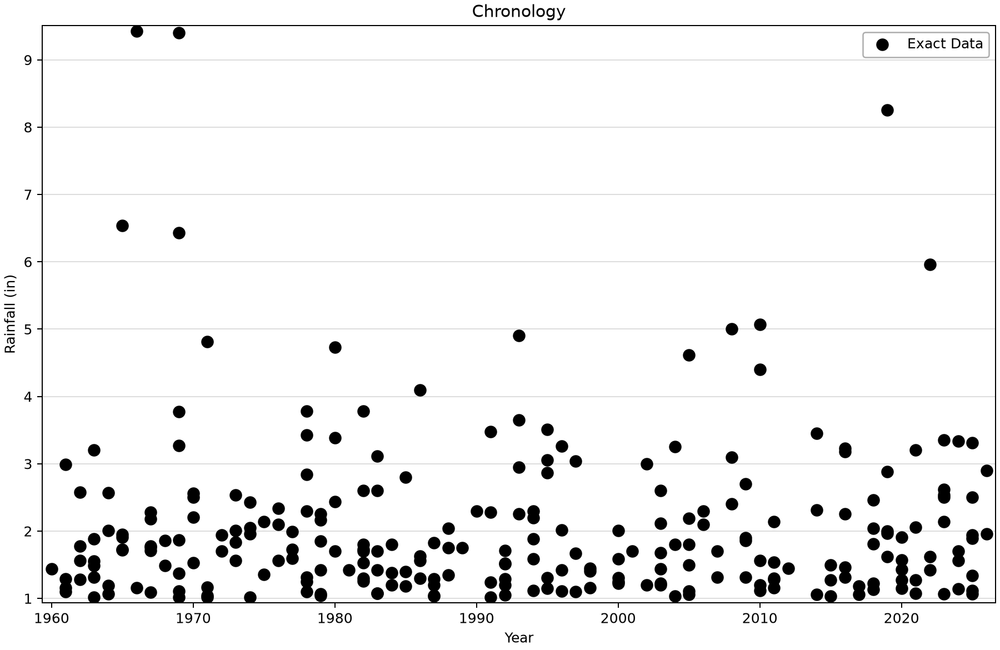
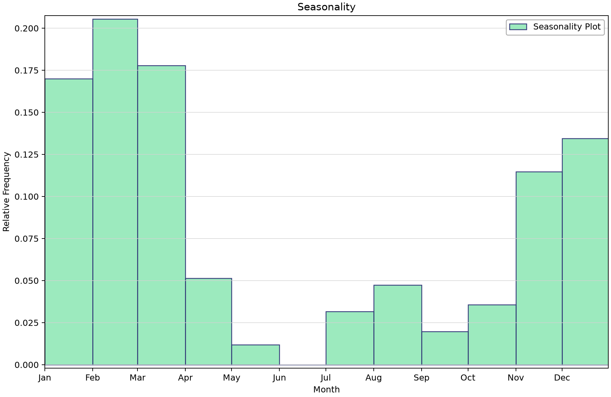
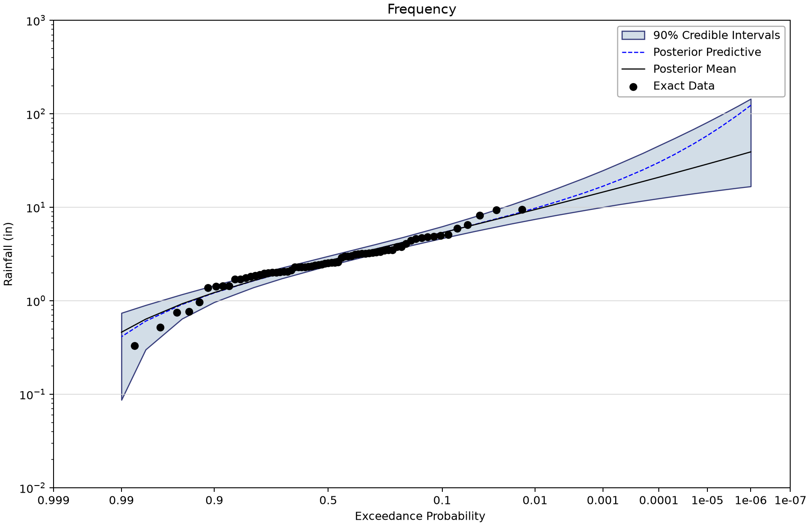
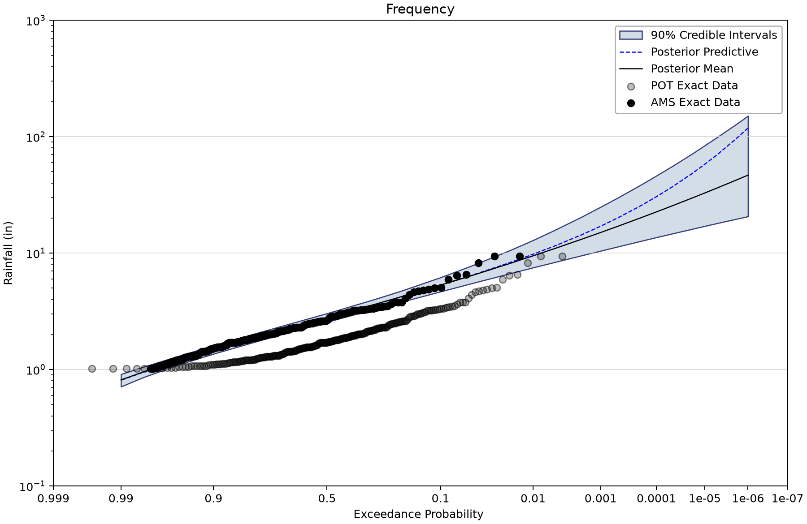
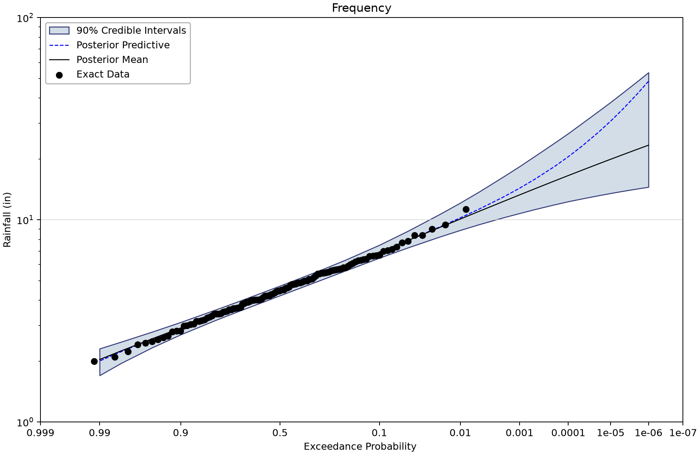
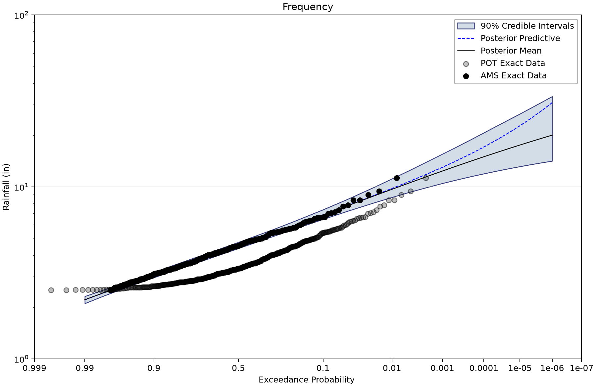
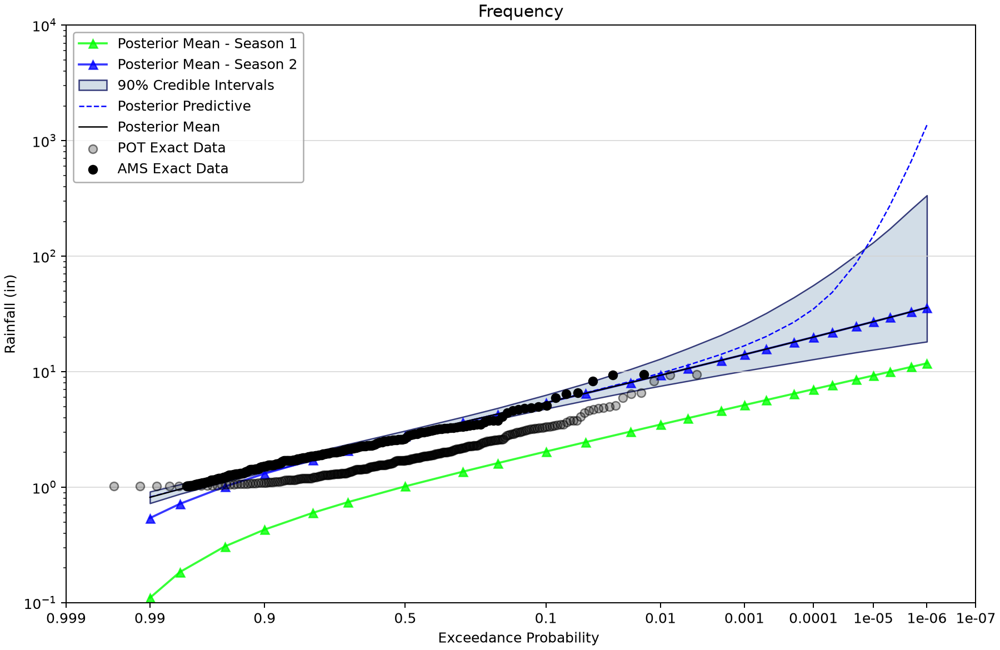

# Precipitation frequency: annual maxima and point-process models

Open [point-process-examples.bestfit](point-process-examples.bestfit) and save a working copy. This project compares annual-maxima GEV models with point-process models that use multiple threshold exceedances per year. The seasonal model allows two event populations within the block year.

## Inspect the rainfall records and extraction

NOAA's [GHCN-D station catalog](https://www.ncei.noaa.gov/pub/data/ghcn/daily/ghcnd-stations.txt) identifies USC00040741 as **Big Bear Lake** and USC00042402 as **De Sabla**, California. Both saved precipitation series use inches.

| Station | Saved daily date range | Daily positions | Missing positions |
| --- | --- | --- | --- |
| Big Bear Lake | 1960-07-01–2026-06-30 | 24,106 | 482 |
| De Sabla | 1906-03-01–2025-03-31 | 43,496 | 1,684 |

| Input element | Meaning | Exact rows and index span | Other saved input rows |
| --- | --- | --- | --- |
| USC00040741 - POT | Big Bear Lake (USC00040741) daily precipitation in inches, POT sample: 253 events above 1 in, minimum separation one source time step, inferred exposure 67 years. Source record has missing positions and partial endpoint years; inferred exposure is not verified complete coverage. | 253 (1960–2026) | Uncertain: 0; intervals: 0; windows: 0; low flags: 0. |
| USC00040741 - AMS | Big Bear Lake (USC00040741) daily precipitation in inches, annual maxima: 67 values, water-year start October. Source record has missing positions and partial endpoint years; inferred exposure is not verified complete coverage. | 67 (1960–2026) | Uncertain: 0; intervals: 0; windows: 0; low flags: 0. |
| USC00042402 - POT | De Sabla (USC00042402) daily precipitation in inches, POT sample: 439 events above 2.5 in, minimum separation one source time step, inferred exposure 120 years. Source record has missing positions and partial endpoint years; inferred exposure is not verified complete coverage. | 439 (1906–2025) | Uncertain: 0; intervals: 0; windows: 0; low flags: 0. |
| USC00042402 - AMS | De Sabla (USC00042402) daily precipitation in inches, annual maxima: 120 values, water-year start September. Source record has missing positions and partial endpoint years; inferred exposure is not verified complete coverage. | 120 (1906–2025) | Uncertain: 0; intervals: 0; windows: 0; low flags: 0. |

POT means peaks over threshold; AMS means annual maxima. Both POT extractions retain minimum separation of one source step and no smoothing. Their empirical rates are 253/67 = 3.776 and 439/120 = 3.658 events/year. Threshold adequacy and event independence need physical and diagnostic review; the extraction setting does not prove independence.

## Work through the comparison

1. Inspect the daily series for missing periods and partial endpoint years. The inferred 67- and 120-year exposures do not certify complete observation coverage.
2. Open each POT input and inspect its threshold, event dates and seasonality. Compare its event count with the AMS companion.
3. Open each GEV analysis to view the annual-maxima frequency curve. Then open the same station's Point Process analysis to inspect the annualized curve based on threshold exceedances.
4. Compare at the same AEP and in the same units. Do not rank AMS and POT using their DIC values: they fit different data likelihoods.
5. Open USC00040741 - Seasonal Point Process. Inspect both component populations, the inferred change points and the annual combination. Its eight parameters require more chains than the stationary models.

## Block-year and seasonal conventions

Big Bear AMS starts in October; De Sabla AMS starts in September. Both stationary point-process models start in October. The Big Bear seasonal model starts in **August**. These differences remain as saved and must be resolved or justified before describing the examples as a controlled AMS/POT comparison.

The seasonal point estimate stores block-day change points 99.53338 and 246.45066 followed by two GEV parameter triples. BestFit floors change points when assigning seasons. Seasonal model parameters and the annualized competing-risk distribution parameters have different roles; do not overwrite one with the other or read block-day coordinates as calendar day-of-year without accounting for the August start.

## Saved frequency results

All listed Bayesian fits retain DEMCzs, seed 12345, posterior-mean point parameters and 90% credible intervals. The table shows the saved chain count, thinning interval and output length. Draw count is not effective sample size (ESS). Read warmup, iteration settings and every parameter prior in the saved properties before copying a model.

R-hat near one and adequate ESS are useful screening evidence, not proof of convergence or model adequacy. Inspect every parameter's trace and autocorrelation, then check the stability of the tail quantities needed for the study. No saved results were rerun for these figures.
| Saved alternative | Chains / thinning / draws | DIC | 1% AEP point | 90% credible limits | Max R-hat | Min ESS |
| --- | --- | --- | --- | --- | --- | --- |
| USC00040741 - GEV | 6/30/10000 | 247.967 | 9.466 | 7.472–13.079 | 1.00100 | 9,026 |
| USC00042402 - GEV | 6/30/10000 | 441.208 | 10.086 | 8.879–12.121 | 1.00014 | 9,255 |
| USC00040741 - Point Process | 6/30/10000 | 372.8 | 9.471 | 7.505–12.88 | 1.00056 | 9,583 |
| USC00042402 - Point Process | 6/30/10000 | 809.085 | 9.687 | 8.703–11.153 | 1.00017 | 9,429 |
| USC00040741 - Seasonal Point Process | 16/80/10000 | 179.504 | 9.327 | 7.538–12.934 | 1.00056 | 6,007 |

Quantiles and limits are inches of daily precipitation. These are annual frequency results, not per-event probabilities. The seasonal fit uses 16 chains and thinning 80; all five retain 10,000 output draws. No uncertainty band establishes that the inferred exposure or threshold is correct.

## Read the figures

*Big Bear Lake retained threshold events; multiple events can occur in one year.* [SVG](images/point-process-examples-big-bear-pot-chronology.svg) · [Plot data](images/point-process-examples-big-bear-pot-chronology.plotspec.json.gz)

*Seasonality of the extracted Big Bear Lake events.* [SVG](images/point-process-examples-big-bear-seasonality.svg) · [Plot data](images/point-process-examples-big-bear-seasonality.plotspec.json.gz)

*Big Bear annual-maxima GEV result.* [SVG](images/point-process-examples-big-bear-ams.svg) · [Plot data](images/point-process-examples-big-bear-ams.plotspec.json.gz)

*Big Bear point-process annualized frequency curve with POT plotting positions.* [SVG](images/point-process-examples-big-bear-point-process.svg) · [Plot data](images/point-process-examples-big-bear-point-process.plotspec.json.gz)

*De Sabla annual-maxima GEV result using its saved September block start.* [SVG](images/point-process-examples-de-sabla-ams.svg) · [Plot data](images/point-process-examples-de-sabla-ams.plotspec.json.gz)

*De Sabla stationary point-process annualized curve using its saved October block start.* [SVG](images/point-process-examples-de-sabla-point-process.svg) · [Plot data](images/point-process-examples-de-sabla-point-process.plotspec.json.gz)

*Big Bear two-season model, its component curves and annual combination with an August block start.* [SVG](images/point-process-examples-big-bear-seasonal.svg) · [Plot data](images/point-process-examples-big-bear-seasonal.plotspec.json.gz)

## Interpretation and references

Threshold choice trades event count against the applicability of an extreme-value tail model. Declustering and exposure accounting are separate decisions. Consult the [point-process technical reference](../../../docs/technical-reference/distributions/point-process.md), and document why each choice represents the site's rainfall process before transferring these settings.

The open study questions concern threshold/separation rationale, gaps and partial-year exposure, and differing block-year starts. The project retains all these settings for the author to address; it does not silently harmonize them.

## Reproduce and check your understanding

The shared Python renderer uses BestFit desktop plot coordinates from a disposable copy of the saved project. See the [figure-generation instructions](../../README.md#reproducing-the-figures); use this tutorial's filename stem with `--only`. Each figure includes an SVG and compressed PlotSpec containing its source identity and displayed values.

Before using a result in a study, explain the target variable, the represented observation period, the information added through thresholds or priors, and what the plotted interval means. Separate a teaching example's saved settings from a justified engineering choice for another site.
