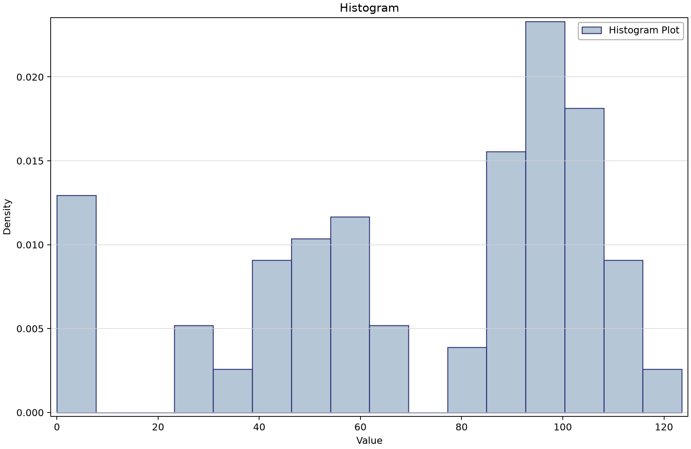
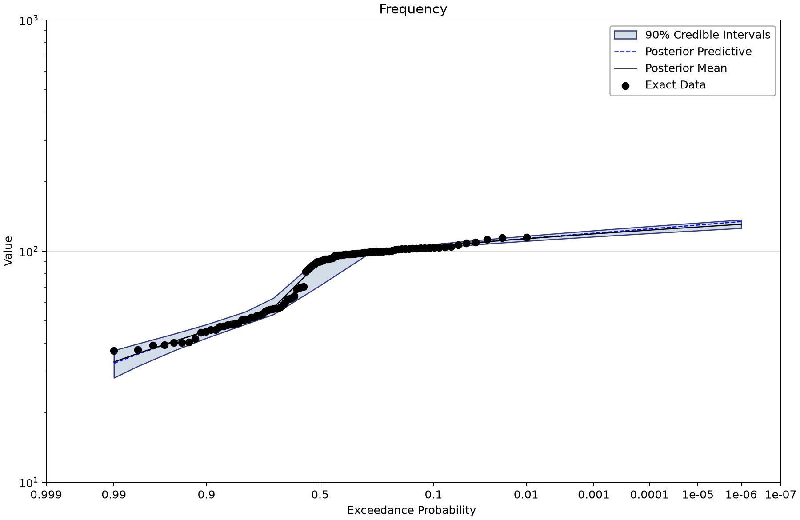
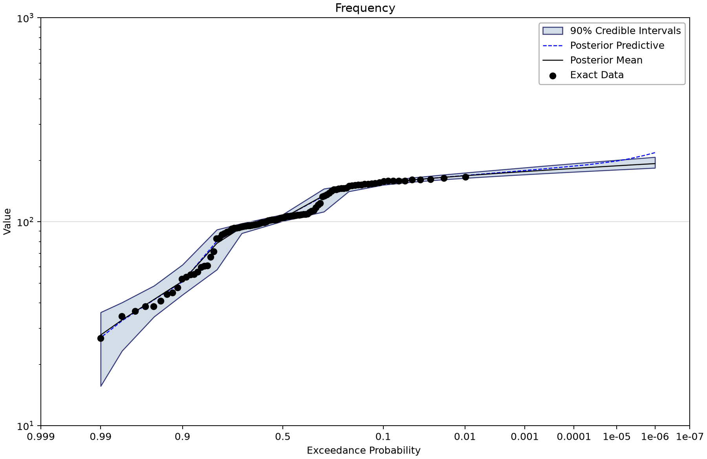
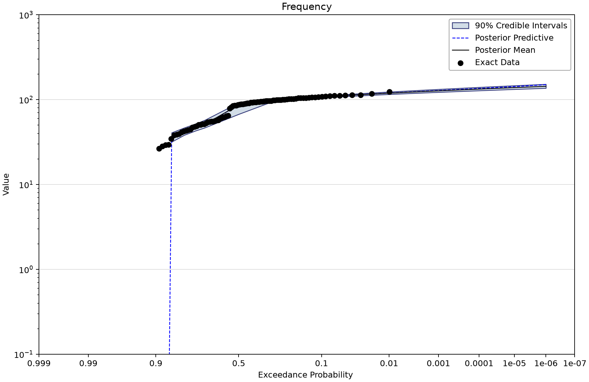
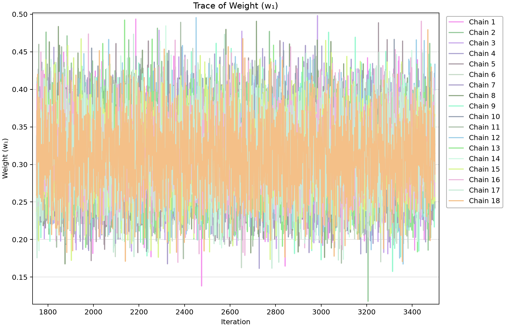

# Mixture distributions: latent components and exact zeros

Open [mixture-distribution-examples.bestfit](mixture-distribution-examples.bestfit) and save a working copy. A mixture represents a population in which an observation comes from one of several component distributions. Component weights describe those alternatives within a model; they are not model-selection weights among the three saved analyses.

## Inspect the three datasets

| Input | Meaning | Exact count (index span) | Other records |
| --- | --- | --- | --- |
| Mixture of 2 Normals - Data | Separate synthetic dataset of 100 exact generic values indexed 1–100. All observations are positive; no censored, uncertain or low-flagged rows. Generator recipe/seed not established by the saved fit. | 100 (1–100) | Uncertain 0; intervals 0; windows 0; low flags 0. |
| Mixture of 3 Normals - Data | Separate synthetic dataset of 100 exact generic values indexed 1–100. All observations are positive; no censored, uncertain or low-flagged rows. Generator recipe/seed not established by the saved fit. | 100 (1–100) | Uncertain 0; intervals 0; windows 0; low flags 0. |
| Mixture of 2 Normals and Zero Inflated - Data | Separate synthetic dataset of 100 exact generic values indexed 1–100. Contains ten exact zeros and 90 positive values; the zero probability mass is fixed at the empirical 0.10. Generator recipe/seed not established by the saved fit. | 100 (1–100) | Uncertain 0; intervals 0; windows 0; low flags 0. |

There are no historical, censored or uncertain records. Each fit uses a different synthetic dataset, so cross-fit DIC/WAIC values do not establish the preferred number of components for a common sample.

## Work through the example

1. Inspect the histogram for Mixture of 2 Normals - Data and open its mixture analysis. Identify two component parameter pairs and their weights.
2. Inspect the three-component alternative. Retain the saved component order when reading parameters; an arbitrary relabeling can conceal label-switching behavior in chains.
3. Inspect the zero-inflated input. Count its ten zeros before reading a logarithmic frequency plot, which cannot display zero as a positive response.
4. Read the zero-inflation setting: the point mass is fixed at **0.10 from the observed zero proportion**. The two continuous masses sum to 0.90. The zero mass is not a sampled posterior probability parameter.
5. Use trace and parameter-density views to assess fitted parameters. A posterior parameter KDE is not the density of observed responses or a plot of component contributions.

## Saved component values

| Fit | Component means / SDs in saved order | Component probability masses |
| --- | --- | --- |
| 2 Normals | 52.19778 / 9.54935; 98.65123 / 6.91164 | 0.4331345; 0.5668655 |
| 3 Normals | 150.90702 / 9.26919; 51.36111 / 14.24873; 101.42935 / 9.13917 | 0.3120533; 0.2030666; 0.4848801 |
| 2 Normals, zero-inflated | 48.87159 / 11.59018; 99.04838 / 9.59798 | 0.3460540; 0.5539460; plus zero mass 0.10 |

Default flat parameter priors and Jeffreys scale treatment are enabled; no quantile priors are enabled. The fits have 5, 8 and 5 free parameters because the weights are constrained.

The current MCMC fits retain DEMCzs, seed 12345, 1,750 warmup iterations, 3,500 iterations, 10,000 output draws and 90% interval width. Chain/thinning and selected point-parameter estimates are listed below. Inspect actual prior bounds, every parameter trace and autocorrelation, and uncertainty in the quantity needed for the study. R-hat and ESS summarize the saved run; successful completion alone does not establish adequacy. Composite and coincident-frequency wrappers propagate upstream results and do not represent separate MCMC fits.
| Saved fit | Chains / thinning | Point parameters | DIC | Max R-hat | Min ESS |
| --- | --- | --- | --- | --- | --- |
| Mixture Distribution - 2 Normals | 12/60 | Mean | 838.221 | 1.00030 | 9,285 |
| Mixture Distribution - 3 Normals | 18/90 | Mean | 950.565 | 1.00065 | 5,702 |
| Mixture Distribution - 2 Normals - Zero-Inflated | 12/60 | Mean | 861.705 | 1.00053 | 9,283 |

| Analysis | Saved 1% AEP point | 90% bounds |
| --- | --- | --- |
| Mixture Distribution - 2 Normals | 113.201 | 110.589–116.292 |
| Mixture Distribution - 3 Normals | 168.069 | 163.59–173.682 |
| Mixture Distribution - 2 Normals - Zero-Inflated | 119.163 | 115.526–123.434 |

The quantiles use generic Value units and the configured point-parameter vector, not necessarily the posterior median quantile. The generating recipe and seed are not established here, so these saved fits are not a new known-truth recovery test.

## Read the figures

*Histogram includes the ten exact zeros in the input.* [SVG](images/mixture-distribution-examples-zero-input-histogram.svg) · [Plot data](images/mixture-distribution-examples-zero-input-histogram.plotspec.json.gz)

*Saved two-Normal mixture frequency result.* [SVG](images/mixture-distribution-examples-two-normal-frequency.svg) · [Plot data](images/mixture-distribution-examples-two-normal-frequency.plotspec.json.gz)

*Saved three-Normal mixture result on its separate dataset.* [SVG](images/mixture-distribution-examples-three-normal-frequency.svg) · [Plot data](images/mixture-distribution-examples-three-normal-frequency.plotspec.json.gz)

*Zero-inflated model: the zero mass remains 0.10 even though a logarithmic response axis cannot show zero-valued markers.* [SVG](images/mixture-distribution-examples-zero-inflated-frequency.svg) · [Plot data](images/mixture-distribution-examples-zero-inflated-frequency.plotspec.json.gz)

*First saved parameter trace; inspect all component and weight parameters for mixing and label stability.* [SVG](images/mixture-distribution-examples-three-normal-trace.svg) · [Plot data](images/mixture-distribution-examples-three-normal-trace.plotspec.json.gz)

## Reproduce and check

These Python figures use BestFit desktop coordinates from a disposable copy of the saved project. No original data, fitted parameters or stored uncertainty draws were replaced. Follow the [figure-generation instructions](../../README.md#reproducing-the-figures) with `--only mixture-distribution-examples`. SVG and compressed PlotSpec links preserve the display and its source identity.

Explain which observations support each fit, what its point curve and band represent, and which assumptions need independent study evidence before reuse.
