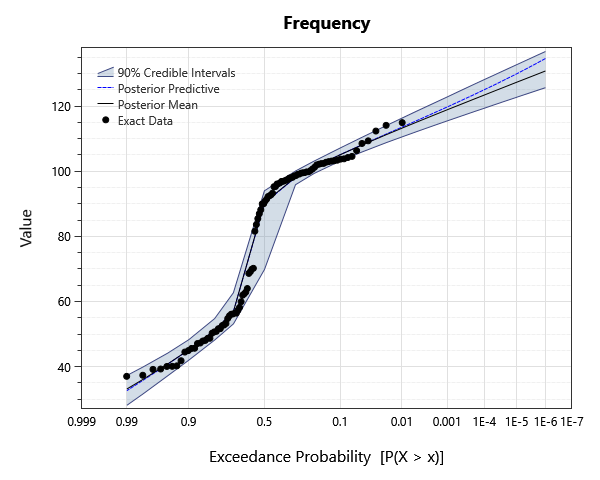
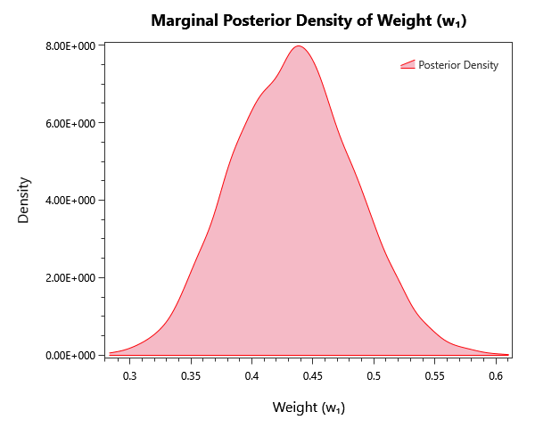
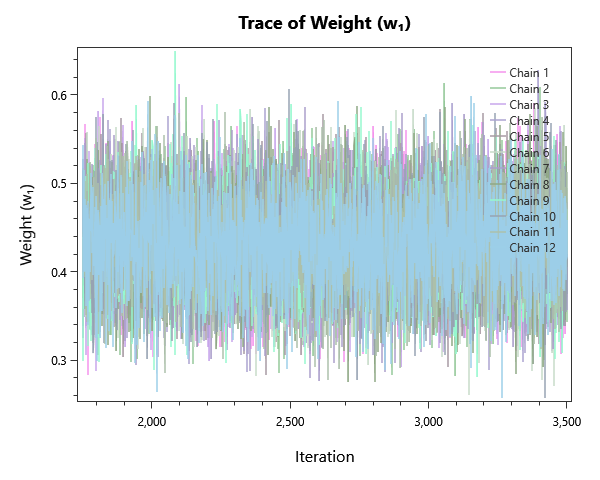
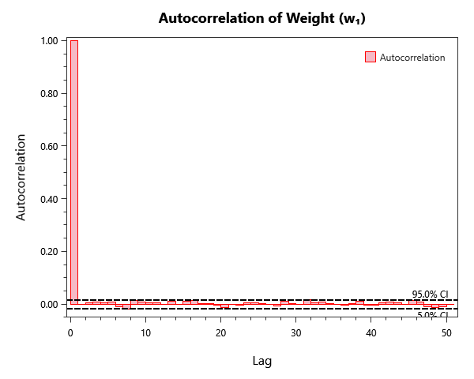

# mixture-distribution-examples

## Overview

Mixture-distribution fitting on synthetic samples from two- and three-component normal mixtures, including a zero-inflated variant. Demonstrates Bayesian estimation of mixture weights, location, and scale parameters.

## What's Inside

### Input Data

| Element | Description |
|---|---|
| `Mixture of 2 Normals - Data` | Synthetic data from the mixture of two normal distributions. |
| `Mixture of 3 Normals - Data` | Synthetic data drawn from a three-component normal mixture. |
| `Mixture of 2 Normals and Zero Inflated - Data` | Synthetic data drawn from a two-component normal mixture with a zero-inflated component. |

### Mixture Distribution

| Element | Description |
|---|---|
| `Mixture Distribution - 2 Normals` | Bayesian fit of a two-component normal mixture to the corresponding synthetic sample. |
| `Mixture Distribution - 3 Normals` | Bayesian fit of a three-component normal mixture to the corresponding synthetic sample. |
| `Mixture Distribution - 2 Normals - Zero-Inflated` | Bayesian fit of a zero-inflated two-component normal mixture to the corresponding synthetic sample. |

## Step-by-Step Walkthrough

### Opening the Project

1. Open RMC-BestFit 2.0.
2. Select **File > Open** and navigate to `examples/4-univariate-distribution-analysis/4-mixture-analysis/`.
3. Open `mixture-distribution-examples.bestfit`.

### Exploring the Elements

For each Mixture Distribution analysis:

1. Click the analysis in the Project Explorer.
2. Open the **Frequency** tab to view the mixture AEP curve.
3. Open the **Kernel Density** tab to see the component contributions.
4. Inspect the component **weights** in the parameter table.

## Analysis Settings

Each Bayesian analysis in this project uses the DEMCzs sampler with project-specific iteration / warm-up settings. Open the **Properties** panel of any alternative to inspect:

- **Sampler type** (DEMCzs, ARWMH, HMC).
- **Iterations / Warm-up Iterations** — total post-warmup samples per chain.
- **Number of Chains** — typically 6 for routine work.
- **Thinning Interval** — keeps every Nth sample to reduce storage / autocorrelation.
- **Point Estimator** — Posterior Mean (default), Posterior Median, or Posterior Mode (MAP).
- **Credible Interval Width** — typically 0.90 or 0.95.

## Expected Results
Below are the expected results for Mixture Distribution Analysis labeled "Mixture Distribution - 2 Normals"; this should be the first analysis in the list.
Be sure to explore all of the analyses provided!

### Parameter Estimates
The parameter estimates are found under the **MCMC Report** tab to the left as parameter summary statistics.

| Parameter | Mean | Std Dev | 5% | Median | 95% |R-hat | ESS |
|---|---|---|---|---|---|---|---|
| Weight (w₁) | 0.43411 | 0.0499398 | 0.35371 | 0.43398 | 0.517628 | 1.0001 | 9580 | 
| Weight (w₂) | 0.56589 | 0.0499398 | 0.482372 | 0.56602 | 0.64629 | 1.0001 | 9580 | 
| D1 Mean (µ) | 52.201 | 1.52931 | 49.6879 | 52.187 | 54.697 | 0.9999 | 9557 | 
| D1 Std Dev (σ) | 9.54152 | 1.24415 | 7.80937 | 9.39534 | 11.7894 | 1.0001 | 9320 | 
| D2 Mean (µ) | 98.6504 | 0.964829 | 97.0639 | 98.6506 | 100.232 | 0.9998 | 9453 | 
| D2 Std Dev (σ) | 6.9293 | 0.713777 | 5.85081 | 6.87941 | 8.18494 | 0.9999 | 9483 | 

### Frequency / Quantile Table
While in the **Distribution Results** tab to the left, select Tabular Results to see the frequency plot's value at each return level probability,

| Probability | 95.0% CI | 5.0% CI | Posterior Predictive| Posterior Mean |
|---|---|---|---|---|
| 1E-06 | 136.75372915852546 | 125.65133645719423 | 134.61185390947912 | 130.78181474750846 | 
| 2E-06 | 135.58073569847977 | 124.79515711696713 | 133.19862668833534 | 129.77408762157407 | 
| 5E-06 | 133.95869233068584 | 123.62697987699049 | 131.33256895705728 | 128.39401059535456 | 
| 1E-05 | 132.69501530956938 | 122.71012904948113 | 129.89756975501072 | 127.30986579366626 | 
| 2E-05 | 131.38348587286313 | 121.75069448098422 | 128.4709197177208 | 126.18715719817294 | 
| 5E-05 | 129.5650651108252 | 120.42575604874273 | 126.51989180832592 | 124.63641490461667 | 
| 0.0001 | 128.13753808909365 | 119.3572618537595 | 125.03232531132672 | 123.40610894756115 | 
| 0.0002 | 126.63343094477321 | 118.25177714123468 | 123.48097081763129 | 122.11924524529803 | 
| 0.0005 | 124.50723352060287 | 116.70777645689547 | 121.38827096629753 | 120.31696506884354 | 
| 0.001 | 122.79427068524714 | 115.45629403460369 | 119.71974776832967 | 118.86305456285493 | 
| 0.002 | 121.0051513022824 | 114.11525846597938 | 117.98884192018699 | 117.31510407143973 | 
| 0.005 | 118.44920146648148 | 112.17564493248561 | 115.54286475081985 | 115.08966168794181 | 
| 0.01 | 116.30278497803258 | 110.55340632974699 | 113.54128069394946 | 113.23244939896003 | 
| 0.02 | 113.94777125674857 | 108.74275323892348 | 111.3664585667642 | 111.17502743461085 | 
| 0.05 | 110.36349207096862 | 105.89005804692832 | 108.0839174676419 | 108.01146265042512 | 
| 0.1 | 107.14641466859999 | 103.14644079885251 | 105.09505613186427 | 105.08050613808324 | 
| 0.2 | 103.12569093619203 | 99.35563682289323 | 101.23522291079722 | 101.2563910099315 | 
| 0.3 | 100.05392742151857 | 95.86572492828353 | 98.07787536496916 | 98.12639534181538 | 
| 0.5 | 94.01317508473839 | 69.84654815900699 | 90.20936874256606 | 90.38462908765455 | 
| 0.7 | 62.73048414224994 | 53.151555799710934 | 56.9698032982063 | 56.96112581442284 | 
| 0.8 | 54.78707935545491 | 48.2099778434261 | 51.25750156846604 | 51.2598562511874 | 
| 0.9 | 48.27254901459952 | 41.99874320655629 | 45.15057731291054 | 45.16248186783007 | 
| 0.95 | 44.080092523241184 | 37.11857035817384 | 40.6707615171922 | 40.756514288977925 | 
| 0.98 | 39.92635171208513 | 31.66740897271099 | 35.85114540734791 | 36.13115451477489 | 
| 0.99 | 37.320274047871976 | 28.171415415536107 | 32.672620413882406 | 33.16815581439024 | 

### Plots
There are also plenty of plots to explore our results with. Under the **Distribution Results** tab we have a frequency curve.

*Figure 1: Frequency curve (AEP versus quantile), with the credible band.*

The **Kernal Density** tab shows an estimate for the pdf of each parameter.

*Figure 2: Posterior kernel density for weight parameter (w₁).*

The **Markov Chain Traces** tab explores the traces of each Markov chain as it explores the posterior space in order to converge.

*Figure 3: Markov-chain traces for weight parameter (w₁).*

Finally, we can investigate the autocorrelation of the chains under the **Autocorrelation** tab.

*Figure 4: Autocorrelation function of the chains, used to estimate effective sample size, for weight parameter (w₁).*

### MCMC Diagnostics
One should always verify chain convergence before interpreting any results. There are a variety of ways including:

- **R-hat** — should be < 1.01 for every parameter.
- **Effective Sample Size (ESS)** — at least a few hundred per parameter.
- **Trace plots** — should look like fuzzy, well-mixed caterpillars (no drift, no sticking).
- **Posterior** — overall posterior log-likelihood should be visually stationary in the mean-likelihood plot.

These can be found under the **Markov Chain Traces** and **MCMC Reports** tabs.

## Next Steps

- Compare 2-component versus 3-component mixtures via DIC / WAIC.
- Use a **zero-inflated** variant if the data has many true zeros (e.g., dry-day precipitation).
- Visualize component memberships via the kernel-density plot.
