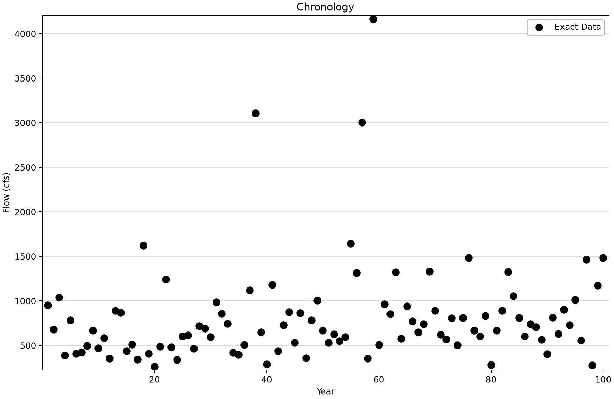
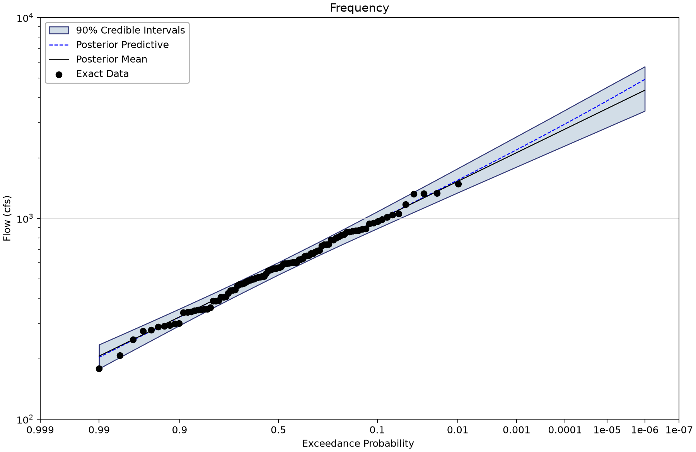
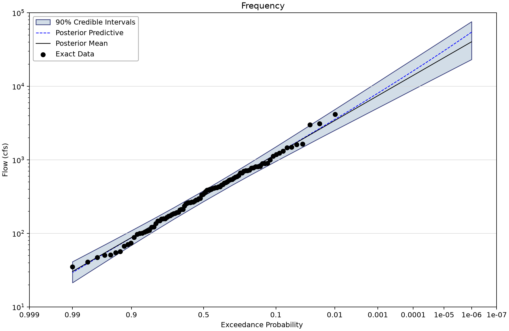
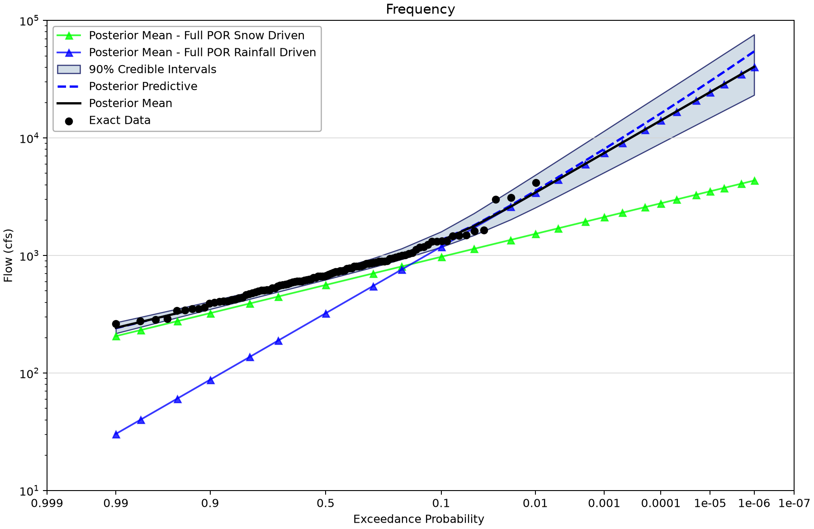
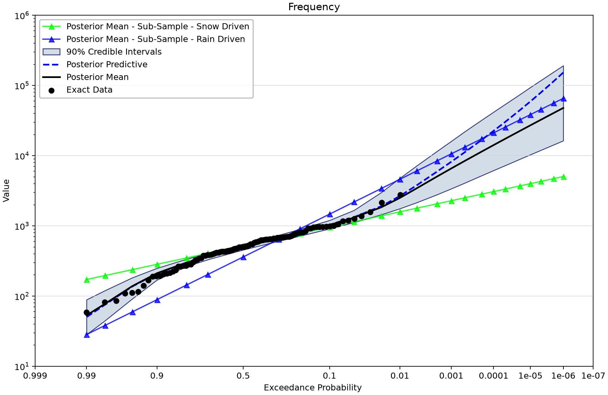

# Mixed flood populations: a maximum and a mixture

Open [mixed-population-examples.bestfit](mixed-population-examples.bestfit) and save a working copy. This example distinguishes two formation rules. If independent processes both occur in a year and the annual flood is their maximum, its CDF is the product of their CDFs. If one type is selected for each observation, the mixture CDF is a weighted sum.

## Establish which data belong together

| Input | Meaning | Exact count (index span) | Other records |
| --- | --- | --- | --- |
| AMS Sub-Sample - Snow Driven Floods | 74 synthetic snow-type values in cfs; part of the separate pooled mixture sample, not a subset of the saved full snow realizations. | 74 (1–100) | Uncertain 0; intervals 0; windows 0; low flags 0. |
| Full POR - Snow Driven Floods | Full synthetic snow-population series, cfs; 100 values. | 100 (1–100) | Uncertain 0; intervals 0; windows 0; low flags 0. |
| Full POR - Rainfall Driven Floods | Full synthetic rain-population series, cfs; 100 values. | 100 (1–100) | Uncertain 0; intervals 0; windows 0; low flags 0. |
| Full POR - Annual Max Series | Index-wise maximum of the two full component series, cfs; equality checked for all 100 rows. | 100 (1–100) | Uncertain 0; intervals 0; windows 0; low flags 0. |
| AMS Sub-Sample - Rain Driven Floods | 26 synthetic rain-type values in cfs; part of the separate pooled mixture sample, not a subset of the saved full rain realizations. | 26 (2–93) | Uncertain 0; intervals 0; windows 0; low flags 0. |
| AMS Mixture of Flood Types | Exact union of the 74/26 separate sub-samples. Saved unit label is Value; physical units need confirmation. Differs from Full POR AMS at every index. | 100 (1–100) | Uncertain 0; intervals 0; windows 0; low flags 0. |

The full annual-maxima series equals the index-wise maximum of its two full components at all 100 rows. The pooled mixture is the union of the 74 snow and 26 rain sub-sample records, but their magnitudes are different realizations from the full components. Names alone do not establish a literal subset relationship. The [simulator workbook](mixed-population-simulator.xlsb) is the source lead for the intended construction.

## Work through the project

1. Compare the full snow, full rain and full AMS input chronologies at matching indexes.
2. Open the two Full POR component fits. They are **base-10 LogNormal**, with mean and SD parameters in log10 flow space.
3. Open Competing Flood Types. Confirm independent dependence and maximum combination. Component weights do not have the mixture interpretation in this formulation.
4. Inspect the separate sub-samples and their LogNormal fits. Then open Mixture of Flood Types and read the explicit **0.75/0.25** weights.
5. Compare the composite curves while retaining the different data sources. The 74/26 observed counts and the rain sub-sample's stored event rate are not replacements for the configured mixture weights.

## Saved component and composite results

| Marginal fit | Distribution | Saved mean parameter | Saved SD parameter |
| --- | --- | --- | --- |
| Full POR Snow Driven | LogNormal | 2.749 | 0.187 |
| Full POR Rainfall Driven | LogNormal | 2.509 | 0.441 |
| Sub-Sample - Snow Driven | LogNormal | 2.718 | 0.207 |
| Sub-Sample - Rain Driven | LogNormal | 2.558 | 0.475 |

The current MCMC fits retain DEMCzs, seed 12345, 1,750 warmup iterations, 3,500 iterations, 10,000 output draws and 90% interval width. Chain/thinning and selected point-parameter estimates are listed below. Inspect actual prior bounds, every parameter trace and autocorrelation, and uncertainty in the quantity needed for the study. R-hat and ESS summarize the saved run; successful completion alone does not establish adequacy. Composite and coincident-frequency wrappers propagate upstream results and do not represent separate MCMC fits.
| Saved fit | Chains / thinning | Point parameters | DIC | Max R-hat | Min ESS |
| --- | --- | --- | --- | --- | --- |
| Full POR Snow Driven | 4/20 | Mean | 1,382.872 | 1.00016 | 9,080 |
| Full POR Rainfall Driven | 4/20 | Mean | 1,443.738 | 1.00067 | 9,500 |
| Sub-Sample - Snow Driven | 4/20 | Mean | 1,028.466 | 1.00035 | 9,361 |
| Sub-Sample - Rain Driven | 4/20 | Mean | 385.965 | 1.00076 | 9,347 |

| Analysis | Saved 1% AEP point | 90% bounds |
| --- | --- | --- |
| Full POR Snow Driven | 1,527.94 | 1,341.072–1,770.208 |
| Full POR Rainfall Driven | 3,427.486 | 2,527.793–4,839.752 |
| Sub-Sample - Snow Driven | 1,585.612 | 1,341.873–1,918.701 |
| Sub-Sample - Rain Driven | 4,609.005 | 2,470.697–10,329.904 |
| Competing Flood Types | 3,429.371 | 2,553.787–4,840.352 |
| Mixture of Flood Types | 2,503.944 | 1,762.428–4,774.472 |

Full-record and component flow values are labeled cfs; the pooled mixture input retains Value. The serialized ModelAverageMethod=DIC is inactive for both selected formulations. Both composites have saved curves but no separate MCMC run. Do not interpret a wrapper's zero criterion as a fit statistic or zero competing-risk weight fields as absent processes.

## Read the figures

*Full-record synthetic annual maximum of the two component magnitudes.* [SVG](images/mixed-population-examples-full-maximum-chronology.svg) · [Plot data](images/mixed-population-examples-full-maximum-chronology.plotspec.json.gz)

*Base-10 LogNormal fit to the full snow component.* [SVG](images/mixed-population-examples-snow-component.svg) · [Plot data](images/mixed-population-examples-snow-component.plotspec.json.gz)

*Base-10 LogNormal fit to the full rain component.* [SVG](images/mixed-population-examples-rain-component.svg) · [Plot data](images/mixed-population-examples-rain-component.plotspec.json.gz)

*Independent competing-maximum result and saved component curves.* [SVG](images/mixed-population-examples-competing-maximum.svg) · [Plot data](images/mixed-population-examples-competing-maximum.plotspec.json.gz)

*Fixed 0.75/0.25 mixture from the separate sub-sample fits; the element formulation determines the curve.* [SVG](images/mixed-population-examples-fixed-mixture.svg) · [Plot data](images/mixed-population-examples-fixed-mixture.plotspec.json.gz)

## Interpretation and source questions

Read the [competing-risks technical reference](../../../docs/technical-reference/distributions/competing-risks.md). A maximum uses simultaneous component opportunities; a mixture assigns a population type. The source rationale for the separate realizations, fixed weights and pooled unit label should be supplied before treating this as a physical basin model. The comparison does not isolate the formation rule alone because its observations differ.

## Reproduce and check

These Python figures use BestFit desktop coordinates from a disposable copy of the saved project. No original data, fitted parameters or stored uncertainty draws were replaced. Follow the [figure-generation instructions](../../README.md#reproducing-the-figures) with `--only mixed-population-examples`. SVG and compressed PlotSpec links preserve the display and its source identity.

Explain which observations support each fit, what its point curve and band represent, and which assumptions need independent study evidence before reuse.
