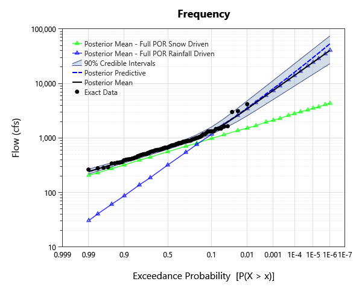

# mixed-population-examples

## Overview

Composite-distribution analysis on a synthetic mixed-population annual maximum series (snow-driven and rainfall-driven floods). Demonstrates both the competing-risks formulation (max of two populations) and the AMS-mixture formulation.

## What's Inside

### Input Data

| Element | Description |
|---|---|
| `AMS Sub-Sample - Snow Driven Floods` | Sub-sampled annual maximum series of snow-driven floods (subset of the full POR record). |
| `Full POR - Snow Driven Floods` | 100 years of annual max snow-driven flood data. |
| `Full POR - Rainfall Driven Floods` | 100-years of annual max rain-driven data. |
| `Full POR - Annual Max Series` | The annual max of the rain and snow data. |
| `AMS Sub-Sample - Rain Driven Floods` | Sub-sampled annual maximum series of rainfall-driven floods (subset of the full POR record). |
| `AMS Mixture of Flood Types` | Pooled annual maximum series combining both snow-driven and rainfall-driven floods. |

### Univariate Distribution

| Element | Description |
|---|---|
| `Full POR Snow Driven` | Bayesian LP-III fit on the full POR snow-driven flood series. |
| `Full POR Rainfall Driven` | Bayesian LP-III fit on the full POR rainfall-driven flood series. |
| `Sub-Sample - Snow Driven` | Bayesian LP-III fit on the sub-sampled snow-driven AMS. |
| `Sub-Sample - Rain Driven` | Bayesian LP-III fit on the sub-sampled rain-driven AMS. |

### Composite Distribution

| Element | Description |
|---|---|
| `Competing Flood Types` | Composite distribution combining the two population fits via the competing-risks (max of two CDFs) formulation. |
| `Mixture of Flood Types` | Composite distribution combining the two population fits via the AMS-mixture (weighted-sum of CDFs) formulation. |

## Step-by-Step Walkthrough

### Opening the Project

1. Open RMC-BestFit 2.0.
2. Select **File > Open** and navigate to `examples/4-univariate-distribution-analysis/5-composite-analysis/`.
3. Open `mixed-population-examples.bestfit`.

### Exploring the Elements

For each Composite Distribution analysis:

1. Click the analysis in the Project Explorer.
2. Inspect the underlying univariate fits in the Properties panel.
3. Open the **Frequency** tab to view the combined AEP curve.
4. Switch between **competing-risks** and **AMS-mixture** formulations in the Properties panel.

## Analysis Settings

Each Bayesian analysis in this project uses the DEMCzs sampler with project-specific iteration / warm-up settings. Open the **Properties** panel of any Univariate Distribution analysis to inspect:

- **Sampler type** (DEMCzs, ARWMH, HMC).
- **Iterations / Warm-up Iterations** — total post-warmup samples per chain.
- **Number of Chains** — typically 6 for routine work.
- **Thinning Interval** — keeps every Nth sample to reduce storage / autocorrelation.
- **Point Estimator** — Posterior Mean (default), Posterior Median, or Posterior Mode (MAP).
- **Credible Interval Width** — typically 0.90 or 0.95.

** These are applicable for the underlying univariate fits of the Composite distribution.

## Expected Results
Below are the expected results for Composite Distribution Analysis labeled "Competing Flood Types"; this should be the first analysis in the list.
Be sure to explore all of the analyses provided!

### Frequency / Quantile Table

| Probability | 95.0% CI | 5.0% CI | Posterior Predictive| Posterior Mean |
|---|---|---|---|---|
| 1E-06 | 74519.59307634977 | 23043.055438711253 | 53303.584930385914 | 40328.58386704339 | 
| 2E-06 | 63442.28519767511 | 20268.060906603358 | 45029.42488692156 | 34909.87670966961 | 
| 5E-06 | 50914.48645228911 | 16974.060656020087 | 35838.51757068133 | 28659.534842755424 | 
| 1E-05 | 42843.634535167774 | 14792.22896913906 | 30019.28503763235 | 24551.98452627458 | 
| 2E-05 | 35908.527087533264 | 12828.205673568604 | 25036.26707200655 | 20923.846079998413 | 
| 5E-05 | 28048.99451018836 | 10534.258991049504 | 19547.504838719167 | 16786.38278909963 | 
| 0.0001 | 23081.73989316945 | 8995.933633012783 | 16105.001908264609 | 14101.431069518803 | 
| 0.0002 | 18861.133012417908 | 7646.577492179918 | 13183.256813881462 | 11757.728877702602 | 
| 0.0005 | 14228.218621849359 | 6085.705908858995 | 10001.430584816675 | 9124.862745391687 | 
| 0.001 | 11343.735909792236 | 5067.628171433932 | 8031.639382544441 | 7444.962994075842 | 
| 0.002 | 8924.895798801233 | 4187.721317001647 | 6380.730625837227 | 6002.117429686751 | 
| 0.005 | 6349.87637683161 | 3183.03089865489 | 4612.796107299864 | 4415.175678512231 | 
| 0.01 | 4802.169821451778 | 2551.699339431311 | 3541.214427680541 | 3428.252606019993 | 
| 0.02 | 3532.011050213143 | 2029.6637300564416 | 2668.168860680768 | 2607.333508975283 | 
| 0.05 | 2258.2076977477786 | 1489.7071923023445 | 1801.8721932513179 | 1777.0759503975294 | 
| 0.1 | 1589.7116219510467 | 1179.72942803775 | 1352.0022254220246 | 1341.4338804409483 | 
| 0.2 | 1142.997621862699 | 926.7582963947812 | 1024.1330983087387 | 1020.8867882079461 | 
| 0.3 | 944.8617686957859 | 792.8011031462112 | 862.4832647298764 | 861.2504234307761 | 
| 0.5 | 718.828994560167 | 620.903710128933 | 667.0056309724142 | 666.8566954899402 | 
| 0.7 | 562.2951742741665 | 490.94452688226875 | 525.1451015371366 | 525.1396603301611 | 
| 0.8 | 489.1190567170544 | 426.27565220132306 | 456.5371732569042 | 456.5895906525859 | 
| 0.9 | 406.5315711877629 | 349.43698308548073 | 377.1985628605844 | 377.47132421036656 | 
| 0.95 | 350.8298326892412 | 296.9223948614993 | 322.71122372134994 | 323.32706495268434 | 
| 0.98 | 298.56036893769823 | 246.70008848738513 | 270.9421594385229 | 272.1107581062608 | 
| 0.99 | 268.7286650340908 | 217.9437506795664 | 241.13875524919075 | 242.7587977692525 | 

### Plots

*Figure: Frequency curve (AEP versus quantile), with the credible band.*

## Next Steps

- Compare **competing-risks** (max of two CDFs) versus **AMS-mixture** (weighted CDFs) for combining sub-populations.
- Use the per-population sub-fits to inform engineering judgment about flood-type frequencies.