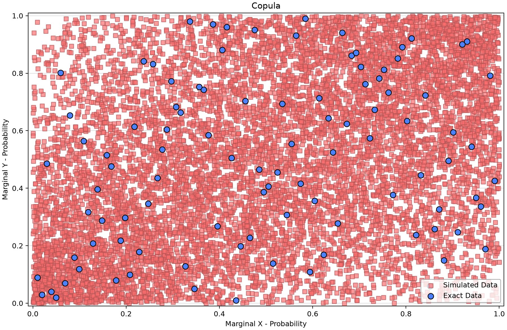
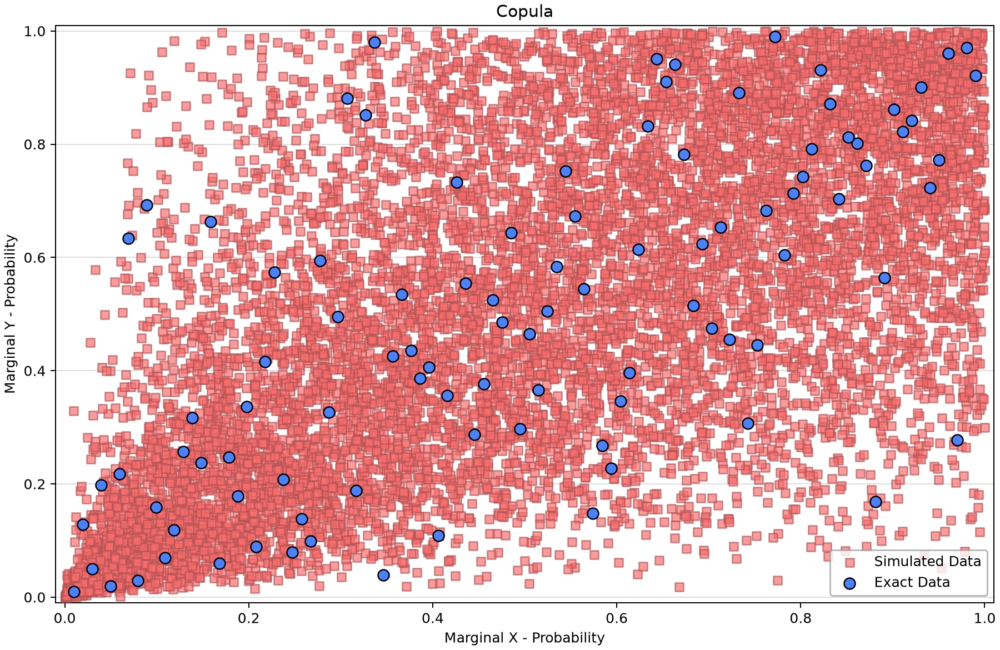
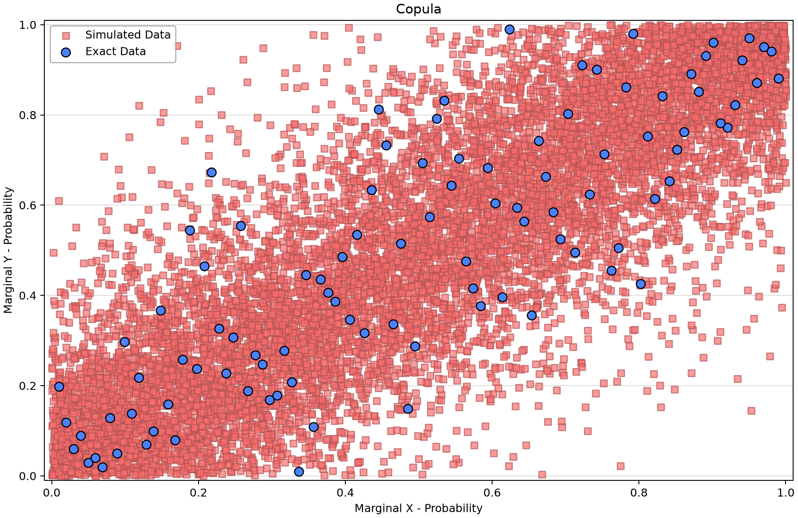
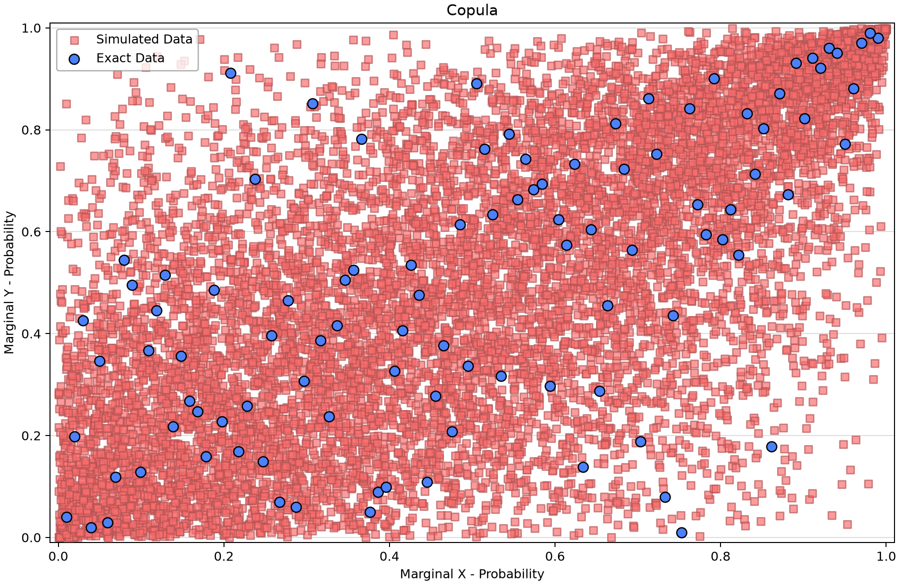
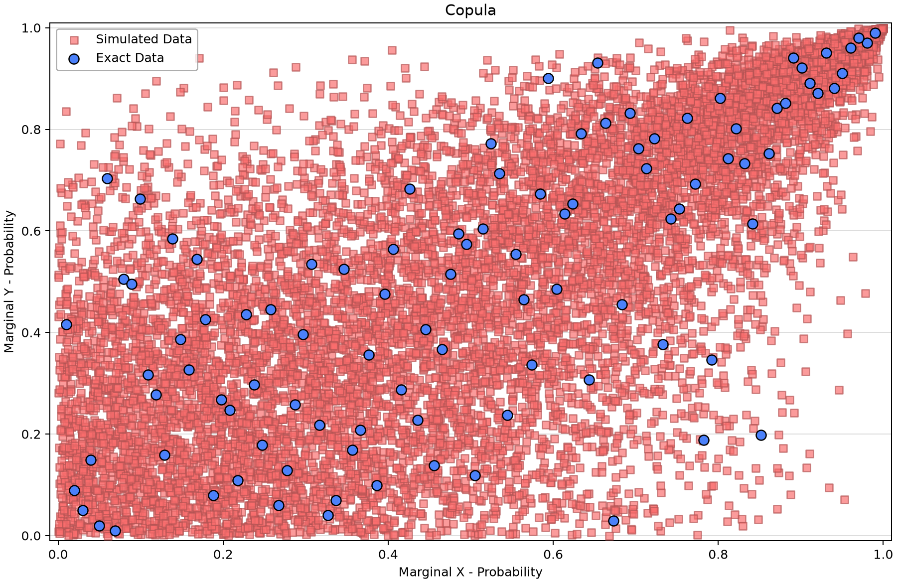
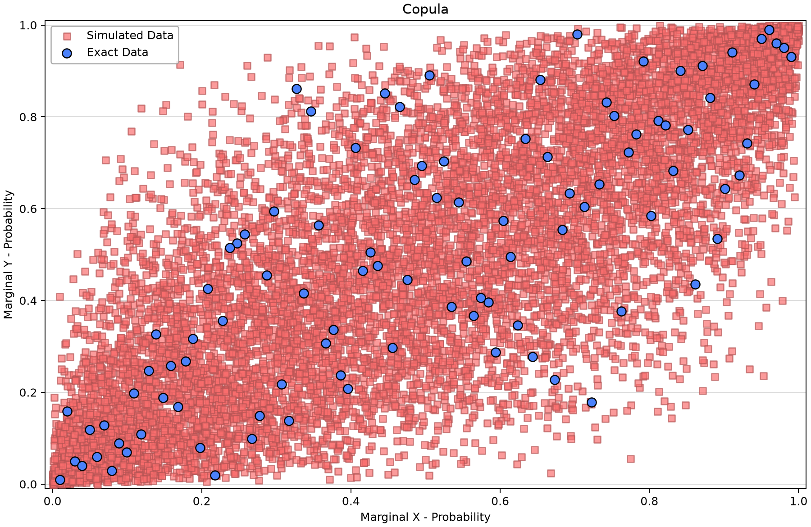
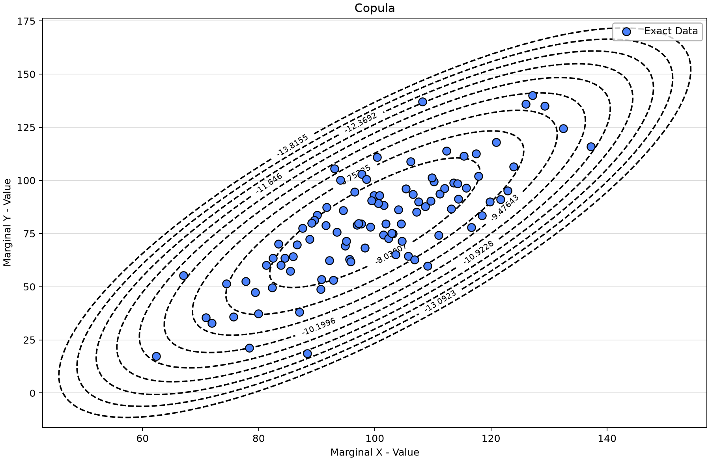
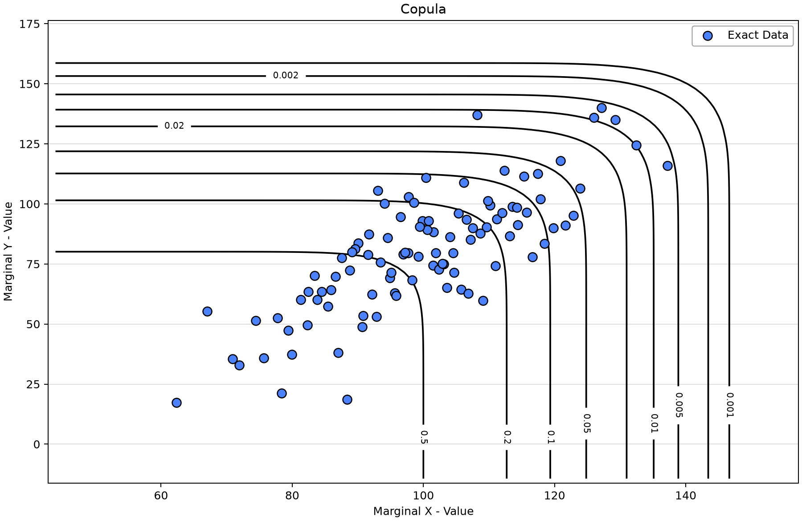
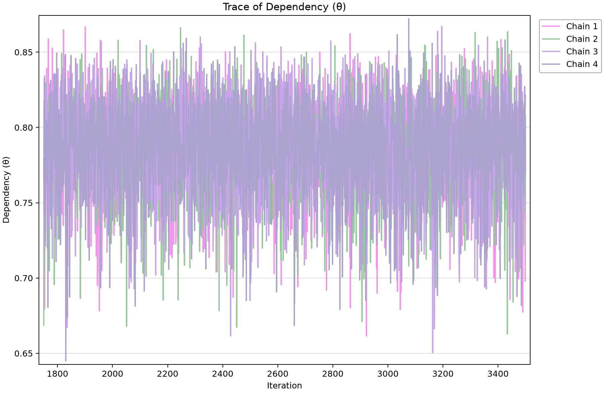

# Bivariate distributions: margins, dependence and probability contours

Open [bivariate-distribution-examples.bestfit](bivariate-distribution-examples.bestfit) and save a working copy. A marginal model describes one variable. A copula describes how the two marginal probabilities occur together. This collection has six separate paired synthetic datasets, twelve Normal marginal fits and six copula fits.

## Identify the inputs and fits

Each family has X Data and Y Data with 100 exact observations indexed 1–100 in generic Value units. There are no uncertain, interval, threshold or low-flagged observations. Pair matching indexes within the same named family; do not pair an AMH input with a Clayton input.

| Marginal fit | Distribution | Saved mean parameter | Saved SD parameter |
| --- | --- | --- | --- |
| AMH - Marginal X | Normal | 99.98 | 15.067 |
| AMH - Marginal Y | Normal | 79.977 | 25.22 |
| Clayton - Marginal X | Normal | 99.976 | 15.264 |
| Clayton - Marginal Y | Normal | 79.886 | 25.237 |
| Frank - Marginal X | Normal | 100.018 | 14.922 |
| Frank - Marginal Y | Normal | 79.801 | 27.497 |
| Gumbel - Marginal X | Normal | 100.08 | 15.061 |
| Gumbel - Marginal Y | Normal | 79.786 | 25.141 |
| Joe - Marginal X | Normal | 100.029 | 15.126 |
| Joe - Marginal Y | Normal | 79.788 | 25.575 |
| Normal - Marginal X | Normal | 100.002 | 15.083 |
| Normal - Marginal Y | Normal | 80.097 | 25.394 |

| Analysis | Copula family | Saved dependence parameter | X marginal | Y marginal |
| --- | --- | --- | --- | --- |
| AMH Copula | AliMikhailHaq | 0.813 | AMH - Marginal X | AMH - Marginal Y |
| Clayton Copula | Clayton | 1.602 | Clayton - Marginal X | Clayton - Marginal Y |
| Frank Copula | Frank | 8.958 | Frank - Marginal X | Frank - Marginal Y |
| Gumbel Copula | Gumbel | 1.922 | Gumbel - Marginal X | Gumbel - Marginal Y |
| Joe Copula | Joe | 3.001 | Joe - Marginal X | Joe - Marginal Y |
| Normal Copula | Normal | 0.785 | Normal - Marginal X | Normal - Marginal Y |

AMH means Ali–Mikhail–Haq; its saved type is AliMikhailHaq. Each copula uses InferenceFromMargins. The dependence parameter theta has a family-specific meaning and is not a directly comparable correlation coefficient across all families.

## Work through the views

1. Open the Normal marginal analyses and inspect their input bindings, parameters, priors and diagnostics.
2. Open Normal Copula and start with the scatter plot in original value space. Then switch to marginal-CDF space, where each axis represents a probability between zero and one.
3. Compare the log-density contours with joint-exceedance contours. In the original-value density view, contour labels are natural logarithms of joint density, so negative labels are expected. Log density is not an event probability; read each number with its selected plot type.
4. Repeat for the other five saved families. The datasets differ, so DIC/WAIC do not identify a winning family for a common observation set.
5. Inspect the dependence trace and tail behavior as well as the scalar diagnostics. Exact generator parameters and seeds are not established by these saved fits, so this is not a new recovery verification.

## Saved diagnostics

The current MCMC fits retain DEMCzs, seed 12345, 1,750 warmup iterations, 3,500 iterations, 10,000 output draws and 90% interval width. Chain/thinning and selected point-parameter estimates are listed below. Inspect actual prior bounds, every parameter trace and autocorrelation, and uncertainty in the quantity needed for the study. R-hat and ESS summarize the saved run; successful completion alone does not establish adequacy. Composite and coincident-frequency wrappers propagate upstream results and do not represent separate MCMC fits.
| Saved fit | Chains / thinning | Point parameters | DIC | Max R-hat | Min ESS |
| --- | --- | --- | --- | --- | --- |
| AMH Copula | 4/10 | Mean | -12.336 | 0.99990 | 7,475 |
| Clayton Copula | 4/10 | Mean | -60.997 | 1.00015 | 9,485 |
| Frank Copula | 4/10 | Mean | -110.19 | 1.00032 | 9,455 |
| Gumbel Copula | 4/10 | Mean | -66.052 | 1.00050 | 9,422 |
| Joe Copula | 4/10 | Mean | -92.864 | 0.99991 | 9,766 |
| Normal Copula | 4/10 | Mean | -95.687 | 1.00009 | 9,500 |
| AMH - Marginal X | 6/30 | Mean | 827.518 | 1.00002 | 9,485 |
| AMH - Marginal Y | 4/20 | Mean | 930.65 | 1.00022 | 9,234 |
| Clayton - Marginal X | 4/20 | Mean | 830.523 | 1.00054 | 9,560 |
| Clayton - Marginal Y | 4/20 | Mean | 930.99 | 1.00058 | 9,306 |
| Frank - Marginal X | 4/20 | Mean | 825.835 | 1.00013 | 9,290 |
| Frank - Marginal Y | 4/20 | Mean | 947.903 | 0.99992 | 9,551 |
| Gumbel - Marginal X | 4/20 | Mean | 827.792 | 1.00039 | 9,388 |
| Gumbel - Marginal Y | 4/20 | Mean | 930.551 | 1.00002 | 9,376 |
| Joe - Marginal X | 4/20 | Mean | 828.757 | 1.00053 | 9,406 |
| Joe - Marginal Y | 4/20 | Mean | 933.421 | 1.00050 | 9,370 |
| Normal - Marginal X | 4/20 | Mean | 827.918 | 1.00016 | 9,364 |
| Normal - Marginal Y | 4/20 | Mean | 932.321 | 1.00002 | 9,405 |

AMH marginal X retains six chains/thinning 30; the other marginals use four/20. Copulas use four/10. Preserve these settings. Each bivariate result table contains one saved XY query near probability one, not a 1% response quantile. The contour views evaluate the saved fitted distribution for display; they are distinct from that query row.

## Compare the figures

*AMH Copula: paired observations in marginal-CDF space for its own dataset.* [SVG](images/bivariate-distribution-examples-amh-cdf.svg) · [Plot data](images/bivariate-distribution-examples-amh-cdf.plotspec.json.gz)

*Clayton Copula: paired observations in marginal-CDF space for its own dataset.* [SVG](images/bivariate-distribution-examples-clayton-cdf.svg) · [Plot data](images/bivariate-distribution-examples-clayton-cdf.plotspec.json.gz)

*Frank Copula: paired observations in marginal-CDF space for its own dataset.* [SVG](images/bivariate-distribution-examples-frank-cdf.svg) · [Plot data](images/bivariate-distribution-examples-frank-cdf.plotspec.json.gz)

*Gumbel Copula: paired observations in marginal-CDF space for its own dataset.* [SVG](images/bivariate-distribution-examples-gumbel-cdf.svg) · [Plot data](images/bivariate-distribution-examples-gumbel-cdf.plotspec.json.gz)

*Joe Copula: paired observations in marginal-CDF space for its own dataset.* [SVG](images/bivariate-distribution-examples-joe-cdf.svg) · [Plot data](images/bivariate-distribution-examples-joe-cdf.plotspec.json.gz)

*Normal Copula: paired observations in marginal-CDF space for its own dataset.* [SVG](images/bivariate-distribution-examples-normal-cdf.svg) · [Plot data](images/bivariate-distribution-examples-normal-cdf.plotspec.json.gz)

*Normal-copula log joint-density contours in original value space; labels are natural-log densities.* [SVG](images/bivariate-distribution-examples-normal-density.svg) · [Plot data](images/bivariate-distribution-examples-normal-density.plotspec.json.gz)

*Normal-copula joint-exceedance contours; read the contour probabilities, not density.* [SVG](images/bivariate-distribution-examples-normal-joint-exceedance.svg) · [Plot data](images/bivariate-distribution-examples-normal-joint-exceedance.plotspec.json.gz)

*Saved Normal dependence-parameter chains.* [SVG](images/bivariate-distribution-examples-normal-trace.svg) · [Plot data](images/bivariate-distribution-examples-normal-trace.plotspec.json.gz)

## Interpretation

Specify the event before using a joint probability: both variables exceeding thresholds (AND), either exceeding (OR), and Kendall formulations are different questions. None is a generic scalar flood quantile. Continue to the [sum-of-two-Normals example](../2-coincident-frequency/sum-two-normals.md) to propagate dependence through a response function.

## Reproduce and check

These Python figures use BestFit desktop coordinates from a disposable copy of the saved project. No original data, fitted parameters or stored uncertainty draws were replaced. Follow the [figure-generation instructions](../../README.md#reproducing-the-figures) with `--only bivariate-distribution-examples`. SVG and compressed PlotSpec links preserve the display and its source identity.

Explain which observations support each fit, what its point curve and band represent, and which assumptions need independent study evidence before reuse.
