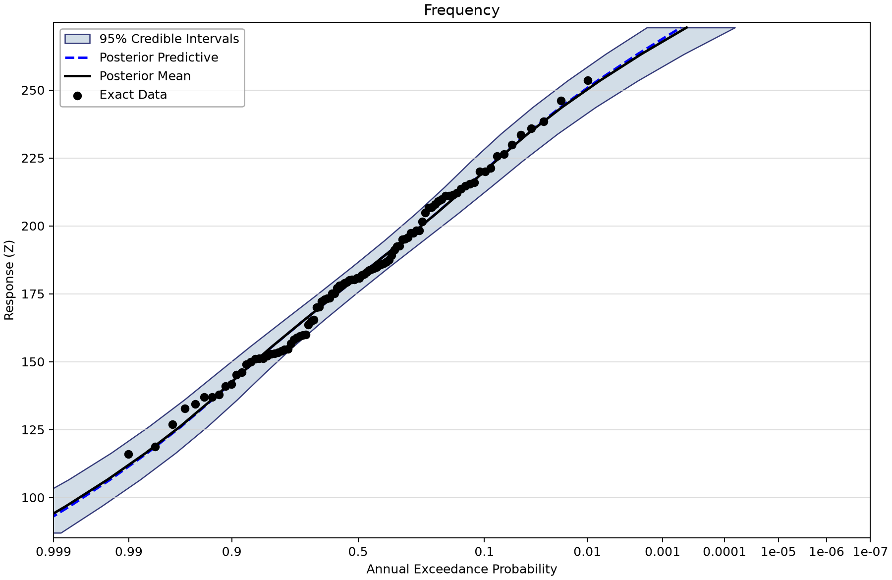
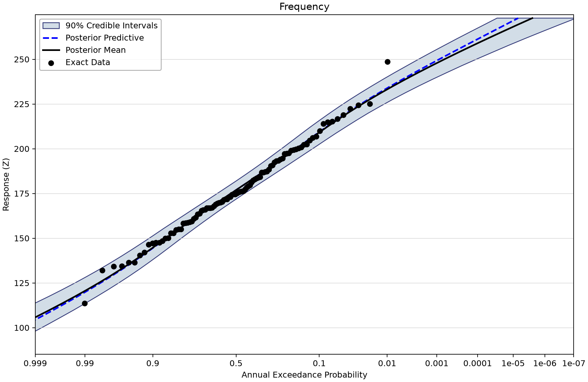
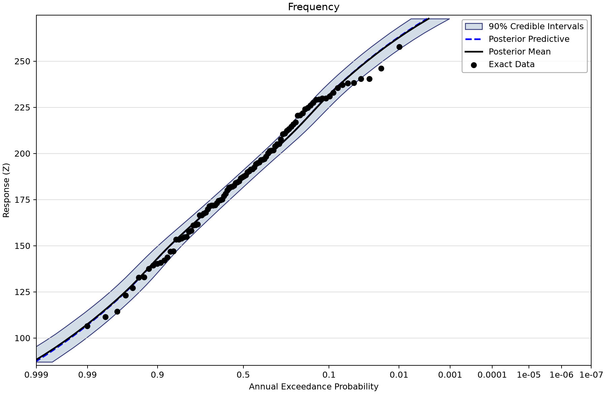
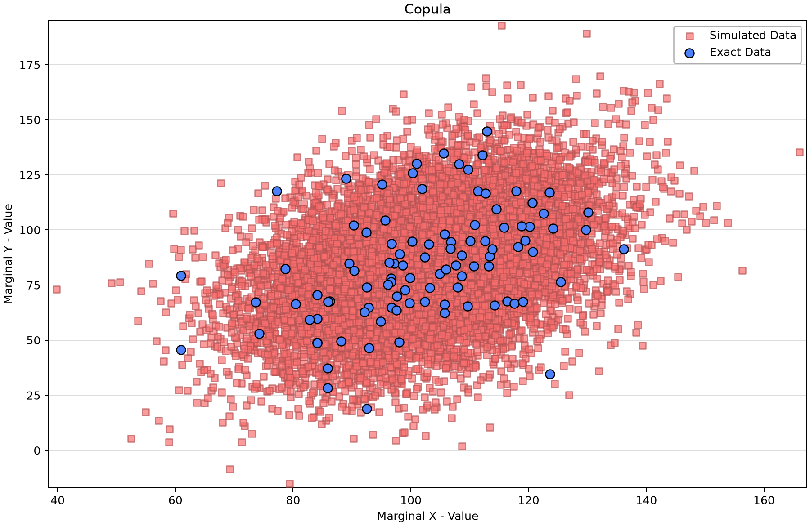
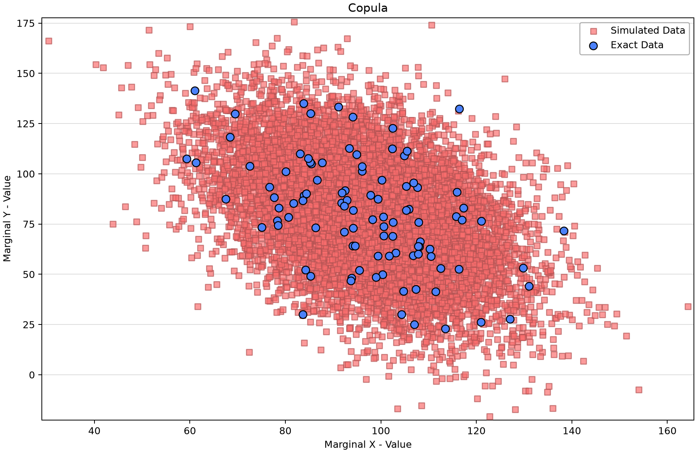

# Coincident frequency: the sum of two Normal variables

Open [sum-two-normals.bestfit](sum-two-normals.bestfit) and save a working copy. This example follows a clear chain: fit X and Y, fit their dependence, then propagate them through **Z = X + Y**. It demonstrates why the same marginal variability can produce different response tails when dependence changes.

## Inspect the scenarios

There are three nominal correlation scenarios, each with X, Y and X+Y inputs containing 100 exact values at indexes 1–100 in generic units. Names contain the nominal rho; the fitted copula correlation is estimated from its finite sample.

| Nominal scenario | Saved X mean / SD | Saved Y mean / SD | Fitted rho | CFA response bins |
| --- | --- | --- | --- | --- |
| 0.0 | 100.637403 / 14.781253 | 80.618735 / 24.484764 | 0.088550744 | 20 |
| −0.5 | 96.680088 / 15.606327 | 80.238168 / 27.424265 | −0.454016064 | 50 |
| +0.5 | 102.259104 / 14.709635 | 84.477595 / 25.259022 | 0.398218880 | 50 |

All three 7×7 response grids have X coordinates 65, 75, 90, 100, 110, 125, 135 and Y coordinates 22, 39, 63, 80, 97, 121, 138. Every saved cell equals X+Y. Response outputs span 87–273. The [source workbook](sum-two-normals-data.xlsx) is available for the generating setup; these tables describe the current saved fits.

## Work through the example

1. Open the two marginal fits and Normal Copula for nominal rho 0.0. Inspect their exact input bindings.
2. Open CFA - Rho = 0.0. Confirm its selected copula, X+Y response input, grid and 20 response bins.
3. Repeat for nominal −0.5 and +0.5; these use 50 bins. Preserve the differences when comparing discrete tabulated outputs.
4. Read a CFA table row as **AEP at a fixed response Z**, not as a response quantile at a fixed AEP.
5. Compare the plots' horizontal uncertainty bounds at the same Z. Upstream Bayesian fits retain 90% intervals, while the near-zero CFA result retains **95%** intervals and the negative/positive CFA results retain **90%** intervals.

For jointly Normal variables, the sum's mean is muX + muY and its variance is sigmaX² + sigmaY² + 2 rho sigmaX sigmaY. This relationship explains the direction of dependence effects. It does not authorize replacing a saved finite-grid CFA result with an analytic curve.

## Saved diagnostics and response rows

The current MCMC fits retain DEMCzs, seed 12345, 1,750 warmup iterations, 3,500 iterations, 10,000 output draws and 90% interval width. Chain/thinning and selected point-parameter estimates are listed below. Inspect actual prior bounds, every parameter trace and autocorrelation, and uncertainty in the quantity needed for the study. R-hat and ESS summarize the saved run; successful completion alone does not establish adequacy. Composite and coincident-frequency wrappers propagate upstream results and do not represent separate MCMC fits.
| Saved fit | Chains / thinning | Point parameters | DIC | Max R-hat | Min ESS |
| --- | --- | --- | --- | --- | --- |
| Normal Copula - Rho = 0.0 | 4/10 | Mean | 1.021 | 0.99998 | 9,457 |
| Normal Copula - Rho = -0.5 | 4/10 | Mean | -22.153 | 1.00026 | 9,189 |
| Normal Copula - Rho =+0.5 | 4/10 | Mean | -16.217 | 1.00088 | 9,290 |
| X Marginal - Rho = 0.0 | 4/20 | Mean | 824.045 | 1.00030 | 9,321 |
| Y Marginal - Rho = 0.0 | 4/20 | Mean | 924.774 | 1.00079 | 8,771 |
| X Marginal - Rho = -0.5 | 4/20 | Mean | 834.874 | 0.99996 | 9,769 |
| Y Marginal - Rho = -0.5 | 4/20 | Mean | 947.472 | 0.99995 | 9,278 |
| X Marginal - Rho = +0.5 | 4/20 | Mean | 822.94 | 1.00061 | 9,437 |
| Y Marginal - Rho =+0.5 | 4/20 | Mean | 931.152 | 1.00018 | 9,486 |

| CFA | Fixed response Z | Saved AEP point | Probability bounds | Width |
| --- | --- | --- | --- | --- |
| CFA - Rho = 0.0 | 135.947 | 0.931373 | 0.890485–0.96115 | 95% |
| CFA - Rho = 0.0 | 184.895 | 0.449537 | 0.375522–0.524639 | 95% |
| CFA - Rho = 0.0 | 233.842 | 0.0426435 | 0.0214771–0.073852 | 95% |
| CFA - Rho = -0.5 | 132.551 | 0.9621 | 0.932147–0.98229 | 90% |
| CFA - Rho = -0.5 | 181.898 | 0.418483 | 0.336907–0.500623 | 90% |
| CFA - Rho = -0.5 | 227.449 | 0.0200105 | 0.00805294–0.0399749 | 90% |
| CFA - Rho = +0.5 | 132.551 | 0.939866 | 0.912128–0.961259 | 90% |
| CFA - Rho = +0.5 | 181.898 | 0.555414 | 0.499386–0.609683 | 90% |
| CFA - Rho = +0.5 | 227.449 | 0.122184 | 0.0891043–0.160763 | 90% |

Rows are selected existing output positions, without interpolation. The interval bounds are probabilities. Wrapper zeros for DIC, AIC or RMSE are not measured model-comparison scores. Because the three scenarios have different samples as well as dependence, do not attribute every difference to rho alone.

## Read the figures

*CFA - Rho = 0.0: AEP at fixed sum response with 95% probability bounds.* [SVG](images/sum-two-normals-near-zero-response.svg) · [Plot data](images/sum-two-normals-near-zero-response.plotspec.json.gz)

*CFA - Rho = -0.5: AEP at fixed sum response with 90% probability bounds.* [SVG](images/sum-two-normals-negative-response.svg) · [Plot data](images/sum-two-normals-negative-response.plotspec.json.gz)

*CFA - Rho = +0.5: AEP at fixed sum response with 90% probability bounds.* [SVG](images/sum-two-normals-positive-response.svg) · [Plot data](images/sum-two-normals-positive-response.plotspec.json.gz)

*Positive nominal scenario in original marginal value space; its fitted rho is about 0.398.* [SVG](images/sum-two-normals-positive-scatter.svg) · [Plot data](images/sum-two-normals-positive-scatter.plotspec.json.gz)

*Negative nominal scenario; its fitted rho is about −0.454.* [SVG](images/sum-two-normals-negative-scatter.svg) · [Plot data](images/sum-two-normals-negative-scatter.plotspec.json.gz)

## Reproduce and check

These Python figures use BestFit desktop coordinates from a disposable copy of the saved project. No original data, fitted parameters or stored uncertainty draws were replaced. Follow the [figure-generation instructions](../../README.md#reproducing-the-figures) with `--only sum-two-normals`. SVG and compressed PlotSpec links preserve the display and its source identity.

Explain which observations support each fit, what its point curve and band represent, and which assumptions need independent study evidence before reuse.
