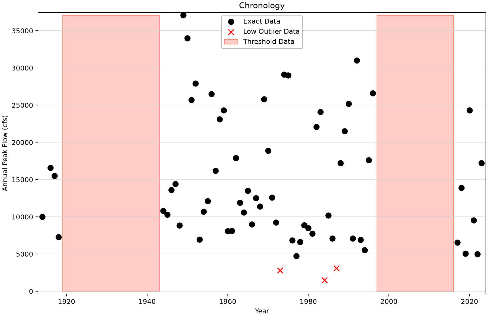
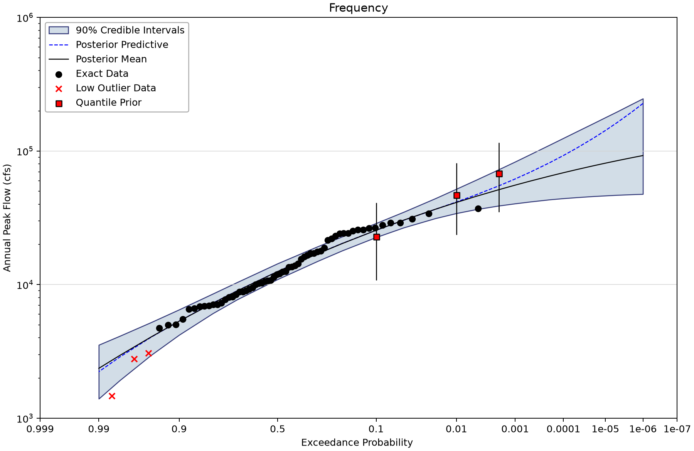
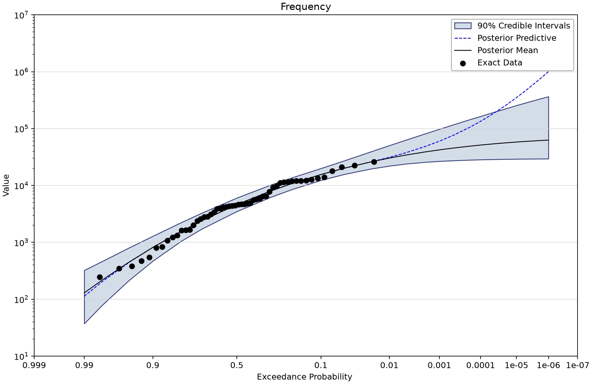
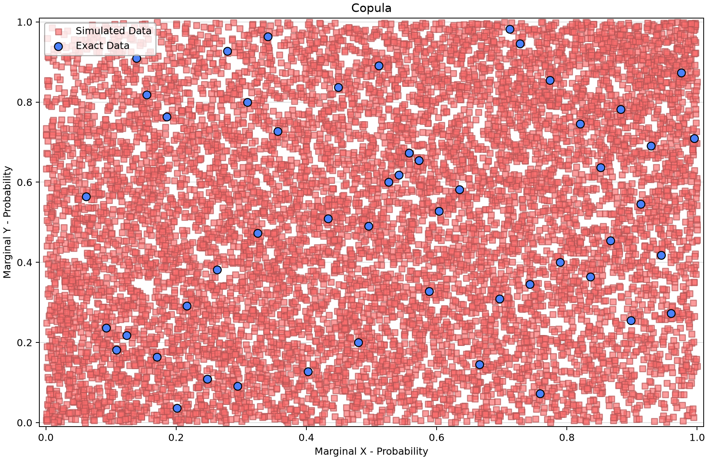
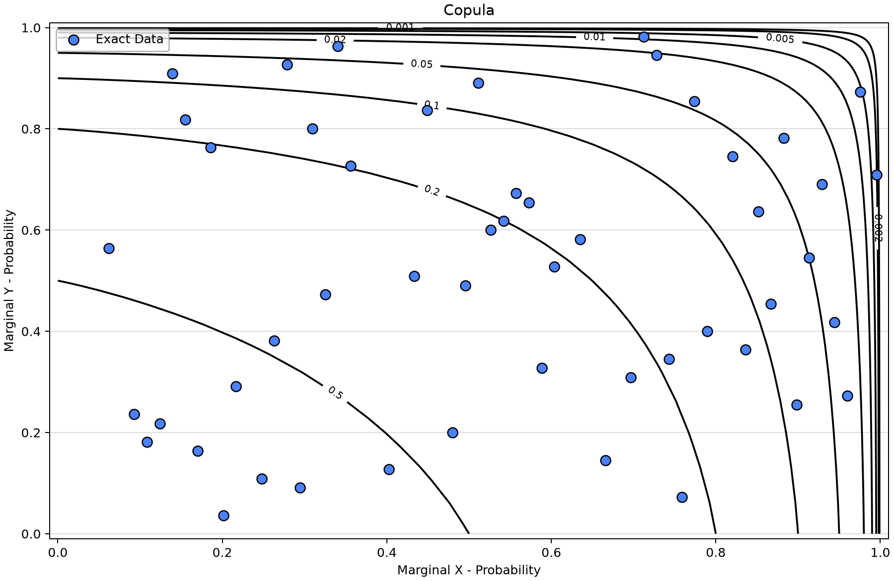
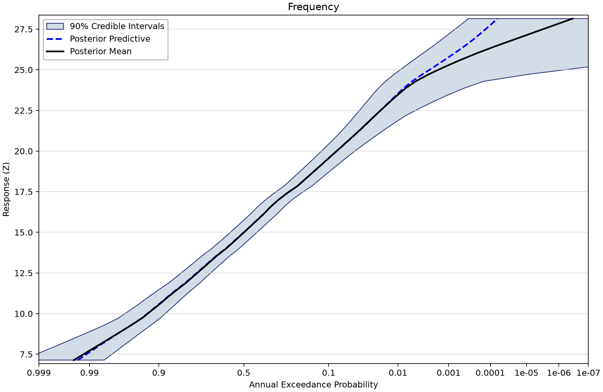

# Waimea and Makaweli: marginals, event pairing and response frequency

Open [waimea-river-stage-frequency.bestfit](waimea-river-stage-frequency.bestfit) and save a working copy. This advanced example connects historical information and priors in marginal flow models, dependence between paired observations, and a supplied response surface. Complete the [copula](../1-bivariate-distributions/bivariate-distribution-examples.md) and [sum-of-two-Normals](sum-two-normals.md) tutorials first.

**Study context is incomplete.** The meaning of RR, Makaweli flow units, conditional event selection, and the hydraulic response's physical quantity, location, units and datum require the project author's explanation. The filename alone does not establish them. This tutorial uses the neutral term response Z and preserves the saved labels and results.

## Inspect the four inputs

| Input | Meaning | Exact count (index span) | Other records |
| --- | --- | --- | --- |
| 16031000_Waimea_Peaks | Waimea annual peaks: 64 exact observations, 1914–2023, cfs. Three low flags (1973, 1984, 1987); 1919–1943 and 1997–2016 perception windows at 37,100 cfs with below counts 25/20 and above counts zero. | 64 (1914–2023) | Uncertain 0; intervals 0; windows 2; low flags 3. |
| 16036000_Makaweli_Peaks | Makaweli annual peaks: 75 exact values, 1945–2019; saved unit label Value, physical units awaiting confirmation. No low flags or perception windows. | 75 (1945–2019) | Uncertain 0; intervals 0; windows 0; low flags 0. |
| 16036000_Makaweli_Conditional_Peaks | 54 exact conditional Makaweli values, 1946–2019; saved unit Value. Event-selection provenance and units need confirmation. No low flags or perception windows. | 54 (1946–2019) | Uncertain 0; intervals 0; windows 0; low flags 0. |
| Simulated Proof | 10,000 exact generic values indexed 1–10,000. Retained simulation evidence with no current CFA InputData binding; purpose and provenance require confirmation. | 10000 (1–10000) | Uncertain 0; intervals 0; windows 0; low flags 0. |

Historical windows inform Waimea's marginal likelihood; they do not create additional measured pairs. Ordinary annual peaks share 55 exact indexes, while the conditional inputs share 54. Excluding Waimea's three flagged low values leaves **52 and 51 eligible copula pairs** under the current matching rules. Two annual maxima in the same year are not necessarily simultaneous floods.

## Trace the marginal information

There are seven current LP3 alternatives. The RR alternatives enable three LogNormal quantile priors. The following parameters are in **base-10 log space**, not natural-flow means and SDs.

| Site | AEP | Prior log10 mean | Prior log10 SD |
| --- | --- | --- | --- |
| Waimea | 0.1 | 4.3234 | 0.1758 |
| Waimea | 0.01 | 4.6408 | 0.163401346 |
| Waimea | 0.002 | 4.8037 | 0.1578 |
| Makaweli | 0.1 | 4.2028 | 0.1758 |
| Makaweli | 0.01 | 4.474 | 0.1634 |
| Makaweli | 0.002 | 4.6175 | 0.1578 |

The two RSkew alternatives disable default flat priors and use a Normal prior on LP3 log-skew, mean −0.157 and SD 0.46. Mean-of-log-flow and scale retain Uniform bounds approximately 0–6 and positive–2, with Jeffreys scale treatment enabled. These are Bayesian parameter priors; do not substitute the separate Bulletin 17C weighted-skew interpretation. Source and regional applicability remain to be documented.

## Follow the analysis connections

1. Open WaimeaPk - Exact + Historical and compare its input chronology with the RR-prior and RR-prior/RSkew alternatives. Identify each distinct information source.
2. Inspect the Makaweli marginal alternatives. Keep the conditional input separate from ordinary annual peaks.
3. Open each ordinary copula. All six use WaimeaPk - Exact + Historical + RR Prior_RSkew as X and MakaweliPk - Exact + RR Prior_RSkew as Y.
4. Open Normal Copula - Conditional. It keeps the Waimea X margin and uses MakaweliPk - Cond - Exact as Y. Different paired observations prevent a direct common-data ranking against the ordinary copulas.
5. Open CFA - Normal - Conditional. Inspect its 10×5 response grid and 50 response outputs. Its InputData binding is empty; Simulated Proof is not an observed-response overlay for this analysis.

| Analysis | Copula family | Saved dependence parameter | X marginal | Y marginal |
| --- | --- | --- | --- | --- |
| Normal Copula | Normal | 0.689 | WaimeaPk - Exact + Historical + RR Prior_RSkew | MakaweliPk - Exact + RR Prior_RSkew |
| Gumbel Copula | Gumbel | 1.708 | WaimeaPk - Exact + Historical + RR Prior_RSkew | MakaweliPk - Exact + RR Prior_RSkew |
| Clayton Copula | Clayton | 1.982 | WaimeaPk - Exact + Historical + RR Prior_RSkew | MakaweliPk - Exact + RR Prior_RSkew |
| Joe Copula | Joe | 1.829 | WaimeaPk - Exact + Historical + RR Prior_RSkew | MakaweliPk - Exact + RR Prior_RSkew |
| Frank Copula | Frank | 5.388 | WaimeaPk - Exact + Historical + RR Prior_RSkew | MakaweliPk - Exact + RR Prior_RSkew |
| AMH Copula | AliMikhailHaq | 1 | WaimeaPk - Exact + Historical + RR Prior_RSkew | MakaweliPk - Exact + RR Prior_RSkew |
| Normal Copula - Conditional | Normal | 0.167 | WaimeaPk - Exact + Historical + RR Prior_RSkew | MakaweliPk - Cond - Exact |

Every copula uses InferenceFromMargins. AMH's point estimate is about 0.999995, near its upper bound; good-looking scalar diagnostics do not resolve that boundary behavior or establish tail suitability. The saved copula query at (0,0) returns probability one and is not a useful flood-return-period result.

## Saved results and diagnostics

The current MCMC fits retain DEMCzs, seed 12345, 1,750 warmup iterations, 3,500 iterations, 10,000 output draws and 90% interval width. Chain/thinning and selected point-parameter estimates are listed below. Inspect actual prior bounds, every parameter trace and autocorrelation, and uncertainty in the quantity needed for the study. R-hat and ESS summarize the saved run; successful completion alone does not establish adequacy. Composite and coincident-frequency wrappers propagate upstream results and do not represent separate MCMC fits.
| Saved fit | Chains / thinning | Point parameters | DIC | Max R-hat | Min ESS |
| --- | --- | --- | --- | --- | --- |
| Normal Copula | 4/10 | Mean | -31.426 | 0.99988 | 9,314 |
| Gumbel Copula | 4/10 | Mode | -23.767 | 1.00109 | 9,694 |
| Clayton Copula | 4/10 | Mode | -31.725 | 0.99991 | 9,145 |
| Joe Copula | 4/10 | Mode | -18.594 | 1.00022 | 9,359 |
| Frank Copula | 4/10 | Mode | -29.873 | 1.00065 | 9,767 |
| AMH Copula | 4/10 | Mode | -24.041 | 1.00100 | 5,590 |
| Normal Copula - Conditional | 4/10 | Mean | 0.323 | 0.99977 | 9,349 |
| MakaweliPk - Exact | 4/20 | Mode | 1,476.621 | 1.00058 | 8,841 |
| WaimeaPk - Exact + Historical + RR Prior | 6/30 | Mean | 1,280.318 | 1.00036 | 9,272 |
| WaimeaPk - Exact + Historical | 4/20 | Mode | 1,280.653 | 1.00068 | 8,843 |
| MakaweliPk - Exact + RR Prior | 4/20 | Mode | 1,476.345 | 1.00078 | 9,030 |
| MakaweliPk - Exact + RR Prior_RSkew | 6/30 | Mode | 1,476.071 | 1.00046 | 9,258 |
| WaimeaPk - Exact + Historical + RR Prior_RSkew | 6/30 | Mean | 1,280.42 | 1.00041 | 9,010 |
| MakaweliPk - Cond - Exact | 6/30 | Mean | 1,060.354 | 1.00058 | 9,374 |

| Analysis | Saved 1% AEP point | 90% bounds |
| --- | --- | --- |
| MakaweliPk - Exact | 24,635.987 | 21,434.962–36,905.435 |
| WaimeaPk - Exact + Historical + RR Prior | 39,832.633 | 33,513.611–50,415.124 |
| WaimeaPk - Exact + Historical | 36,587.137 | 33,339.818–51,693.798 |
| MakaweliPk - Exact + RR Prior | 24,781.808 | 21,502.94–34,741.177 |
| MakaweliPk - Exact + RR Prior_RSkew | 25,442.471 | 21,797.812–35,103.51 |
| WaimeaPk - Exact + Historical + RR Prior_RSkew | 41,247.679 | 34,184.13–51,990.154 |
| MakaweliPk - Cond - Exact | 30,308.621 | 22,039.376–50,429.454 |

Waimea values are cfs; Makaweli retains the saved Value label pending confirmation. These quantiles use **current AnalysisResults**, as read by the current univariate loader, and the configured point-parameter estimator. Seven rows also retain different legacy FrequencyAnalysisResults. Both payloads remain unchanged; they must not be combined.

The conditional CFA saves 10,000 output draws and 90% probability bounds at fixed Z. The response surface spans 7.14–28.15, with 50 output positions. Selected existing rows are:

| CFA | Fixed response Z | Saved AEP point | Probability bounds | Width |
| --- | --- | --- | --- | --- |
| CFA - Normal - Conditional | 12.285 | 0.776525 | 0.710759–0.843447 | 90% |
| CFA - Normal - Conditional | 17.859 | 0.208193 | 0.151021–0.27062 | 90% |
| CFA - Normal - Conditional | 23.005 | 0.0139775 | 0.0022503–0.0321982 | 90% |

## Read the current figures

*Waimea annual peaks, low flags and retained historical perception windows.* [SVG](images/waimea-river-stage-frequency-waimea-chronology.svg) · [Plot data](images/waimea-river-stage-frequency-waimea-chronology.plotspec.json.gz)

*Current Waimea marginal curve with enabled quantile priors and a saved log-skew prior.* [SVG](images/waimea-river-stage-frequency-waimea-priors.svg) · [Plot data](images/waimea-river-stage-frequency-waimea-priors.plotspec.json.gz)

*Current conditional Makaweli marginal result; the saved unit label is Value.* [SVG](images/waimea-river-stage-frequency-makaweli-conditional.svg) · [Plot data](images/waimea-river-stage-frequency-makaweli-conditional.plotspec.json.gz)

*Conditional paired data in marginal-CDF space, with 51 eligible pairs.* [SVG](images/waimea-river-stage-frequency-conditional-cdf.svg) · [Plot data](images/waimea-river-stage-frequency-conditional-cdf.plotspec.json.gz)

*Conditional joint-exceedance contours in marginal-CDF space.* [SVG](images/waimea-river-stage-frequency-conditional-joint-exceedance.svg) · [Plot data](images/waimea-river-stage-frequency-conditional-joint-exceedance.plotspec.json.gz)

*Saved probability bounds at fixed response Z; physical quantity and units await source confirmation.* [SVG](images/waimea-river-stage-frequency-conditional-response.svg) · [Plot data](images/waimea-river-stage-frequency-conditional-response.plotspec.json.gz)

## Retained legacy material and unresolved evidence

Ten legacy Bayesian Estimation Analysis records remain in the database, including names containing RgSkew, MGBT, Censored and SCALED. Their input names do not resolve exactly to current inputs; their binary results require the compatibility loader. They are preserved records, not automatically failed runs or current drainage-area-scaling alternatives.

The separate fitting analysis 16031000_WaimeaPk binds the current Waimea input and contains **15 successful, visible distribution fits**. Current AnalysisXml is estimated, while the old IsFitted flag is zero. The current loader prioritizes AnalysisXml. No populated fit or conflicting flag has been deleted or repaired.

The author follow-up log records the prior sources, regional applicability, Makaweli units, conditional selection, hydraulic response definition, Simulated Proof role and legacy-result conflicts. These are necessary study decisions before design interpretation. A readable saved curve does not supply the missing evidence.

## Reproduce and check

These Python figures use BestFit desktop coordinates from a disposable copy of the saved project. No original data, fitted parameters or stored uncertainty draws were replaced. Follow the [figure-generation instructions](../../README.md#reproducing-the-figures) with `--only waimea-river-stage-frequency`. SVG and compressed PlotSpec links preserve the display and its source identity.

Explain which observations support each fit, what its point curve and band represent, and which assumptions need independent study evidence before reuse.
