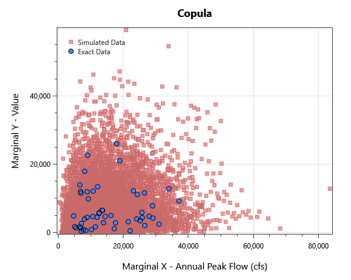

# waimea-river-stage-frequency

## Overview

Coincident peak-flow analysis for the Waimea River and Makaweli River, Kauai, Hawaii. Demonstrates joint Bayesian peak-flow estimation with regional skew, drainage-area scaling, and historical-record conditioning, then derives a coincident peak-flow distribution via the Normal copula.

## What's Inside

### Input Data

| Element | Description |
|---|---|
| `16031000_Waimea_Peaks` | Annual peak discharge for the Waimea River at Waimea, Kauai, HI (USGS gage 16031000). |
| `16036000_Makaweli_Peaks` | Annual peak discharge for the Makaweli River, Kauai, HI (USGS gage 16036000). |
| `16036000_Makaweli_Conditional_Peaks` | Conditional Makaweli peak series — Makaweli peaks observed coincidentally with Waimea peaks. |
| `Simulated Proof` | Simulated dataset used to verify the conditional copula machinery against ground truth. |

### Distribution Fitting Analysis

| Element | Description |
|---|---|
| `16031000_WaimeaPk` | Distribution-fitting comparison across LP-III, GEV, Gumbel, etc. on the Waimea peak series. |

### Bayesian Estimation Analysis

| Element | Description |
|---|---|
| `16031000_WaimeaPk` | Bayesian peak-flow estimation for Waimea (legacy element — see <Univariate Distribution> for current fits). |
| `16036000_MakaweliPk` | Bayesian peak-flow estimation for Makaweli (legacy element). |
| `16031000_WaimeaPk_RgSkew` | Bayesian Waimea fit with regional skew prior (legacy element). |
| `16036000_MakaweliPk_RgSkew` | Bayesian Makaweli fit with regional skew prior (legacy element). |
| `16031000_WaimeaPk_RgSkew_MGBT` | Bayesian Waimea fit with regional skew + Multiple Grubbs-Beck Test low-outlier detection (legacy). |
| `16036000_MakaweliPk_RgSkew_Censored` | Bayesian Makaweli fit with regional skew + low-outlier censoring (legacy). |
| `16036000_MakaweliPk_SCALED2Waimea` | Makaweli fit drainage-area scaled to the Waimea reference area (legacy). |
| `16031000_WaimeaPk_SCALED2Makaweli` | Waimea fit drainage-area scaled to the Makaweli reference area (legacy). |
| `16031000_WaimeaPk_SCALED2_85sqmi` | Waimea fit drainage-area scaled to a 85-sqmi reference (legacy). |
| `16036000_MakaweliPk_SCALED2_85sqmi` | Makaweli fit drainage-area scaled to a 85-sqmi reference (legacy). |

### Univariate Distribution

| Element | Description |
|---|---|
| `MakaweliPk - Exact` | Bayesian LP-III fit on the Makaweli systematic peak record (exact data only). |
| `WaimeaPk - Exact + Historical + RR Prior` | Bayesian LP-III fit for Waimea with historical record extension and a runoff-ratio prior. |
| `WaimeaPk - Exact + Historical` | Bayesian LP-III fit for Waimea with historical record extension only. |
| `MakaweliPk - Exact + RR Prior` | Bayesian LP-III fit for Makaweli using exact data and a runoff-ratio prior. |
| `MakaweliPk - Exact + RR Prior_RSkew` | Bayesian Makaweli fit with runoff-ratio prior + regional skew weighting. |
| `WaimeaPk - Exact + Historical + RR Prior_RSkew` | Bayesian Waimea fit with historical record + runoff-ratio prior + regional skew weighting. |
| `MakaweliPk - Cond - Exact` | Bayesian LP-III fit on the conditional Makaweli peak series (Makaweli peaks at Waimea events). |

### Bivariate Distribution

| Element | Description |
|---|---|
| `Normal Copula` | Bivariate Normal copula fit linking the Waimea and Makaweli peak marginals. |
| `Gumbel Copula` | Bivariate Gumbel copula fit linking the Waimea and Makaweli peak marginals. |
| `Clayton Copula` | Bivariate Clayton copula fit linking the Waimea and Makaweli peak marginals. |
| `Joe Copula` | Bivariate Joe copula fit linking the Waimea and Makaweli peak marginals. |
| `Frank Copula` | Bivariate Frank copula fit linking the Waimea and Makaweli peak marginals. |
| `AMH Copula` | Bivariate AMH copula fit linking the Waimea and Makaweli peak marginals. |
| `Normal Copula - Conditional` | Conditional Normal copula fit using the conditional Makaweli marginal. |

### Coincident Frequency

| Element | Description |
|---|---|
| `CFA - Normal - Conditional` | Coincident frequency analysis combining the conditional copula and marginals to produce the joint Waimea + Makaweli peak-flow distribution. |

## Step-by-Step Walkthrough

### Opening the Project

1. Open RMC-BestFit 2.0.
2. Select **File > Open** and navigate to `examples/5-bivariate-distribution-analysis/2-coincident-frequency/`.
3. Open `waimea-river-stage-frequency.bestfit`.

### Exploring the Elements
For each Coincident Frequency Analysis:

1. Click the analysis in the Project Explorer.
2. Open the **Frequency Plot** tab at the top to view the derived response-variable AEP curve.
3. Adjust the **X / Y ordinates** in the Properties panel to refine the response surface.

## Analysis Settings

Each Bayesian analysis in this project uses the DEMCzs sampler with project-specific iteration / warm-up settings. Open the **Properties** panel of any Bivariate Distribution Analysis (NOT the Coincident Frequency Analysis element) to inspect:

- **Iterations / Warm-up Iterations** — total post-warmup samples per chain.
- **Number of Chains** — typically 6 for routine work.
- **Thinning Interval** — keeps every Nth sample to reduce storage / autocorrelation.
- **Point Estimator** — Posterior Mean (default), Posterior Median, or Posterior Mode (MAP).
- **Credible Interval Width** — typically 0.90 or 0.95.

## Expected Results
Below are the expected results for Coincident Frequency Analysis labeled "CFA - Normal - Conditional"; this should be the only CFA in the list.
Be sure to explore all of the analyses provided!

### Frequency / Quantile Table
Select the **Tabular Results** tab at the top to see the frequency plot's value at each return level probability.

| Response Value | 97.5% CI | 2.5% CI | Posterior Predictive | Posterior Mean |
|---|---|---|---|---|
| 7.14 | 0.999598853349256 | 0.9822736153183459 | 0.9939375860433544 | 0.9949507109374724 | 
| 7.568775510204081 | 0.998992633505899 | 0.9751139659037453 | 0.9907136406885692 | 0.991713014185094 | 
| 7.997551020408163 | 0.9976976594194389 | 0.9657107403795586 | 0.9859701486370981 | 0.9868155773145066 | 
| 8.426326530612245 | 0.9951399769214387 | 0.9535796232730303 | 0.9791221668692526 | 0.9796567296997515 | 
| 8.855102040816327 | 0.9904203859035741 | 0.9381901227534936 | 0.9694422936550987 | 0.9695425576935874 | 
| 9.283877551020408 | 0.9825974772449797 | 0.9193613702569976 | 0.9560742613165246 | 0.95572590988006 | 
| 9.71265306122449 | 0.9709379340863057 | 0.896072407078915 | 0.9387025860669641 | 0.9380434651962304 | 
| 10.141428571428571 | 0.9590321362549451 | 0.8736553675865412 | 0.9214522379480089 | 0.9203697134040612 | 
| 10.570204081632653 | 0.9434842855528288 | 0.8475568979008056 | 0.9003846421165421 | 0.8989656628009409 | 
| 10.998979591836735 | 0.9257811833836075 | 0.8198583614785113 | 0.8769782160857079 | 0.875143645278772 | 
| 11.427755102040816 | 0.902779848570538 | 0.7866596190760782 | 0.8485968144731343 | 0.8462781115411291 | 
| 11.856530612244898 | 0.87329254874581 | 0.7476759718018776 | 0.8140108343560754 | 0.81133967585813 | 
| 12.28530612244898 | 0.8435633851807174 | 0.7101600843275624 | 0.7795891376739831 | 0.7767387509457312 | 
| 12.71408163265306 | 0.8109673052969281 | 0.6692210788980608 | 0.7420207987900213 | 0.7391275866926545 | 
| 13.142857142857142 | 0.7751233461090515 | 0.6257236765307417 | 0.7017537398355265 | 0.6989679882428308 | 
| 13.571632653061224 | 0.735492222790967 | 0.5800419687989538 | 0.6583967275836747 | 0.6560351878865632 | 
| 14.000408163265305 | 0.6867740374439698 | 0.5274612527039573 | 0.6068498245211181 | 0.6047089906043757 | 
| 14.429183673469387 | 0.6426544666024442 | 0.4811312903252858 | 0.5610771938950695 | 0.5591831796954536 | 
| 14.857959183673469 | 0.5971552730053807 | 0.43498382774138133 | 0.5147994661168663 | 0.5131978859597698 | 
| 15.286734693877552 | 0.551391048200534 | 0.3909212623915677 | 0.46901828233088655 | 0.46773858675813307 | 
| 15.715510204081632 | 0.505439810166183 | 0.34845544105148096 | 0.42449848666695345 | 0.42356489972882405 | 
| 16.144285714285715 | 0.46026868202171217 | 0.3070522085346464 | 0.38064430888923545 | 0.38009572261449287 | 
| 16.573061224489795 | 0.41933517837328554 | 0.27131477471237936 | 0.34227383009442636 | 0.34203011924043003 | 
| 17.001836734693878 | 0.37318005689947487 | 0.2326905156308874 | 0.2998219939577745 | 0.30026468086384983 | 
| 17.430612244897958 | 0.32252516977836154 | 0.1914503132754313 | 0.25385910192505645 | 0.2543238333756812 | 
| 17.85938775510204 | 0.2705946189260725 | 0.15067212169511615 | 0.2077453166949087 | 0.20802436530468937 | 
| 18.28816326530612 | 0.2345279059175711 | 0.12327148189975427 | 0.17563114927017315 | 0.17582924074636608 | 
| 18.716938775510204 | 0.20100407285146754 | 0.09929447154133551 | 0.1467503362965446 | 0.14693243477858042 | 
| 19.145714285714284 | 0.17069807087558242 | 0.07872028292859645 | 0.12134021905793459 | 0.12157385883802818 | 
| 19.574489795918367 | 0.1439854205742417 | 0.061233131882399476 | 0.09932106799716632 | 0.09958910351514627 | 
| 20.003265306122447 | 0.12042920458589632 | 0.04653494988115461 | 0.08021986440578467 | 0.08051029493294004 | 
| 20.43204081632653 | 0.09953035404179641 | 0.03431744920465619 | 0.06410122007471096 | 0.06453708865415941 | 
| 20.86081632653061 | 0.08214263614833486 | 0.024500735151532067 | 0.05064725553014899 | 0.05111664185573794 | 
| 21.289591836734694 | 0.06789162681024165 | 0.017113089788251955 | 0.039820708785729686 | 0.04018467099185663 | 
| 21.718367346938773 | 0.05650618275141569 | 0.011486515489130027 | 0.0312771621351342 | 0.031574367127246816 | 
| 22.147142857142857 | 0.046904206146289304 | 0.0075260480203095505 | 0.024417822873657305 | 0.024509291723632698 | 
| 22.575918367346937 | 0.03889686001599997 | 0.004364347222958325 | 0.018793757515630137 | 0.018743819716992904 | 
| 23.00469387755102 | 0.03193163825599845 | 0.0023228065036558997 | 0.014344744422216317 | 0.01410773728214565 | 
| 23.433469387755103 | 0.025946457232817917 | 0.001113250553042527 | 0.010836136315275236 | 0.010387970821016057 | 
| 23.862244897959183 | 0.020997540204862483 | 0.00048595348833170267 | 0.008074600093777844 | 0.0074378003609448795 | 
| 24.291020408163266 | 0.016000951438390424 | 0.00016883947013147097 | 0.005594465622026487 | 0.004815627761223018 | 
| 24.719795918367346 | 0.011469923775680976 | 1.4352487131663592E-05 | 0.0035521474318838636 | 0.002709894132966517 | 
| 25.14857142857143 | 0.007855081717688683 | 3.060522803910437E-07 | 0.0021418800818126115 | 0.00133683155531783 | 
| 25.57734693877551 | 0.005303396990455819 | 1.8900372877883585E-09 | 0.0012842802746611385 | 0.0006006781759374524 | 
| 26.006122448979593 | 0.0034348850259895147 | 4.801670172582805E-12 | 0.0007579949381398096 | 0.000240586158519851 | 
| 26.434897959183672 | 0.0021855603877346066 | 9.999778782798785E-13 | 0.0004468675964164098 | 8.327427542775823E-05 | 
| 26.863673469387756 | 0.001397674916349322 | 9.999778782798785E-13 | 0.00027014002631956663 | 2.54311831492382E-05 | 
| 27.292448979591835 | 0.00089938612296066 | 9.999778782798785E-13 | 0.0001674949155049129 | 7.176272680764484E-06 | 
| 27.72122448979592 | 0.0005587444810815852 | 9.999778782798785E-13 | 0.00010473493976947116 | 1.866355555546484E-06 | 
| 28.15 | 0.0003469296766613005 | 9.999778782798785E-13 | 6.588241335717548E-05 | 4.4700050161328164E-07 | 

### Plots
There are plenty of plots to explore in the Coincident Frequency Anaylsis. First we can look at the Bivariate Distribution Analysis used to build the Coincident Frequency Anaylsis. 
Select the Bivarate Distribution Analysis labeled "Normal Copula - Conditional". From there, under **Distribution Results** is simulated data from the joint copula denisty overliad on the X-Y data.

*Figure 1: Joint copula density contour overlaid on the X-Y scatter.*

Going back to the Coincident Frequency Analysis, there is the frequency plot of annual exccedance probabilities.

*Figure 2: Derived coincident-response frequency curve.*

### MCMC Diagnostics

One should always verify chain convergence before interpreting any results. There are a variety of ways including:

- **R-hat** — should be < 1.01 for every parameter.
- **Effective Sample Size (ESS)** — at least a few hundred per parameter.
- **Trace plots** — should look like fuzzy, well-mixed caterpillars (no drift, no sticking).
- **Posterior** — overall posterior log-likelihood should be visually stationary in the mean-likelihood plot.

These can be found under the **Markov Chain Traces** and **MCMC Reports** tabs of the Bivariate Distribution Analysis (NOT the Coincident Frequency Analysis element).

## Next Steps

- Use the joint AEP table to size structures whose response depends on two correlated drivers (e.g., coincident streamflow and downstream stage).
- Compare results against a closed-form analytical answer where one is available.