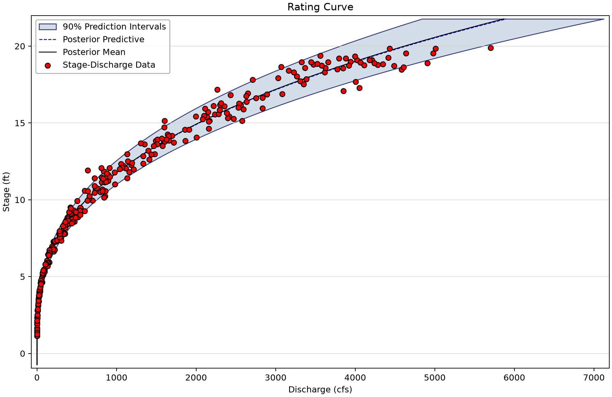
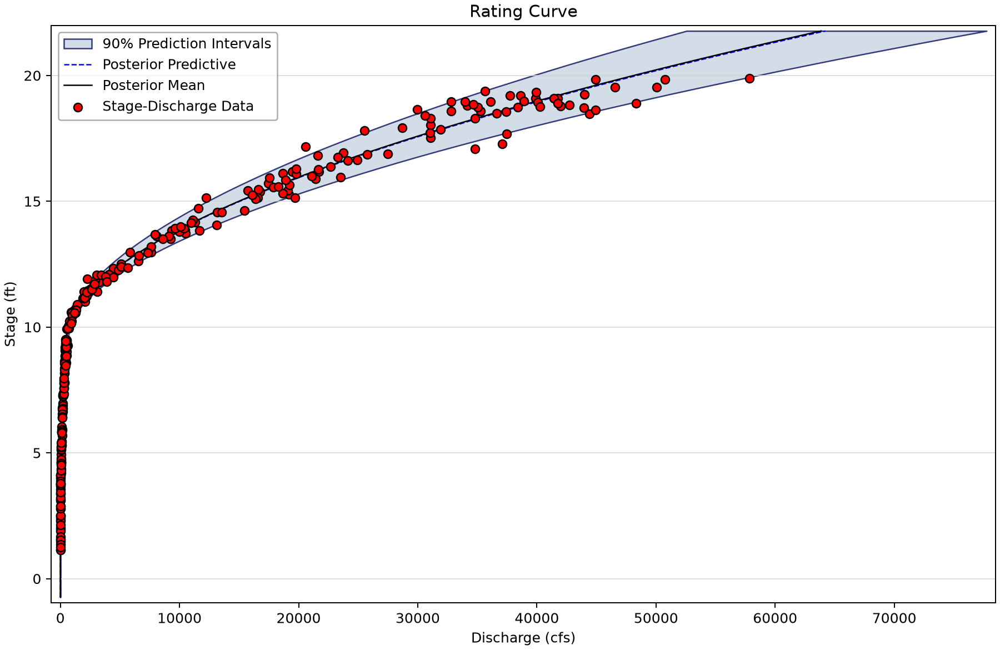
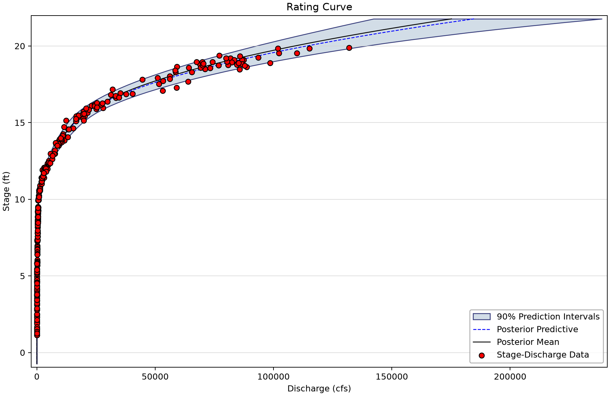
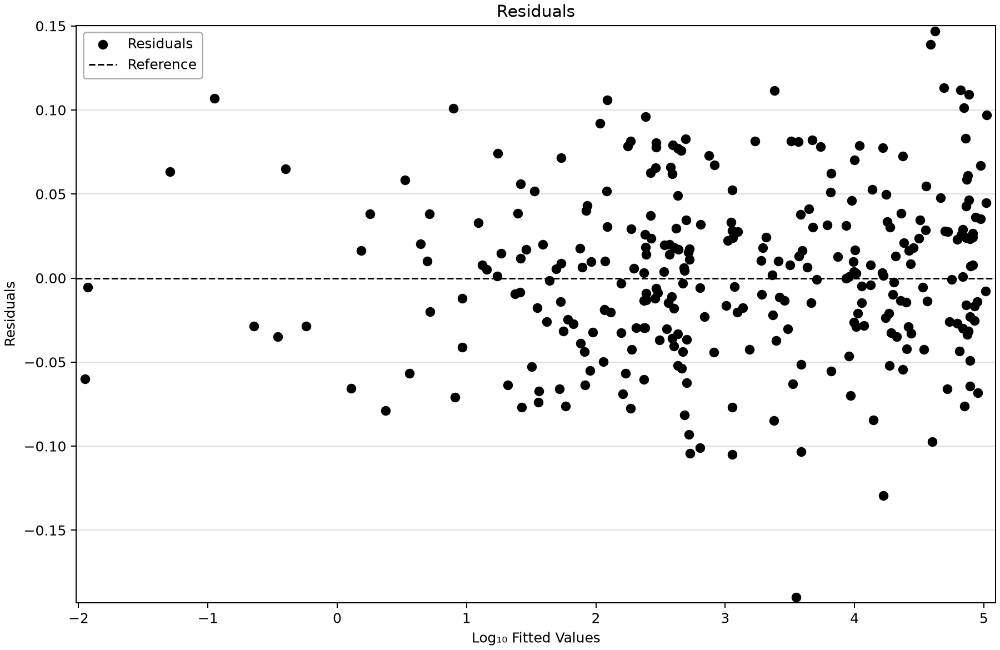
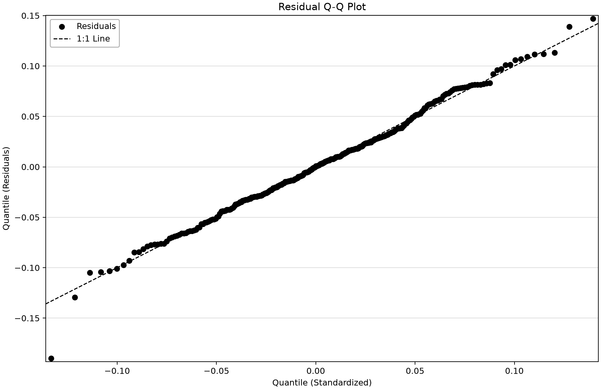

# Synthetic rating curves: additive controls and parameter uncertainty

Open [synthetic-rating-curve-examples.bestfit](synthetic-rating-curve-examples.bestfit) and save a working copy. A rating curve relates stage h to discharge Q. These models use BaRatin-style **addition of active controls**: each term contributes alpha × (h − h0)^beta above its activation stage and adds to controls already active. They are not replacement piecewise power laws.

## Inspect the paired data

| Input series | Meaning | Saved units | Count and dates |
| --- | --- | --- | --- |
| Stage Data | Synthetic stage shared by the three generated discharge series; stage range 1.1425–19.8940 ft. | Stage (ft) | 300 (2000-01-01–2000-10-26) |
| 1 Segment - Flow Data | Distinct synthetic discharge response for one additive hydraulic control. The other response series are different data, not competing fits to the same discharge sample. | Discharge (cfs) | 300 (2000-01-01–2000-10-26) |
| 2 Segment - Flow Data | Distinct synthetic discharge response for 2 additive hydraulic controls. The other response series are different data, not competing fits to the same discharge sample. | Discharge (cfs) | 300 (2000-01-01–2000-10-26) |
| 3 Segment - Flow Data | Distinct synthetic discharge response for 3 additive hydraulic controls. The other response series are different data, not competing fits to the same discharge sample. | Discharge (cfs) | 300 (2000-01-01–2000-10-26) |

All 300 values in each series are finite. The generic saved SeriesType on Stage Data does not override its Stage (ft) unit label. Each analysis pairs that stage series with its corresponding discharge series.

## Work through the controls

1. Open 1 Segment Rating Curve. Read its zero-flow stage, coefficient, exponent and error scale, then compare the curve with the observations.
2. Open the two- and three-control analyses. Identify each activation stage and remember that active terms add.
3. Read a stored Coefficient value as **log10(alpha)**. Convert only for interpretation; do not mistake the saved log coefficient for the positive physical multiplier.
4. Inspect the residual plots and their log10 discharge-error context. The error sigma is in log10 discharge space.
5. Compare parameter uncertainty with curve uncertainty. A curve can be well constrained while individual parameters trade off or are weakly identified.

## Generating evidence and saved parameters

The [source workbook](Synthetic%20Data.xlsx), [archived fixture](../../verification/data/rating-curve/rating-curve-example-fixtures.json) and [verification discussion](../../docs/verification/rating-curve.md) document the construction. Stage uses 1 + 19 r1; generated log10 discharge adds 0.05 times a standard-Normal quantile to the log10 additive rating. Stored workbook draws supply r1 and the error draw.

The recorded generating controls are (h0, log10(alpha), beta): (1, 0.2438965653, 2.6666666667), then (10, 2.9462998886, 1.67), then (15, 3.6095332363, 1.67). Error sigma is 0.05. The fixture's project hash refers to its historical snapshot. The 300-observation saved examples are distinct from the 1,000-observation recovery tests in verification; this tutorial has not rerun those tests.

| Analysis | Parameter / stored space | Saved point value |
| --- | --- | --- |
| 1 Segment Rating Curve | Zero-Flow Stage (h₁) | 0.987 |
| 1 Segment Rating Curve | log10 coefficient (α₁) | 0.221 |
| 1 Segment Rating Curve | Exponent (β₁) | 2.693 |
| 1 Segment Rating Curve | Scale (σ) | 0.051 |
| 2 Segment Rating Curve | Zero-Flow Stage (h₁) | 0.984 |
| 2 Segment Rating Curve | log10 coefficient (α₁) | 0.215 |
| 2 Segment Rating Curve | Exponent (β₁) | 2.701 |
| 2 Segment Rating Curve | Activation Stage (h₂) | 9.847 |
| 2 Segment Rating Curve | log10 coefficient (α₂) | 2.838 |
| 2 Segment Rating Curve | Exponent (β₂) | 1.788 |
| 2 Segment Rating Curve | Scale (σ) | 0.051 |
| 3 Segment Rating Curve | Zero-Flow Stage (h₁) | 0.985 |
| 3 Segment Rating Curve | log10 coefficient (α₁) | 0.217 |
| 3 Segment Rating Curve | Exponent (β₁) | 2.699 |
| 3 Segment Rating Curve | Activation Stage (h₂) | 9.705 |
| 3 Segment Rating Curve | log10 coefficient (α₂) | 2.717 |
| 3 Segment Rating Curve | Exponent (β₂) | 1.953 |
| 3 Segment Rating Curve | Activation Stage (h₃) | 14.648 |
| 3 Segment Rating Curve | log10 coefficient (α₃) | 3.156 |
| 3 Segment Rating Curve | Exponent (β₃) | 2.172 |
| 3 Segment Rating Curve | Scale (σ) | 0.051 |

All fits retain DEMCzs, seed 12345, warmup 1,750, iterations 3,500, 10,000 output draws and 90% interval width. The chain/thinning settings and chosen posterior mean or mode parameter vector remain as saved. Inspect the actual prior bounds, parameter chains, autocorrelation and tail uncertainty. Scalar diagnostics describe the retained run; they do not substitute for scientific validation.
| Saved analysis | Chains / thinning | Point parameters | DIC | Saved RMSE | Max R-hat | Min ESS |
| --- | --- | --- | --- | --- | --- | --- |
| 1 Segment Rating Curve | 8/40 | Mean | 3,156.371 | 224.365 | 1.00059 | 9,453 |
| 2 Segment Rating Curve | 14/70 | Mean | 3,699.86 | 2,036.623 | 1.00032 | 9,190 |
| 3 Segment Rating Curve | 20/100 | Mean | 3,774.226 | 4,042.051 | 1.00117 | 2,121 |

Archived independent evidence identifies weak third-control precision: beta3 standard error is about 0.37, or 22% relative. Preserve that limitation instead of treating approximate curve agreement as precise parameter recovery. DIC does not rank the three control counts here because their discharge datasets differ.

## Saved prediction rows and figures

| Analysis | Stage (ft) | Best fit discharge (cfs) | 90% prediction limits (cfs) |
| --- | --- | --- | --- |
| 1 Segment Rating Curve | -0.733 | 0 | 0–0 |
| 1 Segment Rating Curve | 10.632 | 742.883 | 612.908–901.253 |
| 1 Segment Rating Curve | 21.769 | 5,868.95 | 4,841.11–7,124.382 |
| 2 Segment Rating Curve | -0.733 | 0 | 0–0 |
| 2 Segment Rating Curve | 10.632 | 1,195.25 | 983.508–1,456.408 |
| 2 Segment Rating Curve | 21.769 | 63,863.454 | 52,565.255–77,750.421 |
| 3 Segment Rating Curve | -0.733 | 0 | 0–0 |
| 3 Segment Rating Curve | 10.632 | 1,196.544 | 984.276–1,458.056 |
| 3 Segment Rating Curve | 21.769 | 175,201.576 | 142,285.178–238,730.224 |

The 100 saved stage bins run from −0.7327 to 21.7691 ft, beyond the measured range at both ends. Zero discharge below activation remains zero. These **prediction intervals include residual variation and parameter uncertainty**; they are not confidence bounds for the mean curve alone. Extrapolation is not independently validated by a finite interval.

*1-control additive rating with saved predictive uncertainty. Observed stages span 1.1425–19.8940 ft; the curve extends beyond them.* [SVG](images/synthetic-rating-curve-examples-1-control.svg) · [Plot data](images/synthetic-rating-curve-examples-1-control.plotspec.json.gz)

*2-control additive rating with saved predictive uncertainty. Observed stages span 1.1425–19.8940 ft; the curve extends beyond them.* [SVG](images/synthetic-rating-curve-examples-2-control.svg) · [Plot data](images/synthetic-rating-curve-examples-2-control.plotspec.json.gz)

*3-control additive rating with saved predictive uncertainty. Observed stages span 1.1425–19.8940 ft; the curve extends beyond them.* [SVG](images/synthetic-rating-curve-examples-3-control.svg) · [Plot data](images/synthetic-rating-curve-examples-3-control.plotspec.json.gz)

*Residuals for the three-control fit, using the desktop error convention.* [SVG](images/synthetic-rating-curve-examples-three-control-residuals.svg) · [Plot data](images/synthetic-rating-curve-examples-three-control-residuals.plotspec.json.gz)

*Three-control residual Q–Q diagnostic; inspect departures without assuming a satisfactory fit.* [SVG](images/synthetic-rating-curve-examples-three-control-qq.svg) · [Plot data](images/synthetic-rating-curve-examples-three-control-qq.plotspec.json.gz)

## Reproduce and check

The figures render saved BestFit desktop coordinates through the shared Python plotting package. No data, parameters, diagnostics or predictions were replaced. Follow the [figure-generation instructions](../README.md#reproducing-the-figures) with `--only synthetic-rating-curve-examples`. Each figure links an SVG and the exact display inputs in a compressed PlotSpec.

Explain the input units, the model actually stored, the observations used for fitting, and the assumptions behind extrapolation and uncertainty before reusing an example.
