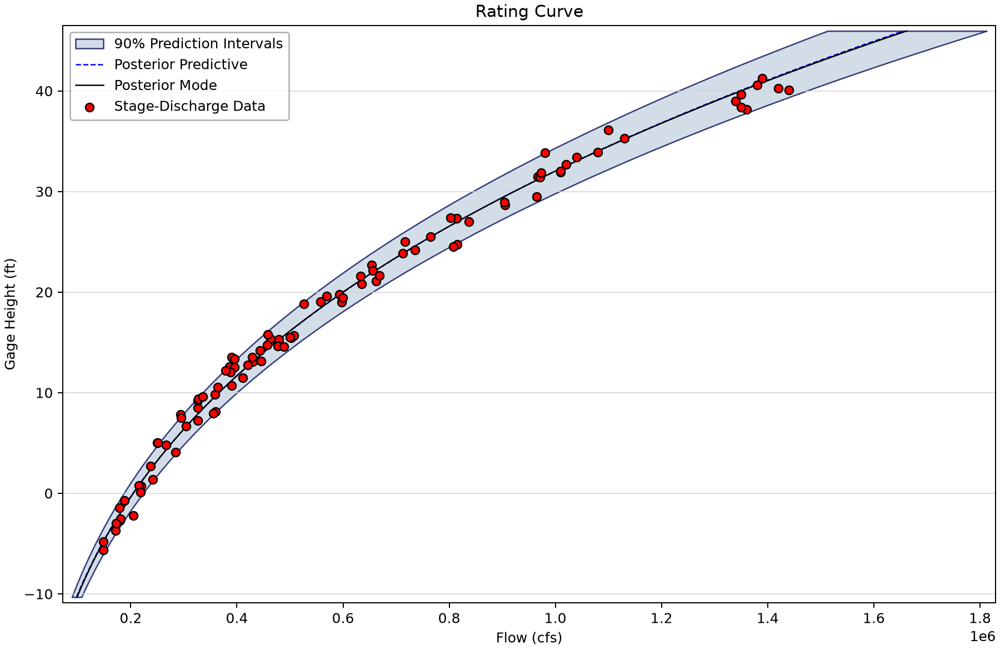
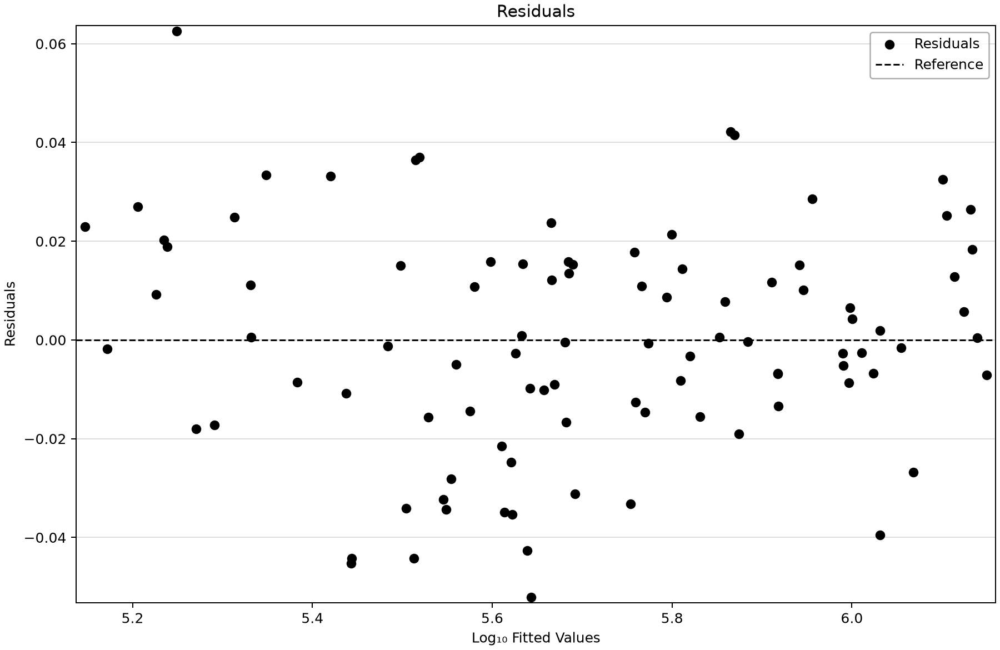
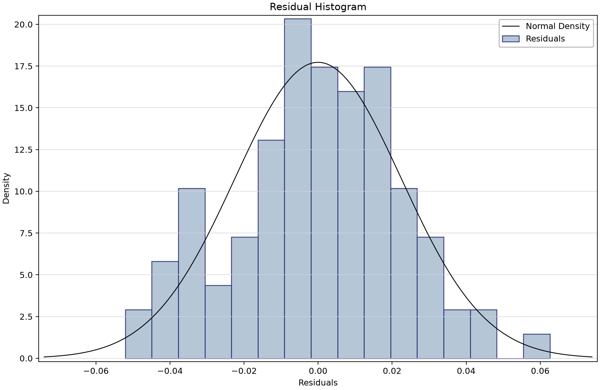
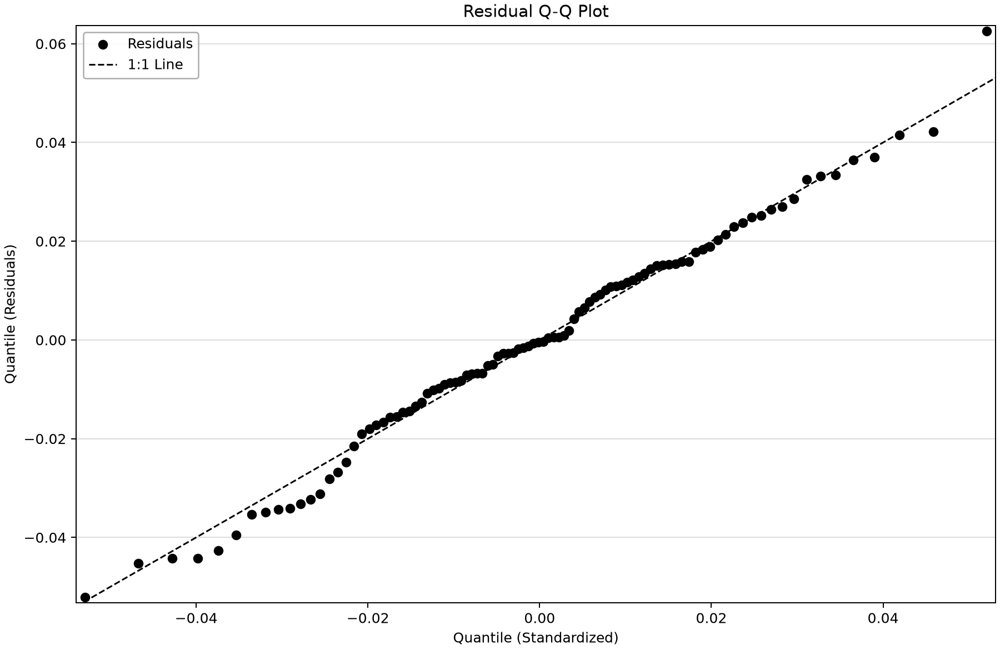

# Mississippi River at New Madrid: a rating from paired measurements

Open [usgs-07024175-mississippi-rating-curve.bestfit](usgs-07024175-mississippi-rating-curve.bestfit) and save a working copy. The example fits **one hydraulic control** to 96 field-measurement pairs at USGS 07024175. It teaches the distinction between measured data, a statistical rating and extrapolation beyond measurements.

## Inspect measurement pairing and units

| Input series | Meaning | Saved units | Count and dates |
| --- | --- | --- | --- |
| USGS 07024175 Measured Stage | USGS field-measurement gage height for the Mississippi River at New Madrid; datum-relative stage, range −5.63–41.27 ft. Negative gage height is not negative water depth. | Gage Height (ft) | 96 (2017-02-08–2026-03-19) |
| USGS 07024175 Measured Discharge | USGS measured discharge paired with the stage measurements, range 148,000–1,440,000 cfs. These are measurements, not rating-derived continuous flow values. | Flow (cfs) | 96 (2017-02-08–2026-03-19) |

All 96 timestamps match between stage and discharge, with no duplicate timestamps or stored missing values. Measurements span 2017-02-08 16:05:08 UTC through 2026-03-19 16:02:34 UTC. Negative gage heights are relative to the station datum. Measurement quality codes, datum changes, rating shifts and filtering history remain source questions; the saved series alone does not establish them.

## Work through the fit

1. Select both measurement series and verify their units, source settings and timestamps.
2. Open USGS 07024175 Rating Curve. Confirm one control; there are no second or third activation stages to interpret.
3. Inspect the posterior-mode parameters below. The coefficient is stored in log10 space, so a negative log coefficient still corresponds to a positive multiplier.
4. Compare residuals across stage and observation time. A single stationary relation across nine years requires hydraulic justification.
5. Separate the measured range, −5.63–41.27 ft, from the saved prediction grid, −10.32–45.96 ft.

| Analysis | Parameter / stored space | Saved point value |
| --- | --- | --- |
| USGS 07024175 Rating Curve | Zero-Flow Stage (h₁) | -52.471 |
| USGS 07024175 Rating Curve | log10 coefficient (α₁) | -0.413 |
| USGS 07024175 Rating Curve | Exponent (β₁) | 3.328 |
| USGS 07024175 Rating Curve | Scale (σ) | 0.023 |

The inferred zero-flow stage near −52.47 ft is far below the observations and is a fitted parameter, not a surveyed zero-flow datum. The error scale is log10 discharge sigma. Default flat parameter priors and Jeffreys scale treatment remain enabled.

## Saved results

All fits retain DEMCzs, seed 12345, warmup 1,750, iterations 3,500, 10,000 output draws and 90% interval width. The chain/thinning settings and chosen posterior mean or mode parameter vector remain as saved. Inspect the actual prior bounds, parameter chains, autocorrelation and tail uncertainty. Scalar diagnostics describe the retained run; they do not substitute for scientific validation.
| Saved analysis | Chains / thinning | Point parameters | DIC | Saved RMSE | Max R-hat | Min ESS |
| --- | --- | --- | --- | --- | --- | --- |
| USGS 07024175 Rating Curve | 8/40 | Mode | 2,233.321 | 30,328.582 | 1.00019 | 8,266 |

| Analysis | Stage (ft) | Best fit discharge (cfs) | 90% prediction limits (cfs) |
| --- | --- | --- | --- |
| USGS 07024175 Rating Curve | -10.32 | 98,812.152 | 89,163.094–107,222.979 |
| USGS 07024175 Rating Curve | 18.104 | 549,275.844 | 503,670.856–600,438.657 |
| USGS 07024175 Rating Curve | 45.96 | 1,662,011.799 | 1,513,008.617–1,812,674.396 |

The 90% prediction limits include parameter and residual uncertainty. They do not include every possible datum, measurement, morphology or flow-regime uncertainty. This teaching fit is not evidence of adoption as an official USGS operational rating.

## Read the figures

*Saved New Madrid rating view. Measured stages span −5.63–41.27 ft; the rating grid extends outside that range.* [SVG](images/usgs-07024175-mississippi-rating-curve-rating.svg) · [Plot data](images/usgs-07024175-mississippi-rating-curve-rating.plotspec.json.gz)

*Saved New Madrid residuals view. Measured stages span −5.63–41.27 ft; the rating grid extends outside that range.* [SVG](images/usgs-07024175-mississippi-rating-curve-residuals.svg) · [Plot data](images/usgs-07024175-mississippi-rating-curve-residuals.plotspec.json.gz)

*Saved New Madrid residual histogram view. Measured stages span −5.63–41.27 ft; the rating grid extends outside that range.* [SVG](images/usgs-07024175-mississippi-rating-curve-residual-histogram.svg) · [Plot data](images/usgs-07024175-mississippi-rating-curve-residual-histogram.plotspec.json.gz)

*Saved New Madrid residual Q–Q view. Measured stages span −5.63–41.27 ft; the rating grid extends outside that range.* [SVG](images/usgs-07024175-mississippi-rating-curve-residual-qq.svg) · [Plot data](images/usgs-07024175-mississippi-rating-curve-residual-qq.plotspec.json.gz)

## Reproduce and check

The figures render saved BestFit desktop coordinates through the shared Python plotting package. No data, parameters, diagnostics or predictions were replaced. Follow the [figure-generation instructions](../README.md#reproducing-the-figures) with `--only usgs-07024175-mississippi-rating-curve`. Each figure links an SVG and the exact display inputs in a compressed PlotSpec.

Explain the input units, the model actually stored, the observations used for fitting, and the assumptions behind extrapolation and uncertainty before reusing an example.
