# Synthetic time series: model structure and withheld validation

Open [synthetic-time-series-examples.bestfit](synthetic-time-series-examples.bestfit) and save a working copy. Twelve same-named input/analysis pairs demonstrate intercepts, trends, autoregressive (AR) terms, moving-average (MA) terms and a log transform. Each input contains 300 finite monthly observations from January 1949 through December 1973 in generic Value units.

## Read the actual configurations

AR terms use lagged responses; MA terms use lagged errors. In ARIMA(p,d,q), p is AR order, d is differencing order and q is MA order. All these examples include an intercept, use d=0, disable deterministic seasonality and have no exogenous covariates.

| Analysis | p,d,q | Trend | Transform | Seasonality | Training / validation / future |
| --- | --- | --- | --- | --- | --- |
| Intercept | 0,0,0 | None | None | False | 240 / 60 / 0 |
| Intercept + Linear Trend | 0,0,0 | Linear | None | False | 240 / 60 / 0 |
| Intercept + Quadratic Trend | 0,0,0 | Quadratic | None | False | 240 / 60 / 0 |
| Intercept + Cubic Trend | 0,0,0 | Cubic | None | False | 280 / 20 / 0 |
| AR(1) | 1,0,0 | None | None | False | 280 / 20 / 0 |
| AR(3) | 3,0,0 | None | None | False | 280 / 20 / 0 |
| MA(1) | 0,0,1 | None | None | False | 280 / 20 / 0 |
| MA(3) | 0,0,3 | None | None | False | 280 / 20 / 0 |
| ARMA(1,1) | 1,0,1 | None | None | False | 280 / 20 / 0 |
| ARMA(2,2) | 2,0,1 | None | None | False | 280 / 20 / 0 |
| Intercept + Linear Trend + ARMA(1,1) | 1,0,1 | Linear | None | False | 275 / 25 / 0 |
| Intercept + Linear Trend + LogTransform | 1,0,0 | Linear | Logarithmic | False | 275 / 25 / 0 |

The analysis named **ARMA(2,2) actually stores p=2, q=1**. Its name and settings remain unchanged for the author to resolve. The logarithmic case also has AR(1). There is no thirteenth sinusoidal example in this project.

## Work through the models

1. Start with Intercept, then compare the linear, quadratic and cubic trend cases. They are separate datasets with different scales; do not rank all examples by DIC.
2. Compare AR(1), AR(3), MA(1) and MA(3). Inspect residual ACF and PACF after reading each model's actual order.
3. Compare ARMA(1,1) with the model named ARMA(2,2), keeping its stored (2,1) orders explicit.
4. Inspect the combined trend/ARMA and trend/logarithmic cases. A transform changes the model's scale and uncertainty interpretation.
5. Locate the training boundary and withheld observations. **Every future horizon is zero**: the prediction segment is validation within the observed record, not a forecast beyond December 1973.

Default training uses 240 observations; several examples instead retain manual 280/20 or 275/25 splits. The saved BlockBootstrap covariate option is dormant because these fits have no exogenous covariates. The [source workbook](Synthetic%20Data.xlsx) is a generator-provenance lead; the saved fit alone does not establish known-truth parameter recovery.

## Saved diagnostics

All fits retain DEMCzs, seed 12345, warmup 1,750, iterations 3,500, 10,000 output draws and 90% interval width. The chain/thinning settings and chosen posterior mean or mode parameter vector remain as saved. Inspect the actual prior bounds, parameter chains, autocorrelation and tail uncertainty. Scalar diagnostics describe the retained run; they do not substitute for scientific validation.
| Saved analysis | Chains / thinning | Point parameters | DIC | Saved RMSE | Max R-hat | Min ESS |
| --- | --- | --- | --- | --- | --- | --- |
| Intercept | 4/20 | Mean | 2,309.347 | 29.484 | 1.00022 | 9,460 |
| Intercept + Linear Trend | 6/30 | Mean | 2,309.799 | 29.389 | 1.00032 | 9,310 |
| Intercept + Quadratic Trend | 8/40 | Mean | 2,311.657 | 29.376 | 1.00032 | 9,488 |
| Intercept + Cubic Trend | 10/50 | Mean | 3,982.031 | 291.901 | 1.00036 | 9,548 |
| AR(1) | 6/30 | Mean | 2,679.008 | 29.106 | 1.00017 | 8,646 |
| AR(3) | 10/50 | Mean | 2,663.679 | 28.989 | 1.00021 | 9,190 |
| MA(1) | 6/30 | Mean | 2,685.58 | 29.441 | 1.00011 | 8,851 |
| MA(3) | 10/50 | Mean | 2,893.455 | 43.901 | 1.00043 | 9,010 |
| ARMA(1,1) | 8/40 | Mean | 2,683.309 | 29.225 | 1.00034 | 9,476 |
| ARMA(2,2) | 10/50 | Mean | 2,676.643 | 29.238 | 1.00011 | 9,257 |
| Intercept + Linear Trend + ARMA(1,1) | 10/50 | Mean | 2,636.647 | 29.137 | 1.00030 | 9,407 |
| Intercept + Linear Trend + LogTransform | 8/40 | Mean | 3,475.122 | 153.941 | 1.00010 | 9,377 |

Saved RMSE describes the training-window fit, not held-out forecast error. The prediction bands include process/error variation and parameter uncertainty. Inspect residual diagnostics and actual held-out behavior before accepting a model; a narrow-looking fit is not sufficient.

## Read the twelve fitted-series views

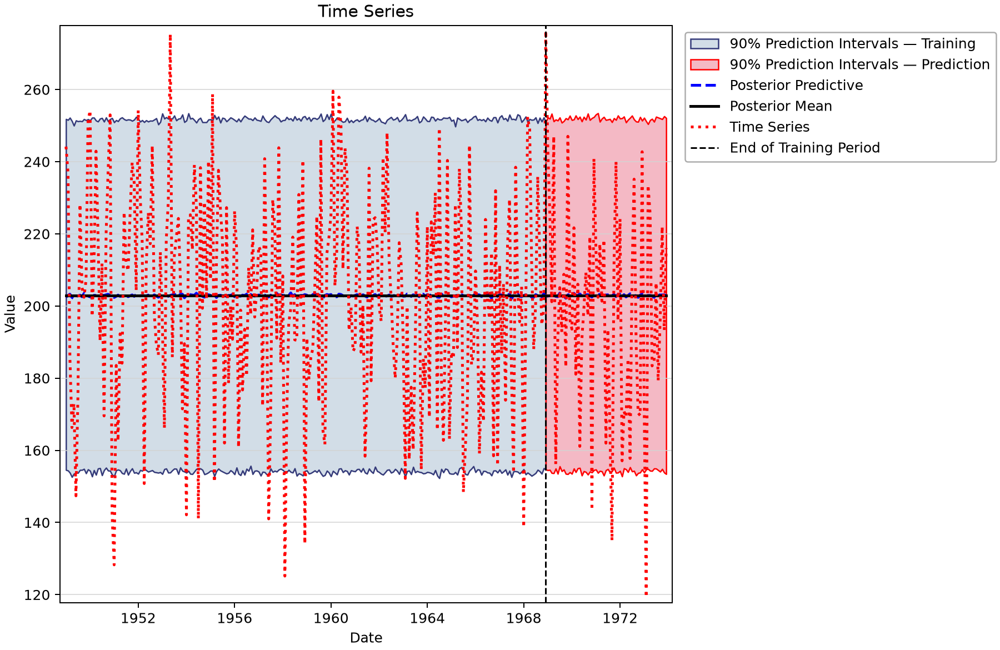

*Intercept: training and withheld validation. No future observations beyond the saved record are predicted.* [SVG](images/synthetic-time-series-examples-model-01.svg) · [Plot data](images/synthetic-time-series-examples-model-01.plotspec.json.gz)

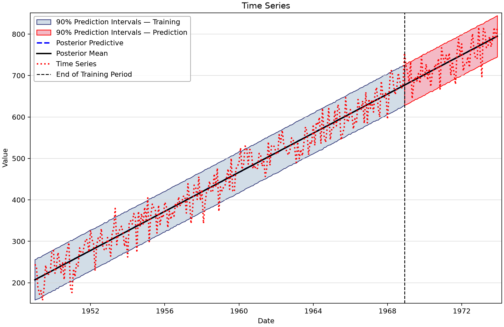

*Intercept + Linear Trend: training and withheld validation. No future observations beyond the saved record are predicted.* [SVG](images/synthetic-time-series-examples-model-02.svg) · [Plot data](images/synthetic-time-series-examples-model-02.plotspec.json.gz)

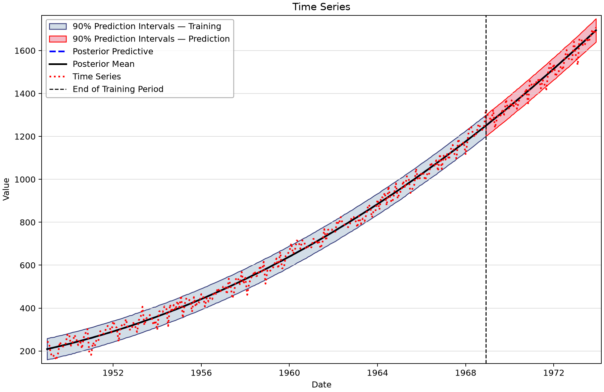

*Intercept + Quadratic Trend: training and withheld validation. No future observations beyond the saved record are predicted.* [SVG](images/synthetic-time-series-examples-model-03.svg) · [Plot data](images/synthetic-time-series-examples-model-03.plotspec.json.gz)

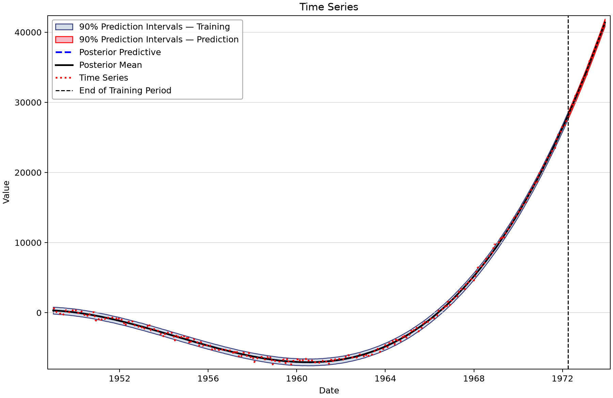

*Intercept + Cubic Trend: training and withheld validation. No future observations beyond the saved record are predicted.* [SVG](images/synthetic-time-series-examples-model-04.svg) · [Plot data](images/synthetic-time-series-examples-model-04.plotspec.json.gz)

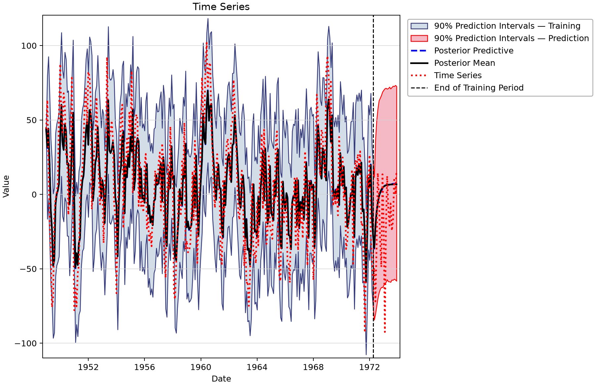

*AR(1): training and withheld validation. No future observations beyond the saved record are predicted.* [SVG](images/synthetic-time-series-examples-model-05.svg) · [Plot data](images/synthetic-time-series-examples-model-05.plotspec.json.gz)

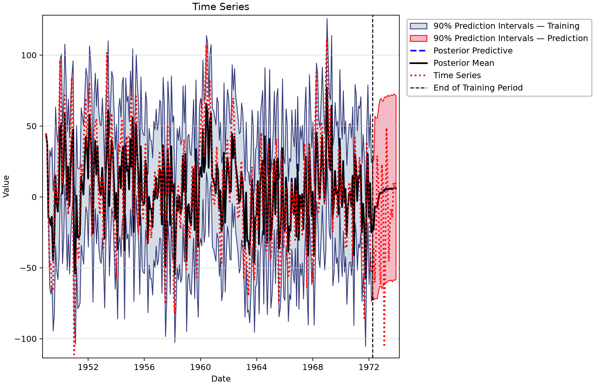

*AR(3): training and withheld validation. No future observations beyond the saved record are predicted.* [SVG](images/synthetic-time-series-examples-model-06.svg) · [Plot data](images/synthetic-time-series-examples-model-06.plotspec.json.gz)

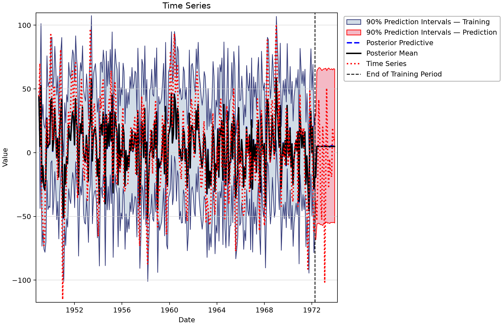

*MA(1): training and withheld validation. No future observations beyond the saved record are predicted.* [SVG](images/synthetic-time-series-examples-model-07.svg) · [Plot data](images/synthetic-time-series-examples-model-07.plotspec.json.gz)

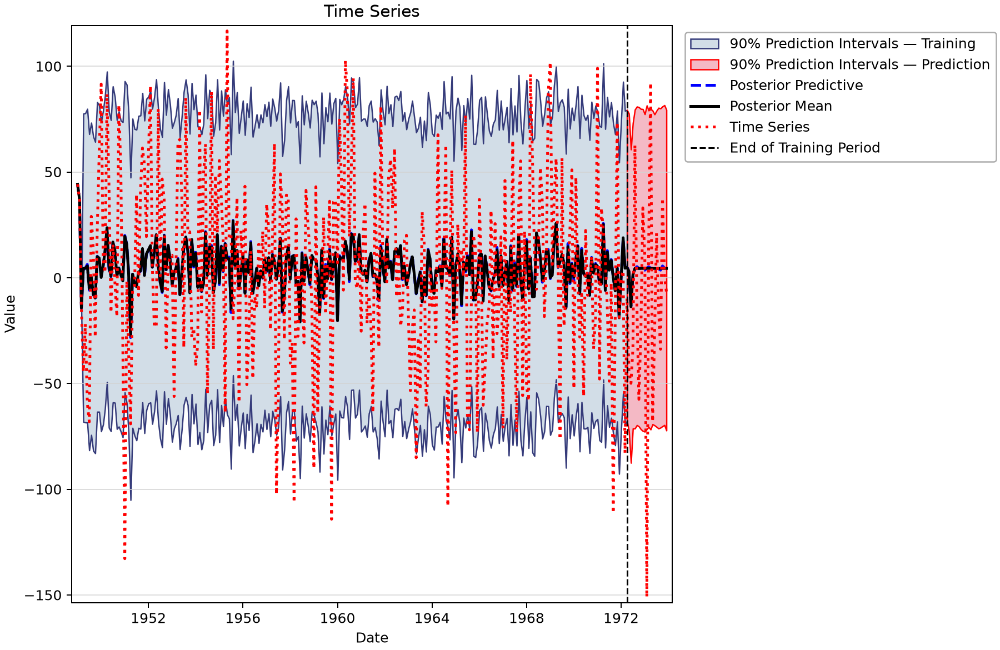

*MA(3): training and withheld validation. No future observations beyond the saved record are predicted.* [SVG](images/synthetic-time-series-examples-model-08.svg) · [Plot data](images/synthetic-time-series-examples-model-08.plotspec.json.gz)

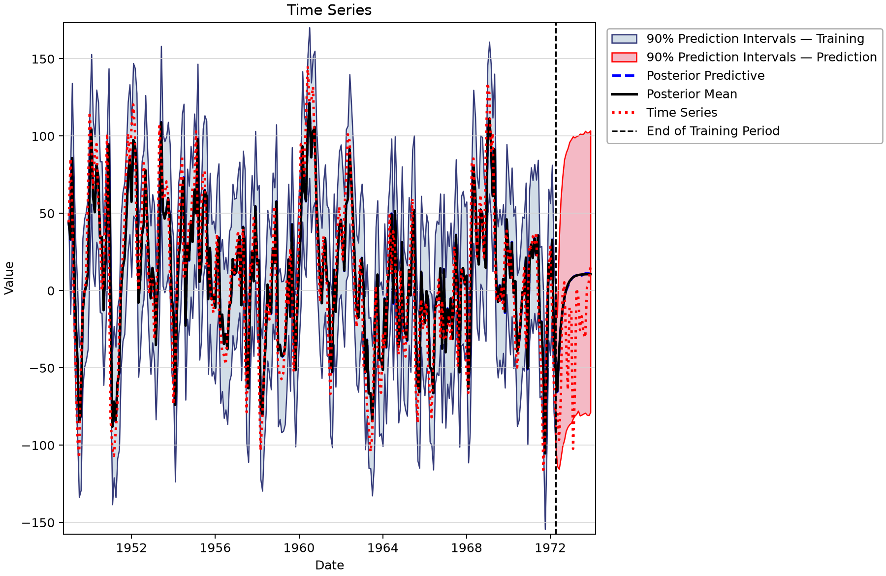

*ARMA(1,1): training and withheld validation. No future observations beyond the saved record are predicted.* [SVG](images/synthetic-time-series-examples-model-09.svg) · [Plot data](images/synthetic-time-series-examples-model-09.plotspec.json.gz)

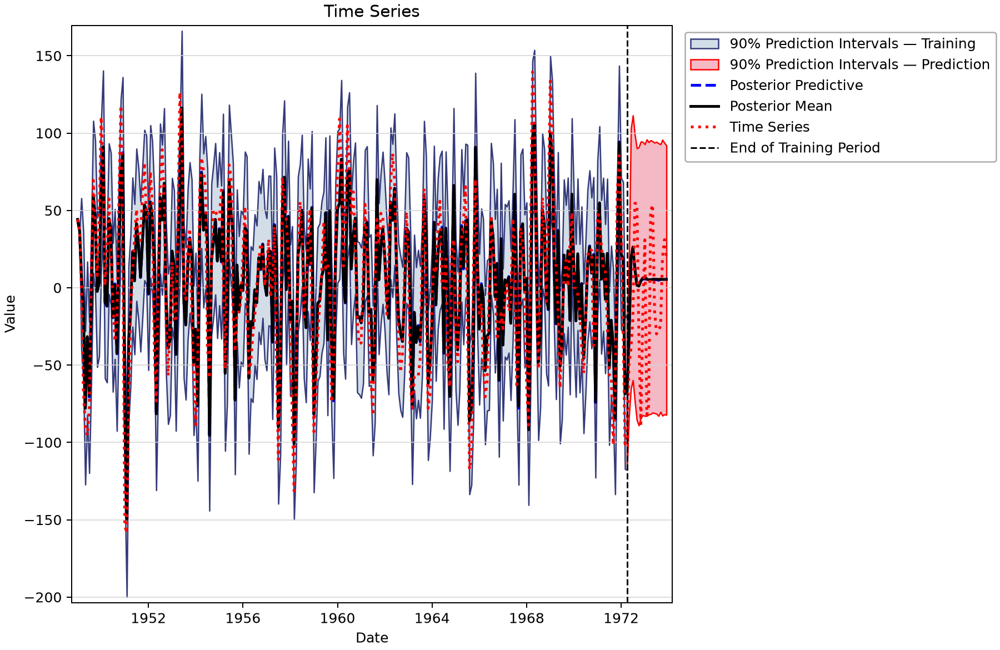

*ARMA(2,2): training and withheld validation. No future observations beyond the saved record are predicted.* [SVG](images/synthetic-time-series-examples-model-10.svg) · [Plot data](images/synthetic-time-series-examples-model-10.plotspec.json.gz)

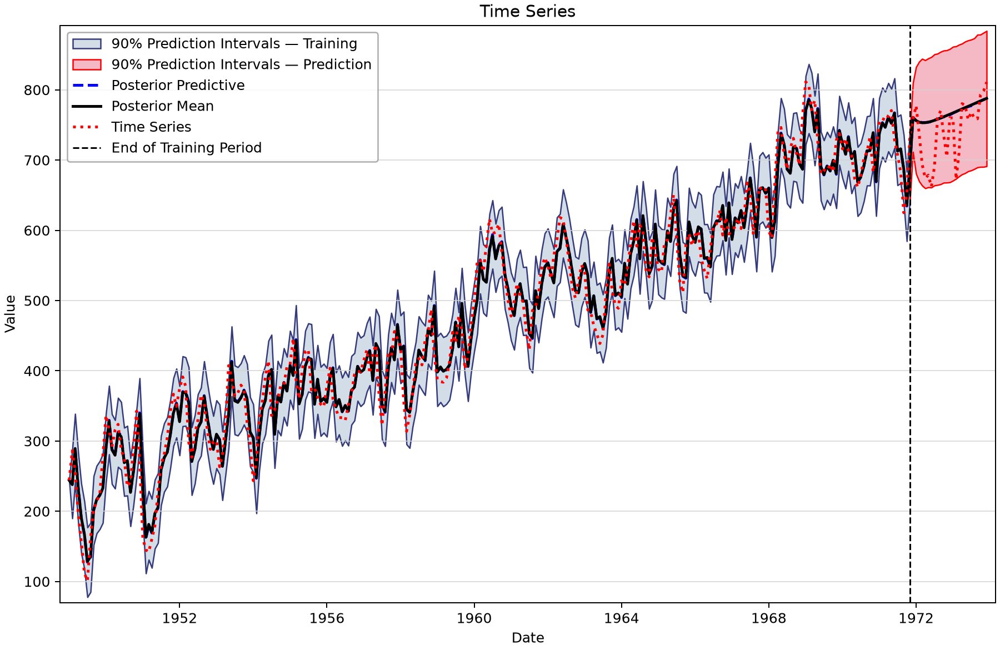

*Intercept + Linear Trend + ARMA(1,1): training and withheld validation. No future observations beyond the saved record are predicted.* [SVG](images/synthetic-time-series-examples-model-11.svg) · [Plot data](images/synthetic-time-series-examples-model-11.plotspec.json.gz)

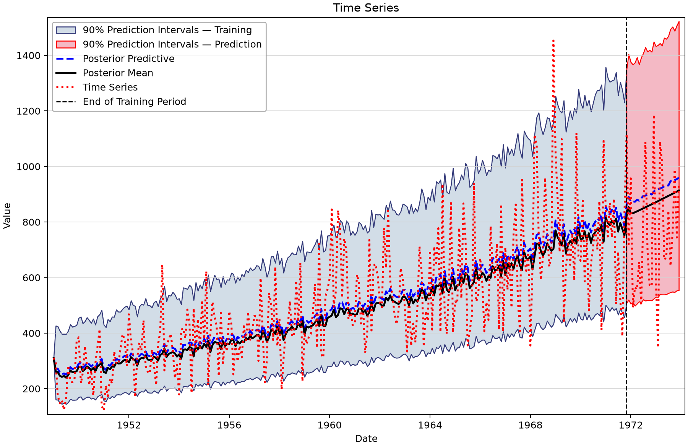

*Intercept + Linear Trend + LogTransform: training and withheld validation. No future observations beyond the saved record are predicted.* [SVG](images/synthetic-time-series-examples-model-12.svg) · [Plot data](images/synthetic-time-series-examples-model-12.plotspec.json.gz)

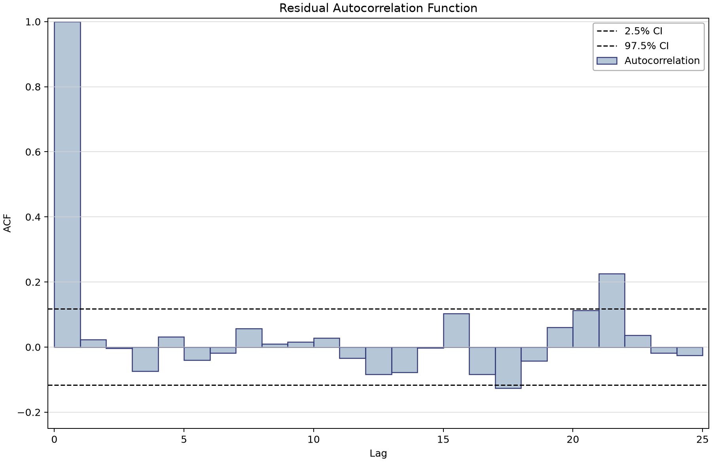

*Residual autocorrelation for the saved ARMA(1,1) fit.* [SVG](images/synthetic-time-series-examples-arma-residual-acf.svg) · [Plot data](images/synthetic-time-series-examples-arma-residual-acf.plotspec.json.gz)

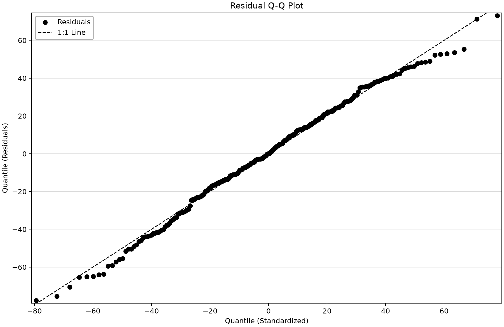

*Residual Q–Q view for ARMA(1,1); examine distributional departures separately from autocorrelation.* [SVG](images/synthetic-time-series-examples-arma-residual-qq.svg) · [Plot data](images/synthetic-time-series-examples-arma-residual-qq.plotspec.json.gz)

## Reproduce and check

The figures render saved BestFit desktop coordinates through the shared Python plotting package. No data, parameters, diagnostics or predictions were replaced. Follow the [figure-generation instructions](../../README.md#reproducing-the-figures) with `--only synthetic-time-series-examples`. Each figure links an SVG and the exact display inputs in a compressed PlotSpec.

Explain the input units, the model actually stored, the observations used for fitting, and the assumptions behind extrapolation and uncertainty before reusing an example.
