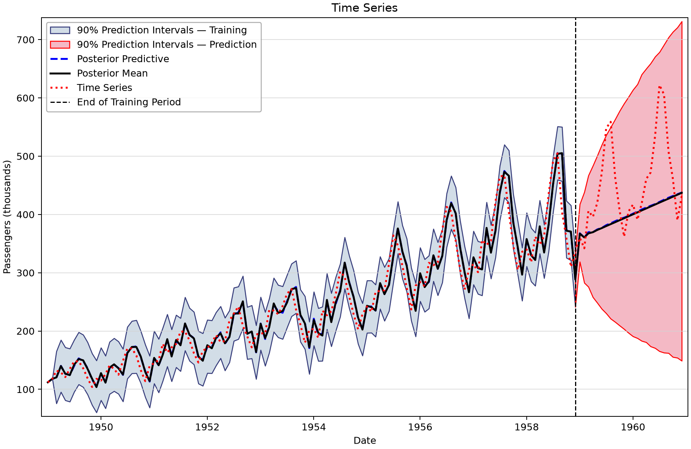
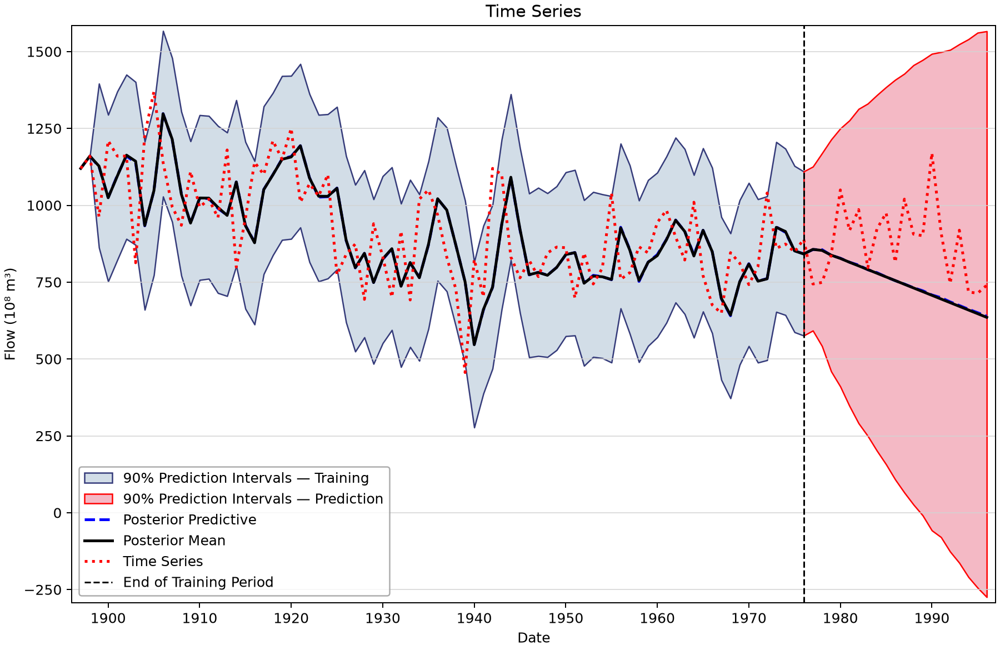
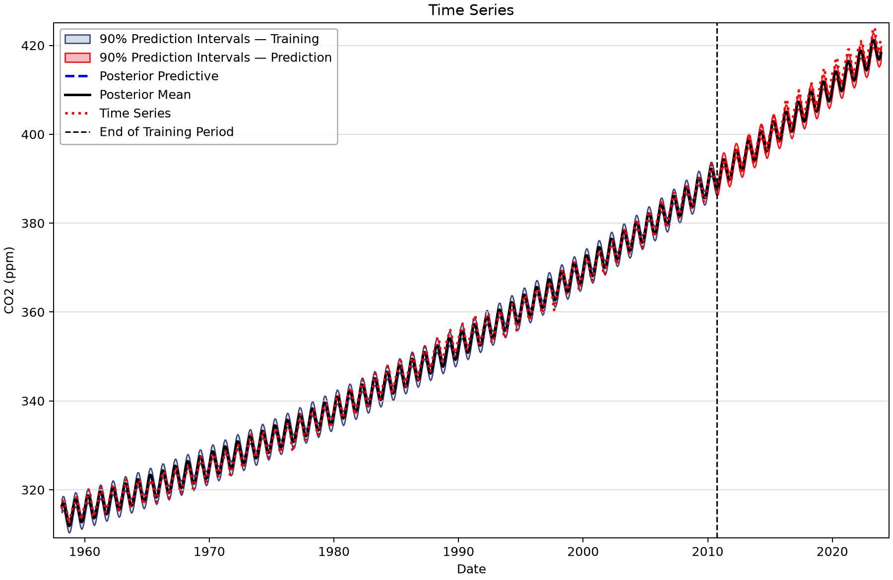
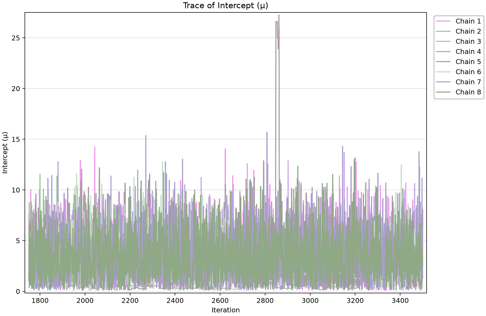
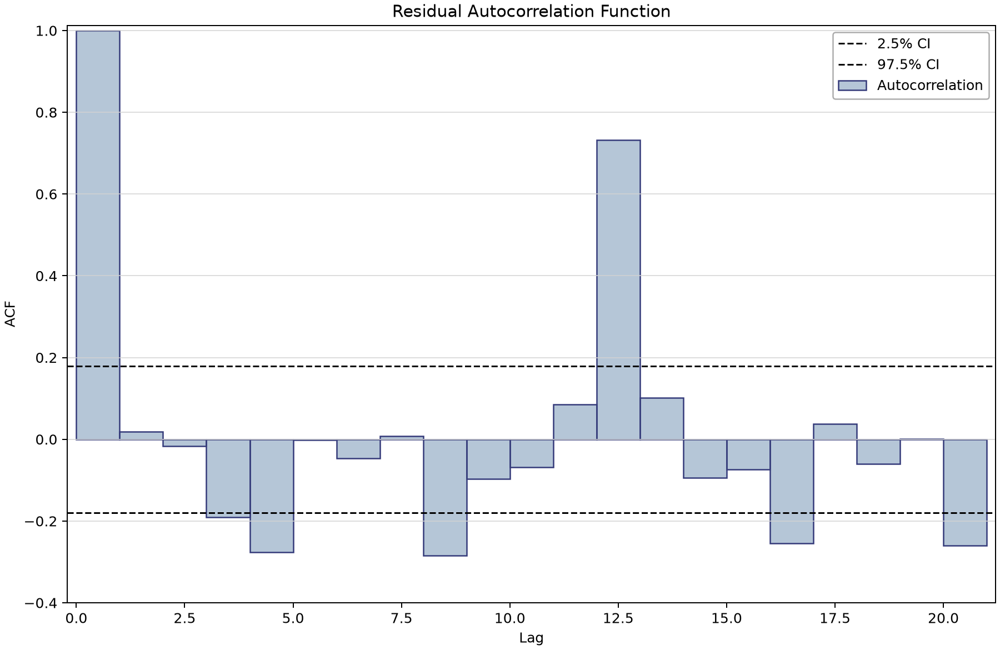
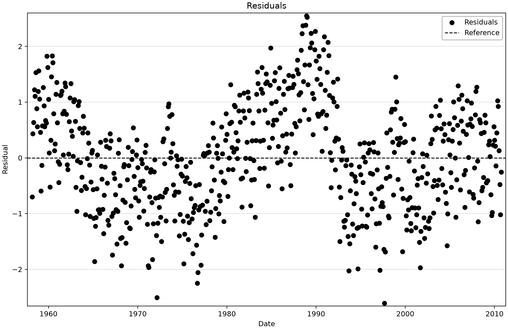

# Classic time series: stored models and diagnostic limitations

Open [classic-time-series-examples.bestfit](classic-time-series-examples.bestfit) and save a working copy. These analyses use three familiar datasets to teach inspection of the model actually stored, validation boundaries and diagnostic problems. A textbook's usual model for a dataset is not necessarily the model in this project.

## Inspect the records

| Input series | Meaning | Saved units | Count and dates |
| --- | --- | --- | --- |
| Airline Passengers | Classic monthly international-airline passenger counts in thousands, 1949–1960. Retains the supplied data and nonseasonal, untransformed ARIMA fit; saved chain diagnostics are poor. | Passengers (thousands) | 144 (1949-01-01–1960-12-01) |
| Nile River Flows | Classic annual Nile series. All 100 values match the source CSV in order, but saved dates 1897–1996 are offset 26 years from source dates 1871–1970. Original calendar retained and disclosed; do not attach historical events to the shifted axis. | Flow (10⁸ m³) | 100 (1897-01-01–1996-01-01) |
| Mauna Loa CO2 | Saved monthly Mauna Loa atmospheric CO2 observations in ppm; fitted quadratic trend plus deterministic seasonal terms, with no AR/MA residual terms. | CO2 (ppm) | 790 (1958-03-01–2023-12-01) |

The supplied [Airline](airline-passengers.csv), [Nile](nile-river-flow.csv) and [CO2](mauna-loa-co2.csv) CSV files provide source snapshots. All stored observations are finite. The Nile values match the CSV in order, but its saved 1897–1996 dates differ from the source 1871–1970 dates. The [manual-entry tutorial](../../1-time-series-data/6-manual-entry/manual-entry-example.md) explains the same discrepancy. Dates remain unchanged; historical event labels would be misleading on the shifted axis.

## Work through the actual models

1. Open Airline Passengers - TSA. It is untransformed ARIMA(1,1,1), with an intercept and no seasonal term. It is not a seasonal log-ARIMA textbook fit.
2. Inspect every Airline parameter's chains and diagnostics before interpreting its prediction band. The retained run has material mixing limitations, detailed below.
3. Open Nile River Flows - TSA. Its stored ARIMA(1,1,0) is not a change-point model; keep the date discrepancy explicit.
4. Open Mauna Loa - CO2. It has an intercept, quadratic trend and deterministic seasonality, with p=d=q=0; it is not seasonal ARMA.
5. Identify the withheld segments. All future horizons are zero, so these predictions stop at the last observed dates.

| Analysis | p,d,q | Trend | Transform | Seasonality | Training / validation / future |
| --- | --- | --- | --- | --- | --- |
| Airline Passengers - TSA | 1,1,1 | None | None | False | 120 / 24 / 0 |
| Nile River Flows - TSA | 1,1,0 | None | None | False | 80 / 20 / 0 |
| Mauna Loa - CO2 | 0,0,0 | Quadratic | None | True | 632 / 158 / 0 |

## Saved diagnostics and the Airline limitation

All fits retain DEMCzs, seed 12345, warmup 1,750, iterations 3,500, 10,000 output draws and 90% interval width. The chain/thinning settings and chosen posterior mean or mode parameter vector remain as saved. Inspect the actual prior bounds, parameter chains, autocorrelation and tail uncertainty. Scalar diagnostics describe the retained run; they do not substitute for scientific validation.
| Saved analysis | Chains / thinning | Point parameters | DIC | Saved RMSE | Max R-hat | Min ESS |
| --- | --- | --- | --- | --- | --- | --- |
| Airline Passengers - TSA | 8/40 | Mean | 1,115.279 | 26.65 | 1.26202 | 52 |
| Nile River Flows - TSA | 6/30 | Mean | 1,016.319 | 156.318 | 1.00041 | 6,166 |
| Mauna Loa - CO2 | 12/60 | Mean | 1,720.184 | 0.935 | 1.00031 | 9,256 |

Every Airline parameter has R-hat greater than 1.08; the MA parameter reaches about 1.262 with ESS about 52. These results do not support a well-mixed-chain claim. They are preserved as a diagnostic example for the author to address, not tuned or rerun to improve the table.

| Airline parameter | Saved point value | R-hat | ESS |
| --- | --- | --- | --- |
| Intercept | 3.364345 | 1.081351 | 1469.44 |
| AR coefficient | -0.368327 | 1.158785 | 126.81 |
| MA coefficient | 0.728826 | 1.262019 | 51.56 |
| Error scale | 27.131068 | 1.161593 | 217.67 |

RMSE is training fit, not held-out skill. Prediction intervals include process/error variation; their appearance does not override weak MCMC diagnostics. The appropriate future model and the Nile date correction are separate author decisions.

## Read the figures

*Retained Airline training/validation result; weak saved MCMC diagnostics limit interpretation.* [SVG](images/classic-time-series-examples-airline-validation.svg) · [Plot data](images/classic-time-series-examples-airline-validation.plotspec.json.gz)

*Nile validation view uses the saved 1897–1996 calendar, which is offset from the CSV source.* [SVG](images/classic-time-series-examples-nile-validation.svg) · [Plot data](images/classic-time-series-examples-nile-validation.plotspec.json.gz)

*CO2 quadratic trend and deterministic seasonality through withheld validation.* [SVG](images/classic-time-series-examples-co2-validation.svg) · [Plot data](images/classic-time-series-examples-co2-validation.plotspec.json.gz)

*First Airline parameter trace; inspect all parameters, especially the MA coefficient with ESS about 52.* [SVG](images/classic-time-series-examples-airline-trace.svg) · [Plot data](images/classic-time-series-examples-airline-trace.plotspec.json.gz)

*Airline residual autocorrelation; residual structure is separate from MCMC mixing.* [SVG](images/classic-time-series-examples-airline-residual-acf.svg) · [Plot data](images/classic-time-series-examples-airline-residual-acf.plotspec.json.gz)

*CO2 residuals on the actual saved dates.* [SVG](images/classic-time-series-examples-co2-residuals.svg) · [Plot data](images/classic-time-series-examples-co2-residuals.plotspec.json.gz)

## Reproduce and check

The figures render saved BestFit desktop coordinates through the shared Python plotting package. No data, parameters, diagnostics or predictions were replaced. Follow the [figure-generation instructions](../../README.md#reproducing-the-figures) with `--only classic-time-series-examples`. Each figure links an SVG and the exact display inputs in a compressed PlotSpec.

Explain the input units, the model actually stored, the observations used for fitting, and the assumptions behind extrapolation and uncertainty before reusing an example.
