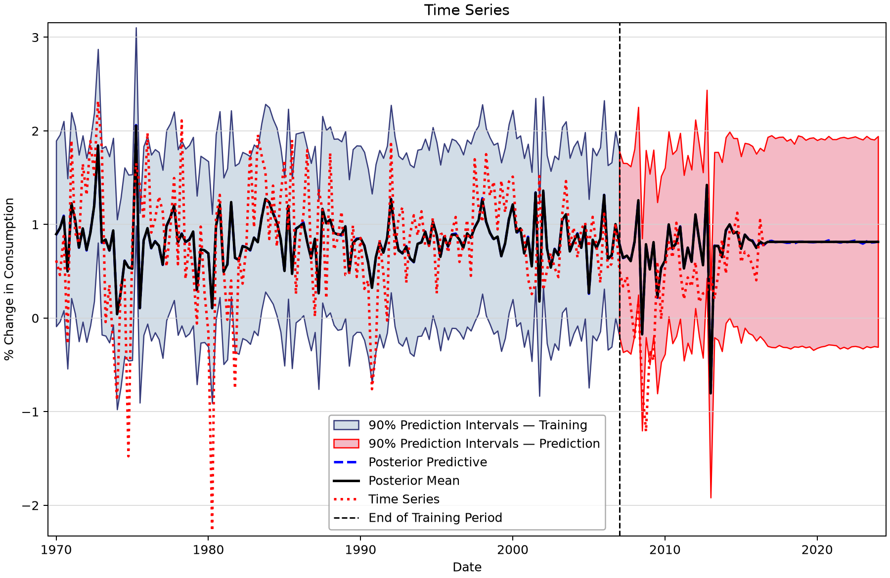
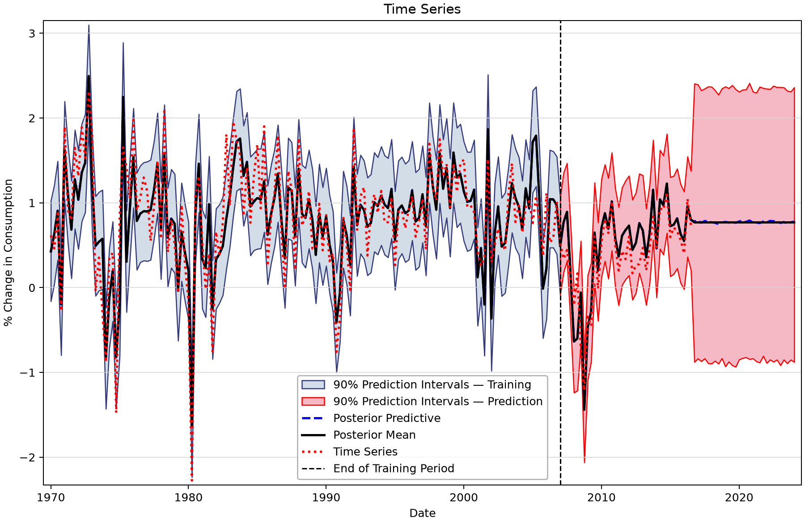
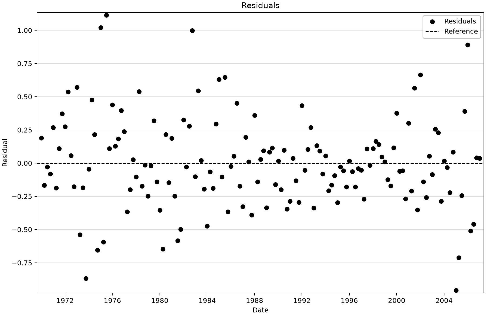
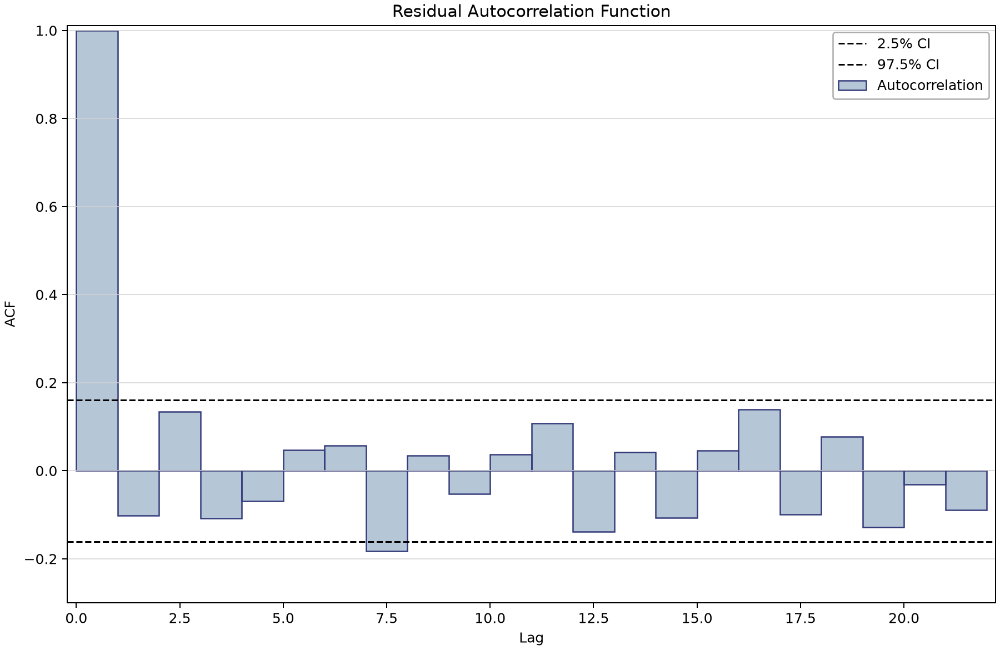
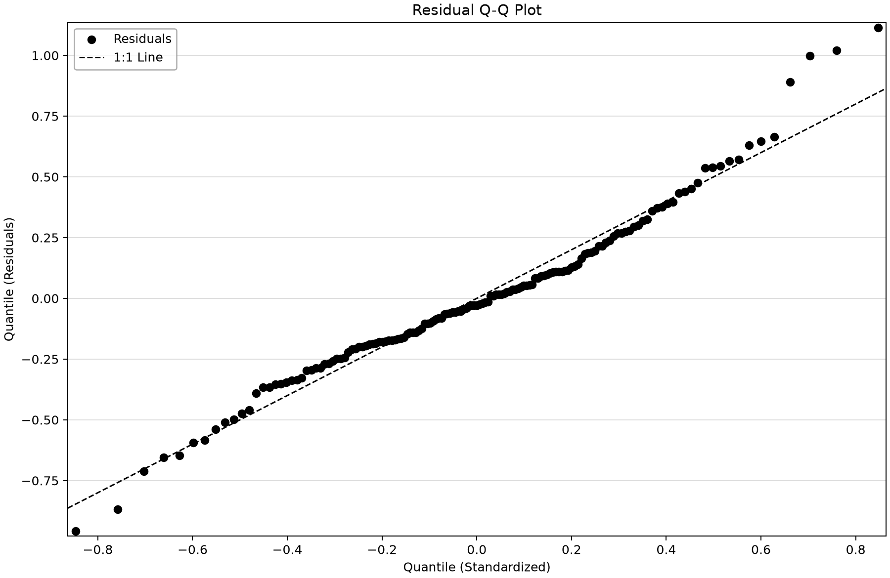

# Time-series regression: validation and future covariate assumptions

Open [time-series-regression-example.bestfit](time-series-regression-example.bestfit) and save a working copy. Two Bayesian regressions predict Consumption using either Income alone or Income, Production, Savings and Unemployment. The lesson is to distinguish fitted association, validation using observed covariates, and future prediction requiring covariate assumptions.

## Inspect the aligned quarterly data

| Input series | Meaning | Saved units | Count and dates |
| --- | --- | --- | --- |
| Consumption | Quarterly consumption change series used in the supplied regression example. Source/vintage and exact transform need confirmation. These values are not economic levels. | % Change in Consumption | 187 (1970-01-01–2016-07-01) |
| Income | Quarterly income change series used in the supplied regression example. Source/vintage and exact transform need confirmation. These values are not economic levels. | % Change in Income | 187 (1970-01-01–2016-07-01) |
| Production | Quarterly production change series used in the supplied regression example. Source/vintage and exact transform need confirmation. These values are not economic levels. | % Change in Production | 187 (1970-01-01–2016-07-01) |
| Savings | Quarterly savings change series used in the supplied regression example. Source/vintage and exact transform need confirmation. These values are not economic levels. | % Change in Savings | 187 (1970-01-01–2016-07-01) |
| Unemployment | Quarterly unemployment change series used in the supplied regression example. Source/vintage and exact transform need confirmation; verify percentage-point change versus percent growth. These values are not economic levels. | % Change in Unemployment | 187 (1970-01-01–2016-07-01) |

All five series contain 187 finite, aligned quarterly values from January 1970 through July 2016. Saved unit labels say percent change. The exact source/vintage/transforms are not supplied here, and Unemployment may require a percentage-point interpretation; verify that before interpreting coefficient units.

## Work through the regressions

1. Open Simple Linear Regression and confirm Consumption as response and Income as its single covariate.
2. Open Multiple Linear Regression. Read coefficients in the saved covariate order: Income, Production, Savings, Unemployment.
3. Confirm p=d=q=B=0, intercept enabled, no transform, trend or seasonality. Despite use of the ARIMAX framework, these fits contain **no ARMA residual terms**.
4. Locate the 149/38 training/validation split and the 30 future quarters. Validation uses observed covariates; future periods require the stored extension rule.
5. Inspect residuals, residual autocorrelation and predictive bands before drawing conclusions about performance. Regression coefficients are conditional associations, not established causal effects.

## Saved coefficients and diagnostics

| Analysis | Parameter / stored space | Saved point value |
| --- | --- | --- |
| Simple Linear Regression | Intercept (μ) | 0.581 |
| Simple Linear Regression | Covariate (β₁) | 0.325 |
| Simple Linear Regression | Scale (σ) | 0.605 |
| Multiple Linear Regression | Intercept (μ) | 0.305 |
| Multiple Linear Regression | Covariate (β₁) | 0.704 |
| Multiple Linear Regression | Covariate (β₂) | 0.037 |
| Multiple Linear Regression | Covariate (β₃) | -0.047 |
| Multiple Linear Regression | Covariate (β₄) | -0.274 |
| Multiple Linear Regression | Scale (σ) | 0.349 |

All fits retain DEMCzs, seed 12345, warmup 1,750, iterations 3,500, 10,000 output draws and 90% interval width. The chain/thinning settings and chosen posterior mean or mode parameter vector remain as saved. Inspect the actual prior bounds, parameter chains, autocorrelation and tail uncertainty. Scalar diagnostics describe the retained run; they do not substitute for scientific validation.
| Saved analysis | Chains / thinning | Point parameters | DIC | Saved RMSE | Max R-hat | Min ESS |
| --- | --- | --- | --- | --- | --- | --- |
| Simple Linear Regression | 6/30 | Mean | 275.582 | 0.598 | 1.00030 | 8,863 |
| Multiple Linear Regression | 12/60 | Mean | 114.447 | 0.341 | 1.00012 | 9,625 |

The lower Multiple DIC and training RMSE describe the same response/training period, but do not establish held-out forecast skill. Compare held-out prediction errors separately before claiming a forecasting improvement.

## Understand future predictions

Both models retain CovariateExtension = BlockBootstrap. The current implementation keeps observed covariates, fills the deterministic future tail with each covariate's empirical mean, and separately resamples stochastic future covariates with distinct seeds. It is not synchronized multivariate block resampling and does not preserve joint future-covariate dependence. It is also not an externally supplied economic scenario.

There are 217 output positions: 149 training, 38 withheld observed quarters and 30 future quarters. The first future point is position 188. At position 217, the saved Simple best-fit value is 0.814343 with 90% limits −0.308802 to 1.942928; Multiple is 0.769074 with limits −0.877415 to 2.360722. Those wider future bands include residual and covariate variation. A constant deterministic future line does not mean zero uncertainty.

## Read the figures

*Income-only regression: training, observed validation and 30 future quarters after July 2016.* [SVG](images/time-series-regression-example-simple-prediction.svg) · [Plot data](images/time-series-regression-example-simple-prediction.plotspec.json.gz)

*Four-covariate regression with saved future-extension uncertainty after July 2016.* [SVG](images/time-series-regression-example-multiple-prediction.svg) · [Plot data](images/time-series-regression-example-multiple-prediction.plotspec.json.gz)

*Multiple-regression residuals at the saved observation dates.* [SVG](images/time-series-regression-example-multiple-residuals.svg) · [Plot data](images/time-series-regression-example-multiple-residuals.plotspec.json.gz)

*Residual autocorrelation; this fitted model has no ARMA residual terms.* [SVG](images/time-series-regression-example-multiple-residual-acf.svg) · [Plot data](images/time-series-regression-example-multiple-residual-acf.plotspec.json.gz)

*Multiple-regression residual Q–Q diagnostic.* [SVG](images/time-series-regression-example-multiple-residual-qq.svg) · [Plot data](images/time-series-regression-example-multiple-residual-qq.plotspec.json.gz)

## Reproduce and check

The figures render saved BestFit desktop coordinates through the shared Python plotting package. No data, parameters, diagnostics or predictions were replaced. Follow the [figure-generation instructions](../../README.md#reproducing-the-figures) with `--only time-series-regression-example`. Each figure links an SVG and the exact display inputs in a compressed PlotSpec.

Explain the input units, the model actually stored, the observations used for fitting, and the assumptions behind extrapolation and uncertainty before reusing an example.

## Saved-fit residual display

The current app loader attaches covariates after reading ARIMAX parameters, which resets its live coefficients. Its ordinary residual views can therefore disagree with the saved fitted curve. The figures here read the original coefficient vector and pass it to BestFit's existing residual method without changing the model or database. All 149 displayed residuals agree with observed Consumption minus the saved ModeCurve; their RMS is 0.3411468296, matching the stored RMSE. This source-preserving display correction is recorded in PlotSpec. The underlying app-loading defect remains in the [author issue log](../../../docs/example-issues-for-haden.md).
