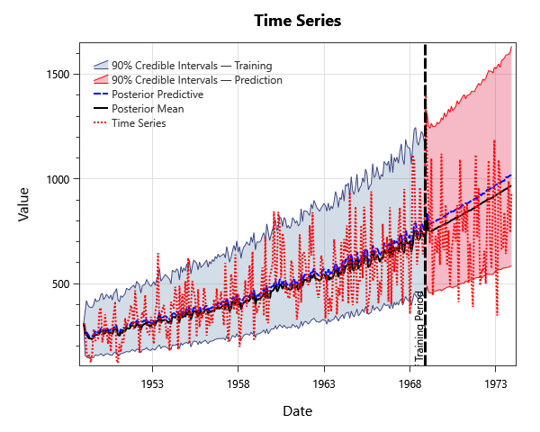
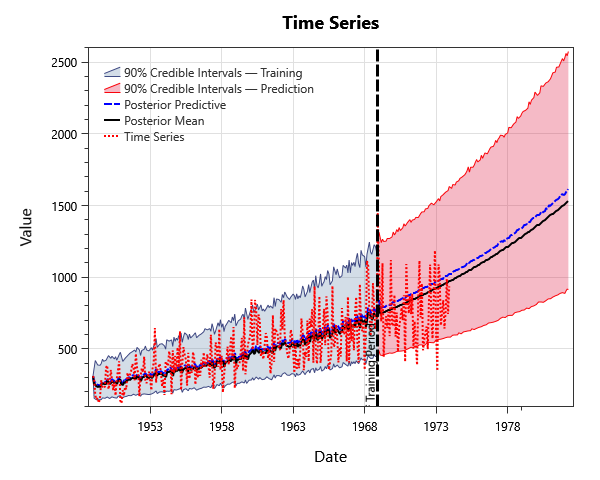
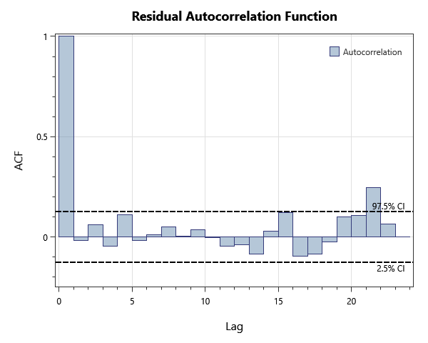

# synthetic-time-series-examples

## Overview

Synthetic time-series datasets covering trend (linear, quadratic, cubic, sinusoidal), AR / MA / ARMA processes, and a log-transformed series with linear trend. Each series has a paired Time Series Analysis fit using the corresponding model for verifying parameter recovery.

## What's Inside

### Time Series Data

| Element | Description |
|---|---|
| `Intercept` | Synthetic series with constant mean only (no trend, no autocorrelation). |
| `Intercept + Linear Trend` | Synthetic series with constant mean + linear trend. |
| `Intercept + Quadratic Trend` | Synthetic series with constant mean + quadratic trend. |
| `Intercept + Cubic Trend` | Synthetic series with constant mean + cubic trend. |
| `Intercept + Sinusoidal Trend` | Synthetic series with constant mean + sinusoidal (annual cycle) trend. |
| `AR(1)` | Synthetic AR(1) series for AR-fit verification. |
| `AR(3)` | Synthetic AR(3) series for AR-fit verification. |
| `MA(1)` | Synthetic MA(1) series for MA-fit verification. |
| `MA(3)` | Synthetic MA(3) series for MA-fit verification. |
| `ARMA(1,1)` | Synthetic ARMA(1,1) series for ARMA-fit verification. |
| `ARMA(2,2)` | Synthetic ARMA(2,2) series for ARMA-fit verification. |
| `Intercept + Linear Trend + ARMA(1,1)` | Synthetic series with constant mean + linear trend + ARMA(1,1) residuals. |
| `Intercept + Linear Trend + LogTransform` | Log-normal synthetic series with constant mean + linear trend (in log space). |

### Time Series Analysis

| Element | Description |
|---|---|
| `Intercept` | Constant-mean fit on the intercept-only synthetic series. |
| `Intercept + Linear Trend` | Linear-trend fit on the intercept + linear trend synthetic series. |
| `Intercept + Quadratic Trend` | Quadratic-trend fit on the intercept + quadratic trend synthetic series. |
| `Intercept + Cubic Trend` | Cubic-trend fit on the intercept + cubic trend synthetic series. |
| `Intercept + Sinusoidal Trend` | Sinusoidal-trend fit on the intercept + sinusoidal trend synthetic series. |
| `AR(1)` | AR(1) fit on the AR(1) synthetic series. |
| `AR(3)` | AR(3) fit on the AR(3) synthetic series. |
| `MA(1)` | MA(1) fit on the MA(1) synthetic series. |
| `MA(3)` | MA(3) fit on the MA(3) synthetic series. |
| `ARMA(1,1)` | ARMA(1,1) fit on the ARMA(1,1) synthetic series. |
| `ARMA(2,2)` | ARMA(2,2) fit on the ARMA(2,2) synthetic series. |
| `Intercept + Linear Trend + ARMA(1,1)` | Linear-trend + ARMA(1,1) fit on the corresponding synthetic series. |
| `Intercept + Linear Trend + LogTransform` | Linear-trend fit with logarithmic transform on the log-normal synthetic series. |

## Step-by-Step Walkthrough

### Opening the Project

1. Open RMC-BestFit 2.0.
2. Select **File > Open** and navigate to `examples/7-time-series-analysis/`.
3. Open `synthetic-time-series-examples.bestfit`.

### Exploring the Elements

For each Time Series Analysis:

1. Click the analysis in the Project Explorer.
2. Open the **Time Series Results** tab to view the fitted mean (and trend, if any) overlaid on the observations.
3. Open the **Residual Diagnostics** tab to view the  ACF and PACF plots to confirm white-noise residuals.
4. Adjust **ForecastSteps** in the **Properties** panel under **Output** to extend the forecast horizon.

## Analysis Settings

Each Bayesian analysis in this project uses the DEMCzs sampler with project-specific iteration / warm-up settings. Open the **Properties** panel of any Time Series Analysis to inspect:

- **Sampler type** (DEMCzs, ARWMH, HMC).
- **Iterations / Warm-up Iterations** — total post-warmup samples per chain.
- **Number of Chains** — typically 6 for routine work.
- **Thinning Interval** — keeps every Nth sample to reduce storage / autocorrelation.
- **Point Estimator** — Posterior Mean (default), Posterior Median, or Posterior Mode (MAP).
- **Credible Interval Width** — typically 0.90 or 0.95.

## Expected Results

Below are the expected results for Time Series Analysis labeled "Intercept + Linear Trend + Log Transform"; this should be the last analysis in the list.

### Parameter Estimates
The parameter estimates are found under the **MCMC Report** tab to the left as parameter summary statistics.

| Parameter | Mean | Std Dev | 5% | Median | 95% |R-hat | ESS |
|---|---|---|---|---|---|---|---|
| Intercept (μ) | 5.53757 | 0.0409761 | 5.47053 | 5.53781 | 5.604 | 1.0003 | 9423 | 
| Trend (γ) | 0.00427976 | 0.000257608 | 0.00386032 | 0.00427742 | 0.00470331 | 1.0001 | 9196 | 
| AR (φ₁) | 0.11329 | 0.0612233 | 0.0123687 | 0.113767 | 0.214336 | 1.0001 | 9697
| Scale (σ) | 0.29827 | 0.0129644 | 0.27796 | 0.29771 | 0.320289 | 0.9998 | 9685 | 

### Frequency / Quantile Table

While in the **Time Series Results** tab to the left, select Tabular Results to see the fitted curve values. Below are the first 30 rows of the table.

| Date Time	| 95.0% CI | 5.0% CI | Posterior Predictive | Posterior Mean |
|---|---|---|---|---|
| 1/1/1949 12:00:00 AM | 311.1262212999999 | 311.1262212999999 | 311.12622129999977 | 311.1262212999999 | 
| 2/1/1949 12:00:00 AM | 426.38464243991456 | 160.3555921591378 | 272.0425283311215 | 261.07351155331224 | 
| 3/1/1949 12:00:00 AM | 424.46463843643573 | 159.78470682677477 | 272.05012904582776 | 260.1809812803675 | 
| 4/1/1949 12:00:00 AM | 408.09905232176817 | 149.53386083791813 | 259.37705714461174 | 246.7396378165508 |
| 5/1/1949 12:00:00 AM | 396.74411649177745 | 144.81776614190844 | 252.6907621135749 | 242.57371338100327 | 
| 6/1/1949 12:00:00 AM | 396.6717315365566 | 149.0295381566797 | 254.6866736022618 | 245.6132172532968 | 
| 7/1/1949 12:00:00 AM | 396.42334323013915 | 144.42669990469437 | 250.69056059650183 | 239.76224554610238 | 
| 8/1/1949 12:00:00 AM | 408.15110411277294 | 150.75550115659718 | 259.921034851638 | 248.6528737304171 | 
| 9/1/1949 12:00:00 AM | 431.6953604031021 | 162.5216750224946 | 277.73055391516914 | 265.3167659703401 | 
| 10/1/1949 12:00:00 AM | 422.2882684019153 | 159.22809898768745 | 270.71372007551656 | 259.72340060092654 | 
| 11/1/1949 12:00:00 AM | 425.0935435021051 | 159.26175778459083 | 273.6257775227426 | 260.18537784606764 | 
| 12/1/1949 12:00:00 AM | 428.7147369359031 | 160.03328228417746 | 274.87256104088107 | 262.8825257942729 | 
| 1/1/1950 12:00:00 AM | 454.4713225381115 | 169.52176302248955 | 290.2837588253908 | 277.6621283546742 | 
| 2/1/1950 12:00:00 AM | 458.8741473682888 | 171.15143412370028 | 291.6433470960421 | 279.91563488419644 | 
| 3/1/1950 12:00:00 AM | 434.8795473977411 | 159.42046280463182 | 274.5706411675759 | 263.66323816329697 | 
| 4/1/1950 12:00:00 AM | 442.25990380720634 | 165.65909639222818 | 282.02708147970344 | 269.37437844475056 | 
| 5/1/1950 12:00:00 AM | 456.4208373564537 | 169.90426837409942 | 293.6239203764719 | 280.37356142140203 | 
| 6/1/1950 12:00:00 AM | 446.65474650129084 | 170.14862426258497 | 287.7248740111439 | 274.53573923036726 | 
| 7/1/1950 12:00:00 AM | 436.4575038508696 | 163.4009833210243 | 279.6854102247972 | 266.6976049750208 | 
| 8/1/1950 12:00:00 AM | 451.5285842271729 | 166.2191849539441 | 287.70950738330174 | 274.5751230752903 | 
| 9/1/1950 12:00:00 AM | 430.19811532556855 | 160.04761583425363 | 275.00720195183146 | 262.9709853667392 | 
| 10/1/1950 12:00:00 AM | 459.5385834118447 | 171.29575959941116 | 293.35090864505696 | 279.77194133062585 | 
| 11/1/1950 12:00:00 AM | 467.3321026246339 | 176.3202710465978 | 300.7631729495565 | 286.61580982215463 | 
| 12/1/1950 12:00:00 AM | 482.50679130310374 | 179.2213266660087 | 306.81538938156194 | 293.1780208489188 | 
| 1/1/1951 12:00:00 AM | 430.2026466981867 | 156.92773038740907 | 272.7678859179577 | 259.7902523004257 | 
| 2/1/1951 12:00:00 AM | 420.9960530686117 | 154.05294848574997 | 267.8076579331828 | 256.9565662891865 | 
| 3/1/1951 12:00:00 AM | 449.61993592388905 | 168.32485956852798 | 286.8877555915513 | 274.8526537046771 | 
| 4/1/1951 12:00:00 AM | 442.0588094852041 | 165.3943326617061 | 282.4482399656593 | 269.6852167466676 | 
| 5/1/1951 12:00:00 AM | 458.7570112533463 | 172.6486259588133 | 292.413840099478 | 280.2161015012757 | 
| 6/1/1951 12:00:00 AM | 458.1496690960134 | 168.41337129539116 | 291.45188954186347 | 278.9453763667788 | 

### Plots
There are plenty of plots to expore with our Time Series Analysis. Under the **Time Series Results** tab there is fitted curve plotted with the orginal data. This plot has both training and prediction estimates.

*Figure 1: Time-series fit overlaid on the observations, with credible band.*

To take a closer look at the forecasting capability, extend the Forecast Steps in the **Properties** panel under **Options** from 0 to 100. Return the **General** section under the **Properties** panel and select **Estimate**. Then you will have the plot below.

*Figure 2: Multi-step forecast extension with credible band.*

To explore how good the fit is we can look at our residuals in the **Residual Diagnostics** tab. Investigate the ACF plot of the resodiauls to ensure residuals are not correlated.

*Figure 3: Residual autocorrelation function.*

### MCMC Diagnostics

One should always verify chain convergence before interpreting any results. There are a variety of ways including:

- **R-hat** — should be < 1.01 for every parameter.
- **Effective Sample Size (ESS)** — at least a few hundred per parameter.
- **Trace plots** — should look like fuzzy, well-mixed caterpillars (no drift, no sticking).
- **Posterior** — overall posterior log-likelihood should be visually stationary in the mean-likelihood plot.

These can be found under the **Markov Chain Traces** and **MCMC Reports** tabs.

## Next Steps

- Use the fitted ARIMA / regression model for **multi-step forecasting** with credible bands.
- Inspect residual ACF / PACF to confirm no remaining temporal structure.
- For non-stationary trend cases, project the trend function out beyond the observation window.
